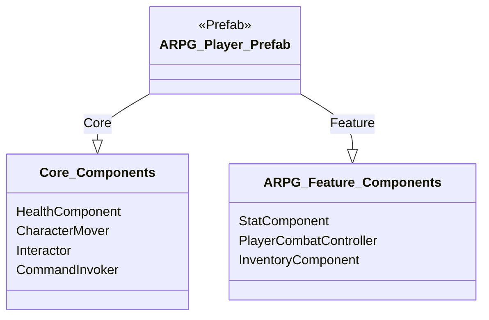

# DESIGN.md - アクションRPGテンプレート実装設計書

## 文書管理情報

- **ドキュメント種別**: テンプレート実装設計書（SDDフェーズ3: 設計）
- **生成元**: `アクションRPG要件定義書作成ガイド.md`, `ActionRPG_Advanced_Design_Doc.md`
- **対象読者**: 実装担当開発者、ゲームデザイナー、QAエンジニア
- **整合性状態**: `Core Architecture`および`ActionRPG Feature Design`と完全整合
- **設計目標**: GDDの核心的ゲームサイクル「挑戦・成長・探索」を即時体験可能にし、プロジェクトのアーキテクチャとデザインパターンの有効性を実証する、拡張容易なARPGテンプレートの実装仕様を定義する。

## 1.0 テンプレートの全体構成

アクションRPGテンプレートは、GDDのコア・ループを凝縮したプレイアブルなサンプルシーン、モジュール化されたPrefab群、そしてデータ駆動設計を体現する`ScriptableObject`コンフィギュレーションによって構成される。

### 1.1 ディレクトリ構造

- `Assets/_Project/Features/Templates/ActionRPG/`
  - `Scenes/`: `ActionRPG_SampleScene.unity`, `ActionRPG_UIScene.unity`
  - `Prefabs/`:
    - `Player/ARPG_Player_Prefab.prefab`
    - `Enemies/ARPG_Swarmer_Prefab.prefab`
    - `Items/RunePickup_Prefab.prefab`
    - `World/LevelUpShrine_Prefab.prefab`
  - `ScriptableObjects/`:
    - `Classes/`: `WarriorClassData.asset`
    - `Enemies/`: `SwarmerEnemyData.asset`
    - `Items/`: `RuneItemData.asset`
    - `Leveling/`: `DefaultLevelCurve.asset`
  - `Audio/`, `Materials/`, `VFX/`

### 1.2 シーン構成

- **`ActionRPG_SampleScene.unity`**:
  - 役割: ARPGのコア・ループを体験するメインシーン。
  - 構成: `SystemInitializer`, `TemplateManager`を配置。`TemplateManager`が`ARPG_TemplateConfig.asset`に基づき、プレイヤーと敵を動的に生成する。
- **`ActionRPG_UIScene.unity`**:
  - 役割: HUD（HP、FP、ルーン所持数）とレベルアップUIを管理。
  - 構成: `SampleScene`に加算ロードされる。

### 1.3 主要Prefab構成

#### `ARPG_Player_Prefab.prefab`
GDDの戦闘と成長を担うプレイヤーキャラクター。

- **Core Components**:
  - `HealthComponent`, `CharacterMover`, `Interactor`: `Core`層の汎用コンポーネント。
  - `CommandInvoker`: `PlayerCombatController`から発行された`ICommand`を実行する。
- **ARPG Feature Components**:
  - **`StatComponent`**: GDDの全基礎ステータスを管理。`ScriptableObject`から初期クラスデータをロードし、レベルアップによる成長を記録する。
  - **`PlayerCombatController`**: `Core.Input.InputService`からのイベントを解釈し、弱攻撃・強攻撃に対応する`DamageCommand`を生成して`CommandInvoker`に渡す。ダメージ計算時には`StatComponent`と`EquipmentManager`から最新の攻撃力を参照する。
  - **`InventoryComponent`**: 収集したルーン（アイテムとして表現）や装備を管理する。

#### `ARPG_Swarmer_Prefab.prefab`
GDDの敵アーキタイプ「スウォーマー」を実装した、最も基本的な敵。

- **Core Components**:
  - `HealthComponent`: `SwarmerEnemyData.asset`から最大HPを設定。
  - `AIStateMachine`: `Swarmer_HSM`（Idle, Chase, Attackの3状態）を制御。
- **ARPG Feature Components**:
  - **`LootDropComponent`**: `Core_Health`から`GenericDeathEvent`を受け取ると、`SwarmerEnemyData.asset`で定義されたルーン量を基に`RunePickup_Prefab`を生成する。

## 2.0 サンプルシーン (`ActionRPG_SampleScene`) 詳細設計

### 2.1 レベルデザインとコア・ループ体験フロー

- **舞台**: 小さな森の広場。一本道で構成され、プレイヤーを自然に導く。
- **体験フロー (5分間の凝縮ループ)**:
  1.  **探索 (0:00-0:30)**: プレイヤーは広場の入口に出現。道なりに進むと、最初の敵グループ（スウォーマー2体）が見える。
  2.  **戦闘 (0:30-1:30)**: プレイヤーは敵と交戦。`PlayerCombatController`を通じて弱攻撃と強攻撃を繰り出す。敵を倒すと`LootDropComponent`が`RunePickup_Prefab`をドロップする。
  3.  **報酬 (1:30-2:00)**: プレイヤーは`Interactor`でルーンを拾う。`OnResourceCollectedEvent`が発行され、`ExperienceManager`がこれを捕捉。UI上のルーン所持数が増加する。
  4.  **成長 (2:00-3:30)**: 広場の中央には`LevelUpShrine_Prefab`が配置されている。プレイヤーがこれとインタラクトすると、レベルアップUIが表示される。プレイヤーは貯めたルーンを消費して、任意の基礎ステータス（例: 筋力）を1ポイント上昇させる。`StatComponent`が更新され、`OnStatChangedEvent`が発行される。
  5.  **成長実感 (3:30-4:30)**: 広場の奥には、少し強化された敵（スウォーマー3体）が配置されている。プレイヤーは再度戦闘に挑む。`DamageCommand`が生成される際、上昇した筋力ステータスがダメージ計算に反映され、以前より高いダメージが出ることをプレイヤーは実感する。
  6.  **さらなる探索 (4:30-5:00)**: 強化された敵を倒すと、広場の出口が開く。その先には次のエリアが広がっていることを示唆し、テンプレートの体験は終了する。

## 3.0 ScriptableObject コンフィギュレーション

テンプレートの挙動は、デザイナーが調整可能な`ScriptableObject`によって完全に制御される。

- **`ARPG_TemplateConfig.asset` (`GenreTemplateConfig`)**:
  - `playerClass`: `WarriorClassData.asset` - 開始時のプレイヤー設定。
  - `enemyPrefabs`: `ARPG_Swarmer_Prefab`のリスト。
  - `initialScene`: `ActionRPG_SampleScene`への参照。

- **`WarriorClassData.asset` (`CharacterClassData`)**:
  - `initialStats`: 生命力10, 筋力10, その他5。
  - `startingEquipment`: `SimpleSword.asset`。

- **`SwarmerEnemyData.asset` (`EnemyData`)**:
  - `maxHealth`: 50
  - `attackPower`: 5
  - `runeDropAmount`: 100

- **`DefaultLevelCurve.asset` (`LevelUpCurveData`)**:
  - `experiencePerLevel`: `AnimationCurve`でLv1→2は200ルーン、Lv2→3は500ルーン、といった形で設定。

## 4.0 実装と検証のステップ

1.  **データ構造の確立 (Day 1-2)**: `ActionRPG_Advanced_Design_Doc.md`で設計された`StatComponent`, `ItemInstance`等のデータ構造と、本設計書の`ScriptableObject`群を実装する。
2.  **Prefabの作成 (Day 3-4)**: `1.3`で定義された`ARPG_Player_Prefab`と`ARPG_Swarmer_Prefab`を作成する。この時点ではAIロジックは空でよい。
3.  **戦闘→報酬サイクルの実装 (Day 5-7)**: `PlayerCombatController`から`DamageCommand`を発行し、敵の`HealthComponent`を減らす流れを実装。`HealthComponent`の死亡イベントをトリガーに`LootDropComponent`がルーンを生成し、プレイヤーがそれを回収できるまでを実装する。
4.  **報酬→成長サイクルの実装 (Day 8-10)**: `ExperienceManager`がルーン回収を検知し、`StatComponent`に経験値として加算する。`LevelUpShrine`とUIを実装し、プレイヤーがルーンを消費してステータスを向上させられるようにする。
5.  **成長→戦闘サイクルの実装 (Day 11-12)**: `DamageCommand`のダメージ計算ロジックに、`StatComponent`の能力値を反映させる。レベルアップ後に与ダメージが上昇することを検証する。
6.  **AIとシーンフローの統合 (Day 13-14)**: `Swarmer_HSM`を実装し、敵がプレイヤーを追跡・攻撃するようにする。`2.1`のゲームフローに従ってサンプルシーンを完成させる。
7.  **最終調整とドキュメント化 (Day 15)**: ゲームバランスを調整し、テンプレートの使用方法を解説する簡単なMarkdownファイル (`README_ActionRPG_Template.md`) を作成する。

この設計書に基づき実装することで、GDDの壮大なビジョンを、**具体的で、即座に体験でき、そして拡張の指針となる**形で開発者に提供するアクションRPGテンプレートが完成する。

