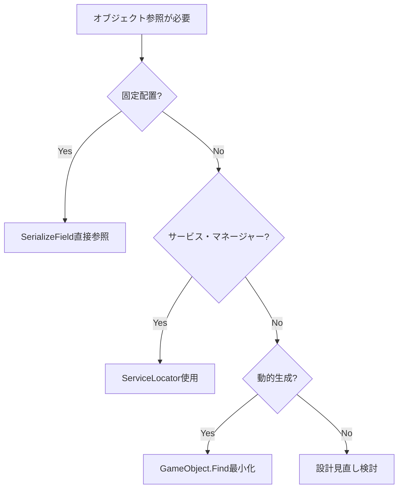

# アーキテクチャガイドライン

**更新日**: 2025-09-12  
**バージョン**: 1.0  
**適用対象**: URP3D_Base01 Unity プロジェクト

## 📋 概要

このドキュメントは、プロジェクトのアーキテクチャ準拠性を維持するためのガイドラインを定義します。開発者は新機能実装時にこれらの規約に従い、コードレビュー時の参照資料として活用してください。

## 🏗️ アーキテクチャ原則

### 基本設計思想
- **Service Locator + Event駆動のハイブリッドアプローチ**
- **ScriptableObjectベースのデータ駆動設計**
- **コマンドパターンとObjectPool最適化**
- **関心事の分離と疎結合**

### 禁止事項
- ❌ **Dependency Injection (DI) フレームワークの使用**
- ❌ **Core層からFeatures層への参照**
- ❌ **`_Project.*` namespace の新規使用**
- ❌ **実行時 `GameObject.Find()` の頻繁な使用**

## 📁 ディレクトリ構造規約

### 必須配置ルール
```
Assets/_Project/
├── Core/           # コアロジック（必須配置）
├── Features/       # 機能実装（必須配置）
├── Tests/          # テストコード（必須配置）
├── Docs/           # ドキュメント（必須配置）
├── Scenes/         # ゲームシーン
└── Works/          # 作業ログ保管庫
```

### 分離原則
- **コアロジック**: `Assets/_Project/Core` に配置
- **機能コード**: Core に混在させない、`Features` に分離
- **テストコード**: Core・Features に混在させない、`Tests` に専用配置
- **ドキュメント**: 一元管理のため `Docs` に専用配置

## 🏷️ Namespace規約

### 基本規則
```csharp
// ✅ 正しい namespace 定義
namespace asterivo.Unity60.Core;                    // Core機能
namespace asterivo.Unity60.Features.Player;         // 機能実装  
namespace asterivo.Unity60.Tests.Core.Services;     // テスト

// ❌ 禁止 namespace 定義
namespace _Project.Core;              // _Project.* は禁止
namespace Project.Features.Player;   // Root違反
```

### 階層構造
- **Root**: `asterivo.Unity60`
- **Core機能**: `asterivo.Unity60.Core.*`
- **機能実装**: `asterivo.Unity60.Features.*`
- **テスト**: `asterivo.Unity60.Tests.*`

### 移行ガイド
```csharp
// Before: 旧形式
namespace _Project.Tests.Core.Services
{
    using _Project.Core.Services;
}

// After: 新形式  
namespace asterivo.Unity60.Tests.Core.Services
{
    using asterivo.Unity60.Core.Services;
}
```

## 🔍 GameObject.Find() 代替パターン集

### Pattern 1: SerializeField直接参照 (UI・固定オブジェクト)

**適用対象**: UI要素、固定配置オブジェクト

```csharp
// ❌ Before: 実行時検索
void InitializeHUD()
{
    var player = GameObject.FindGameObjectWithTag("Player");
    if (player != null) {
        playerHealth = player.GetComponent<IHealthTarget>();
    }
}

// ✅ After: Inspector設定参照
[SerializeField] private Transform playerTransform;

void InitializeHUD()
{
    if (playerTransform != null) {
        playerHealth = playerTransform.GetComponent<IHealthTarget>();
    }
}
```

**利点:**
- 実行時パフォーマンス向上
- Inspector での視覚的設定
- コンパイル時の参照チェック

### Pattern 2: ServiceLocator (サービス・マネージャー)

**適用対象**: アプリケーション全体サービス、マネージャー系

```csharp
// ❌ Before: GameObject検索
void FindPlayerReference()
{
    var player = GameObject.FindWithTag("Player");
    if (player != null) {
        playerTransform = player.transform;
    }
}

// ✅ After: ServiceLocator経由
void FindPlayerReference()
{
    try {
        var playerService = ServiceLocator.GetService<PlayerController>();
        if (playerService != null) {
            playerTransform = playerService.transform;
            EventLogger.LogStatic("Player reference found via ServiceLocator");
        }
    } catch (System.Exception ex) {
        EventLogger.LogErrorStatic($"Failed to get PlayerController: {ex.Message}");
    }
}
```

**利点:**
- 型安全な参照取得
- 依存関係の明示化
- テスト時のモック対応

### Pattern 3: 動的検索の必要最小化

**適用対象**: NPCなど動的オブジェクト (最適化困難な場合)

```csharp
// 許容される使用例（最適化困難）
void FindPotentialTargets()
{
    potentialTargets.Clear();
    
    // Player: ServiceLocator推奨だが、直接参照も可
    if (playerTransform != null) {
        potentialTargets.Add(playerTransform);
    }
    
    // NPC: 動的生成のため検索必要（頻度最小化）
    var allNPCs = GameObject.FindGameObjectsWithTag("NPC");
    foreach (var npc in allNPCs) {
        if (npc != gameObject) {
            potentialTargets.Add(npc.transform);
        }
    }
}
```

## 📚 ServiceLocator使用ガイド

### 登録パターン
```csharp
public class AudioManager : MonoBehaviour, IAudioService, IServiceLocatorRegistrable
{
    public int Priority => 10;
    
    void Awake()
    {
        RegisterServices();
    }
    
    public void RegisterServices()
    {
        ServiceLocator.RegisterService<IAudioService>(this);
    }
    
    public void UnregisterServices()  
    {
        ServiceLocator.UnregisterService<IAudioService>();
    }
}
```

### 取得パターン
```csharp
public class StealthAudioService : MonoBehaviour
{
    private IAudioService audioService;
    
    void Start()
    {
        // 安全な取得方法
        audioService = ServiceLocator.GetService<IAudioService>();
        if (audioService == null) {
            EventLogger.LogErrorStatic("AudioService not found in ServiceLocator");
            return;
        }
        
        // 使用例
        audioService.PlaySound("example");
    }
}
```

### 使用判断フロー


## ✅ コードレビューチェックリスト

### 必須確認項目

#### Namespace規約
- [ ] `asterivo.Unity60.*` 形式を使用
- [ ] `_Project.*` を新規使用していない
- [ ] using文が正しいnamespaceを参照

#### ディレクトリ配置
- [ ] Core機能が `Core/` に配置
- [ ] 機能実装が `Features/` に配置
- [ ] テストが `Tests/` に配置
- [ ] ドキュメントが `Docs/` に配置

#### パフォーマンス最適化
- [ ] `GameObject.Find()` の新規追加を確認
- [ ] 適切な代替パターンの適用
- [ ] 頻繁な実行処理での最適化

#### アーキテクチャ準拠
- [ ] Core層からFeatures層への参照なし
- [ ] ServiceLocatorの適切な使用
- [ ] 疎結合・高凝集の維持

### 違反パターン例

#### ❌ Namespace違反
```csharp
namespace _Project.Features.Player  // 禁止パターン
{
    using _Project.Core.Services;   // 禁止パターン
}
```

#### ❌ 不適切なGameObject.Find()
```csharp
void Update()  // 毎フレーム実行
{
    // パフォーマンス問題
    var player = GameObject.FindWithTag("Player");
}
```

#### ❌ 不適切な層間参照
```csharp
namespace asterivo.Unity60.Core.Audio
{
    using asterivo.Unity60.Features.Player;  // Core→Features 参照禁止
}
```

### 修正方法参照リンク

- **Namespace修正**: [Architecture_Compliance_TODO.md - Section 1](Architecture_Compliance_TODO.md#1-namespace-migration完了)
- **GameObject.Find()最適化**: [Architecture_Guidelines.md - GameObject.Find()代替パターン集](#-gameobjectfind-代替パターン集)
- **ServiceLocator使用**: [Architecture_Guidelines.md - ServiceLocator使用ガイド](#-servicelocator使用ガイド)

## 📊 定期チェック自動化

### 静的解析スクリプト

```bash
# Namespace規約チェック
find Assets/_Project -name "*.cs" -exec grep -l "namespace _Project\." {} \;

# GameObject.Find()検出  
find Assets/_Project -name "*.cs" -exec grep -l "GameObject\.Find" {} \;

# Core→Features参照チェック
find Assets/_Project/Core -name "*.cs" -exec grep -l "using asterivo.Unity60.Features" {} \;
```

### 月次レポート生成項目

- namespace準拠率測定
- GameObject.Find()使用箇所カウント
- アーキテクチャ違反検出
- パフォーマンス指標変化
- 新規問題パターン特定

## 🚨 統一デバッグシステム

### ProjectDebug利用規約

ProjectDebugシステムを使用して、プロジェクト統一のログ出力を実装してください。

### 基本使用方法
```csharp
using asterivo.Unity60.Core.Debug;

public class ExampleClass : MonoBehaviour
{
    void Start()
    {
        ProjectDebug.Log("情報レベルのログ");
        ProjectDebug.LogWarning("警告レベルのログ");
        ProjectDebug.LogError("エラーレベルのログ");
    }
}
```

### 条件付きログ出力
```csharp
// FeatureFlagsに基づく条件付きログ
ProjectDebug.LogConditional("デバッグ専用メッセージ", FeatureFlags.EnableDebugLogging);

// Editor専用ログ（ビルドには含まれない）
ProjectDebug.LogEditor("Editorでのみ表示される情報");
```

### パフォーマンス測定付きログ
```csharp
ProjectDebug.LogWithTiming("重い処理の実行", () => {
    // 時間を測定したい処理
    ExpensiveOperation();
});
```

### 適用範囲と例外

#### ✅ ProjectDebugを使用する場所
- **Coreレイヤー**：すべてのログ出力
- **Featuresレイヤー**：すべてのログ出力
- **Runtime実行**：アプリケーション動作ログ

#### ❌ UnityEngine.Debug.Logを使用する場所
- **Editor拡張スクリプト**：Unity Editor APIと整合性を保つため
- **テストコード**：テスト実行結果の明確な出力のため
- **ドキュメント内のサンプルコード**：説明目的のため

### 統合機能

#### EventLoggerとの連携
```csharp
// ProjectDebugは自動的にEventLoggerと統合されます
ProjectDebug.Log("このメッセージはEventLoggerにも送信されます");

// FeatureFlagsによる制御
// EnableDebugLogging = false の場合、Errorレベルのみ出力
```

#### Editor/Runtime環境の自動判定
```csharp
// Editor環境では "[EDITOR]" プレフィックス付きで出力
// Runtime環境では "[RUNTIME]" プレフィックス付きでEventLoggerに送信
ProjectDebug.Log("環境自動判定メッセージ");
```

## 🎯 成功指標

### 品質指標
- **Namespace準拠率**: 100%
- **GameObject.Find()最適化率**: 主要ランタイムファイル100%
- **コンパイルエラー**: 0件
- **アーキテクチャ違反**: 0件

### パフォーマンス指標
- **実行時検索処理**: 最小化達成
- **フレームレート**: 現状維持以上
- **メモリ使用量**: 最適化による改善

### 開発者体験指標
- **ガイドライン参照頻度**: 増加
- **レビュー指摘事項**: 減少
- **新規開発者オンボーディング**: 効率化

---

**このガイドラインに従うことで、プロジェクトのアーキテクチャ準拠性と品質を継続的に維持できます。**
