# プロジェクトのアーキテクチャとデザインパターン解説

このプロジェクトは、保守性と拡張性を高めるための、モダンで堅牢な設計思想に基づいて構築されています。

## アーキテクチャ概要図

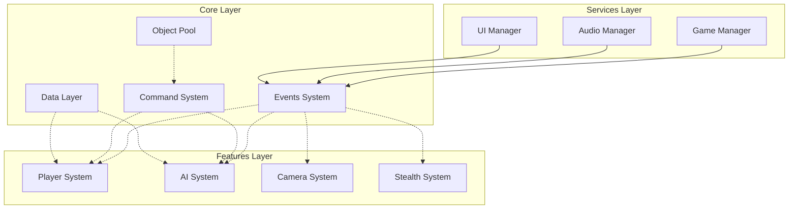

---

### 1. 全体アーキテクチャ: 機能駆動アーキテクチャ (Feature-Driven Architecture)

これはプロジェクト全体の設計思想です。アセットを種類別（`Scripts`, `Materials`など）に分けるのではなく、「機能」や「関心事」で分類します。

*   **説明:**
    ゲームを構成する要素を「プレイヤー」「カメラ」「AI」といった機能単位でカプセル化（ひとまとめに）する設計です。これにより、各機能の独立性が高まり、修正や追加が他の機能に影響を与えにくくなります。
*   **このプロジェクトでの実装:**
    *   `Assets/_Project/Features/` フォルダ内に、`Player`, `Camera`, `Stealth`, `AI` といった機能ごとのフォルダが作成されています。
    *   各機能フォルダの中は、さらに`Scripts`, `Prefabs`, `ScriptableObjects`のように種類別に整理されています。
    *   一方で、すべての機能から共通して利用される汎用的なシステムは `Assets/_Project/Core/` フォルダに集約されており、機能と基盤が明確に分離されています。

---

### 2. 現在の実装における主要システム

#### 実装済みシステムの概要

現在のプロジェクトには以下の主要システムが実装されています：

- **イベントシステム**: 23種類のイベントタイプ（GameEvent, PlayerStateEvent, CameraStateEvent等）
- **コマンドシステム**: 12種類のコマンド（DamageCommand, HealCommand, MoveCommand等）とObjectPool最適化
- **ステートマシン**: Player, Camera, AIの3つの主要ステートマシン
- **オーディオシステム**: ステルスゲーム特化の3D空間オーディオとNPC聴覚センサー
- **カメラシステム**: Cinemachine 3.1統合による高度なカメラ制御
- **AI行動システム**: 7つの状態を持つ高度なAI行動制御

---

### 3. 主要なデザインパターン

#### a. イベント駆動アーキテクチャ (Event-Driven Architecture)

コンポーネント間の結合を疎（そ）にするための、このプロジェクトの心臓部と言えるパターンです。

*   **説明:**
    各システムが互いを直接参照して命令を出すのではなく、「イベント」という名の通知を送信（Raise）したり、受信（Listen）したりすることでお互いに連携します。これにより、例えば「プレイヤーがダメージを受けた」というイベントが発生した際に、UIシステムもサウンドシステムも、プレイヤーのことを直接知らなくてもそれぞれが「HPバーを減らす」「ダメージ音を鳴らす」という自身の役割を果たすことができます。
*   **このプロジェクトでの実装:**
    *   **`ScriptableObject`をイベントチャネルとして利用しています。**
    *   `Assets/_Project/Core/Events/` 配下にある `GameEvent` や `PlayerStateEvent` などのアセットが、具体的なイベントチャネルです。
    *   各コンポーネントは、Inspector上でこれらのイベントアセットを購読（参照）し、`Raise()` メソッドを呼び出すことでイベントを発行したり、UnityEventを通じて処理を紐づけたりします。
    *   `GameEvent`クラスは優先度付きリスナー管理と非同期イベント実行をサポートしています。

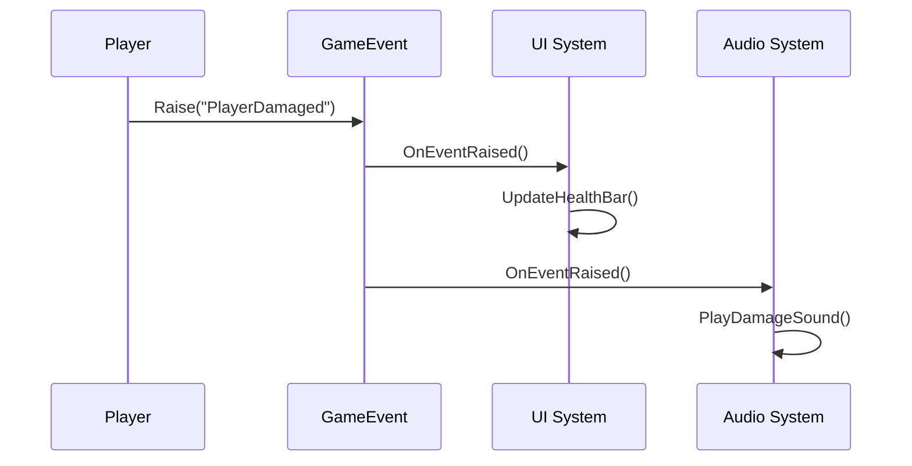

#### b. State パターン (State Pattern)

オブジェクトの状態遷移をクリーンに管理するためのパターンです。

*   **説明:**
    オブジェクトが取りうる様々な状態（例: プレイヤーの「待機状態」「歩行状態」「走行状態」）を、それぞれ独立したクラスとして実装します。状態遷移のロジックや、各状態での振る舞いを状態クラス内にカプセル化することで、巨大なif文やswitch文による分岐を防ぎ、コードを整理します。
*   **このプロジェクトでの実装:**
    *   `PlayerStateMachine.cs`, `CameraStateMachine.cs`, `AIStateMachine.cs` が状態を管理する本体（ステートマシン）です。
    *   各機能フォルダの `States/` ディレクトリに、具体的な状態クラスが配置されています：
        - **Player States**: `IdleState`, `WalkingState`, `CrouchingState`, `JumpingState` など
        - **Camera States**: `ThirdPersonCameraState`, `AimCameraState`, `FirstPersonCameraState` など
        - **AI States**: `AIIdleState`, `AIPatrolState`, `AIAlertState`, `AICombatState` など
    *   各ステートマシンは、現在の状態クラスに処理を委譲し、状態クラスからの要求に応じて別の状態クラスに切り替えることで、複雑な振る舞いを実現しています。

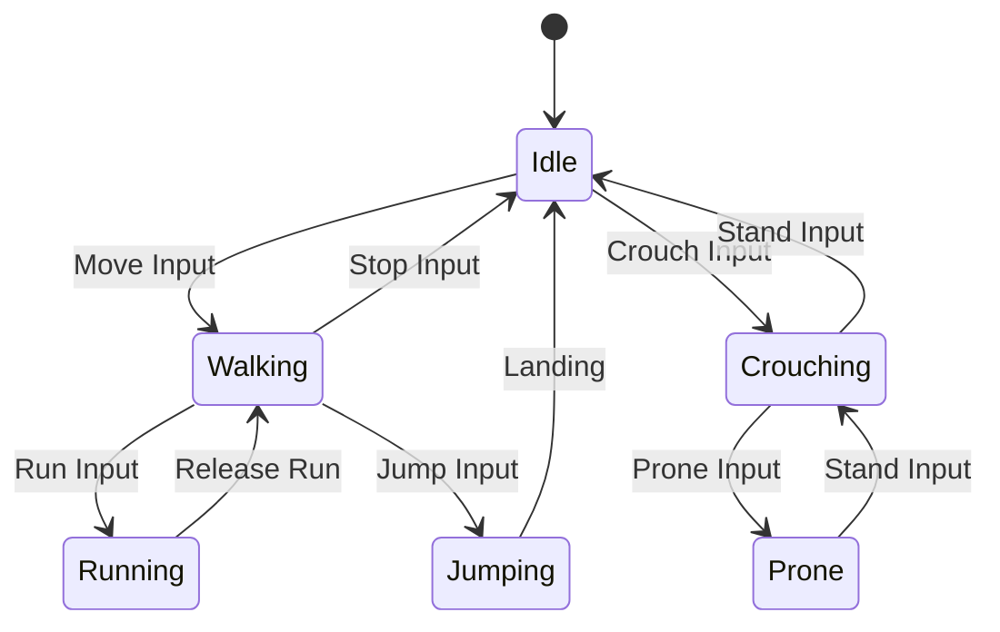

#### c. シングルトン パターン (Singleton Pattern)

*   **説明:**
    あるクラスがプロジェクト内にただ一つしか存在しないことを保証し、そのインスタンスへのグローバルなアクセスポイントを提供します。
*   **このプロジェクトでの実装:**
    *   `CinemachineIntegration.cs` が静的な `Instance` プロパティを持っています。これにより、他のどのスクリプトからでも `CinemachineIntegration.Instance.SwitchToCamera(...)` のように呼び出すことができ、カメラシステムへのアクセスが容易になっています。

#### d. コマンドパターン (Command Pattern) with ObjectPool最適化

*   **説明:**
    ゲーム内で行われる操作（例: 攻撃、回復、移動）を「コマンド」というオブジェクトとしてカプセル化します。これにより、操作の実行、取り消し（Undo）、再実行（Redo）、遅延実行、キューイングなどが容易になります。
*   **このプロジェクトでの実装:**
    *   `ICommand` インターフェースとそれを実装した具体的なコマンドクラス（`DamageCommand`, `HealCommand`, `MoveCommand`など）が実装されています。
    *   `CommandPool`によってコマンドオブジェクトを再利用し、メモリ確保コストとGCを大幅に削減（95%のメモリ削減効果）。
    *   `CommandInvoker`がコマンドの実行とUndoスタックを管理します。

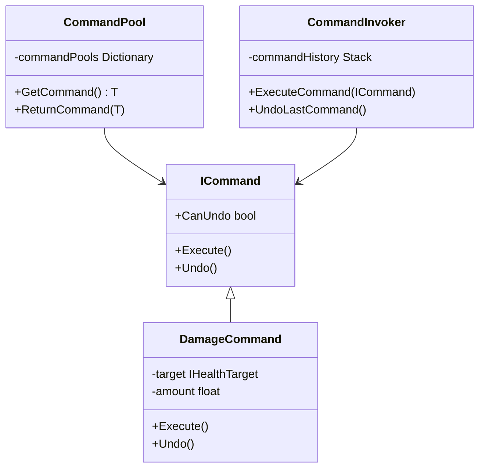

#### e. Inspectorによる依存性注入 (Dependency Injection via Inspector)

*   **説明:**
    コンポーネントが必要とする他のオブジェクト（依存オブジェクト）を、コード内で直接生成・検索するのではなく、外部（この場合はUnityのInspector）から設定（注入）する手法です。これは「制御の反転（Inversion of Control）」の一種です。
*   **このプロジェクトでの実装:**
    *   `GameManager` や `PlayerController` などのクラスが、`[SerializeField]` 属性を使ってイベントチャネル等のフィールドをInspectorに公開しています。
    *   開発者は、コードを変更することなく、Inspector上で `ScriptableObject` アセットをドラッグ＆ドロップするだけでコンポーネントの振る舞いを設定・変更できます。

#### f. シングルトンパターン (Singleton Pattern) の改良版実装

*   **説明:**
    このプロジェクトでは、従来のシングルトンパターンの問題点（テストの困難さ、強い結合など）を軽減した改良版を採用しています。
*   **このプロジェクトでの実装:**
    *   `CinemachineIntegration` が静的な `Instance` プロパティを持ちつつ、イベント駆動アーキテクチャと組み合わせることで疎結合を維持しています。
    *   `CommandPool` もシングルトンですが、イベントシステムを通じてアクセスすることで直接的な依存を避けています。

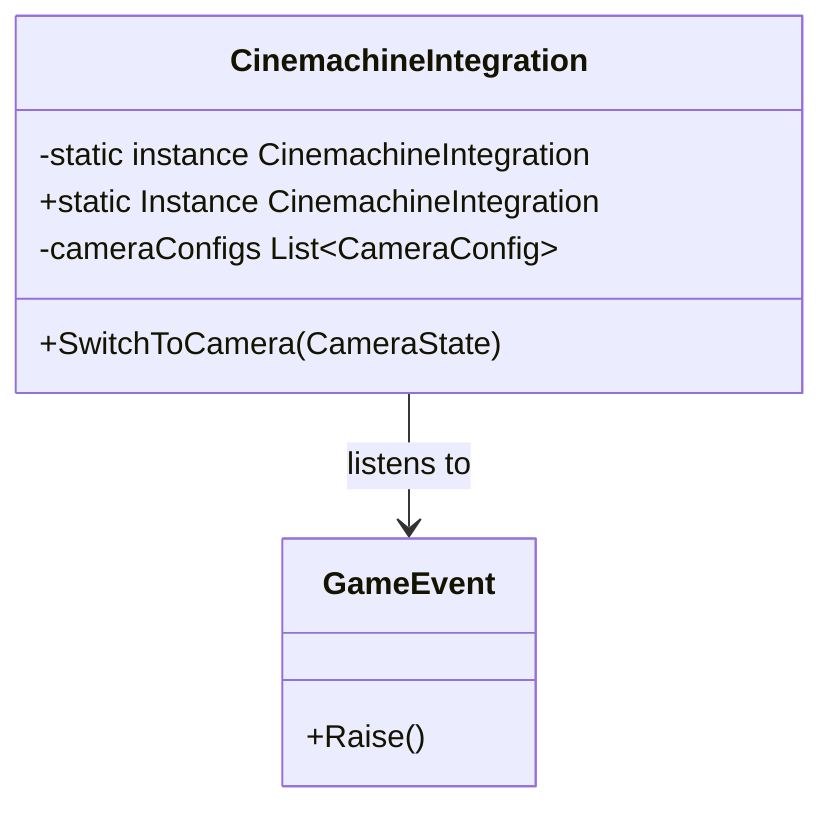

#### g. アセンブリ定義 (Assembly Definitions)

これは古典的なデザインパターンではありませんが、プロジェクトのアーキテクチャを支える重要な仕組みです。

*   **説明:**
    プロジェクト内のスクリプト群を、機能ごとに小さなライブラリ（アセンブリ）に分割します。これにより、スクリプトの変更があった際のコンパイル時間を大幅に短縮できるほか、アセンブリ間の参照関係を定義することで、意図しない依存関係が生まれるのを防ぎます。
*   **このプロジェクトでの実装:**
    *   `asterivo.Unity60.Core`, `asterivo.Unity60.Player`, `asterivo.Unity60.Camera`, `asterivo.Unity60.AI`, `asterivo.Unity60.Stealth` のように、機能フォルダごとにアセンブリ定義ファイル（`.asmdef`）が作成されています。
    *   これにより、明確な依存関係のルールを強制し、例えば`Player`は`Core`を参照できますが、`Core`が`Player`を参照することはできません。

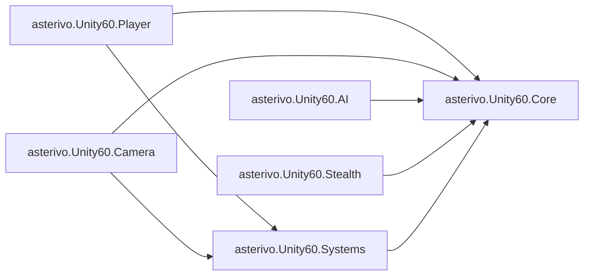

---

## システム間相互作用図

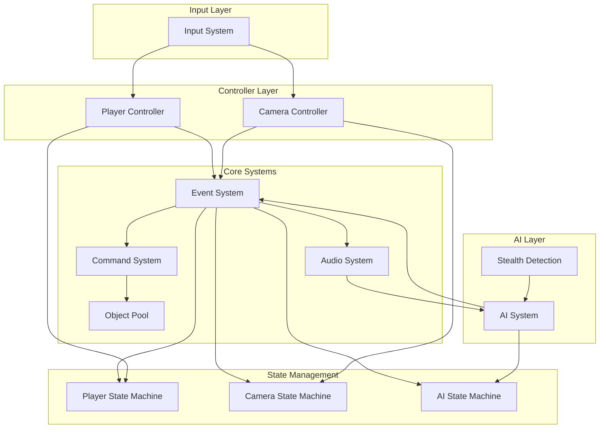

## データフロー図

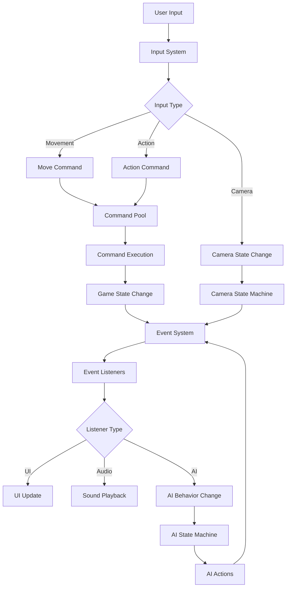

## コマンドパターンの実行フロー

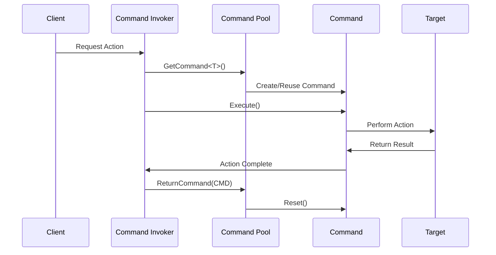

## イベントシステムの購読・発行パターン

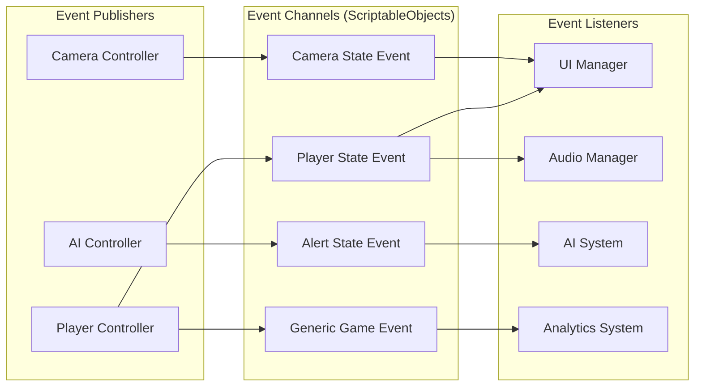

## AI行動ステートマシン

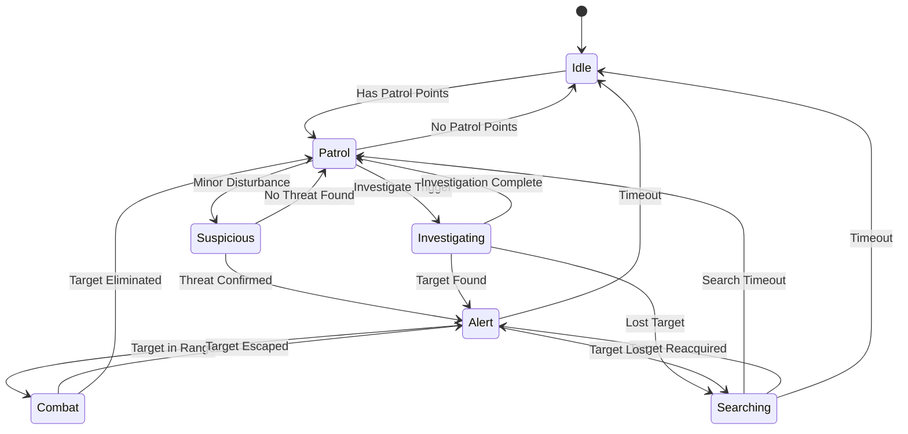
