# プロジェクトのアーキテクチャとデザインパターン解説

このプロジェクトは、保守性と拡張性を高めるための、モダンで堅牢な設計思想に基づいて構築されています。

## アーキテクチャ概要図

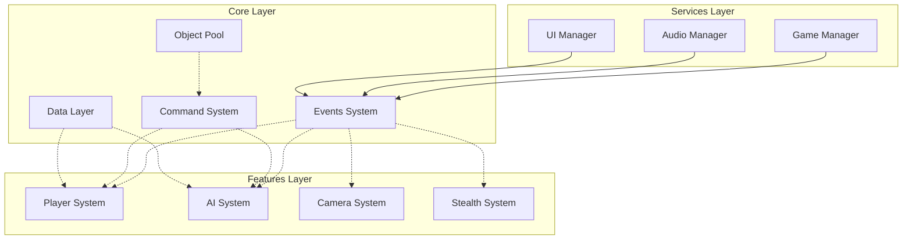

---

### 1. 全体アーキテクチャ: 機能駆動アーキテクチャ (Feature-Driven Architecture)

これはプロジェクト全体の設計思想です。アセットを種類別（`Scripts`, `Materials`など）に分けるのではなく、「機能」や「関心事」で分類します。

*   **説明:**
    ゲームを構成する要素を「プレイヤー」「カメラ」「AI」といった機能単位でカプセル化（ひとまとめに）する設計です。これにより、各機能の独立性が高まり、修正や追加が他の機能に影響を与えにくくなります。
*   **このプロジェクトでの実装:**
    *   `Assets/_Project/Features/` フォルダ内に、`Player`, `Camera`, `Stealth`, `AI` といった機能ごとのフォルダが作成されています。
    *   各機能フォルダの中は、さらに`Scripts`, `Prefabs`, `ScriptableObjects`のように種類別に整理されています。
    *   一方で、すべての機能から共通して利用される汎用的なシステムは `Assets/_Project/Core/` フォルダに集約されており、機能と基盤が明確に分離されています。

---

### 2. 現在の実装における主要システム

#### 実装済みシステムの概要

現在のプロジェクトには以下の主要システムが実装されています：

- **イベントシステム**: 多様なイベントタイプ（GameEvent, PlayerStateEvent, CameraStateEvent, AudioEvent等）とGenericGameEvent対応
- **コマンドシステム**: CommandPoolManager中心の最新式プール最適化システム（DamageCommand, HealCommand等）
- **ステートマシン**: Camera（4状態）、AI（7状態）が完全実装、Player（実装予定）
- **オーディオシステム**: StealthAudioCoordinator中心のステルス特化型統合音響システム
- **カメラシステム**: Cinemachine 3.1統合システムとSingleton化されたCinemachineIntegration
- **AI行動システム**: 7つの状態（Idle, Patrol, Suspicious, Investigating, Searching, Alert, Combat）を持つ高度なAI行動制御
- **デザインパターン統合**: Factory+Registry+ObjectPool統合実装による高度なメモリ管理

---

### 3. 主要なデザインパターン

#### a. イベント駆動アーキテクチャ (Event-Driven Architecture)

コンポーネント間の結合を疎（そ）にするための、このプロジェクトの心臓部と言えるパターンです。

*   **説明:**
    各システムが互いを直接参照して命令を出すのではなく、「イベント」という名の通知を送信（Raise）したり、受信（Listen）したりすることでお互いに連携します。これにより、例えば「プレイヤーがダメージを受けた」というイベントが発生した際に、UIシステムもサウンドシステムも、プレイヤーのことを直接知らなくてもそれぞれが「HPバーを減らす」「ダメージ音を鳴らす」という自身の役割を果たすことができます。
*   **このプロジェクトでの実装:**
    *   **`ScriptableObject`をイベントチャネルとして利用しています。**
    *   `Assets/_Project/Core/Events/` 配下にある `GameEvent`、`PlayerStateEvent`、`CameraStateEvent`、`AudioEvent`、`GenericGameEvent<T>` などのアセットが、具体的なイベントチャネルです。
    *   各コンポーネントは、Inspector上でこれらのイベントアセットを購読（参照）し、`Raise()` メソッドを呼び出すことでイベントを発行したり、`IGameEventListener<T>`インターフェースを通じて処理を紐づけたりします。
    *   `GameEvent`クラスは優先度付きリスナー管理（`HashSet<GameEventListener>`による高速管理）、非同期イベント実行（`RaiseAsync()`）、デバッグ機能をサポートしています。

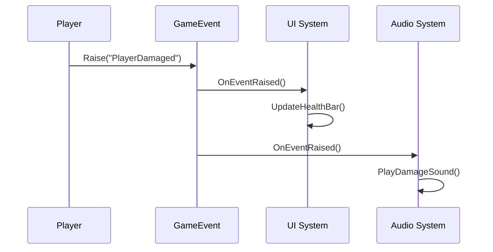

#### b. State パターン (State Pattern)

オブジェクトの状態遷移をクリーンに管理するためのパターンです。

*   **説明:**
    オブジェクトが取りうる様々な状態（例: プレイヤーの「待機状態」「歩行状態」「走行状態」）を、それぞれ独立したクラスとして実装します。状態遷移のロジックや、各状態での振る舞いを状態クラス内にカプセル化することで、巨大なif文やswitch文による分岐を防ぎ、コードを整理します。
*   **このプロジェクトでの実装:**
    *   **カメラシステム**: `CameraStateMachine.cs` が4つの状態（FirstPerson, ThirdPerson, Aim, Cover）を管理。
    *   **AIシステム**: `AIStateMachine.cs` が7つの状態（Idle, Patrol, Suspicious, Investigating, Searching, Alert, Combat）を管理し、NavMeshAgentと統合。
    *   **プレイヤーシステム**: 基盤クラス（`BasePlayerState.cs`, `IPlayerState.cs`）は実装済みだが、`PlayerStateMachine.cs`は今後の実装予定。
    *   各機能フォルダの `States/` ディレクトリに、具体的な状態クラスが配置されています：
        - **Camera States**: `FirstPersonCameraState`, `ThirdPersonCameraState`, `AimCameraState`, `CoverCameraState`
        - **AI States**: `AIIdleState`, `AIPatrolState`, `AISuspiciousState`, `AIInvestigatingState`, `AISearchingState`, `AIAlertState`, `AICombatState`
        - **Player States**: 基盤実装済み（`IdleState`, `WalkingState`, `CrouchingState`, `JumpingState`, `ProneState`, `RunningState`等）
    *   各ステートマシンは、`Dictionary<StateType, IState>`による高速状態検索と、状態クラス内での`Enter()`, `Update()`, `Exit()`メソッドによる明確なライフサイクル管理を実現しています。

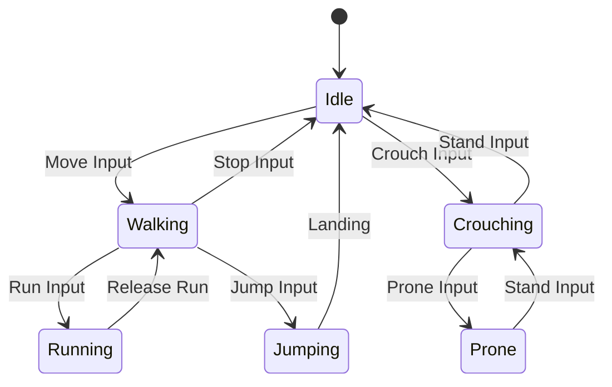

#### c. シングルトンパターン (Singleton Pattern) の改良版実装

*   **説明:**
    あるクラスがプロジェクト内にただ一つしか存在しないことを保証し、そのインスタンスへのグローバルなアクセスポイントを提供します。このプロジェクトでは、従来のシングルトンの問題点を軽減した改良版を採用。
*   **このプロジェクトでの実装:**
    *   **`CinemachineIntegration.Instance`**: Cinemachine 3.1統合カメラシステムのシングルトン。イベント駆動アーキテクチャと組み合わせて疎結合を維持。
    *   **`StealthAudioCoordinator.Instance`**: ステルスオーディオシステムの中央制御。AIシステムとの連携で聴覚センサーシステムを統合管理。
    *   **`AudioManager.Instance`**: オーディオシステムの基盤管理（実装参照による）。
    *   **改良点**: `DontDestroyOnLoad()`による永続化、二重初期化防止、イベントシステムとの統合により直接的な依存を回避。

#### d. コマンドパターン (Command Pattern) with Factory+Registry+ObjectPool統合最適化

*   **説明:**
    ゲーム内で行われる操作（例: 攻撃、回復、移動）を「コマンド」というオブジェクトとしてカプセル化します。これにより、操作の実行、取り消し（Undo）、再実行（Redo）、遅延実行、キューイングなどが容易になります。
*   **このプロジェクトでの実装:**
    *   `ICommand` インターフェースとそれを実装した具体的なコマンドクラス（`DamageCommand`, `HealCommand`等）が実装されています。
    *   **`CommandPoolManager`による最新式統合管理**: Factory + Registry + ObjectPool パターンを統合し、型安全なコマンド管理を実現。
    *   **高度なプール最適化**: `ITypeRegistry<IObjectPool<ICommand>>`による型ベースのプール管理と`IResettableCommand`によるコマンド状態リセット。
    *   **統計情報とデバッグ機能**: `CommandStatistics`による詳細な使用状況の追跡とパフォーマンス分析。
    *   `CommandInvoker`がコマンドの実行とUndoスタック管理を担当。

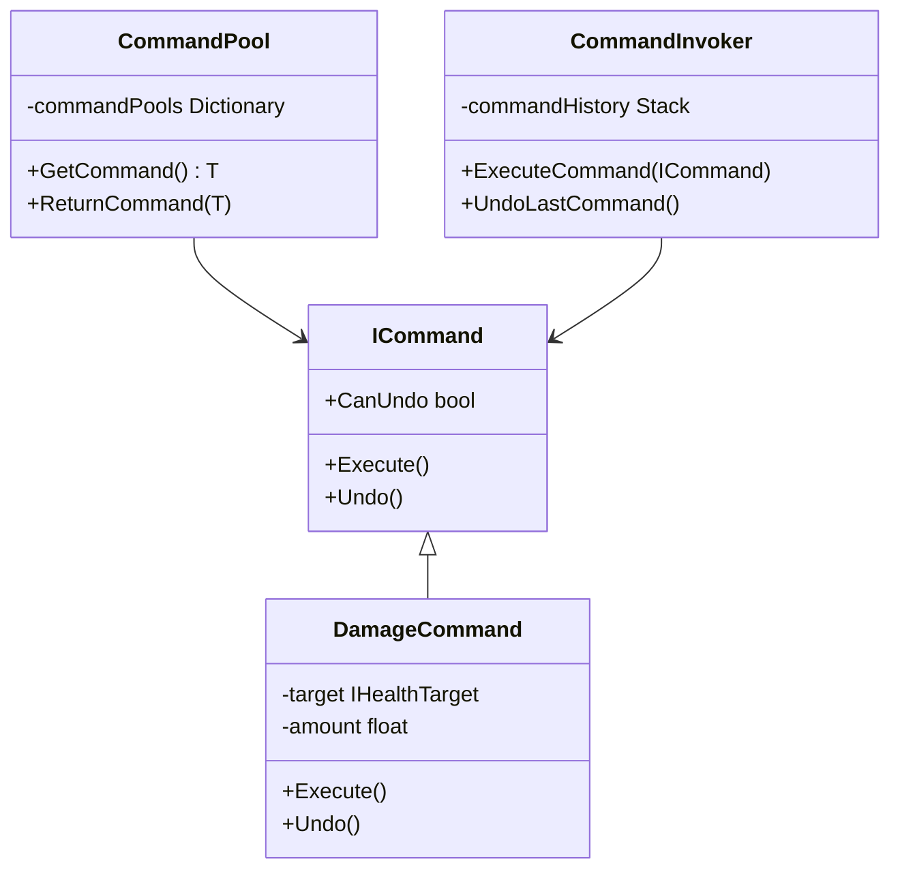

#### e. Inspectorによる依存性注入 (Dependency Injection via Inspector)

*   **説明:**
    コンポーネントが必要とする他のオブジェクト（依存オブジェクト）を、コード内で直接生成・検索するのではなく、外部（この場合はUnityのInspector）から設定（注入）する手法です。これは「制御の反転（Inversion of Control）」の一種です。
*   **このプロジェクトでの実装:**
    *   `GameManager` や `PlayerController` などのクラスが、`[SerializeField]` 属性を使ってイベントチャネル等のフィールドをInspectorに公開しています。
    *   開発者は、コードを変更することなく、Inspector上で `ScriptableObject` アセットをドラッグ＆ドロップするだけでコンポーネントの振る舞いを設定・変更できます。

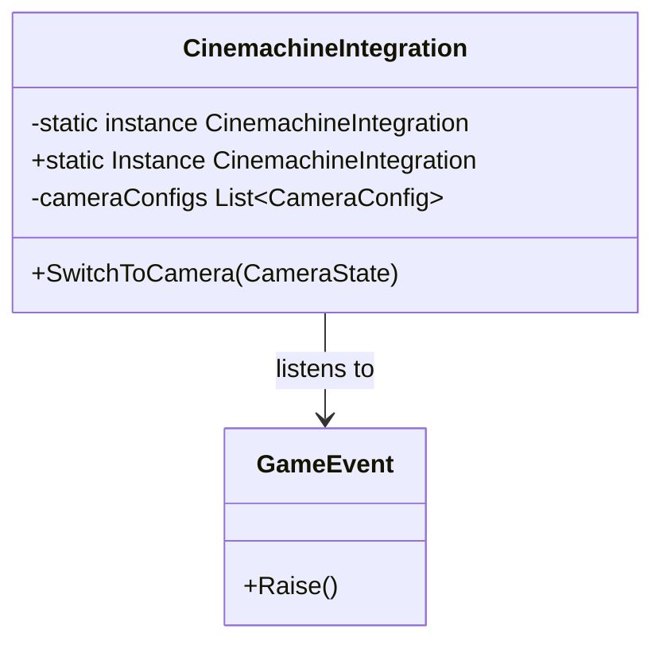

#### f. アセンブリ定義 (Assembly Definitions)

これは古典的なデザインパターンではありませんが、プロジェクトのアーキテクチャを支える重要な仕組みです。

*   **説明:**
    プロジェクト内のスクリプト群を、機能ごとに小さなライブラリ（アセンブリ）に分割します。これにより、スクリプトの変更があった際のコンパイル時間を大幅に短縮できるほか、アセンブリ間の参照関係を定義することで、意図しない依存関係が生まれるのを防ぎます。
*   **このプロジェクトでの実装:**
    *   `asterivo.Unity60.Core`, `asterivo.Unity60.Player`, `asterivo.Unity60.Camera`, `asterivo.Unity60.AI`, `asterivo.Unity60.Stealth`, `asterivo.Unity60.Optimization` のように、機能フォルダごとにアセンブリ定義ファイル（`.asmdef`）が作成されています。
    *   これにより、明確な依存関係のルールを強制し、例えば`Player`は`Core`を参照できますが、`Core`が`Player`を参照することはできません。

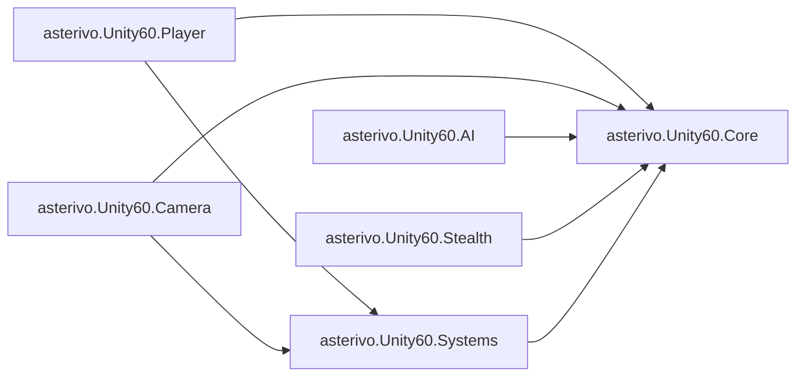

---

### 7. ステルスオーディオシステムの統合実装

現在のプロジェクトには、ステルスゲームに特化した包括的なオーディオシステムが実装されています：

#### 主要コンポーネント
- **StealthAudioCoordinator**: ステルスゲームプレイと音響の中央制御（Singleton）
- **NPCAuditorySensor**: AI NPCの聴覚センサーシステム
- **PlayerAudioSystem**: プレイヤーの音響フィードバック
- **DynamicAudioEnvironment**: 環境による音響マスキング効果
- **SpatialAudioManager**: 3D空間音響制御

#### システム間連携
- AIStateMachineとの警戒レベル連動
- プレイヤーステート（隠れモード）による音響抑制
- 環境マスキング効果による聴覚検知の動的調整
- リアルタイムオーディオダッキング（背景音の自動減衰）
- NPCの聴覚センサーとの音響イベント連携

## システム間相互作用図

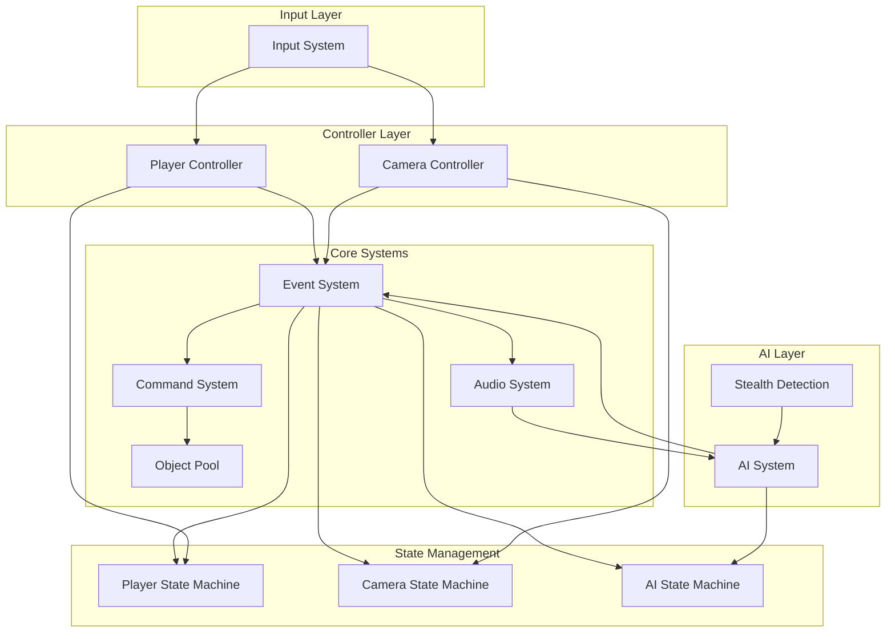

## データフロー図

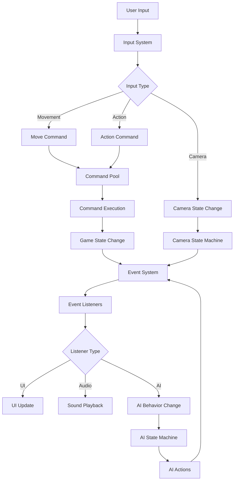

## コマンドパターンの実行フロー

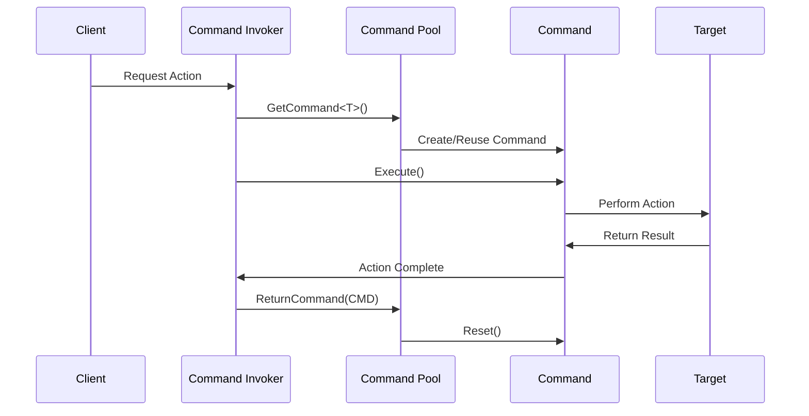

## イベントシステムの購読・発行パターン

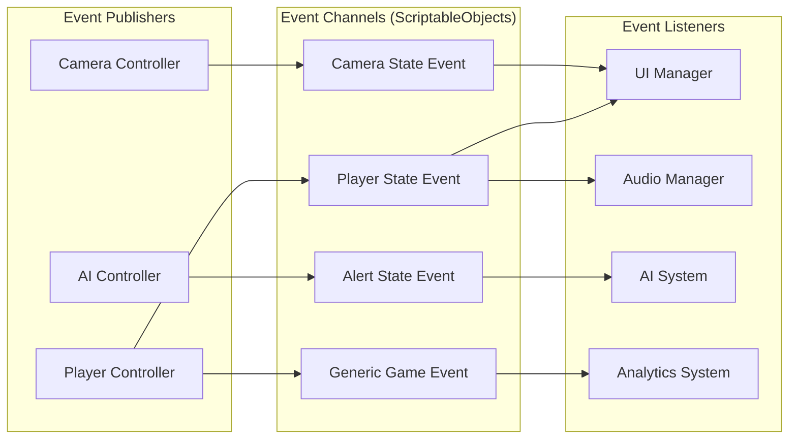

## AI行動ステートマシン（実装済み）

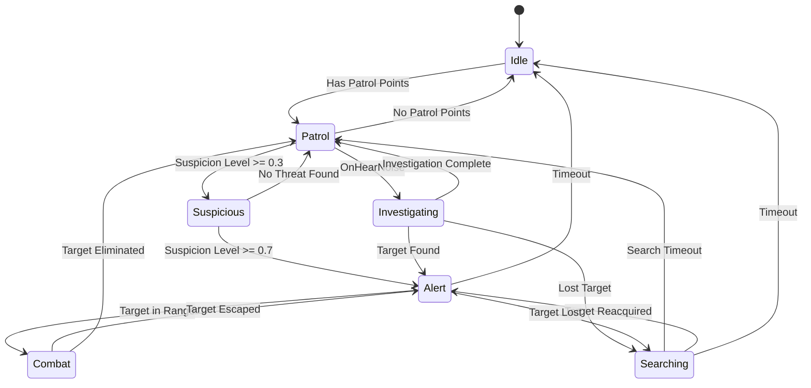
