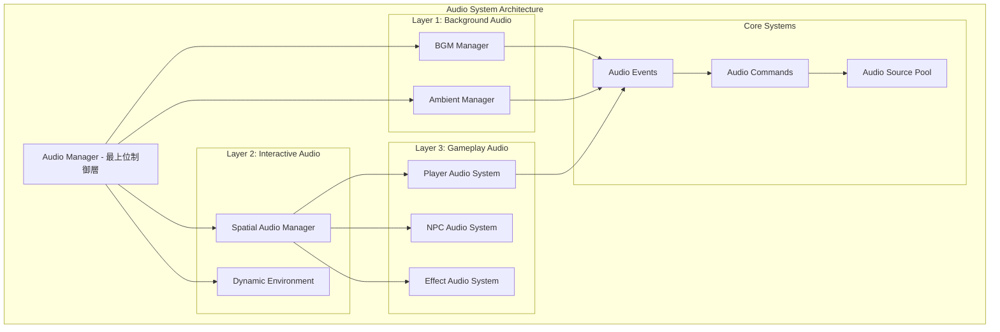
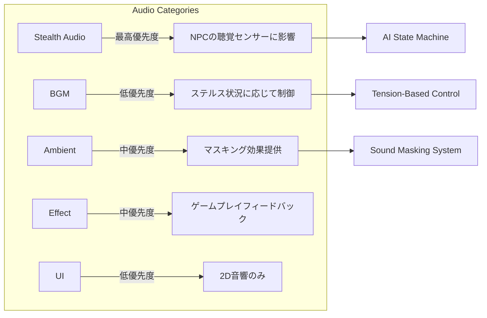

# オーディオシステム統合設計書

このドキュメントでは、既存の高度なステルス特化オーディオシステムに、BGM、環境音、効果音などの一般的なサウンドを統合するための設計方針を説明します。

---

## 現在のオーディオシステム分析

### 実装済みの高機能システム

#### 1. SpatialAudioManager
- **機能**: 3D空間音響、オクルージョン計算、オーディオソースプール
- **特徴**: 最大32の同時音源、距離減衰、障害物による遮蔽計算
- **ファイル**: `Assets/_Project/Core/Audio/SpatialAudioManager.cs`

#### 2. DynamicAudioEnvironment  
- **機能**: 環境に応じた動的音響変化（時間帯、天候、場所）
- **特徴**: 5つの環境タイプ（室内、屋外、洞窟、森林、水中）、4つの天候、マスキング効果
- **ファイル**: `Assets/_Project/Core/Audio/DynamicAudioEnvironment.cs`

#### 3. PlayerAudioSystem
- **機能**: プレイヤーの足音、インタラクション音の詳細管理
- **特徴**: 表面材質検出、移動状態別音響設定、NPCの聴覚センサー連携
- **ファイル**: `Assets/_Project/Features/Player/Audio/PlayerAudioSystem.cs`

#### 4. CommandPattern統合
- **機能**: PlaySoundCommand による統一的な音声再生システム
- **特徴**: ObjectPool最適化、Undo/Redo対応、イベント駆動型
- **ファイル**: `Assets/_Project/Core/Audio/Commands/PlaySoundCommand.cs`

### ステルス特化要素

- **NPCの聴覚センサー連携**: 音が AI の行動に直接影響
- **表面材質による音響特性**: 8種類の材質（コンクリート、カーペット、金属等）
- **マスキング効果**: 環境音が足音を隠す仕組み
- **音の優先度システム**: NPCの注意を引く度合いの管理

---

## 統合設計アーキテクチャ

### システム階層図



### 音響カテゴリシステム



---

## 実装戦略

### Phase 1: 基盤拡張

#### 1. AudioManager の作成

```csharp
/// <summary>
/// 最上位のオーディオ制御システム
/// 既存のステルスオーディオシステムと新規システムを統合管理
/// </summary>
public class AudioManager : MonoBehaviour
{
    [Header("Audio Categories")]
    [SerializeField] private BGMManager bgmManager;
    [SerializeField] private AmbientManager ambientManager;
    [SerializeField] private EffectManager effectManager;
    
    [Header("Existing Systems Integration")]
    [SerializeField] private SpatialAudioManager spatialAudio;
    [SerializeField] private DynamicAudioEnvironment dynamicEnvironment;
    [SerializeField] private PlayerAudioSystem playerAudio;
    
    [Header("Master Volume Controls")]
    [Range(0f, 1f)] public float masterVolume = 1f;
    [Range(0f, 1f)] public float bgmVolume = 0.8f;
    [Range(0f, 1f)] public float ambientVolume = 0.6f;
    [Range(0f, 1f)] public float effectVolume = 1f;
    [Range(0f, 1f)] public float stealthAudioVolume = 1f;
    
    [Header("Stealth Integration")]
    [SerializeField] private StealthAudioCoordinator stealthCoordinator;
    
    /// <summary>
    /// ゲーム状態に応じたオーディオ制御
    /// </summary>
    public void UpdateAudioForGameState(GameState state, float tensionLevel)
    {
        // ステルス状況に応じてBGMと環境音を制御
        bool shouldReduceBackground = stealthCoordinator.ShouldReduceNonStealthAudio();
        
        bgmManager.UpdateForTensionLevel(tensionLevel, shouldReduceBackground);
        ambientManager.UpdateForStealthState(shouldReduceBackground);
    }
}
```

#### 2. AudioEventData の拡張

```csharp
/// <summary>
/// 音響カテゴリの定義
/// </summary>
public enum AudioCategory
{
    Stealth,        // 既存のステルス音響（最高優先度）
    BGM,            // バックグラウンドミュージック
    Ambient,        // 環境音（マスキング効果あり）
    Effect,         // 効果音
    UI              // UIサウンド
}

/// <summary>
/// 拡張された音響イベントデータ
/// 既存のステルス機能を維持しつつ新機能を追加
/// </summary>
[System.Serializable]
public struct AudioEventData
{
    // === 既存フィールド（維持） ===
    [Header("基本音響情報")]
    public string soundID;
    public float volume;
    public float pitch;
    
    [Header("空間情報")]
    public Vector3 worldPosition;
    public bool use3D;
    
    [Header("ゲームプレイ情報")]
    public AudioSourceType sourceType;
    public bool isPlayerGenerated;
    public float timestamp;
    
    [Header("ステルス特化設定")]
    public float hearingRadius;
    public SurfaceMaterial surfaceType;
    public bool canBemasked;
    public float priority;
    
    // === 新規追加フィールド ===
    [Header("カテゴリ統合機能")]
    public AudioCategory category;              // 音響カテゴリ
    public bool affectsStealthGameplay;        // ステルスゲームプレイに影響するか
    public float maskingStrength;              // この音が提供するマスキング効果の強度
    public bool canBeDuckedByTension;          // 緊張状態で音量を下げるか
    
    /// <summary>
    /// ステルス音響用のデフォルト作成
    /// </summary>
    public static AudioEventData CreateStealthDefault(string soundID)
    {
        return new AudioEventData
        {
            soundID = soundID,
            volume = 1f,
            pitch = 1f,
            use3D = true,
            hearingRadius = 5f,
            surfaceType = SurfaceMaterial.Default,
            canBemasked = true,
            priority = 0.5f,
            timestamp = Time.time,
            category = AudioCategory.Stealth,
            affectsStealthGameplay = true,
            maskingStrength = 0f,
            canBeDuckedByTension = false
        };
    }
    
    /// <summary>
    /// BGM用のデフォルト作成
    /// </summary>
    public static AudioEventData CreateBGMDefault(string soundID)
    {
        return new AudioEventData
        {
            soundID = soundID,
            volume = 0.8f,
            pitch = 1f,
            use3D = false,
            hearingRadius = 0f,
            canBemasked = false,
            priority = 0.1f,
            timestamp = Time.time,
            category = AudioCategory.BGM,
            affectsStealthGameplay = false,
            maskingStrength = 0.3f,
            canBeDuckedByTension = true
        };
    }
}
```

### Phase 2: BGM システム

#### BGMManager の実装

```csharp
/// <summary>
/// ステルスゲーム特化のBGMマネージャー
/// 緊張度とゲーム状況に応じた動的BGM制御
/// </summary>
public class BGMManager : MonoBehaviour
{
    [Header("BGM Categories")]
    [SerializeField] private BGMTrack[] menuBGM;
    [SerializeField] private BGMTrack[] ambientBGM;        // 平常時
    [SerializeField] private BGMTrack[] tensionBGM;        // 警戒時
    [SerializeField] private BGMTrack[] combatBGM;         // 戦闘時
    [SerializeField] private BGMTrack[] stealthSuccessBGM; // ステルス成功時
    
    [Header("Dynamic Control Settings")]
    [SerializeField] private float crossfadeDuration = 2f;
    [SerializeField] private AnimationCurve tensionCurve = AnimationCurve.EaseInOut(0f, 0f, 1f, 1f);
    [SerializeField] private float stealthVolumeReduction = 0.3f;
    
    [Header("Audio Events")]
    [SerializeField] private AudioEvent bgmChangeEvent;
    
    // 現在の状態
    private BGMTrack currentTrack;
    private AudioSource bgmAudioSource;
    private AudioSource crossfadeAudioSource;
    private float currentTensionLevel = 0f;
    private bool isStealthModeActive = false;
    
    /// <summary>
    /// 緊張度に応じたBGM更新
    /// </summary>
    public void UpdateForTensionLevel(float tensionLevel, bool stealthModeActive = false)
    {
        currentTensionLevel = tensionLevel;
        isStealthModeActive = stealthModeActive;
        
        BGMTrack targetTrack = SelectBGMByTension(tensionLevel);
        
        if (targetTrack != currentTrack)
        {
            CrossfadeToBGM(targetTrack);
        }
        
        // ステルス時の音量調整
        UpdateVolumeForStealthState();
    }
    
    /// <summary>
    /// 緊張度に基づくBGM選択
    /// </summary>
    private BGMTrack SelectBGMByTension(float tension)
    {
        if (tension < 0.2f)
            return GetRandomTrack(ambientBGM);
        else if (tension < 0.7f)
            return GetRandomTrack(tensionBGM);
        else
            return GetRandomTrack(combatBGM);
    }
    
    /// <summary>
    /// スムーズなBGM切り替え
    /// </summary>
    private void CrossfadeToBGM(BGMTrack newTrack)
    {
        if (newTrack == null) return;
        
        StartCoroutine(CrossfadeCoroutine(newTrack));
        currentTrack = newTrack;
        
        // BGM変更イベントを発行
        bgmChangeEvent?.Raise($"BGM_Change_{newTrack.trackName}");
    }
    
    /// <summary>
    /// ステルス状態に応じた音量調整
    /// </summary>
    private void UpdateVolumeForStealthState()
    {
        float targetVolume = isStealthModeActive ? stealthVolumeReduction : 1f;
        
        if (bgmAudioSource != null)
        {
            StartCoroutine(FadeVolumeCoroutine(bgmAudioSource, targetVolume, 1f));
        }
    }
    
    private IEnumerator CrossfadeCoroutine(BGMTrack newTrack)
    {
        // クロスフェード実装
        yield return null;
    }
    
    private IEnumerator FadeVolumeCoroutine(AudioSource source, float targetVolume, float duration)
    {
        // 音量フェード実装
        yield return null;
    }
}

/// <summary>
/// BGMトラック情報
/// </summary>
[System.Serializable]
public class BGMTrack
{
    public string trackName;
    public AudioClip clip;
    [Range(0f, 1f)] public float volume = 0.8f;
    public bool looping = true;
    public float fadeInDuration = 2f;
    public float fadeOutDuration = 2f;
    
    [Header("Stealth Game Integration")]
    public float tensionLevel = 0f;          // この曲が適用される緊張度
    public bool allowInStealthMode = true;   // ステルス中に再生可能か
}
```

### Phase 3: 環境音・効果音システム

#### ステルス統合コーディネーター

```csharp
/// <summary>
/// ステルスゲームプレイと一般オーディオの協調制御
/// </summary>
public class StealthAudioCoordinator : MonoBehaviour
{
    [Header("AI Integration")]
    [SerializeField] private float aiAlertThreshold = 0.5f;
    [SerializeField] private float playerHidingRadius = 3f;
    
    [Header("Audio Reduction Settings")]
    [SerializeField] private float bgmReductionAmount = 0.4f;
    [SerializeField] private float ambientReductionAmount = 0.6f;
    
    /// <summary>
    /// 非ステルス音響を抑制すべきかを判定
    /// </summary>
    public bool ShouldReduceNonStealthAudio()
    {
        // プレイヤーが隠れモードの時
        if (IsPlayerInHidingMode())
            return true;
            
        // 近くのAIが警戒状態の時
        if (GetNearbyAIAlertLevel() > aiAlertThreshold)
            return true;
            
        // 重要なステルスアクション中
        if (IsPerformingCriticalStealthAction())
            return true;
            
        return false;
    }
    
    /// <summary>
    /// マスキング効果の計算
    /// </summary>
    public float CalculateMaskingEffect(Vector3 soundPosition, AudioEventData audioData)
    {
        float totalMasking = 0f;
        
        // BGMによるマスキング
        if (IsBGMPlaying())
        {
            totalMasking += GetBGMMaskingStrength();
        }
        
        // 環境音によるマスキング
        totalMasking += GetEnvironmentalMaskingAt(soundPosition);
        
        // 天候によるマスキング
        totalMasking += GetWeatherMaskingEffect();
        
        return Mathf.Clamp01(totalMasking);
    }
    
    /// <summary>
    /// NPCの聴覚システムへの影響度を計算
    /// </summary>
    public float GetNPCAudibilityMultiplier(AudioEventData audioData)
    {
        if (!audioData.affectsStealthGameplay)
            return 0f; // ステルスに影響しない音は NPCが感知しない
            
        float maskingEffect = CalculateMaskingEffect(audioData.worldPosition, audioData);
        return 1f - maskingEffect;
    }
    
    private bool IsPlayerInHidingMode()
    {
        // PlayerControllerの状態を確認
        return false; // 実装に応じて調整
    }
    
    private float GetNearbyAIAlertLevel()
    {
        // AISystemから警戒レベルを取得
        return 0f; // 実装に応じて調整
    }
    
    private bool IsPerformingCriticalStealthAction()
    {
        // 鍵開け、ハッキングなどの重要アクションを検出
        return false; // 実装に応じて調整
    }
}
```

---

## 実装ロードマップ

### 🎯 Phase 1: 基盤拡張（1-2週間）
- [ ] `AudioManager` の作成と既存システムとの統合
- [ ] `AudioEventData` のカテゴリ拡張
- [ ] `SpatialAudioManager` のカテゴリ対応機能追加
- [ ] `StealthAudioCoordinator` の基本実装

### 🎵 Phase 2: BGM システム（1-2週間）
- [ ] `BGMManager` の実装
- [ ] 緊張度ベースのBGM制御システム
- [ ] `DynamicAudioEnvironment` との連携
- [ ] クロスフェード機能の実装

### 🌍 Phase 3: 環境音・効果音（1-2週間）
- [ ] `AmbientManager` の実装
- [ ] `EffectManager` の実装
- [ ] マスキング効果の統合
- [ ] NPCの聴覚センサーとの完全連携

### 🔧 Phase 4: 最適化・統合テスト（1週間）
- [ ] パフォーマンス最適化
- [ ] 既存 `CommandPool` システムの全カテゴリ対応
- [ ] エディタツールの拡張
- [ ] 統合テストとバランス調整

---

## 設計原則

### 1. ステルスゲームプレイの優先
- ステルスに関連する音響要素は常に最高優先度
- BGMや効果音はゲームプレイを妨害しない設計
- NPCの聴覚センサーとの完全な統合

### 2. 既存システムの保護
- `SpatialAudioManager`、`DynamicAudioEnvironment`、`PlayerAudioSystem` の機能を維持
- 既存のイベント駆動アーキテクチャを活用
- `CommandPool` システムの継続利用

### 3. マスキング効果の活用
- BGMが効果音をマスクする自然な音響設計
- 環境音（雨、風、機械音）が足音をマスクする仕組み
- 動的なマスキング強度の計算

### 4. パフォーマンス最適化
- 既存のオーディオソースプールシステムの拡張
- CommandPattern による統一的なメモリ管理
- 状況に応じた音響品質の動的調整

---

## 期待される効果

### ゲーム体験の向上
- **没入感の向上**: 状況に応じた動的BGMとリッチな環境音
- **ステルス体験の深化**: 音によるマスキング効果の戦略的活用
- **音響フィードバック**: プレイヤーアクションに対する豊かな音響レスポンス

### 開発効率の向上
- **統一的なシステム**: 全ての音響要素を一元管理
- **再利用可能な設計**: CommandPattern による柔軟なサウンド制御
- **デバッグとバランス調整**: 視覚化ツールによる音響状況の把握

### 技術的メリット
- **スケーラビリティ**: 新しい音響カテゴリの容易な追加
- **メモリ効率**: ObjectPool による最適化された音源管理
- **モジュラー設計**: 各システムの独立性とテスタビリティ

---

## まとめ

この設計により、**既存の高度なステルスオーディオシステムの品質を維持しながら**、一般的なゲームに必要なBGM、環境音、効果音を自然に統合することができます。特に「NPCの聴覚センサーと連携したマスキング効果」や「緊張度に応じたBGM制御」など、ステルスゲームならではの特色ある音響体験を提供できるでしょう。

実装は段階的に進めることで、各フェーズでの動作確認とバランス調整が可能です。既存システムへの影響を最小限に抑えながら、豊かな音響体験を実現する設計となっています。