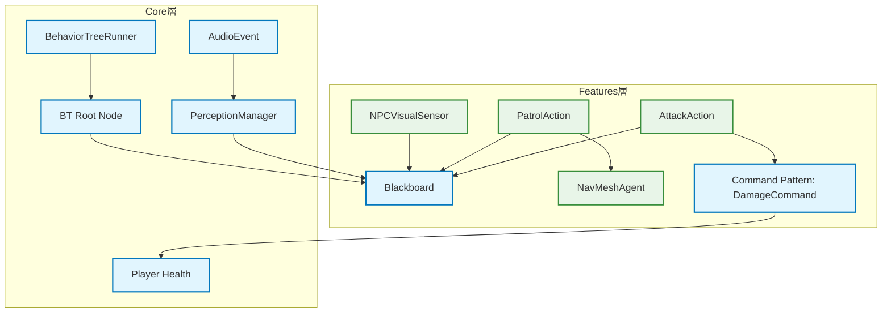

# ビヘイビアツリー (Behavior Tree) フレームワーク 技術設計書

## 文書管理情報

- **ドキュメント種別**: 技術設計書（SDDフェーズ3: 設計）
- **生成元**: AI強化に関する開発者からの要求
- **ステータス**: 提案・設計段階
- **対象読者**: アーキテクト、AI開発者、ゲームプレイプログラマー
- **関連要件**: AIの複雑な意思決定ロジックを、ステートマシンよりもスケーラブルかつ保守性高く実装する必要性

---

## 1. 概要と設計思想

### 1.1. 目的
本設計書は、現在のステートマシン基盤を補完し、より複雑で動的なAIロジックを効率的に構築するための、再利用可能な**ビヘイビアツリー (BT) フレームワーク**の技術設計を定義する。

### 1.2. 設計思想
- **データ駆動 (Data-Driven)**: AIのロジック（ツリー構造）をScriptableObjectアセットとして定義し、プログラマー以外のチームメンバー（デザイナー等）も編集・管理できるようにする。
- **モジュール性 (Modularity)**: 個々の行動（Action）や判断（Composite, Decorator）を独立したノードとしてカプセル化し、高い再利用性を実現する。
- **パフォーマンス (Performance)**: 実行時のオーバーヘッドを最小限に抑え、多数のAIキャラクターが同時に動作可能な設計とする。
- **既存アーキテクチャとの統合**: Service Locator, Eventシステム, Blackboard（後述）とシームレスに連携し、プロジェクト全体の設計思想に準拠する。

---

## 2. アーキテクチャ設計

### 2.1. Core層とFeatures層の役割分担

#### **Core層 (`asterivo.Unity60.Core.AI.BehaviorTrees`)**
特定のゲームロジックに依存しない、汎用的なBTの「仕組み」を提供する。

- **BT実行エンジン**: `BehaviorTreeRunner`
- **ノード基底クラス**: `Node` (abstract)
- **ノード種別**:
    - `CompositeNode`: `Sequence`, `Selector`, `Parallel`
    - `DecoratorNode`: `Inverter`, `Succeeder`, `Repeater`, `Condition`
    - `ActionNode`: (具体的な行動の基底クラス)
- **データ共有機構**: `Blackboard`

#### **Features層 (`asterivo.Unity60.Features.AI.BehaviorTrees.*`)**
Core層の基盤を利用して、特定のゲーム機能やキャラクターに特化した具体的な「行動」や「判断条件」を実装する。

- **具体的なActionNode**: `PatrolAction`, `ChasePlayerAction`, `AttackAction`
- **具体的なDecoratorNode**: `IsPlayerInSightCondition`
- **BTアセット**: 上記のノードを組み合わせて作成された`EnemyBehaviorTree.asset`

### 2.2. 主要コンポーネント詳細 (Core層)

#### `BehaviorTreeRunner.cs` (MonoBehaviour)
- Unityのゲームオブジェクトにアタッチし、BTの実行を開始・管理する。
- 実行するBTアセット（Root Node）と、使用するBlackboardアセットへの参照を持つ。
- `Update()`メソッドで、Root Nodeからツリーの評価（Tick）を開始する。

#### `Node.cs` (ScriptableObject)
- 全てのノードの抽象基底クラス。
- `NodeStatus Execute(GameObject agent, Blackboard blackboard)` という抽象メソッドを持つ。
- `NodeStatus` は `Success`, `Failure`, `Running` の3つの値を持つenum。

#### `Blackboard.cs` (ScriptableObject)
- AIの「短期記憶」として機能するデータコンテナ。
- キー（string）と値（各種型）を格納する辞書ベースのシステム。
- `SetValue<T>(string key, T value)`, `GetValue<T>(string key)` といったメソッドを提供する。
- 対応する型: `float`, `int`, `bool`, `string`, `Vector3`, `GameObject`, `Transform`など。
- センサーからの情報や、行動の結果をここに書き込むことで、ノード間のデータ共有を実現する。

#### Composite Nodes ( `CompositeNode.cs` を継承)
- 1つ以上の子ノードを持つ。
- **`Sequence.cs`**: 子ノードを順番に実行。一つでも`Failure`を返したら、即座に`Failure`を返す。すべて成功したら`Success`を返す。
- **`Selector.cs`**: 子ノードを順番に実行。一つでも`Success`を返したら、即座に`Success`を返す。すべて失敗したら`Failure`を返す。（フォールバック処理に適している）
- **`Parallel.cs`**: すべての子ノードを同時に実行する。成功・失敗の条件は設定可能（例：N個の子が成功したらSuccess）。

#### Decorator Nodes ( `DecoratorNode.cs` を継承)
- 1つだけの子ノードを持つ。子ノードの振る舞いを修飾・変更する。
- **`Inverter.cs`**: 子ノードの結果を反転させる (`Success` -> `Failure`, `Failure` -> `Success`)。
- **`Succeeder.cs`**: 子ノードの結果に関わらず、常に`Success`を返す。
- **`Repeater.cs`**: 子ノードを指定回数、または成功/失敗するまで繰り返し実行する。
- **`Condition.cs`**: Blackboardの特定の値を評価し、条件を満たす場合のみ子ノードを実行する。

#### `ActionNode.cs` (abstract)
- 子ノードを持たない葉（Leaf）ノード。
- AIの具体的な行動（移動、攻撃、アニメーション再生など）を実装するための基底クラス。
- Features層でこのクラスを継承して具体的なアクションを作成する。

---

## 3. データフローと既存システムとの統合

BTフレームワークは、以下の図のように既存システムと連携する。

1.  **センサー -> Blackboard**: `NPCVisualSensor`や`NPCAuditorySensor`は、検知した情報（例：プレイヤーのオブジェクト、最後の目撃位置）をBlackboardに書き込む。
2.  **BT -> Blackboard**: `Condition`ノードや`Action`ノードは、Blackboardから情報を読み取り、行動の判断材料とする。（例：「"Target"キーにGameObjectがセットされていたら追跡を開始する」）
3.  **BT -> Game Logic**: `ActionNode`は、`ServiceLocator`を通じて`IAudioService`を呼び出したり、`CommandPool`から`DamageCommand`を取得して実行したりする。
4.  **Game Events -> BT**: `GameEvent`をリッスンし、Blackboardの値を更新することで、外部からのイベントをきっかけにBTの行動を変化させることができる。（例：`OnAlertBroadcast`イベントを受け取ったら、Blackboardの`"AlertLevel"`キーを上げる）

---

## 4. 実装詳細とエディタ拡張

### 4.1. ScriptableObjectベースのツリー構造
- 全てのノード (`Sequence`, `PatrolAction`など) は `ScriptableObject` として実装する。
- これにより、各ノードはアセットファイルとなり、ノード間の親子関係はアセット参照としてUnity Inspector上で設定できる。
- メリット:
    - デザイナーがコードを触らずに、Inspector上でBTを構築・編集できる。
    - ツリー構造をプレハブのように再利用できる。
    - 実行時にツリー構造を変更しても、元のアセットには影響がない。

### 4.2. カスタムエディタ (推奨)
- ScriptableObjectを直接つなぎ合わせるのは煩雑なため、**UnityのGraphView API**を使用したノードベースのビジュアルエディタを開発することを強く推奨する。
- 機能:
    - ノードのドラッグ＆ドロップによる追加・削除。
    - ノード間の親子関係を線で結んで視覚的に編集。
    - 実行時にアクティブなノードをハイライト表示するデバッグ機能。

---

## 5. パフォーマンス要件
- **Tick頻度の最適化**: 毎フレームBTを評価するのではなく、AIの状態やイベントに応じて評価タイミングを制御する。例えば、遠くにいるAIは評価頻度を落とす。
- **メモリ効率**: ノードはScriptableObjectアセットであるため、実行時のインスタンス生成を最小限に抑える。Blackboardのデータも必要最小限に留める。

---

## 6. テスト戦略
- **Unit Tests (Core層)**:
    - 各Compositeノード（`Sequence`, `Selector`）が、子ノードの返すステータスに応じて正しく動作するかをテストする。
    - 各Decoratorノード（`Inverter`等）が、子ノードの結果を正しく修飾するかをテストする。
- **Integration Tests (Features層)**:
    - モックのBlackboardとセンサーを用意し、特定の情報がBlackboardに書き込まれた際に、BTが期待通りの行動（例：巡回から追跡へ）に遷移するかをテストする。

---

## 7. 次のステップ
1.  Core層の主要コンポーネント（`Node`, `NodeStatus`, `Blackboard`, `BehaviorTreeRunner`, 各Composite/Decoratorノード）を実装する。
2.  Features層で、テスト用のシンプルな`ActionNode`（例：`LogMessageAction`）を実装する。
3.  基本的なBTアセットを手動で作成し、`BehaviorTreeRunner`で実行できることを確認する。
4.  (推奨) GraphViewベースのビジュアルエディタの開発に着手する。
