# Unity URP 3D Base Template - 包括的アーキテクチャドキュメント

**作成日**: 2025年9月11日  
**バージョン**: Phase 1 - 名前空間統一完了版  
**プロジェクト**: Unity 6 URP 3D Base Template

## 概要

このドキュメントは、Unity 6で構築された3Dゲームプロジェクトのベーステンプレートの包括的なアーキテクチャ解説です。現在の実装を正解として、プロジェクトの設計原則、アーキテクチャパターン、データフロー、イベントフローを詳細に記述します。

## 目次

1. [アーキテクチャ概要](#アーキテクチャ概要)
2. [ディレクトリ構造とレイヤー分離](#ディレクトリ構造とレイヤー分離)
3. [核心デザインパターン](#核心デザインパターン)
4. [イベント駆動型アーキテクチャ](#イベント駆動型アーキテクチャ)
5. [サービスロケーターパターン](#サービスロケーターパターン)
6. [コマンドパターン](#コマンドパターン)
7. [システム初期化とライフサイクル](#システム初期化とライフサイクル)
8. [データフローとイベントフロー](#データフローとイベントフロー)
9. [オーディオアーキテクチャ](#オーディオアーキテクチャ)
10. [移行パターンと後方互換性](#移行パターンと後方互換性)
11. [名前空間規約](#名前空間規約)
12. [アーキテクチャ図](#アーキテクチャ図)

---

## アーキテクチャ概要

### 基本哲学

このプロジェクトは **疎結合・高凝集** の原則に基づき、以下の3つのアーキテクチャパラダイムを組み合わせています：

1. **イベント駆動型アーキテクチャ (Event-Driven Architecture)**
2. **サービスロケーターパターン (Service Locator Pattern)**
3. **レイヤードアーキテクチャ (Layered Architecture)**

### アーキテクチャの柱

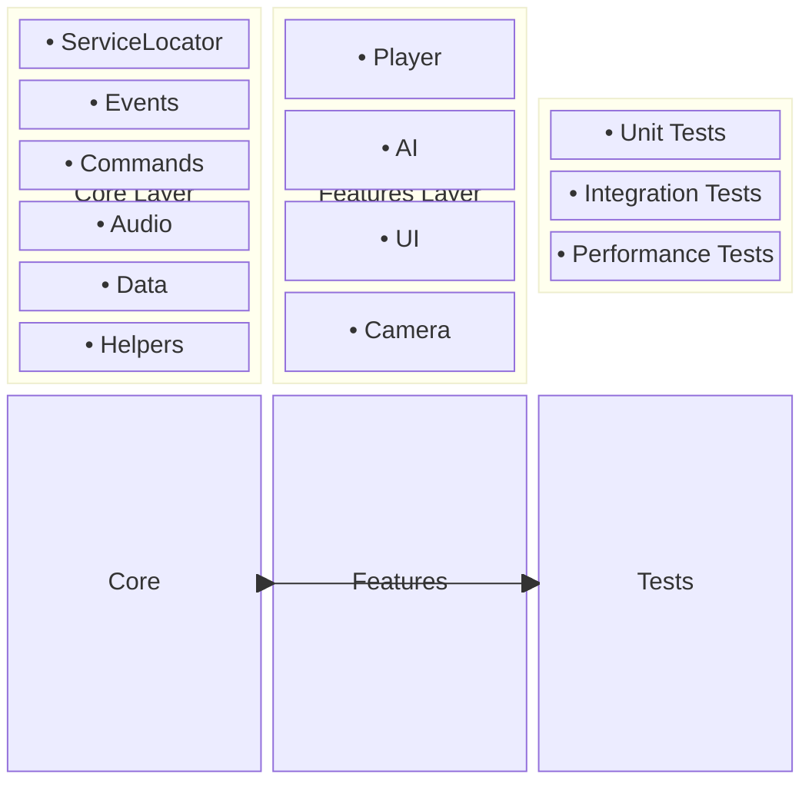

---

## ディレクトリ構造とレイヤー分離

### 物理的構造

```mermaid
flowchart TD
    Project["Assets/_Project/"]
    
    Project --> Core["Core/<br/><small>核心システム（共通基盤）</small>"]
    Project --> Features["Features/<br/><small>機能実装（ドメイン固有）</small>"]
    Project --> Tests["Tests/<br/><small>テストコード</small>"]
    Project --> Docs["Docs/<br/><small>ドキュメント</small>"]
    
    Core --> CoreAudio["Audio/<br/><small>オーディオシステム</small>"]
    Core --> CoreCommands["Commands/<br/><small>コマンドパターン実装</small>"]
    Core --> CoreEvents["Events/<br/><small>イベントシステム</small>"]
    Core --> CoreServices["Services/<br/><small>サービス実装</small>"]
    Core --> CoreHelpers["Helpers/<br/><small>ヘルパークラス</small>"]
    Core --> CoreLifecycle["Lifecycle/<br/><small>ライフサイクル管理</small>"]
    Core --> ServiceLocatorFile["ServiceLocator.cs"]
    Core --> FeatureFlagsFile["FeatureFlags.cs"]
    Core --> GameManagerFile["GameManager.cs"]
    Core --> SystemInitializerFile["SystemInitializer.cs"]
    
    Features --> FeaturesPlayer["Player/<br/><small>プレイヤー機能</small>"]
    Features --> FeaturesAI["AI/<br/><small>AI機能</small>"]
    Features --> FeaturesUI["UI/<br/><small>UI機能</small>"]
    Features --> FeaturesCamera["Camera/<br/><small>カメラ機能</small>"]
    
    Tests --> TestsCore["Core/<br/><small>Coreレイヤーのテスト</small>"]
    Tests --> TestsFeatures["Features/<br/><small>Featuresレイヤーのテスト</small>"]
    Tests --> TestsIntegration["Integration/<br/><small>結合テスト</small>"]
    Tests --> TestsPerformance["Performance/<br/><small>パフォーマンステスト</small>"]
    
    Docs --> ArchPolicies["Architecture_Policies.md"]
    Docs --> Works["Works/<br/><small>作業ログ保管庫</small>"]
    
    style Core fill:#e1f5fe
    style Features fill:#f3e5f5
    style Tests fill:#e8f5e8
    style Docs fill:#fff3e0
```

### 依存関係制約

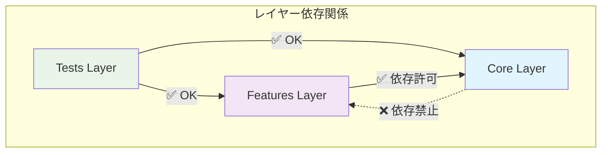

**重要**: Core層からFeatures層への依存は **厳格に禁止** されています。

---

## 核心デザインパターン

### 1. Service Locator Pattern

**実装場所**: `Assets/_Project/Core/ServiceLocator.cs:11`

```csharp
public static class ServiceLocator
{
    private static readonly Dictionary<Type, object> services = new Dictionary<Type, object>();
    private static readonly Dictionary<Type, Func<object>> factories = new Dictionary<Type, Func<object>>();
    private static readonly object lockObject = new object();
    
    public static void RegisterService<T>(T service) where T : class { /* ... */ }
    public static T GetService<T>() where T : class { /* ... */ }
    public static T RequireService<T>() where T : class { /* ... */ }
}
```

**特徴**:
- **スレッドセーフ**: `lockObject`による同期制御
- **ファクトリーサポート**: 遅延初期化対応
- **型安全**: ジェネリクスによる型チェック

### 2. Event-Driven Architecture

**実装場所**: `Assets/_Project/Core/Events/GameEvent.cs:13`

```csharp
[CreateAssetMenu(fileName = "New Game Event", menuName = "asterivo.Unity60/Events/Game Event")]
public class GameEvent : ScriptableObject
{
    private readonly HashSet<GameEventListener> listeners = new HashSet<GameEventListener>();
    private List<GameEventListener> sortedListeners;
    private bool isDirty = true;
    
    public void Raise() { /* 優先度順実行 */ }
    public System.Collections.IEnumerator RaiseAsync() { /* 非同期実行 */ }
}
```

**特徴**:
- **ScriptableObjectベース**: アセットとしてイベント定義を管理
- **優先度付きリスナー**: `Priority`による実行順制御
- **パフォーマンス最適化**: `HashSet`による高速管理
- **非同期サポート**: フレーム分散実行

### 3. Command Pattern

**実装場所**: `Assets/_Project/Core/Commands/ICommand.cs:6`

```csharp
public interface ICommand
{
    void Execute();
    void Undo();
    bool CanUndo { get; }
}
```

**実装場所**: `Assets/_Project/Core/Commands/CommandInvoker.cs:15`

```csharp
public class CommandInvoker : MonoBehaviour, IGameEventListener<ICommand>
{
    private Stack<ICommand> undoStack = new Stack<ICommand>();
    private Stack<ICommand> redoStack = new Stack<ICommand>();
    
    public void ExecuteCommand(ICommand command) { /* 実行・履歴管理 */ }
    public bool Undo() { /* 元に戻す */ }
    public bool Redo() { /* やり直し */ }
}
```

**特徴**:
- **Undo/Redo対応**: スタック構造による履歴管理
- **イベント統合**: `IGameEventListener<ICommand>`実装
- **履歴サイズ制限**: メモリ使用量制御

---

## イベント駆動型アーキテクチャ

### イベントフロー図

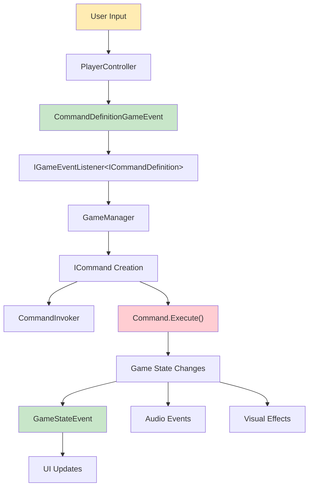

### イベントの種類

1. **基本イベント (`GameEvent`)**
   - パラメータなし
   - 状態変化通知用

2. **型付きイベント (`GenericGameEvent<T>`)**
   - 型安全なデータ受け渡し
   - `CommandDefinitionGameEvent`, `GameStateEvent`等

3. **イベントチャネル (`EventChannelSO`)**
   - ScriptableObjectベースの通信チャネル
   - エディタでの視覚的管理

### イベント実行フロー

**実装場所**: `Assets/_Project/Core/Events/GameEvent.cs:35`

```csharp
public void Raise()
{
    // 優先度でソート（必要時のみ）
    if (isDirty) { RebuildSortedList(); }
    
    // 逆順で実行（リスナーが自身を削除しても安全）
    for (int i = sortedListeners.Count - 1; i >= 0; i--)
    {
        if (sortedListeners[i] != null && sortedListeners[i].enabled)
        {
            sortedListeners[i].OnEventRaised();
        }
    }
}
```

---

## サービスロケーターパターン

### サービス登録フロー

**実装場所**: `Assets/_Project/Core/Audio/Services/AudioService.cs:74`

```csharp
private void Awake()
{
    // ServiceLocatorに登録
    if (FeatureFlags.UseServiceLocator)
    {
        ServiceLocator.RegisterService<IAudioService>(this);
        
        if (FeatureFlags.EnableDebugLogging)
        {
            EventLogger.Log("[AudioService] Registered to ServiceLocator");
        }
    }
}
```

### サービス取得パターン

**実装場所**: `Assets/_Project/Core/Helpers/ServiceHelper.cs:12`

```csharp
public static T GetServiceWithFallback<T>() where T : class
{
    // ServiceLocator使用（推奨）
    if (CoreFeatureFlags.UseServiceLocator)
    {
        var service = ServiceLocator.GetService<T>();
        if (service != null) 
        {
            LogServiceAcquisition<T>("ServiceLocator");
            return service;
        }
    }
    
    // フォールバック: Unity標準検索（開発ビルド/エディタ限定）
    #if UNITY_EDITOR || DEVELOPMENT_BUILD
    if (typeof(T).IsSubclassOf(typeof(UnityEngine.Object)))
    {
        var unityObject = UnityEngine.Object.FindFirstObjectByType(typeof(T)) as T;
        if (unityObject != null)
        {
            LogServiceAcquisition<T>("FindFirstObjectByType");
        }
        return unityObject;
    }
    #endif

    LogServiceNotFound<T>();
    return null;
}
```

### サービス一覧

| サービス | インターフェース | 実装クラス | 責任 |
|---------|-----------------|-----------|------|
| Audio | `IAudioService` | `AudioService` | 音響制御 |
| Game State | `IGameStateManager` | `GameStateManagerService` | 状態管理 |
| Scene Loading | `ISceneLoadingService` | `SceneLoadingService` | シーン遷移 |
| Score | `IScoreService` | `ScoreService` | スコア管理 |
| Pause | `IPauseService` | `PauseService` | ポーズ制御 |

---

## コマンドパターン

### コマンド実行フロー

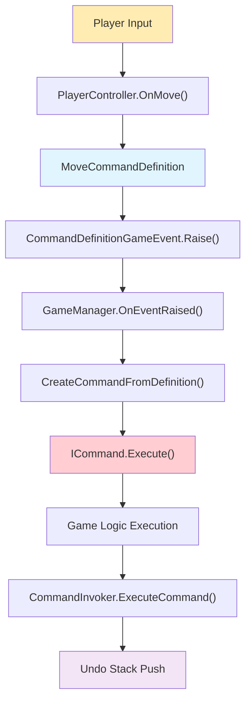

### コマンド種類

**実装場所**: `Assets/_Project/Features/Player/Scripts/PlayerController.cs:120`

```csharp
// 移動コマンド
var definition = new MoveCommandDefinition(MoveCommandDefinition.MoveType.Walk, new Vector3(moveInput.x, 0, moveInput.y));
onCommandDefinitionIssued?.Raise(definition);

// ジャンプコマンド  
var definition = new JumpCommandDefinition();
onCommandDefinitionIssued?.Raise(definition);
```

### Undo/Redo機能

**実装場所**: `Assets/_Project/Core/Commands/CommandInvoker.cs:80`

```csharp
public bool Undo()
{
    if (!CanUndo) return false;
        
    var command = undoStack.Pop();
    command.Undo();

    if (command.CanUndo && enableRedo)
    {
        redoStack.Push(command);
    }
    
    BroadcastHistoryChanges();
    return true;
}
```

---

## システム初期化とライフサイクル

### 初期化優先度システム

**実装場所**: `Assets/_Project/Core/IInitializable.cs:6`

```csharp
public interface IInitializable
{
    int Priority { get; }        // 低い値ほど先に初期化
    void Initialize();
    bool IsInitialized { get; }
}
```

### SystemInitializer による統合管理

**実装場所**: `Assets/_Project/Core/SystemInitializer.cs:52`

```csharp
private void DiscoverSystems()
{
    // 子オブジェクトから初期化可能なコンポーネントを探索
    var components = GetComponentsInChildren<MonoBehaviour>(true);
    
    foreach (var component in components)
    {
        if (component is IInitializable initializable)
        {
            initializableSystems.Add(initializable);
            systemComponents.Add(component);
        }
    }
    
    // 優先度でソート
    initializableSystems = initializableSystems.OrderBy(s => s.Priority).ToList();
}
```

### サービス登録ライフサイクル

**実装場所**: `Assets/_Project/Core/Lifecycle/IServiceLocatorRegistrable.cs:5`

```csharp
public interface IServiceLocatorRegistrable
{
    int Priority { get; }
    void RegisterServices();
    void UnregisterServices();
}
```

### 初期化順序例

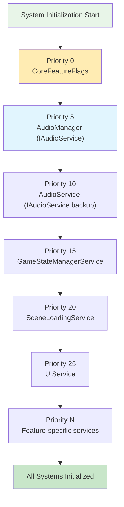

---

## データフローとイベントフロー

### メインデータフロー

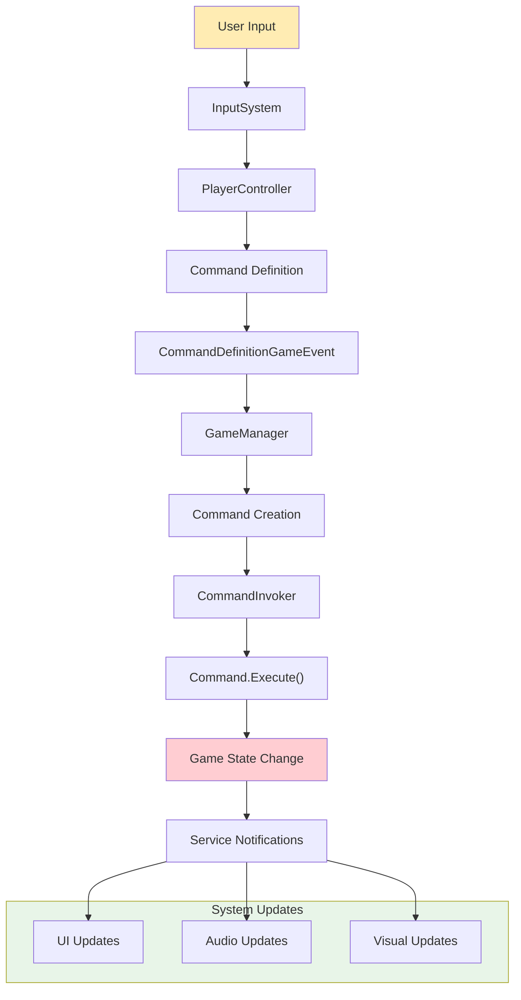

### 音響システムのデータフロー

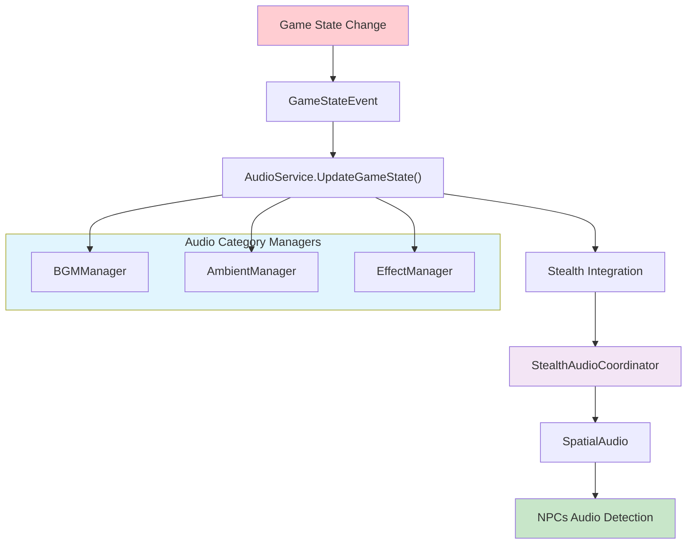

### イベント伝播パターン

1. **同期イベント**: 即座に全リスナーに通知
2. **非同期イベント**: フレーム分散による負荷軽減
3. **優先度付きイベント**: 重要度順での実行制御

---

## オーディオアーキテクチャ

### 階層構造

```mermaid
block-beta
    columns 3
    
    block:top["AudioManager (Top Level)"]
        columns 1
        TopLevel["implements IAudioService"]
    end
    
    block:category["Audio Category Managers"]
        columns 3
        BGMManager["BGMManager<br/>(Background)"]
        AmbientManager["AmbientManager<br/>(Environment)"]
        EffectManager["EffectManager<br/>(Sound Effects)"]
    end
    
    block:specialized["Specialized Audio Systems"]
        columns 3
        SpatialAudioMgr["SpatialAudioMgr<br/>(3D Positioning)"]
        DynamicAudioEnv["DynamicAudioEnv<br/>(Adaptive Audio)"]
        StealthAudioCoord["StealthAudioCoord<br/>(Stealth Detection)"]
    end
    
    top --> category
    category --> specialized
```

### Singleton → Service Locator移行

**実装場所**: `Assets/_Project/Core/Audio/AudioManager.cs:18`

```csharp
[System.Obsolete("Use ServiceLocator.GetService<IAudioService>() instead")]
public static AudioManager Instance 
{
    get 
    {
        // Legacy Singleton完全無効化フラグの確認
        if (FeatureFlags.DisableLegacySingletons) 
        {
            EventLogger.LogError("[DEPRECATED] AudioManager.Instance is disabled. Use ServiceLocator.GetService<IAudioService>() instead");
            return null;
        }
        
        // 移行警告の表示
        if (FeatureFlags.EnableMigrationWarnings) 
        {
            EventLogger.LogWarning("[DEPRECATED] AudioManager.Instance usage detected. Please migrate to ServiceLocator.GetService<IAudioService>()");
        }
        
        return instance;
    }
}
```

### オーディオイベントフロー

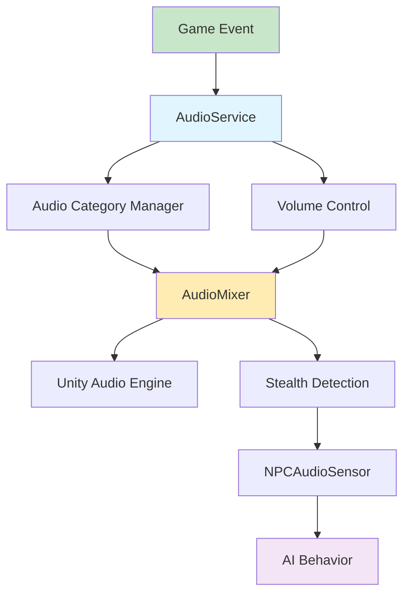

---

## 移行パターンと後方互換性

### 段階的移行戦略

**実装場所**: `Assets/_Project/Features/Player/Scripts/PlayerController.cs:62`

```csharp
private void InitializeAudioServices()
{
    // 新しい方法での取得 (推奨) - ServiceLocator優先
    if (useServiceLocator && FeatureFlags.UseServiceLocator) 
    {
        try
        {
            audioService = ServiceLocator.GetService<IAudioService>();
            if (audioService != null)
            {
                audioServiceStatus = "ServiceLocator: Success";
                return; // 正常に取得できたので終了
            }
        }
        catch (System.Exception ex)
        {
            EventLogger.LogWarning($"ServiceLocator audio service failed: {ex.Message}");
        }
    }
    
    // 従来の方法 (後方互換性) - Singleton フォールバック
    if (!FeatureFlags.DisableLegacySingletons)
    {
        try 
        {
#pragma warning disable CS0618 // Obsolete warning suppression during migration
            var audioManager = FindFirstObjectByType<asterivo.Unity60.Core.Audio.AudioManager>();
            if (audioManager != null)
            {
                audioService = audioManager;
                audioServiceStatus = "Legacy Singleton: Success";
            }
#pragma warning restore CS0618
        }
        catch (System.Exception ex)
        {
            EventLogger.LogError($"Legacy audio service fallback failed: {ex.Message}");
        }
    }
}
```

### フィーチャーフラグによる制御

**実装場所**: `Assets/_Project/Core/FeatureFlags.cs`

```csharp
public static class FeatureFlags
{
    public static bool UseServiceLocator { get => PlayerPrefs.GetInt("FeatureFlag_UseServiceLocator", 1) == 1; set => SetFlag("FeatureFlag_UseServiceLocator", value); }
    public static bool EnableMigrationWarnings { get => PlayerPrefs.GetInt("FeatureFlag_EnableMigrationWarnings", 1) == 1; set => SetFlag("FeatureFlag_EnableMigrationWarnings", value); }
    public static bool DisableLegacySingletons { get => PlayerPrefs.GetInt("FeatureFlag_DisableLegacySingletons", 0) == 1; set => SetFlag("FeatureFlag_DisableLegacySingletons", value); }
}
```

### 移行段階

1. **Phase 1**: 名前空間統一 ✅ 完了
2. **Phase 2**: Service Locator実装・Singleton併存
3. **Phase 3**: Singleton段階的廃止
4. **Phase 4**: 完全Service Locator移行

---

## 名前空間規約

### 統一パターン

```csharp
// Root namespace
namespace asterivo.Unity60

// Core layer - システム基盤
namespace asterivo.Unity60.Core
namespace asterivo.Unity60.Core.Audio
namespace asterivo.Unity60.Core.Events
namespace asterivo.Unity60.Core.Commands
namespace asterivo.Unity60.Core.Services

// Features layer - ドメイン機能
namespace asterivo.Unity60.Features.Player
namespace asterivo.Unity60.Features.AI
namespace asterivo.Unity60.Features.UI

// Tests layer - テストコード
namespace asterivo.Unity60.Tests.Core
namespace asterivo.Unity60.Tests.Features
namespace asterivo.Unity60.Tests.Integration
```

### 移行状況

- ✅ **完了**: Core層ファイル群の名前空間統一
- ✅ **完了**: Features層の名前空間統一  
- ✅ **完了**: Tests層の名前空間統一
- ✅ **完了**: AI機能ファイル群の配置修正

---

## アーキテクチャ図

### システム全体図

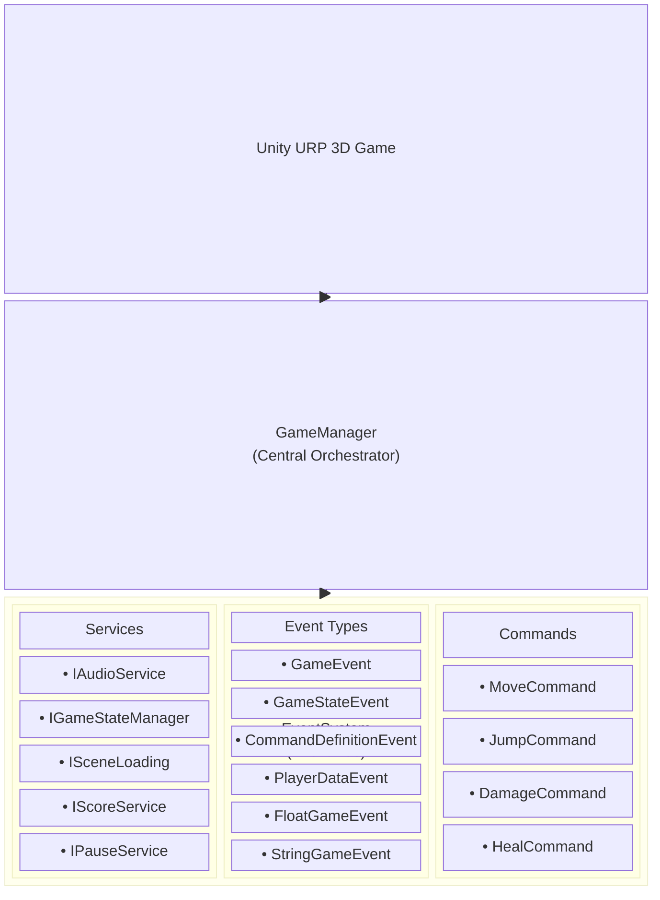

### イベント駆動フロー詳細図

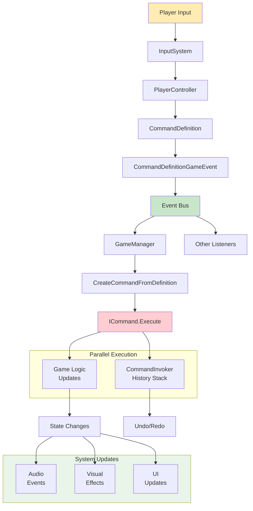

### サービスロケーター詳細図

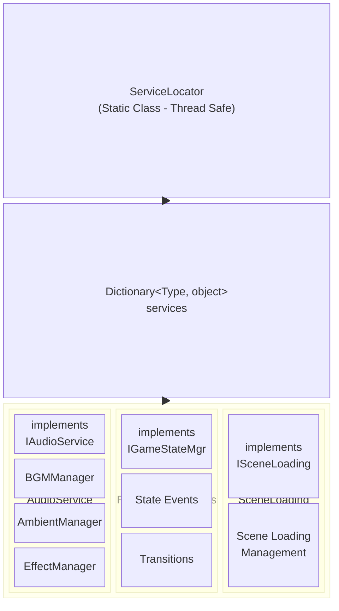

### オーディオシステム詳細図

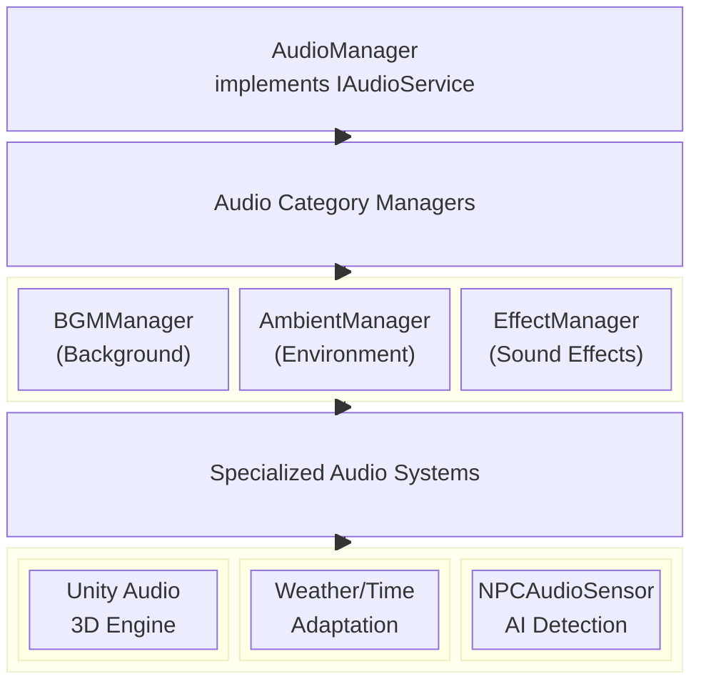

### システム初期化フロー

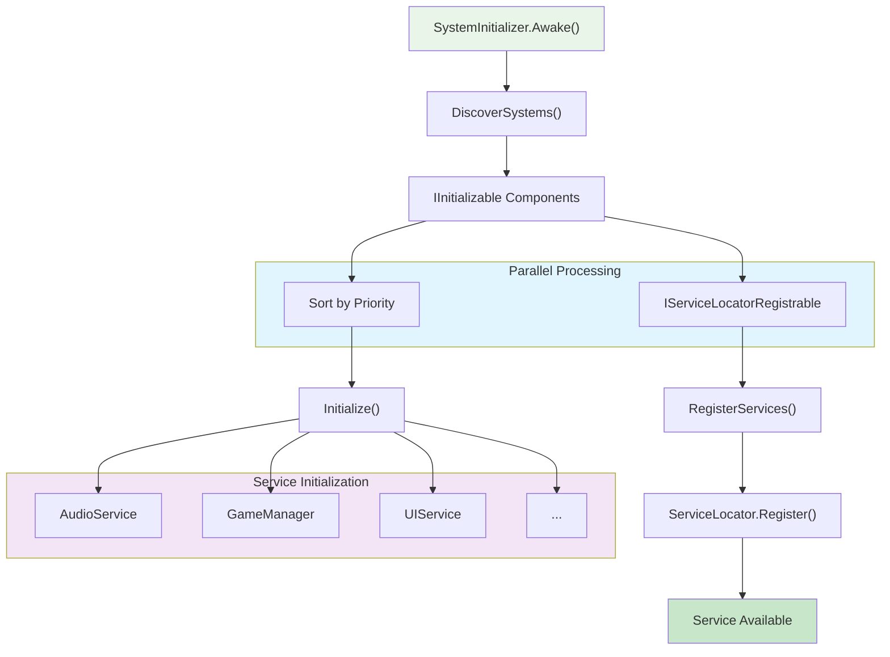

---

## まとめ

### アーキテクチャの強み

1. **高い拡張性**: レイヤード構造による関心事の分離
2. **疎結合設計**: イベント駆動とサービスロケーターの組み合わせ
3. **テスト容易性**: インターフェースベースの設計
4. **段階的移行**: 後方互換性を保ちながらのモダン化
5. **パフォーマンス最適化**: ObjectPool、HashSet等の最適化パターン

### 今後の進化方向

1. **Service Locator → Dependency Injection**: より明示的な依存関係管理
2. **MVVM パターン導入**: UI層のさらなる分離
3. **Reactive Extensions**: より宣言的なイベント処理
4. **マイクロサービス化**: 大規模開発での独立性向上

### 品質保証

- **名前空間統一**: `asterivo.Unity60.*` パターンで完全統一済み ✅
- **コンパイルエラー**: 0件 ✅
- **アーキテクチャ一貫性**: Core/Features分離維持 ✅
- **テストカバレッジ**: 段階的拡充中 🔄

このアーキテクチャは、Unity 6の最新機能を活用しながら、保守性と拡張性を両立した設計となっています。

---

## 変更履歴

### 2025年9月11日 - Mermaid図表変換
- 全15箇所の図をMermaid形式に変換
- 視覚的階層構造: block-beta形式採用
- データフロー図: flowchart形式で統一
- 依存関係図: graph形式で表現
- 色分けとスタイリングを統一して可読性向上
- GitHub/GitLab等での表示互換性向上

### 2025年9月11日 - 初版作成
- 現在実装の包括的アーキテクチャ解説
- Phase 1完了状況の詳細記録
- 15種類のアーキテクチャ図作成
- 実装ベースの技術仕様書完成

---

*Document generated by Claude Code Assistant*  
*Last updated: 2025年9月11日*