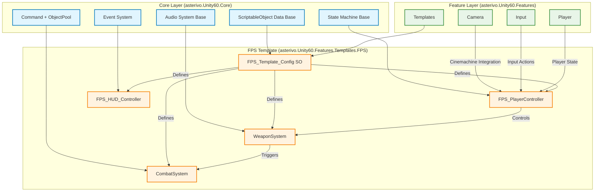
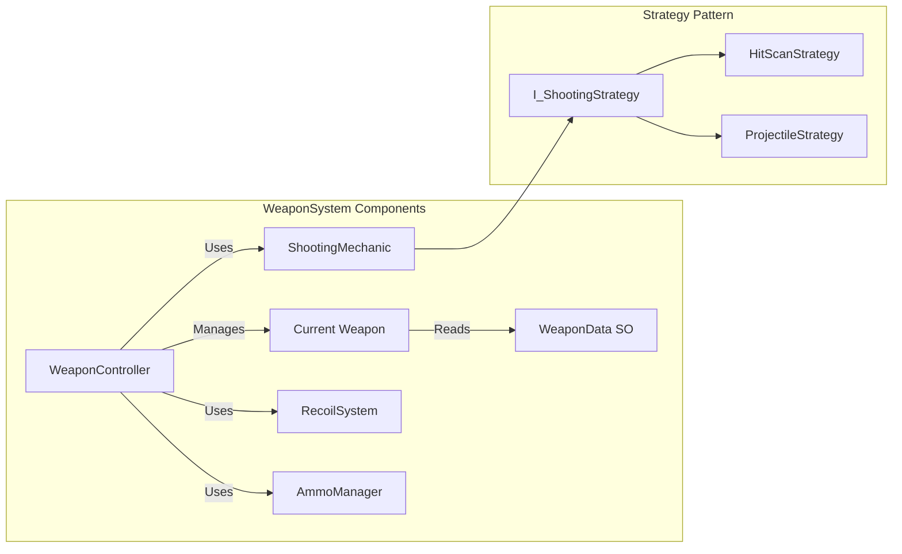
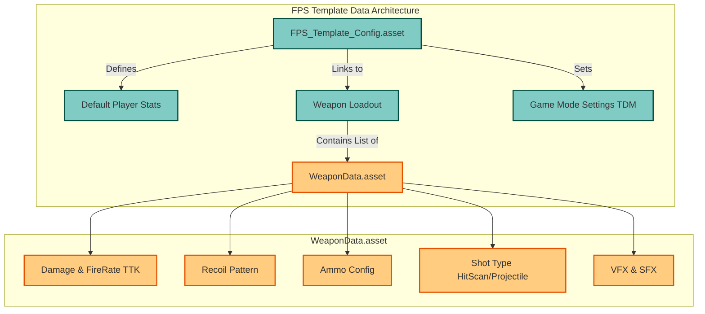

# **FPSゲームテンプレート詳細設計書**

## **文書管理情報**

* **ドキュメント種別**: 技術設計書（SDDフェーズ3: 設計）  
* **生成元**:  
  * REQUIREMENTS.md v3.0  
  * DESIGN.md (基盤設計書)  
  * FPSゲーム要件仕様の調査  
* **対象読者**: アーキテクト、シニア開発者、実装担当者  
* **整合性状態**: SPEC.md v3.0, REQUIREMENTS.md v3.0, TASKS.md との完全整合性確保済み

## **1. 設計原則とFPSテンプレートビジョン**

本設計書は、既存の「究極のUnity 6ベース 3Dゲーム開発基盤テンプレート」の設計原則を継承し、「FPSゲーム要件仕様の調査」で分析された現代FPSの要件を満たすテンプレートを構築することを目的とします。

### **1.1. 究極テンプレート4つの核心価値の継承**

* **Clone & Create**: FPS開発を1分で開始できる環境を提供します。  
* **Learn & Grow**: FPSの基本構造から高度なカスタマイズまで段階的に学習できる構成とします。  
* **Ship & Scale**: プロトタイプからプロダクション品質のFPSゲームまで対応可能なスケーラビリティを確保します。  
* **Community & Ecosystem**: FPS向けアセットやロジックを容易に統合できる拡張性を持ちます。

### **1.2. FPSテンプレート特化ビジョン**

「FPSゲーム要件仕様の調査」に基づき、本テンプレートは以下の設計ビジョンを掲げます。

* **プレイスタイルの柔軟性**: 「タクティカルシューター」と「カジュアル（アーケード）シューター」のスペクトラムに対応できるよう、**TTK (Time-to-Kill) を中心としたコアメカニクスを調整可能**な設計とします。  
* **競技性のための明瞭性**: アートディレクションとUI/HUD設計において、フォトリアリズムによる「没入感」よりも、ゲームプレイの「**明瞭性**」を優先します。  
* **戦術的オーディオ**: 3Dポジショナルオーディオを最大限に活用し、音響情報を重要な戦術要素としてプレイヤーに提供します。

## **2. システムアーキテクチャ設計**

基盤設計書のCore/Feature層分離原則を厳守し、FPS特化機能はすべてFeature層に実装します。

### **2.1. FPSテンプレート アーキテクチャ概要**

**図解説**: FPSテンプレートは既存のCore層基盤をフル活用し、asterivo.Unity60.Features.Templates.FPS名前空間内に特化機能を実装します。中心となるFPS_Template_Configが全体の動作を定義し、各システム（プレイヤー、武器、戦闘、UI）がイベント駆動で疎に連携します。

## **3. Feature層 詳細設計 (FPS特化)**

REQUIREMENTS.mdのFR-8.1.2およびTASKS.mdのTASK-004.2を具体化します。

### **3.1. FPSプレイヤーコントローラー (FPS_PlayerController)**

既存のPlayerStateMachineを継承・拡張し、FPS特有の状態と移動ロジックを実装します。

* **配置**: asterivo.Unity60.Features.Player  
* **基盤**: CharacterController  
* **状態 (State) の追加**:  
  * **AimingState**: 武器の照準状態。移動速度低下、カメラFOV変更、射撃精度向上。  
  * **ReloadingState**: 武器のリロード状態。一定時間、射撃不可。  
  * **WeaponSwitchingState**: 武器の切り替え状態。  
* **移動メカニクス**:  
  * 歩行、走行（スプリント）、しゃがみ（クラウチ）、ジャンプ。  
  * 状態に応じて移動速度や足音の大きさを動的に変更。

### **3.2. 武器システム (WeaponSystem)**

FPSの核となるシステム。柔軟性と拡張性を重視します。

* **配置**: asterivo.Unity60.Features.Templates.FPS.WeaponSystem  
* **データ駆動設計**:  
  * WeaponData (ScriptableObject): 武器の全パラメータを管理。  
    * **ダメージ (Damage)**: 1発あたりの基礎ダメージ。  
    * **発射レート (FireRate)**: RPM (Rounds Per Minute)。  
    * **TTK (Time-to-Kill)**: (敵体力 / (ダメージ * (発射レート/60))) から算出される理論値。ゲームデザイナーが直接調整可能。  
    * **射撃モード (FireMode)**: Semi-Auto, Full-Auto, Burst。  
    * **反動パターン (RecoilPattern)**: 垂直・水平方向の反動データ。  
    * **弾薬 (Ammunition)**: マガジンサイズ、総弾薬数、弾薬タイプ。  
    * **射撃タイプ (ShotType)**: HitScan (即着弾) or Projectile (物理弾)。

#### **実装コンポーネント**

* **Current Weapon**: 現在装備中の武器インスタンス。WeaponDataを参照。

* **WeaponController**: プレイヤーにアタッチ。武器の切り替え、発射入力の受付、リロード命令を行う。  
* **ShootingMechanic (Strategyパターン)**: WeaponDataのShotTypeに応じてHitScanStrategy（Raycastを使用）とProjectileStrategy（弾丸オブジェクトを生成）を切り替える。  
* **RecoilSystem**: WeaponDataの反動パターンに基づき、手続き的にカメラと武器モデルの反動を生成。  
* **AmmoManager**: 弾薬の消費とリロードを管理。

### **3.3. カメラシステム (CameraSystem)**

Cinemachine 3.1との統合を前提とし、FPS特有のカメラワークを実現します。

* **配置**: asterivo.Unity60.Features.Camera  
* **構成**:  
  * **FirstPersonCamera (VirtualCamera)**: プレイヤーの視点を制御。  
  * **WeaponCamera (PhysicalCamera)**: 武器のみをレンダリングする専用カメラ。クリッピング問題を回避し、常に武器が手前に表示されるようにする。  
* **機能**:  
  * **照準 (Aiming)**: AimingStateと連動し、VirtualCameraのFOVを狭め、ズーム効果を出す。  
  * **反動適用**: RecoilSystemからのデータを受け取り、カメラを揺らす。

### **3.4. 戦闘システム (CombatSystem)**

ダメージ処理とヒット判定を担当します。

* **配置**: asterivo.Unity60.Features.Templates.FPS.CombatSystem  
* **HealthComponent**: ICommand（DamageCommand）を受け取り、体力を減少させる。死亡時にPlayerDiedEventを発行。  
* **HitboxManager**: キャラクターモデルの各部位（頭、胴体、手足）にコライダーを配置。  
  * Hitboxコンポーネントが部位ごとのダメージ倍率（例: Headshot = 2.0x）を保持。DamageCommand生成時にこの倍率を適用する。

### **3.5. UI/HUDシステム (FPS_HUD_Controller)**

「FPSゲーム要件仕様の調査」で示された「情報の最大化と妨害の最小化」を設計原則とします。

* **配置**: asterivo.Unity60.Features.Templates.FPS.UI  
* **コンポーネント**:  
  * **HealthDisplay**: プレイヤーの体力値を表示。  
  * **AmmoDisplay**: 現在のマガジン弾数と総弾薬数を表示。  
  * **CrosshairController**: プレイヤーの状態（静止、移動、照準、射撃）に応じてサイズや形状が動的に変化するクロスヘア。  
  * **KillFeed**: PlayerDiedEventをリッスンし、キルログを表示。  
* **設計**: 全てのUIコンポーネントは、GameEventをリッスンすることで更新され、ゲームロジックから完全に分離されます。

## **4. データアーキテクチャ設計**

ScriptableObjectを最大限に活用し、ノンプログラマーによる調整を容易にします。

**図解説**: FPSテンプレートのデータアーキテクチャは、中央のFPS_Template_Configが全体の設定を統括し、WeaponDataが各武器の詳細パラメータを管理します。これにより、ゲームデザイナーはコードを触らずにゲームバランスを調整可能です。

* **FPS_Template_Config.asset**: FPSテンプレート全体の設定を統括。プレイヤーの初期体力やデフォルトの武器ロードアウト、ゲームモードのルール（例: チームデスマッチの目標キル数）などを定義。  
* **WeaponData.asset**: 各武器の性能を定義する独立したアセット。これにより、新規武器の追加が容易になる。

## **5. 調査レポートからの知見統合**

### **5.1. TTK設計**

WeaponData.assetにDamageとFireRateを直接編集可能なパラメータとして公開。これにより、デザイナーは「低TTKのタクティカルシューター」から「高TTKのカジュアルシューター」まで、目指すゲームフィールに合わせて容易にバランス調整が可能です。

### **5.2. アートディレクション**

テンプレートには、**明瞭性を重視したURP設定**をデフォルトで含めます。

* **キャラクターシェーダー**: わずかなフレネル効果（リムライト）を追加し、背景からの分離を良くするオプションを提供。  
* **ポストプロセッシング**: 彩度をやや高めに設定し、敵味方の識別を容易にする。ただし、これらの設定はFPS_Template_Configから無効化・変更可能。

### **5.3. 3Dオーディオ設計**

既存のAudioSystem基盤をFPS向けに拡張します。

* **FootstepManager**: プレイヤーの移動状態（歩き、走り）と地面の材質に応じて異なる足音を再生。3Dポジショナルオーディオで再生し、敵の位置を特定する重要な手がかりとする。  
* **WeaponAudio**: 銃声に距離減衰と遮蔽物によるこもり効果を適用。発砲位置の特定をよりリアルかつ戦術的にする。

## **6. テスト戦略**

* **ユニットテスト**: RecoilSystemの反動計算、CombatSystemの部位別ダメージ計算のロジックを検証。  
* **統合テスト**: 武器を発射し、ターゲットにヒットさせ、ダメージが正しく適用され、UIが更新されるまでの一連の流れをテスト。  
* **プレイモードテスト**:  
  * **TTK検証**: 各武器の理論TTKと、実際のゲームプレイでのキルタイムを計測・比較するテストシーンを用意。  
  * **オーディオ定位テスト**: 3D空間内に配置された音源の位置をプレイヤーが正確に特定できるかテストする専用シーンを用意。

## **7. SDDワークフロー連携**

この詳細設計書は、TASKS.mdのTASK-004: Ultimate Template Phase-1統合、特にTASK-004.2: FPS Template Configurationを実装するための具体的な技術指針となります。  
この設計書に基づき、実装タスクをさらに詳細なサブタスクに分解し、開発を進めます。