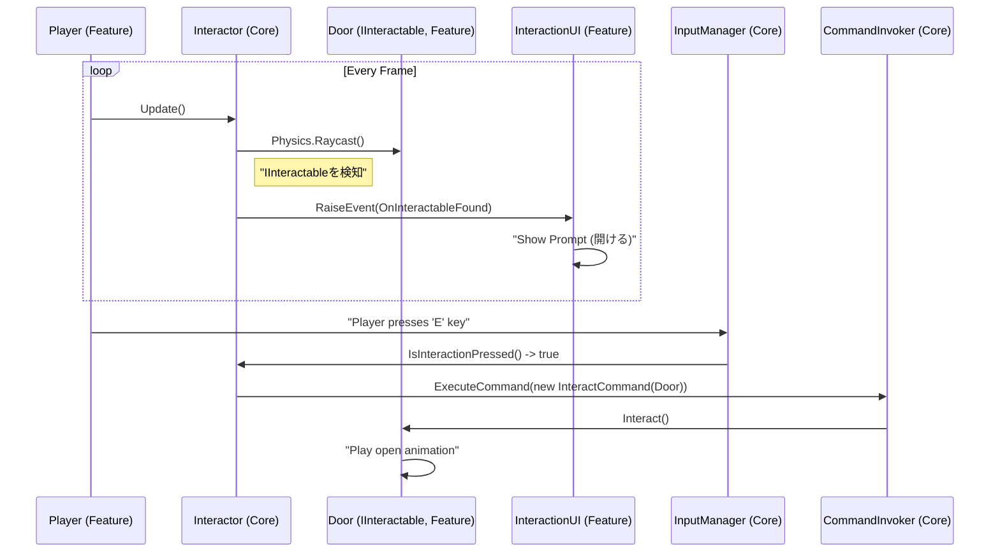

# インタラクションシステム 設計書 (Interaction System Design)

## 1. 概要

このドキュメントは、カメラからのRaycastを利用したインタラクションシステムの設計と実装計画を定義します。プレイヤーが視界内のオブジェクトに対して働きかけるための、汎用的で拡張性の高いシステムを構築することを目的とします。

このシステムは、`Core`層の抽象的な概念（`IInteractable`）と、`Feature`層の具体的な実装（`Player`の視点、インタラクション可能なオブジェクト）を繋ぐ役割を果たします。

## 2. 設計目標

-   **直感的な操作**: プレイヤーが見ているオブジェクトに対して、キー入力一つでインタラクションできる。
-   **高い拡張性**: 新しい種類のインタラクション可能なオブジェクト（ドア、アイテム、スイッチ等）を、既存システムに影響を与えることなく簡単に追加できる。
-   **疎結合の維持**: プレイヤー、UI、インタラクション対象オブジェクトが互いに直接依存しない、イベント駆動のアーキテクチャを維持する。
-   **明確なフィードバック**: プレイヤーがインタラクション可能なオブジェクトを見ていることを、UIを通じて明確にフィードバックする。

## 3. アーキテクチャとコンポーネント

このシステムは、以下の主要なコンポーネントと概念によって構成されます。

| コンポーネント/概念 | 所属層 | 役割 |
| :--- | :--- | :--- |
| **`IInteractable` (インターフェース)** | `Core` | 「インタラクション可能」という契約を定義する。`Interact()`と`GetInteractionPrompt()`メソッドを持つ。 |
| **`Interactor.cs`** | `Core` | Raycastによるオブジェクト検知、状態管理、入力処理、コマンド発行を行う、インタラクションの「頭脳」。 |
| **`InteractCommand.cs`** | `Core` | インタラクションの実行をカプセル化するコマンド。`IInteractable`の`Interact()`を呼び出す。 |
| **`PlayerController` (の一部)** | `Feature` | `Interactor`コンポーネントを保持し、Rayの発射元（カメラ）などの具体的な設定を行う。 |
| **`Door.cs`, `PickupItem.cs`等** | `Feature` | `IInteractable`を実装した具体的なオブジェクト。固有のインタラクション処理を記述する。 |
| **`InteractionPromptUI.cs`** | `Feature` | インタラクションのフィードバックUI。`GameEvent`をリッスンして表示を更新する。 |
| **`GameEvent`アセット** | `Core`/`Template` | `Interactor`と`InteractionPromptUI`を繋ぐためのイベントチャネル。 |

### シーケンス図



## 4. 実装計画

### Step 1: `Core`層の拡張

#### 1.1. `IInteractable`インターフェースの確認・更新

`Core`層に、インタラクション可能なオブジェクトの契約を定義します。

**ファイル:** `Assets/_Project/Core/Interaction/IInteractable.cs`
```csharp
public interface IInteractable
{
    /// <summary>
    /// インタラクションが実行されたときに呼び出される
    /// </summary>
    /// <param name="interactor">インタラクションを実行したオブジェクト</param>
    void Interact(object interactor);

    /// <summary>
    /// UIに表示するためのプロンプトテキストを取得する
    /// </summary>
    /// <returns>例: 「開ける」「拾う」</returns>
    string GetInteractionPrompt();
}
```

#### 1.2. `Interactor`コンポーネントの実装

Raycastによる検知と入力処理のロジックを実装します。

**ファイル:** `Assets/_Project/Core/Interaction/Interactor.cs`
```csharp
using UnityEngine;
using asterivo.Unity60.Core.Events;
using asterivo.Unity60.Core.Input;
using asterivo.Unity60.Core.Commands;

public class Interactor : MonoBehaviour
{
    [Header("Raycast Settings")]
    [SerializeField] private float _interactionDistance = 3f;
    [SerializeField] private LayerMask _interactionLayer;
    [SerializeField] private Transform _raycastOrigin;

    [Header("Events")]
    [SerializeField] private GameEvent<string> _onInteractableFound; // プロンプトテキストを渡す
    [SerializeField] private GameEvent _onInteractableLost;

    private IInteractable _currentInteractable;
    private IInputService _inputService;
    private ICommandInvoker _commandInvoker;

    private void Start()
    {
        // ServiceLocatorから必要なサービスを取得
        _inputService = ServiceLocator.Get<IInputService>();
        _commandInvoker = ServiceLocator.Get<ICommandInvoker>();
    }

    private void Update()
    {
        CheckForInteractable();
        HandleInteractionInput();
    }

    private void CheckForInteractable()
    {
        IInteractable foundInteractable = null;
        if (Physics.Raycast(_raycastOrigin.position, _raycastOrigin.forward, out RaycastHit hit, _interactionDistance, _interactionLayer))
        {
            hit.collider.TryGetComponent(out foundInteractable);
        }

        if (foundInteractable != _currentInteractable)
        {
            if (_currentInteractable != null)
            {
                _onInteractableLost?.Raise();
            }

            _currentInteractable = foundInteractable;

            if (_currentInteractable != null)
            {
                _onInteractableFound?.Raise(_currentInteractable.GetInteractionPrompt());
            }
        }
    }

    private void HandleInteractionInput()
    {
        if (_currentInteractable != null && _inputService.IsInteractionPressed()) // IsInteractionPressedはIInputServiceに要実装
        {
            Interact();
        }
    }

    public void Interact()
    {
        if (_currentInteractable == null) return;
        var command = new InteractCommand(_currentInteractable, this.gameObject);
        _commandInvoker.ExecuteCommand(command);
    }
}
```

#### 1.3. `InteractCommand`の実装

インタラクション実行をカプセル化します。

**ファイル:** `Assets/_Project/Core/Interaction/InteractionCommands.cs` (既存ファイルを更新または新規作成)
```csharp
public class InteractCommand : ICommand
{
    private readonly IInteractable _target;
    private readonly object _interactor;

    public InteractCommand(IInteractable target, object interactor)
    {
        _target = target;
        _interactor = interactor;
    }

    public void Execute()
    {
        _target?.Interact(_interactor);
    }

    // Undo/Redoを実装する場合はここに追加
}
```

### Step 2: `Feature`層でのセットアップと実装

#### 2.1. `Player`プレハブへの`Interactor`設定

**対象:** `Assets/_Project/Features/Player/Prefabs/Player.prefab`
1.  `Player`プレハブに`Interactor`コンポーネントを追加します。
2.  `Raycast Origin`フィールドに、メインカメラの`Transform`を設定します。
3.  `Interaction Layer`に、新しく作成した"Interactable"レイヤーを設定します。
4.  `On Interactable Found`と`On Interactable Lost`フィールドに、後述する`GameEvent`アセットを設定します。

#### 2.2. インタラクション可能なオブジェクト（ドア）の実装

**ファイル:** `Assets/_Project/Features/World/Scripts/Door.cs` (新規作成)
```csharp
using UnityEngine;
using asterivo.Unity60.Core.Interaction;

public class Door : MonoBehaviour, IInteractable
{
    private bool _isOpen = false;
    // Animatorなどのコンポーネントへの参照

    public void Interact(object interactor)
    {
        _isOpen = !_isOpen;
        // ドアを開閉するアニメーションをトリガーする
        // サウンドを再生する
        Debug.Log($"Door interacted by {((GameObject)interactor).name}. IsOpen: {_isOpen}");
    }

    public string GetInteractionPrompt()
    {
        return _isOpen ? "閉める" : "開ける";
    }
}
```
**シーンでの設定:**
- シーン内のドアオブジェクトに`Door.cs`と`BoxCollider`を追加します。
- オブジェクトのレイヤーを"Interactable"に設定します。

#### 2.3. UIフィードバックの実装

**ファイル:** `Assets/_Project/Features/UI/Scripts/InteractionPromptUI.cs` (新規作成)
```csharp
using UnityEngine;
using TMPro; // TextMeshProを使用

public class InteractionPromptUI : MonoBehaviour
{
    [SerializeField] private TextMeshProUGUI _promptText;
    [SerializeField] private GameObject _promptPanel;

    // GameEventListener<string>から呼び出される
    public void ShowPrompt(string prompt)
    {
        _promptText.text = $"[E] {prompt}";
        _promptPanel.SetActive(true);
    }

    // GameEventListenerから呼び出される
    public void HidePrompt()
    {
        _promptPanel.SetActive(false);
    }
}
```
**シーンでの設定:**
- UIキャンバス内にプロンプト用のUI要素（PanelとTextMeshProのText）を作成します。
- `InteractionPromptUI.cs`をアタッチします。
- `GameEventListener<string>`と`GameEventListener`をアタッチし、それぞれ`ShowPrompt`と`HidePrompt`を対応するイベントに登録します。

### Step 3: アセットの作成 (`Template`層)

**場所:** `Assets/_Project/Features/Templates/Common/Events/` (または適切な場所)
1.  `GameEvent<string>`アセットを新規作成し、`OnInteractableFound.asset`と名付けます。
2.  `GameEvent`アセットを新規作成し、`OnInteractableLost.asset`と名付けます。
3.  これらのアセットを、`Player`プレハブの`Interactor`コンポーネントと、UIの`GameEventListener`コンポーネントに設定します。

## 5. 依存関係と前提条件

-   `IInputService`に、インタラクションキーが押されたことを判定する`IsInteractionPressed()`のようなメソッドが存在すること。
-   `ICommandInvoker`が`ServiceLocator`に登録されていること。
-   TextMeshProパッケージがプロジェクトにインポートされていること。
-   "Interactable"という名前の`Layer`がUnityプロジェクトに設定されていること。
