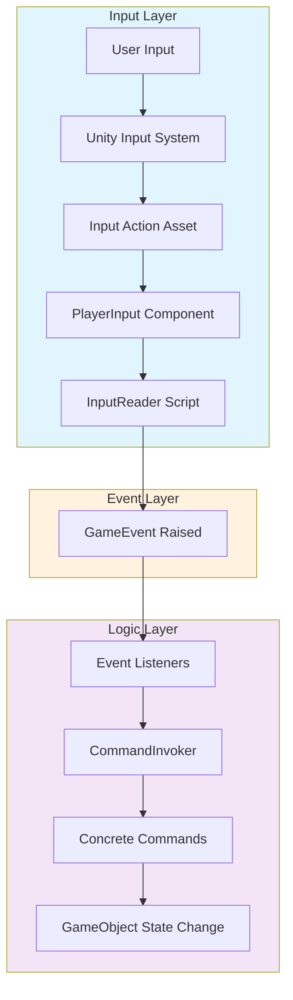

# ユーザー入力の実装フローとアーキテクチャ解説

このドキュメントは、このUnityプロジェクトにおけるユーザー入力の実装方法と、その背後にあるアーキテクチャについて詳細に説明します。

このプロジェクトは、Unityの新しい**Input System**を使い、**ScriptableObjectベースのイベント（GameEvent）**と**コマンドパターン**を組み合わせた、非常に疎結合で拡張性の高い設計になっています。

## ユーザー入力から処理実行までのフロー

以下は、ユーザーがキーを押してから、ゲーム内で何らかのアクションが実行されるまでの一連の流れを示す図です。



## 各ステップの詳細解説

1.  **ユーザー入力**: ユーザーが物理的なデバイス（キーボード、マウス、ゲームパッド）を操作します。

2.  **Unity Input System**: Unityの新しいInput Systemがこの物理的な入力を検知します。このシステムは、古い`Input.GetKey`などとは異なり、デバイスに依存しない抽象的な入力を扱えます。

3.  **Input Action Asset**: プロジェクト内に存在する `.inputactions` ファイル（例: `PlayerControls.inputactions`）で、"移動"、"ジャンプ"、"攻撃"といった抽象的なアクションを定義します。そして、どのアクションがどの物理的な入力（例: Wキー、スペースバー、マウス左クリック）に対応するか（Binding）を設定します。

4.  **PlayerInputコンポーネント**: プレイヤーキャラクターなどのGameObjectに`PlayerInput`コンポーネントをアタッチします。このコンポーネントがInput Action Assetと連携し、定義されたアクションが実行されたときに対応するC#メソッドを呼び出すように設定します。

5.  **InputReader (C# Script)**: `PlayerInput`コンポーネントから直接呼び出されるスクリプトです。このスクリプトの**重要な役割は、ゲームのロジックを一切含まず、受け取った入力イベントを対応する`GameEvent`に変換して発行（Raise）することだけ**です。これにより、入力の検知とゲームロジックが完全に分離されます。

6.  **GameEvent (ScriptableObject) の発行**: `InputReader`は、特定の入力（例: ジャンプボタン押下）があった場合に、`OnPlayerJump`のような名前の`GameEvent`（ScriptableObjectアセット）を発行します。ScriptableObjectであるため、シーンをまたいで参照関係を維持でき、非常に便利です。

7.  **イベントリスナー**: ゲーム内の様々な機能（プレイヤーの移動処理、UIの更新処理など）を持つスクリプトが、関心のある`GameEvent`をリッスン（購読）しています。例えば、`PlayerMovementController`は`OnPlayerMove`イベントを、`WeaponController`は`OnPlayerAttack`イベントをリッスンします。

8.  **CommandInvokerの呼び出し**: イベントを受け取ったリスナーは、具体的な処理を実行するために`CommandInvoker`を呼び出します。このプロジェクトでは、処理の実行履歴を管理したり、Undo/Redoを実装したりするためにコマンドパターンが採用されています。

9.  **具体的なCommandの実行**: `CommandInvoker`は、渡された`ICommand`（例: `DamageCommand`, `HealCommand`）の`Execute()`メソッドを実行します。新しいアクションを追加する場合は、新しいCommandクラスを作成することになります。

10. **ゲームオブジェクトの状態変更**: Commandが最終的にターゲットとなるGameObjectのメソッドを呼び出し、位置やHPなどの状態を変更します。

## 具体的な実装例：「ダッシュ」機能の追加

仮に新しい「ダッシュ」機能を追加する場合、以下の手順を踏みます。

1.  **Input Actionの追加**:
    *   `.inputactions`ファイルを開き、"Dash"という新しいActionを追加します。
    *   "Dash"アクションに、例えば「左Shiftキー」をBindingします。

2.  **InputReaderの更新**:
    *   `PlayerInput`コンポーネントのEventsに"Dash"アクションを追加し、`InputReader`スクリプトの`OnDash()`メソッドを呼び出すように設定します。
    *   `InputReader.cs`に以下のコードを追加します。

    ```csharp
    // Assets/_Project/Core/Input/InputReader.cs (と仮定)

    [Header("Player Actions")]
    [SerializeField] private GameEvent _dashEvent; // ダッシュイベント用のGameEventをインスペクターから設定

    // PlayerInputコンポーネントから呼び出される
    public void OnDash(InputAction.CallbackContext context)
    {
        if (context.phase == InputActionPhase.Performed)
        {
            _dashEvent.Raise(); // ダッシュイベントを発行するだけ
        }
    }
    ```

3.  **GameEventの作成**:
    *   Projectウィンドウで右クリックし、`Create > Events > GameEvent`を選択して`OnPlayerDash`という名前の`GameEvent`アセットを作成します。
    *   `InputReader`のインスペクターで、`_dashEvent`フィールドにこのアセットをセットします。

4.  **ダッシュ機能の実装 (イベントリスナーとコマンド)**:
    *   イベントを受け取り、コマンドを発行する`PlayerDashController.cs`を作成します。
    *   ロジックをカプセル化する`DashCommand.cs`を作成します。

5.  **GameObjectへのアタッチ**:
    *   PlayerのGameObjectに`PlayerDashController`をアタッチし、インスペクターで必要な参照（`_dashEvent`, `_commandInvoker`など）を設定します。

これで、ユーザーが左Shiftキーを押すと、`InputReader` -> `GameEvent` -> `PlayerDashController` -> `CommandInvoker` -> `DashCommand` という一連の流れが完成し、プレイヤーがダッシュします。

### ステップ4.1: `DashCommand` の作成

まず、ダッシュのロジックをカプセル化するコマンドを作成します。このプロジェクトの`ICommand`インターフェースを実装します。

*   **パス**: `Assets/_Project/Features/Player/Commands/DashCommand.cs` （推奨）
*   **内容**:

```csharp
// Assets/_Project/Features/Player/Commands/DashCommand.cs
using UnityEngine;
using asterivo.Unity60.Core.Commands; // ICommandのnamespace

public class DashCommand : ICommand
{
    private readonly Rigidbody _rigidbody;
    private readonly Vector3 _dashDirection;
    private readonly float _dashForce;

    public DashCommand(Rigidbody rigidbody, Vector3 dashDirection, float dashForce)
    {
        _rigidbody = rigidbody;
        _dashDirection = dashDirection;
        _dashForce = dashForce;
    }

    public void Execute()
    {
        if (_rigidbody != null)
        {
            // 実際のダッシュ処理
            _rigidbody.AddForce(_dashDirection * _dashForce, ForceMode.Impulse);
            Debug.Log($"Dash executed with force {_dashForce}");
        }
    }
}
```

### ステップ4.2: `PlayerDashController` の修正

次に、イベントリスナーである`PlayerDashController`が、直接処理を行う代わりに`DashCommand`を作成して`CommandInvoker`に渡すように修正します。

*   **パス**: `Assets/_Project/Features/Player/PlayerDashController.cs`
*   **内容**:

```csharp
// Assets/_Project/Features/Player/PlayerDashController.cs
using UnityEngine;
using asterivo.Unity60.Core.Commands; // CommandInvokerのnamespace
using asterivo.Unity60.Core.Events;   // GameEventのnamespace

public class PlayerDashController : MonoBehaviour
{
    [Header("Events")]
    [SerializeField] private GameEvent _dashEvent; // リッスンするイベント

    [Header("Command")]
    [SerializeField] private CommandInvoker _commandInvoker; // CommandInvokerへの参照

    [Header("Dash Settings")]
    [SerializeField] private float _dashForce = 10f;

    private Rigidbody _rigidbody;

    private void Awake()
    {
        _rigidbody = GetComponent<Rigidbody>();
        // CommandInvokerはSingletonやDIコンテナから取得する設計も考えられる
        if (_commandInvoker == null)
        {
            Debug.LogError("CommandInvoker is not set.", this);
        }
    }

    private void OnEnable()
    {
        _dashEvent.RegisterListener(OnDashRequested);
    }

    private void OnDisable()
    {
        _dashEvent.UnregisterListener(OnDashRequested);
    }

    // Editorからテスト実行するためにpublicに変更
    public void OnDashRequested()
    {
        // 実行中ではない場合、Rigidbodyが取得できない等のエラーを防ぐ
        if (!Application.isPlaying || _rigidbody == null)
        {
            Debug.LogWarning("Dash can only be requested in Play Mode.");
            return;
        }

        Debug.Log("Dash event received!");
        var dashCommand = new DashCommand(_rigidbody, transform.forward, _dashForce);
        _commandInvoker.ExecuteCommand(dashCommand);
    }
}
```
> **Note**: `CommandInvoker`への参照は、インスペクターから設定する代わりに、Singletonパターン（例: `CommandInvoker.Instance`）や、Zenject/VContainerのようなDI（Dependency Injection）コンテナ経由で取得することもできます。プロジェクトの設計規約に合わせて実装してください。

## カスタムエディタとの連携

このアーキテクチャは、Unityエディタの拡張と非常に相性が良いです。カスタムエディタを利用することで、テストやデバッグを効率化できます。

### 例1: `GameEvent` のインスペクター拡張

`Assets/_Project/Core/Editor/GameEventEditor.cs` に見られるように、`GameEvent`のScriptableObjectアセット自体にカスタムエディタを実装するのは非常に強力です。

典型的な実装として、インスペクターに「Raise Event」ボタンを追加します。これにより、ゲームを再生中にこのボタンを押すだけで、このイベントを購読している全てのリスナーの動作をテストできます。ユーザー入力をエミュレートする必要はありません。

```csharp
// Assets/_Project/Core/Editor/GameEventEditor.cs （実装例）
using UnityEngine;
using UnityEditor;
using asterivo.Unity60.Core.Events;

[CustomEditor(typeof(GameEvent))]
public class GameEventEditor : Editor
{
    public override void OnInspectorGUI()
    {
        base.OnInspectorGUI();

        GUI.enabled = Application.isPlaying;

        GameEvent e = target as GameEvent;
        if (GUILayout.Button("Raise Event"))
        {
            e.Raise();
        }
    }
}
```

### 例2: `PlayerDashController` のデバッグ機能

特定の機能コンポーネントにデバッグ用のボタンを追加することも簡単です。`PlayerDashController`のインスペクターに「ダッシュ実行」ボタンを追加してみましょう。

*   **パス**: `Assets/_Project/Features/Player/Editor/PlayerDashControllerEditor.cs` （Editorフォルダ内に作成）
*   **内容**:

```csharp
// Assets/_Project/Features/Player/Editor/PlayerDashControllerEditor.cs
using UnityEngine;
using UnityEditor;

[CustomEditor(typeof(PlayerDashController))]
public class PlayerDashControllerEditor : Editor
{
    public override void OnInspectorGUI()
    {
        base.OnInspectorGUI(); // デフォルトのインスペクターを表示

        // 再生中のみボタンを有効化
        GUI.enabled = Application.isPlaying;

        PlayerDashController controller = (PlayerDashController)target;
        if (GUILayout.Button("Execute Dash"))
        {
            // Controllerのメソッドを直接呼び出す
            controller.OnDashRequested();
        }
    }
}
```

このエディタスクリプトを追加すると、`PlayerDashController`がアタッチされたGameObjectのインスペクターにボタンが表示され、再生中にクリックするだけでダッシュ機能をテストできるようになります。

## このアーキテクチャの利点

*   **疎結合**: 入力処理、イベント、UI、ゲームロジックが完全に分離しているため、お互いに依存しません。
*   **拡張性**: 新しい機能を追加する際、既存のコードをほとんど変更する必要がありません。新しいイベント、コマンド、リスナーを追加するだけで済みます。
*   **テスト容易性**: 各機能が単一の責任を持っているため、個別にテストするのが非常に簡単です。カスタムエディタを使えば、再生中に直接イベントやコマンドを叩いてテストできます。
*   **再利用性と柔軟性**: `DashCommand`は他の場所（例: AIやカットシーン、エディタボタン）からも再利用できます。入力起因である必要はありません。
