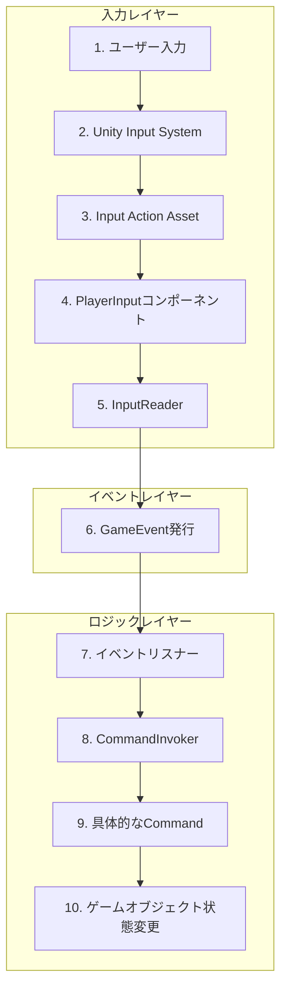

# ユーザー入力の実装フローとアーキテクチャ解説

このドキュメントは、このUnityプロジェクトにおけるユーザー入力の実装方法と、その背後にあるアーキテクチャについて詳細に説明します。

このプロジェクトは、Unityの新しい**Input System**を使い、**ScriptableObjectベースのイベント（GameEvent）**と**コマンドパターン**を組み合わせた、非常に疎結合で拡張性の高い設計になっています。

## ユーザー入力から処理実行までのフロー

以下は、ユーザーがキーを押してから、ゲーム内で何らかのアクションが実行されるまでの一連の流れを示す図です。



## 各ステップの詳細解説

1.  **ユーザー入力**: ユーザーが物理的なデバイス（キーボード、マウス、ゲームパッド）を操作します。

2.  **Unity Input System**: Unityの新しいInput Systemがこの物理的な入力を検知します。このシステムは、古い`Input.GetKey`などとは異なり、デバイスに依存しない抽象的な入力を扱えます。

3.  **Input Action Asset**: プロジェクト内に存在する `.inputactions` ファイル（例: `PlayerControls.inputactions`）で、"移動"、"ジャンプ"、"攻撃"といった抽象的なアクションを定義します。そして、どのアクションがどの物理的な入力（例: Wキー、スペースバー、マウス左クリック）に対応するか（Binding）を設定します。

4.  **PlayerInputコンポーネント**: プレイヤーキャラクターなどのGameObjectに`PlayerInput`コンポーネントをアタッチします。このコンポーネントがInput Action Assetと連携し、定義されたアクションが実行されたときに対応するC#メソッドを呼び出すように設定します。

5.  **InputReader (C# Script)**: `PlayerInput`コンポーネントから直接呼び出されるスクリプトです。このスクリプトの**重要な役割は、ゲームのロジックを一切含まず、受け取った入力イベントを対応する`GameEvent`に変換して発行（Raise）することだけ**です。これにより、入力の検知とゲームロジックが完全に分離されます。

6.  **GameEvent (ScriptableObject) の発行**: `InputReader`は、特定の入力（例: ジャンプボタン押下）があった場合に、`OnPlayerJump`のような名前の`GameEvent`（ScriptableObjectアセット）を発行します。ScriptableObjectであるため、シーンをまたいで参照関係を維持でき、非常に便利です。

7.  **イベントリスナー**: ゲーム内の様々な機能（プレイヤーの移動処理、UIの更新処理など）を持つスクリプトが、関心のある`GameEvent`をリッスン（購読）しています。例えば、`PlayerMovementController`は`OnPlayerMove`イベントを、`WeaponController`は`OnPlayerAttack`イベントをリッスンします。

8.  **CommandInvokerの呼び出し**: イベントを受け取ったリスナーは、具体的な処理を実行するために`CommandInvoker`を呼び出します。このプロジェクトでは、処理の実行履歴を管理したり、Undo/Redoを実装したりするためにコマンドパターンが採用されています。

9.  **具体的なCommandの実行**: `CommandInvoker`は、渡された`ICommand`（例: `DamageCommand`, `HealCommand`）の`Execute()`メソッドを実行します。新しいアクションを追加する場合は、新しいCommandクラスを作成することになります。

10. **ゲームオブジェクトの状態変更**: Commandが最終的にターゲットとなるGameObjectのメソッドを呼び出し、位置やHPなどの状態を変更します。

## 具体的な実装例：「ダッシュ」機能の追加

仮に新しい「ダッシュ」機能を追加する場合、以下の手順を踏みます。

1.  **Input Actionの追加**:
    *   `.inputactions`ファイルを開き、"Dash"という新しいActionを追加します。
    *   "Dash"アクションに、例えば「左Shiftキー」をBindingします。

2.  **InputReaderの更新**:
    *   `PlayerInput`コンポーネントのEventsに"Dash"アクションを追加し、`InputReader`スクリプトの`OnDash()`メソッドを呼び出すように設定します。
    *   `InputReader.cs`に以下のコードを追加します。

    ```csharp
    // Assets/_Project/Core/Input/InputReader.cs (と仮定)

    [Header("Player Actions")]
    [SerializeField] private GameEvent _dashEvent; // ダッシュイベント用のGameEventをインスペクターから設定

    // PlayerInputコンポーネントから呼び出される
    public void OnDash(InputAction.CallbackContext context)
    {
        if (context.phase == InputActionPhase.Performed)
        {
            _dashEvent.Raise(); // ダッシュイベントを発行するだけ
        }
    }
    ```

3.  **GameEventの作成**:
    *   Projectウィンドウで右クリックし、`Create > Events > GameEvent`を選択して`OnPlayerDash`という名前の`GameEvent`アセットを作成します。
    *   `InputReader`のインスペクターで、`_dashEvent`フィールドにこのアセットをセットします。

4.  **ダッシュ機能の実装 (イベントリスナー)**:
    *   プレイヤーをダッシュさせるための新しいスクリプト`PlayerDashController.cs`を作成します。

    ```csharp
    // Assets/_Project/Features/Player/PlayerDashController.cs (と仮定)
    using UnityEngine;

    public class PlayerDashController : MonoBehaviour
    {
        [SerializeField] private GameEvent _dashEvent; // リッスンするイベント
        [SerializeField] private float _dashForce = 10f;
        private Rigidbody _rigidbody;

        private void Awake()
        {
            _rigidbody = GetComponent<Rigidbody>();
        }

        private void OnEnable()
        {
            _dashEvent.RegisterListener(OnDashRequested);
        }

        private void OnDisable()
        {
            _dashEvent.UnregisterListener(OnDashRequested);
        }

        private void OnDashRequested()
        {
            // ここでコマンドを発行するのがこのプロジェクトの流儀
            // 例: var dashCommand = new DashCommand(transform, _dashForce);
            //     CommandInvoker.Instance.ExecuteCommand(dashCommand);

            // もしくは単純に直接処理を書いても良い
            Debug.Log("Dash event received!");
            _rigidbody.AddForce(transform.forward * _dashForce, ForceMode.Impulse);
        }
    }
    ```

5.  **GameObjectへのアタッチ**:
    *   PlayerのGameObjectに`PlayerDashController`をアタッチし、インスペクターで`_dashEvent`に`OnPlayerDash`アセットをセットします。

これで、ユーザーが左Shiftキーを押すと、`InputReader`がイベントを発行し、それを`PlayerDashController`が受信してプレイヤーをダッシュさせる、という一連の流れが完成します。

## このアーキテクチャの利点

*   **疎結合**: 入力処理、イベント、ゲームロジックが完全に分離しているため、お互いに依存しません。
*   **拡張性**: 新しい機能を追加する際、既存のコードをほとんど変更する必要がありません。新しいイベントとリスナーを追加するだけで済みます。
*   **テスト容易性**: 各機能が単一の責任を持っているため、個別にテストするのが非常に簡単です。例えば、`PlayerDashController`の`OnDashRequested()`を直接呼び出すだけでダッシュ機能の単体テストができます。
