# Platformer Template Configuration 詳細設計書

## プロジェクト情報

- **TASK**: TASK-004: Ultimate Template Phase-1統合 - Platformer Template Configuration
- **要件ID**: FR-8.1.2（究極テンプレート Phase A-2最優先）
- **優先度**: 高（3Dプラットフォーマー対応）
- **作成日**: 2025年9月15日
- **設計者**: Claude Code
- **整合性**: REQUIREMENTS.md v3.0・DESIGN.md・TASKS.md完全準拠

## 🎯 設計ビジョン・核心価値

### Ultimate Template Learn & Grow価値実現
**目標**: 学習コスト70%削減（40時間→12時間）、15分完全ゲームプレイ体験実現

**Platformer Template特化価値**:
- **物理ベース移動システム**: リアルなジャンプ・落下・着地メカニクス
- **コレクタブル統合**: スコアシステム・進行管理・レベル完了条件
- **動的プラットフォーム**: 移動床・回転床・トラップシステム
- **段階的学習体験**: 基本操作→応用テクニック→レベルデザイン→カスタマイズ

## 🏗️ アーキテクチャ制約・設計原則

### TR-2.2 名前空間一貫性制約（REQUIREMENTS.md準拠）

**必須遵守事項**:
```csharp
// 名前空間構造
asterivo.Unity60.Features.Templates.Platformer         // メインConfiguration
asterivo.Unity60.Features.Templates.Platformer.Physics // 物理システム
asterivo.Unity60.Features.Templates.Platformer.Collectibles // コレクタブル
asterivo.Unity60.Features.Templates.Platformer.Platforms   // プラットフォーム
asterivo.Unity60.Features.Templates.Platformer.Camera     // カメラシステム
asterivo.Unity60.Features.Templates.Platformer.UI        // UI システム

// ⚠️禁止事項
- _Project.* 名前空間の新規使用完全禁止
- Core層からFeature層への直接参照禁止
```

### Service Locator + Event駆動ハイブリッドアーキテクチャ

**設計原則**:
1. **Service Locator**: 共通サービス（Audio, Commands, EventLogger）への統一アクセス
2. **Event駆動通信**: Core↔Feature間の疎結合連携
3. **ScriptableObject設定**: データ資産化による非プログラマー対応
4. **Command Pattern**: アクション（Jump, Collect, Platform）のカプセル化
5. **State Management**: プレイヤー・カメラ・ゲーム状態の統合管理

## 🔍 既存エラー分析・解決戦略

### 現在のコンパイルエラー（優先解決順）

#### 1. Cinemachine 3.1 API変更対応（最重要）
**エラー**: `Cannot implicitly convert type 'CinemachinePositionComposer' to 'CinemachineComposer'`
**原因**: Cinemachine 3.1のAPI変更
**解決策**:
```csharp
// 修正前
CinemachineComposer composer = vcam.GetCinemachineComponent<CinemachineComposer>();

// 修正後
CinemachinePositionComposer composer = vcam.GetCinemachineComponent<CinemachinePositionComposer>();
```

#### 2. ServiceLocator/IEventLogger参照問題
**エラー**: `ServiceLocator does not exist in the current context`
**原因**: using文・Assembly Definition参照不足
**解決策**:
```csharp
using asterivo.Unity60.Core.Services;
using asterivo.Unity60.Core.Debug;

// Assembly Definition更新（asterivo.Unity60.Core.Services追加）
```

#### 3. CollectItemCommand参照問題
**エラー**: `The type or namespace name 'CollectItemCommand' could not be found`
**解決策**: Command実装とusing追加
```csharp
using asterivo.Unity60.Features.Templates.Platformer.Commands;
```

#### 4. PlatformerPlayerController メソッド不足
**エラー**: `does not contain a definition for 'GetVelocity'/'IsJumping'`
**解決策**: 必要メソッドの実装追加

## 📊 PlatformerTemplateConfiguration 設計仕様

### 基本設計アーキテクチャ

```mermaid
flowchart TB
    subgraph "PlatformerTemplateConfiguration (ScriptableObject)"
        A["Basic Settings<br/>• Template Name<br/>• Version<br/>• Description<br/>• Enable15MinGameplay"]
        B["Physics Configuration<br/>• Gravity Settings<br/>• Jump Parameters<br/>• Ground Detection<br/>• Coyote Time/Jump Buffer"]
        C["Player Configuration<br/>• Movement Speed<br/>• Jump Force<br/>• Air Control<br/>• Animation Settings"]
        D["Camera Configuration<br/>• Follow Settings<br/>• Look Ahead<br/>• Dynamic Height<br/>• Cinemachine Presets"]
        E["Collectible Configuration<br/>• Score Values<br/>• Pickup Effects<br/>• Target Scores<br/>• Completion Conditions"]
        F["Platform Configuration<br/>• Moving Platforms<br/>• Trap Systems<br/>• Environmental Elements<br/>• Hazard Settings"]
        G["Learning System<br/>• Tutorial Steps<br/>• Difficulty Progression<br/>• Performance Tracking<br/>• Achievement System"]
    end

    subgraph "Integration Systems"
        H["Service Locator Integration"]
        I["Event System Integration"]
        J["Command System Integration"]
        K["Audio System Integration"]
    end

    A --> H
    B --> I
    C --> J
    D --> K
    E --> H
    F --> I
    G --> J

    classDef config fill:#e1f5fe,stroke:#0277bd,stroke-width:2px,color:#000
    classDef integration fill:#e8f5e8,stroke:#388e3c,stroke-width:2px,color:#000

    class A,B,C,D,E,F,G config
    class H,I,J,K integration
```



### ScriptableObject実装設計

```csharp
namespace asterivo.Unity60.Features.Templates.Platformer
{
    /// <summary>
    /// プラットフォーマーテンプレート設定システム
    /// Stealth Template Configurationのパターンを適用した
    /// 3Dプラットフォームアクション完全対応設定
    /// </summary>
    [CreateAssetMenu(menuName = "Templates/Platformer/Template Configuration", fileName = "PlatformerTemplateConfiguration")]
    public class PlatformerTemplateConfiguration : ScriptableObject
    {
        #region Template Basic Settings

        [Header("=== Platformer Template Configuration ===")]
        [SerializeField] private string templateName = "3D Platformer Template";
        [SerializeField] private string templateVersion = "1.0.0";
        [SerializeField] private string templateDescription = "Complete 3D platformer template with physics-based movement, collectibles, and dynamic platforms";
        [SerializeField] private bool enable15MinuteGameplay = true;

        #endregion

        #region Physics Configuration

        [Header("=== Physics Configuration ===")]
        public PlatformerPhysicsSettings PhysicsSettings = new PlatformerPhysicsSettings();

        #endregion

        #region Player Configuration

        [Header("=== Player Configuration ===")]
        public PlatformerPlayerSettings PlayerSettings = new PlatformerPlayerSettings();

        #endregion

        #region Camera Configuration

        [Header("=== Camera Configuration ===")]
        public PlatformerCameraSettings CameraSettings = new PlatformerCameraSettings();

        #endregion

        #region Collectible Configuration

        [Header("=== Collectible System Configuration ===")]
        public PlatformerCollectibleSettings CollectibleSettings = new PlatformerCollectibleSettings();

        #endregion

        #region Platform Configuration

        [Header("=== Platform System Configuration ===")]
        public PlatformerPlatformSettings PlatformSettings = new PlatformerPlatformSettings();

        #endregion

        #region Learning System Configuration

        [Header("=== Learning System Configuration ===")]
        public PlatformerLearningSettings LearningSettings = new PlatformerLearningSettings();

        #endregion

        #region Service Integration

        [Header("=== Service Integration ===")]
        [SerializeField] private bool useServiceLocator = true;
        [SerializeField] private bool enableEventDrivenArchitecture = true;
        [SerializeField] private bool enableCommandPattern = true;
        [SerializeField] private bool enableAudioIntegration = true;

        #endregion

        // 以下、各設定クラスと実装メソッド
    }
}
```

## 🎮 設定システム詳細設計

### 1. PlatformerPhysicsSettings

```csharp
[System.Serializable]
public class PlatformerPhysicsSettings
{
    [Header("Gravity & Physics")]
    [SerializeField, Range(-50f, 0f)] public float gravity = -9.81f;
    [SerializeField, Range(0f, 20f)] public float terminalVelocity = 15f;
    [SerializeField] public LayerMask groundLayerMask = 1;
    [SerializeField] public LayerMask platformLayerMask = 512;

    [Header("Jump Configuration")]
    [SerializeField, Range(1f, 20f)] public float jumpForce = 8f;
    [SerializeField, Range(1f, 5f)] public int maxJumpCount = 2; // Double jump support
    [SerializeField, Range(0f, 0.5f)] public float coyoteTime = 0.2f; // Forgiving jump timing
    [SerializeField, Range(0f, 0.5f)] public float jumpBufferTime = 0.2f; // Jump buffer

    [Header("Air Control")]
    [SerializeField, Range(0f, 1f)] public float airControl = 0.8f;
    [SerializeField, Range(0f, 2f)] public float jumpCutMultiplier = 0.5f; // Variable jump height

    [Header("Ground Detection")]
    [SerializeField, Range(0.1f, 2f)] public float groundCheckDistance = 1.1f;
    [SerializeField, Range(0.1f, 1f)] public float groundCheckRadius = 0.5f;
    [SerializeField] public Vector3 groundCheckOffset = Vector3.zero;

    public bool ValidatePhysicsSettings()
    {
        return gravity < 0f && jumpForce > 0f && groundCheckDistance > 0f;
    }
}
```

### 2. PlatformerPlayerSettings

```csharp
[System.Serializable]
public class PlatformerPlayerSettings
{
    [Header("Movement Configuration")]
    [SerializeField, Range(1f, 15f)] public float movementSpeed = 6f;
    [SerializeField, Range(1f, 10f)] public float sprintSpeed = 9f;
    [SerializeField, Range(0.1f, 2f)] public float acceleration = 1.5f;
    [SerializeField, Range(0.1f, 2f)] public float deceleration = 1.8f;

    [Header("Rotation & Animation")]
    [SerializeField, Range(0.1f, 10f)] public float rotationSpeed = 8f;
    [SerializeField] public bool enableSmoothRotation = true;
    [SerializeField] public bool enableWalkAnimation = true;
    [SerializeField] public bool enableJumpAnimation = true;

    [Header("Input Configuration")]
    [SerializeField] public bool enableSprintInput = true;
    [SerializeField] public bool enableCrouchInput = false; // Optional for platformer
    [SerializeField] public string horizontalInputAxis = "Horizontal";
    [SerializeField] public string verticalInputAxis = "Vertical";
    [SerializeField] public string jumpInputButton = "Jump";

    public bool ValidatePlayerSettings()
    {
        return movementSpeed > 0f && rotationSpeed > 0f;
    }
}
```

### 3. PlatformerCameraSettings

```csharp
[System.Serializable]
public class PlatformerCameraSettings
{
    [Header("Follow Configuration")]
    [SerializeField] public Vector3 followOffset = new Vector3(0f, 8f, -10f);
    [SerializeField, Range(0.1f, 5f)] public float followSpeed = 2f;
    [SerializeField, Range(0.1f, 5f)] public float positionDamping = 1.5f;
    [SerializeField, Range(0.1f, 5f)] public float rotationDamping = 2f;

    [Header("Look Ahead System")]
    [SerializeField] public bool enableLookAhead = true;
    [SerializeField, Range(0f, 10f)] public float lookAheadDistance = 3f;
    [SerializeField, Range(0.1f, 2f)] public float lookAheadSpeed = 1f;

    [Header("Dynamic Height")]
    [SerializeField] public bool enableDynamicHeight = true;
    [SerializeField, Range(0f, 15f)] public float jumpHeight = 12f;
    [SerializeField, Range(0f, 5f)] public float fallDistance = 8f;
    [SerializeField, Range(0.1f, 3f)] public float verticalFollowSpeed = 1.2f;

    [Header("Cinemachine Integration")]
    [SerializeField] public bool useCinemachine = true;
    [SerializeField] public string virtualCameraName = "PlatformerVCam";
    [SerializeField, Range(10f, 80f)] public float fieldOfView = 60f;

    public bool ValidateCameraSettings()
    {
        return followSpeed > 0f && positionDamping > 0f;
    }
}
```

### 4. PlatformerCollectibleSettings

```csharp
[System.Serializable]
public class PlatformerCollectibleSettings
{
    [Header("Score Configuration")]
    [SerializeField, Range(1, 1000)] public int baseScoreValue = 100;
    [SerializeField, Range(1, 5000)] public int targetScore = 1000;
    [SerializeField, Range(1, 100)] public int totalCollectibles = 20;

    [Header("Pickup Effects")]
    [SerializeField] public bool enablePickupSound = true;
    [SerializeField] public bool enablePickupParticles = true;
    [SerializeField] public bool enableScorePopup = true;
    [SerializeField, Range(0.1f, 2f)] public float pickupAnimationDuration = 0.5f;

    [Header("Bonus System")]
    [SerializeField] public bool enableBonusMultiplier = true;
    [SerializeField, Range(1f, 5f)] public float bonusMultiplier = 2f;
    [SerializeField, Range(1f, 60f)] public float bonusTimeWindow = 10f; // Consecutive collection bonus

    [Header("Level Progression")]
    [SerializeField] public bool requireAllCollectibles = false;
    [SerializeField, Range(0.1f, 1f)] public float completionPercentage = 0.8f; // 80% for level completion

    public bool ValidateCollectibleSettings()
    {
        return baseScoreValue > 0 && targetScore > 0 && totalCollectibles > 0;
    }
}
```

### 5. PlatformerPlatformSettings

```csharp
[System.Serializable]
public class PlatformerPlatformSettings
{
    [Header("Moving Platforms")]
    [SerializeField] public bool enableMovingPlatforms = true;
    [SerializeField, Range(0.1f, 10f)] public float defaultPlatformSpeed = 2f;
    [SerializeField] public bool enablePlayerSticking = true;
    [SerializeField, Range(0f, 50f)] public float stickThreshold = 1f;

    [Header("Platform Physics")]
    [SerializeField, Range(0f, 100f)] public float carryForce = 15f;
    [SerializeField] public bool inheritPlatformVelocity = true;
    [SerializeField, Range(0f, 1f)] public float platformFriction = 0.8f;

    [Header("Trap Systems")]
    [SerializeField] public bool enableTraps = false;
    [SerializeField, Range(1f, 50f)] public float trapDamage = 25f;
    [SerializeField, Range(0.1f, 5f)] public float trapCooldown = 2f;

    [Header("Environmental Elements")]
    [SerializeField] public bool enableWindZones = false;
    [SerializeField] public bool enableWaterAreas = false;
    [SerializeField] public bool enableIcePhysics = false;

    public bool ValidatePlatformSettings()
    {
        return defaultPlatformSpeed > 0f && carryForce >= 0f;
    }
}
```

### 6. PlatformerLearningSettings

```csharp
[System.Serializable]
public class PlatformerLearningSettings
{
    [Header("Tutorial System")]
    [SerializeField] public bool enableTutorial = true;
    [SerializeField] public int tutorialSteps = 10;
    [SerializeField] public bool enableContextualHints = true;
    [SerializeField, Range(0.5f, 10f)] public float hintDisplayDuration = 3f;

    [Header("Difficulty Progression")]
    [SerializeField] public bool enableAdaptiveDifficulty = true;
    [SerializeField, Range(0.1f, 2f)] public float difficultyScaling = 1.2f;
    [SerializeField] public int difficultyLevels = 5;

    [Header("Performance Tracking")]
    [SerializeField] public bool enablePerformanceTracking = true;
    [SerializeField] public bool trackJumpAccuracy = true;
    [SerializeField] public bool trackCollectionEfficiency = true;
    [SerializeField] public bool trackTimeToCompletion = true;

    [Header("Achievement System")]
    [SerializeField] public bool enableAchievements = true;
    [SerializeField] public int totalAchievements = 15;
    [SerializeField] public bool enableProgressSaving = true;

    public bool ValidateLearningSettings()
    {
        return tutorialSteps > 0 && difficultyLevels > 0;
    }
}
```

## 🎯 15分完全ゲームプレイ体験設計

### ゲームプレイフロー（Learn & Grow価値実現）

```mermaid
flowchart TD
    A["Phase 1: Basic Movement<br/>(0-3分)<br/>• WASD移動<br/>• スペースキージャンプ<br/>• カメラ基本操作"] --> B["Phase 2: Jump Mechanics<br/>(3-6分)<br/>• 単発ジャンプ<br/>• ダブルジャンプ<br/>• Coyote Time体験"]

    B --> C["Phase 3: Collectibles<br/>(6-9分)<br/>• アイテム収集<br/>• スコアシステム<br/>• ボーナス獲得"]

    C --> D["Phase 4: Platform Elements<br/>(9-12分)<br/>• 移動プラットフォーム<br/>• 環境ギミック<br/>• タイミング要素"]

    D --> E["Phase 5: Level Completion<br/>(12-15分)<br/>• ゴール到達<br/>• 達成評価<br/>• 次レベル解放"]

    classDef phase fill:#e3f2fd,stroke:#1976d2,stroke-width:2px,color:#000
    class A,B,C,D,E phase
```



### 学習段階設計（段階的成長支援）

#### 第1段階: 基本操作習得（0-3分）
**学習目標**: WASD移動とスペースキージャンプの基本操作
**実装要素**:
- シンプルな地形での移動練習
- 視覚的フィードバック（移動方向インジケータ）
- 音響フィードバック（足音、ジャンプ音）
- コンテキストヘルプ（画面上の操作ガイド）

#### 第2段階: ジャンプメカニクス（3-6分）
**学習目標**: 高度なジャンプテクニックの習得
**実装要素**:
- ダブルジャンプシステム
- Coyote Time（地面を離れた後の短時間ジャンプ許可）
- Jump Buffer（着地前のジャンプ入力受付）
- 可変ジャンプ高度（ボタン長押し時間による調整）

#### 第3段階: コレクタブルシステム（6-9分）
**学習目標**: アイテム収集とスコアシステムの理解
**実装要素**:
- 基本コレクタブル（コイン、ジェム）
- スコア表示とフィードバック
- ボーナスシステム（連続収集ボーナス）
- 進捗表示（収集率、残りアイテム数）

#### 第4段階: プラットフォーム要素（9-12分）
**学習目標**: 動的環境要素との相互作用
**実装要素**:
- 移動プラットフォーム
- 回転プラットフォーム
- 一時的足場（タイマー式）
- 環境ギミック（スイッチ、ドア）

#### 第5段階: レベル完了（12-15分）
**学習目標**: 総合的なスキル統合とレベル達成
**実装要素**:
- ゴール地点到達
- 達成度評価（時間、収集率、スキル評価）
- 成果記録とフィードバック
- 次レベル・アドバンス機能の解放

## 🔧 実装戦略・エラー解決

### 実装順序（優先度順）

#### 1. PlatformerTemplateConfiguration.cs 実装（最優先）
```csharp
// Assets/_Project/Features/Templates/Platformer/Scripts/
namespace asterivo.Unity60.Features.Templates.Platformer
{
    [CreateAssetMenu(menuName = "Templates/Platformer/Template Configuration")]
    public class PlatformerTemplateConfiguration : ScriptableObject
    {
        // 上記設計の完全実装
    }
}
```

#### 2. 既存エラーの修正（高優先）
- **Cinemachine 3.1対応**: API変更への適応
- **ServiceLocator参照**: using文とAssembly Definition更新
- **CollectItemCommand**: Command実装とusing追加
- **PlayerController メソッド**: 必要メソッド実装

#### 3. Service Locator統合（高優先）
```csharp
// PlatformerTemplateManager.cs内
private void InitializeServices()
{
    audioService = ServiceLocator.GetService<IAudioService>();
    commandInvoker = ServiceLocator.GetService<ICommandInvoker>();
    eventLogger = ServiceLocator.GetService<IEventLogger>();
}
```

#### 4. Event駆動統合（中優先）
```csharp
// Platformer特化イベント
public class PlatformerPlayerJumpEvent : GameEvent<Vector3> { }
public class PlatformerCollectItemEvent : GameEvent<CollectibleData> { }
public class PlatformerLevelCompleteEvent : GameEvent<LevelCompletionData> { }
```

#### 5. Command Pattern統合（中優先）
```csharp
// Platformer特化コマンド
public class PlatformerJumpCommand : ICommand, IResettableCommand
public class CollectItemCommand : ICommand, IResettableCommand
public class PlatformActivateCommand : ICommand, IResettableCommand
```

### Assembly Definition更新

```json
{
    "name": "asterivo.Unity60.Features.Templates.Platformer",
    "rootNamespace": "asterivo.Unity60.Features.Templates.Platformer",
    "references": [
        "asterivo.Unity60.Core",
        "asterivo.Unity60.Core.Events",
        "asterivo.Unity60.Core.Commands",
        "asterivo.Unity60.Core.Audio",
        "asterivo.Unity60.Core.Services",
        "asterivo.Unity60.Core.Debug",
        "asterivo.Unity60.Features.Templates.Common",
        "Unity.InputSystem",
        "Unity.Cinemachine",
        "Unity.TextMeshPro",
        "Unity.Mathematics",
        "Sirenix.OdinInspector.Attributes"
    ],
    "includePlatforms": [],
    "excludePlatforms": [],
    "allowUnsafeCode": false,
    "overrideReferences": false,
    "precompiledReferences": [],
    "autoReferenced": true,
    "defineConstraints": [],
    "versionDefines": [],
    "noEngineReferences": false
}
```

## 🎮 統合テストケース設計

### Template Configuration 検証テスト

```csharp
[Test]
public void PlatformerTemplateConfiguration_ValidateAllSettings_Success()
{
    // Given
    var config = ScriptableObject.CreateInstance<PlatformerTemplateConfiguration>();

    // When
    var physicsValid = config.PhysicsSettings.ValidatePhysicsSettings();
    var playerValid = config.PlayerSettings.ValidatePlayerSettings();
    var cameraValid = config.CameraSettings.ValidateCameraSettings();
    var collectibleValid = config.CollectibleSettings.ValidateCollectibleSettings();
    var platformValid = config.PlatformSettings.ValidatePlatformSettings();
    var learningValid = config.LearningSettings.ValidateLearningSettings();

    // Then
    Assert.IsTrue(physicsValid, "Physics settings validation failed");
    Assert.IsTrue(playerValid, "Player settings validation failed");
    Assert.IsTrue(cameraValid, "Camera settings validation failed");
    Assert.IsTrue(collectibleValid, "Collectible settings validation failed");
    Assert.IsTrue(platformValid, "Platform settings validation failed");
    Assert.IsTrue(learningValid, "Learning settings validation failed");
}

[Test]
public void PlatformerTemplate_15MinuteGameplay_Complete()
{
    // 15分完全ゲームプレイ体験のフルテスト
    // Phase 1-5の全段階検証
}
```

## 📋 実装チェックリスト

### Phase 1: Configuration System
- [ ] PlatformerTemplateConfiguration.cs実装
- [ ] 6つの設定クラス完全実装
- [ ] ScriptableObject Asset作成
- [ ] Validation メソッド実装

### Phase 2: Error Resolution
- [ ] Cinemachine 3.1 API修正
- [ ] ServiceLocator using文追加
- [ ] Assembly Definition更新
- [ ] CollectItemCommand実装
- [ ] PlayerController メソッド追加

### Phase 3: Service Integration
- [ ] Service Locator統合
- [ ] Event駆動アーキテクチャ統合
- [ ] Command Pattern統合
- [ ] Audio System統合

### Phase 4: Learning System
- [ ] 15分ゲームプレイフロー実装
- [ ] 5段階学習システム実装
- [ ] チュートリアルシステム統合
- [ ] パフォーマンス追跡システム

### Phase 5: Testing & Validation
- [ ] Unit Test実装
- [ ] Integration Test実装
- [ ] 15分ゲームプレイテスト
- [ ] パフォーマンス検証

## 🎯 成功指標・品質保証

### 定量的目標
- **コンパイルエラー**: 0件（Complete Zero Error）
- **15分ゲームプレイ**: 100%実現（Phase 1-5完全体験）
- **学習コスト削減**: 70%達成（40時間→12時間）
- **パフォーマンス**: 60FPS安定動作保証

### 定性的目標
- **アーキテクチャ準拠**: Service Locator + Event駆動完全適用
- **Learn & Grow価値**: 段階的学習体験の完全実現
- **拡張性**: 他ジャンルテンプレートとの統合性確保
- **保守性**: ScriptableObjectによる設定の外部化

## 📝 まとめ

この詳細設計書は、**Stealth Template Configurationの成功実装パターンを基盤**として、Platformer Template特有の要件（物理ベース移動、コレクタブル、動的プラットフォーム）を完全に統合した設計を提供します。

**核心価値実現**:
- **Learn & Grow**: 70%学習コスト削減を15分ゲームプレイ体験で実現
- **アーキテクチャ準拠**: Service Locator + Event駆動による疎結合設計
- **品質保証**: エラー0の Complete Clean Implementation

**次ステップ**: この設計書に基づき、Phase 1（Configuration System）から段階的実装を開始し、TASK-004の完全達成を目指します。

---

**設計完了**: ✅ Platformer Template Configuration 詳細設計書
**次アクション**: 実装フェーズ開始 - PlatformerTemplateConfiguration.cs作成
