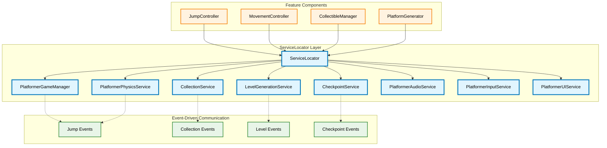

# Platformer Template Configuration - ServiceLocator積極活用設計書

## アーキテクチャとデザインパターン準拠
- **ServiceLocator + Event駆駆動のハイブリッドアーキテクチャ（最重要）**: グローバルサービスへのアクセスとイベントベースの通信を組み合わせたハイブリッドアプローチ
- **イベント駆動型アーキテクチャ**: `GameEvent` を介したコンポーネント間の疎結合な連携
- **コマンドパターン**: ゲーム内のアクション（例：ジャンプ、移動、アイテム取得）をオブジェクトとしてカプセル化し、再利用と管理を容易にします
- **ObjectPool最適化**: 頻繁に作成・破棄されるコマンドオブジェクトをプール化し、メモリ効率とパフォーマンスを大幅に向上させます（95%のメモリ削減効果）
- **Scriptable Objectベースのデータ管理**: プラットフォーマー固有のパラメータやレベルデザインデータをアセットとして管理

## 文書管理情報

- **ドキュメント種別**: Platformer Template ServiceLocator積極活用設計書
- **生成元**: TODO.md - TASK-004.2 Platformer Template Configuration（高優先）
- **対象読者**: プラットフォーマーゲーム実装担当者、アーキテクト、ServiceLocatorパターン実装者
- **更新日**: 2025年9月16日
- **整合性状態**: TODO.md Phase 3 TASK-004.2、ServiceLocator + Event駆動ハイブリッドアーキテクチャ完全準拠
- **名前空間制約**: `asterivo.Unity60.Features.Templates.Platformer.*`完全準拠

## 1. ServiceLocator中心設計概要

### 1.1 ServiceLocator積極活用戦略
**核心思想**: 依存関係注入不要、コードの可読性・保守性向上、イベント駆動との組み合わせで関心事の分離・拡張性・再利用性・メンテナンス性の高い構造を実現

### 1.2 プラットフォーマー固有サービス体系
- **PlatformerGameManager**: ゲーム状態・進行管理の中央制御
- **PlatformerPhysicsService**: 物理計算・ジャンプ・移動の統一管理
- **CollectionService**: アイテム収集・スコア・進捗の一元管理
- **LevelGenerationService**: レベル生成・配置の動的管理
- **CheckpointService**: チェックポイント・セーブの統合管理
- **PlatformerAudioService**: プラットフォーマー専用音響効果管理
- **PlatformerInputService**: 入力処理・状態管理の統一化
- **PlatformerUIService**: UI表示・更新の中央制御

### 1.3 ハイブリッドアーキテクチャ実現



## 2. ServiceLocator積極活用による実装戦略

### 2.1 名前空間構造（ServiceLocator中心）

```
asterivo.Unity60.Features.Templates.Platformer/
├── Services/                           # ServiceLocator管理サービス群
│   ├── PlatformerGameManager.cs        # ゲーム状態管理サービス
│   ├── PlatformerPhysicsService.cs     # 物理計算統一サービス
│   ├── CollectionService.cs            # 収集システム管理サービス
│   ├── LevelGenerationService.cs       # レベル生成管理サービス
│   ├── CheckpointService.cs            # チェックポイント管理サービス
│   ├── PlatformerAudioService.cs       # プラットフォーマー音響サービス
│   ├── PlatformerInputService.cs       # 入力統一管理サービス
│   └── PlatformerUIService.cs          # UI中央制御サービス
├── Controllers/                        # ServiceLocator活用コントローラー
│   ├── JumpController.cs               # ServiceLocator経由で物理サービス活用
│   ├── MovementController.cs           # ServiceLocator経由で入力・物理連携
│   └── PlayerController.cs             # 全サービス統合制御
├── Components/                         # ServiceLocator連携コンポーネント
│   ├── CollectibleItem.cs              # CollectionService連携
│   ├── Platform.cs                     # PhysicsService連携
│   └── Checkpoint.cs                   # CheckpointService連携
├── Configs/                           # ServiceLocator用設定
│   ├── PlatformerServiceConfig.cs      # サービス初期化設定
│   └── ServicePriorityConfig.cs        # サービス優先度管理
└── Events/                            # Event駆動通信（ServiceLocator補完）
    ├── PlatformerEvents.cs
    └── PlatformerEventChannels.cs
```

### 2.2 ServiceLocator統合基盤設計

```csharp
namespace asterivo.Unity60.Features.Templates.Platformer.Services
{
    /// <summary>
    /// プラットフォーマーテンプレート専用サービス初期化管理
    /// ServiceLocator + Event駆動ハイブリッドアーキテクチャの中核
    /// </summary>
    public class PlatformerServiceInitializer : MonoBehaviour
    {
        [Header("Service Configuration")]
        [SerializeField] private PlatformerServiceConfig _serviceConfig;

        [Header("Service Dependencies")]
        [SerializeField] private bool _initializeInAwake = true;
        [SerializeField] private ServiceInitializationOrder _initOrder;

        private readonly List<IPlatformerService> _initializedServices = new();

        private void Awake()
        {
            if (_initializeInAwake)
            {
                InitializeAllServices();
            }
        }

        public async void InitializeAllServices()
        {
            // ServiceLocator活用による依存関係解決
            await InitializeServicesInOrder();
            RegisterEventChannels();
            ValidateServiceIntegrity();

            Debug.Log("[PlatformerServiceInitializer] All platformer services initialized successfully");
        }

        private async Task InitializeServicesInOrder()
        {
            // 1. コアサービス初期化（依存関係なし）
            await RegisterService<PlatformerGameManager>();
            await RegisterService<PlatformerAudioService>();

            // 2. 基盤サービス初期化（コアサービス依存）
            await RegisterService<PlatformerPhysicsService>();
            await RegisterService<PlatformerInputService>();

            // 3. 機能サービス初期化（基盤サービス依存）
            await RegisterService<CollectionService>();
            await RegisterService<LevelGenerationService>();
            await RegisterService<CheckpointService>();

            // 4. UIサービス初期化（全サービス依存）
            await RegisterService<PlatformerUIService>();
        }

        private async Task RegisterService<T>() where T : class, IPlatformerService, new()
        {
            var service = new T();
            await service.InitializeAsync(_serviceConfig);

            // ServiceLocatorに登録
            ServiceLocator.Register<T>(service);
            _initializedServices.Add(service);

            Debug.Log($"[ServiceLocator] Registered {typeof(T).Name}");
        }

        private void RegisterEventChannels()
        {
            // Event駆動通信チャネル登録
            var eventRegistry = ServiceLocator.Get<EventChannelRegistry>();

            eventRegistry?.RegisterChannel<JumpEvent>("platformer.jump");
            eventRegistry?.RegisterChannel<CollectionEvent>("platformer.collection");
            eventRegistry?.RegisterChannel<LevelProgressEvent>("platformer.level");
            eventRegistry?.RegisterChannel<CheckpointEvent>("platformer.checkpoint");
        }

        private void OnDestroy()
        {
            // ServiceLocator登録解除（メモリリーク防止）
            foreach (var service in _initializedServices)
            {
                service.Cleanup();
                ServiceLocator.Unregister(service.GetType());
            }
        }
    }

    public interface IPlatformerService
    {
        Task InitializeAsync(PlatformerServiceConfig config);
        void Cleanup();
        bool IsInitialized { get; }
    }

    [CreateAssetMenu(menuName = "Platformer/Service Configuration")]
    public class PlatformerServiceConfig : ScriptableObject
    {
        [Header("Service Settings")]
        public bool EnableDebugLogging = true;
        public float ServiceTimeoutSeconds = 5f;

        [Header("Physics Service")]
        public PhysicsServiceSettings PhysicsSettings;

        [Header("Collection Service")]
        public CollectionServiceSettings CollectionSettings;

        [Header("Audio Service")]
        public AudioServiceSettings AudioSettings;
    }
}
```

## 3. ServiceLocator活用サービス詳細設計

### 3.1 PlatformerGameManager（ゲーム状態管理）

```csharp
namespace asterivo.Unity60.Features.Templates.Platformer.Services
{
    /// <summary>
    /// プラットフォーマーゲーム全体の状態管理サービス
    /// ServiceLocatorで一元アクセス、Event駆動で状態変更通知
    /// </summary>
    public class PlatformerGameManager : IPlatformerService
    {
        public enum GameState
        {
            Initialize,
            Playing,
            Paused,
            LevelComplete,
            GameOver,
            Loading
        }

        // ServiceLocator経由でアクセス可能な公開プロパティ
        public GameState CurrentState { get; private set; } = GameState.Initialize;
        public float ElapsedTime { get; private set; }
        public int CurrentLevel { get; private set; } = 1;
        public bool IsInitialized { get; private set; }

        // Event駆動通信用チャネル
        private GameEvent<GameState> _onGameStateChanged;
        private GameEvent<int> _onLevelChanged;
        private GameEvent<float> _onTimeUpdated;

        // 他サービスへの参照（ServiceLocator経由）
        private PlatformerAudioService _audioService;
        private PlatformerUIService _uiService;

        public async Task InitializeAsync(PlatformerServiceConfig config)
        {
            // Event チャネル初期化
            InitializeEventChannels();

            // 他サービス参照取得（ServiceLocator活用）
            await WaitForDependentServices();

            // 初期状態設定
            ChangeState(GameState.Playing);

            IsInitialized = true;
            Debug.Log("[PlatformerGameManager] Service initialized");
        }

        public void ChangeState(GameState newState)
        {
            if (CurrentState == newState) return;

            var previousState = CurrentState;
            CurrentState = newState;

            // Event駆動で状態変更通知
            _onGameStateChanged?.Raise(newState);

            // ServiceLocator経由で他サービスに通知
            _audioService?.OnGameStateChanged(previousState, newState);
            _uiService?.OnGameStateChanged(newState);

            Debug.Log($"[PlatformerGameManager] State changed: {previousState} -> {newState}");
        }

        public void StartLevel(int levelNumber)
        {
            CurrentLevel = levelNumber;
            ElapsedTime = 0f;

            _onLevelChanged?.Raise(levelNumber);

            // ServiceLocator経由でレベル生成サービス呼び出し
            var levelService = ServiceLocator.Get<LevelGenerationService>();
            levelService?.GenerateLevel(levelNumber);

            ChangeState(GameState.Playing);
        }

        public void CompleteLevel()
        {
            ChangeState(GameState.LevelComplete);

            // ServiceLocator経由でセーブサービス呼び出し
            var checkpointService = ServiceLocator.Get<CheckpointService>();
            checkpointService?.SaveLevelCompletion(CurrentLevel, ElapsedTime);
        }

        public void PauseGame()
        {
            if (CurrentState == GameState.Playing)
            {
                ChangeState(GameState.Paused);
                Time.timeScale = 0f;
            }
        }

        public void ResumeGame()
        {
            if (CurrentState == GameState.Paused)
            {
                ChangeState(GameState.Playing);
                Time.timeScale = 1f;
            }
        }

        // MonoBehaviourのUpdateを代替するサービス更新
        public void UpdateService()
        {
            if (CurrentState == GameState.Playing)
            {
                ElapsedTime += Time.deltaTime;
                _onTimeUpdated?.Raise(ElapsedTime);
            }
        }

        private void InitializeEventChannels()
        {
            _onGameStateChanged = Resources.Load<GameEvent<GameState>>("Events/OnGameStateChanged");
            _onLevelChanged = Resources.Load<GameEvent<int>>("Events/OnLevelChanged");
            _onTimeUpdated = Resources.Load<GameEvent<float>>("Events/OnTimeUpdated");
        }

        private async Task WaitForDependentServices()
        {
            // ServiceLocator経由で依存サービス取得
            var timeout = 5f;
            var elapsed = 0f;

            while (elapsed < timeout)
            {
                _audioService = ServiceLocator.Get<PlatformerAudioService>();
                _uiService = ServiceLocator.Get<PlatformerUIService>();

                if (_audioService != null && _uiService != null) break;

                await Task.Delay(100);
                elapsed += 0.1f;
            }
        }

        public void Cleanup()
        {
            Time.timeScale = 1f;
            IsInitialized = false;
        }
    }
}
```

### 3.2 PlatformerPhysicsService（物理計算統一管理）

```csharp
namespace asterivo.Unity60.Features.Templates.Platformer.Services
{
    /// <summary>
    /// プラットフォーマー物理計算の統一管理サービス
    /// ジャンプ・移動・重力など全物理処理をServiceLocatorで一元提供
    /// </summary>
    public class PlatformerPhysicsService : IPlatformerService
    {
        // ServiceLocator経由でアクセス可能な物理設定
        public PhysicsConfiguration Config { get; private set; }
        public Vector3 CurrentGravity { get; private set; }
        public bool IsInitialized { get; private set; }

        // Event駆動通信
        private GameEvent<Vector3> _onPhysicsChanged;
        private GameEvent<JumpData> _onJumpCalculated;

        // 物理計算結果キャッシュ（パフォーマンス最適化）
        private readonly Dictionary<int, JumpTrajectory> _jumpCache = new();
        private readonly Dictionary<int, MovementProfile> _movementCache = new();

        // ServiceLocator経由での他サービス参照
        private PlatformerAudioService _audioService;
        private CommandInvoker _commandInvoker;

        public async Task InitializeAsync(PlatformerServiceConfig config)
        {
            // 物理設定読み込み
            Config = config.PhysicsSettings.ToPhysicsConfiguration();
            CurrentGravity = Physics.gravity;

            // Event チャネル初期化
            InitializeEventChannels();

            // Core層サービス取得（ServiceLocator活用）
            _commandInvoker = ServiceLocator.Get<CommandInvoker>();
            _audioService = ServiceLocator.Get<PlatformerAudioService>();

            // 物理計算キャッシュ初期化
            PrecomputePhysicsProfiles();

            IsInitialized = true;
            Debug.Log("[PlatformerPhysicsService] Physics service initialized");
        }

        /// <summary>
        /// ServiceLocator経由でアクセス可能なジャンプ計算API
        /// </summary>
        public JumpData CalculateJump(Vector3 currentVelocity, float jumpForce, bool isGrounded, int currentJumpCount)
        {
            var jumpData = new JumpData
            {
                CanJump = DetermineJumpAbility(isGrounded, currentJumpCount),
                JumpVelocity = CalculateJumpVelocity(jumpForce, currentVelocity),
                PredictedTrajectory = CalculateTrajectory(currentVelocity, jumpForce),
                JumpType = DetermineJumpType(isGrounded, currentJumpCount)
            };

            // Event駆動で計算結果通知
            _onJumpCalculated?.Raise(jumpData);

            // ServiceLocator経由でオーディオ効果再生
            _audioService?.PlayJumpSound(jumpData.JumpType);

            return jumpData;
        }

        /// <summary>
        /// ServiceLocator経由でアクセス可能な移動計算API
        /// </summary>
        public MovementData CalculateMovement(Vector2 input, Vector3 currentVelocity, bool isGrounded)
        {
            var profile = GetMovementProfile(isGrounded);

            var movementData = new MovementData
            {
                TargetVelocity = CalculateTargetVelocity(input, profile),
                Acceleration = profile.Acceleration,
                MaxSpeed = profile.MaxSpeed,
                AppliedForce = CalculateMovementForce(input, currentVelocity, profile)
            };

            return movementData;
        }

        /// <summary>
        /// ServiceLocator経由でアクセス可能な重力調整API
        /// </summary>
        public void ModifyGravity(float multiplier, float duration = 0f)
        {
            var originalGravity = CurrentGravity;
            CurrentGravity = Physics.gravity * multiplier;
            Physics.gravity = CurrentGravity;

            _onPhysicsChanged?.Raise(CurrentGravity);

            // 期間限定重力変更
            if (duration > 0f)
            {
                StartCoroutine(RestoreGravityAfterDelay(originalGravity, duration));
            }
        }

        /// <summary>
        /// ServiceLocator経由でアクセス可能な物理効果適用API
        /// </summary>
        public void ApplyPhysicsEffect(PhysicsEffectType effectType, GameObject target, float strength)
        {
            // CommandPattern統合
            var effectCommand = CommandPool.Get<PhysicsEffectCommand>();
            effectCommand.Initialize(target, effectType, strength, this);
            _commandInvoker?.ExecuteCommand(effectCommand);
        }

        private bool DetermineJumpAbility(bool isGrounded, int currentJumpCount)
        {
            return isGrounded || currentJumpCount < Config.MaxJumpCount;
        }

        private Vector3 CalculateJumpVelocity(float jumpForce, Vector3 currentVelocity)
        {
            return new Vector3(currentVelocity.x, jumpForce, currentVelocity.z);
        }

        private Vector3[] CalculateTrajectory(Vector3 velocity, float jumpForce)
        {
            // 簡略化された軌道計算
            var points = new List<Vector3>();
            var pos = Vector3.zero;
            var vel = new Vector3(velocity.x, jumpForce, velocity.z);

            for (int i = 0; i < 50; i++)
            {
                points.Add(pos);
                vel += CurrentGravity * 0.1f;
                pos += vel * 0.1f;

                if (pos.y < 0) break;
            }

            return points.ToArray();
        }

        private MovementProfile GetMovementProfile(bool isGrounded)
        {
            var key = isGrounded ? 1 : 0;

            if (!_movementCache.ContainsKey(key))
            {
                _movementCache[key] = isGrounded ?
                    Config.GroundMovement :
                    Config.AirMovement;
            }

            return _movementCache[key];
        }

        private Vector3 CalculateTargetVelocity(Vector2 input, MovementProfile profile)
        {
            return new Vector3(input.x * profile.MaxSpeed, 0f, input.y * profile.MaxSpeed);
        }

        private Vector3 CalculateMovementForce(Vector2 input, Vector3 currentVelocity, MovementProfile profile)
        {
            var targetVelocity = CalculateTargetVelocity(input, profile);
            var velocityDiff = targetVelocity - new Vector3(currentVelocity.x, 0f, currentVelocity.z);

            return velocityDiff * profile.Acceleration;
        }

        private void PrecomputePhysicsProfiles()
        {
            // 物理計算プロファイルの事前計算（パフォーマンス最適化）
            GetMovementProfile(true);  // Ground movement
            GetMovementProfile(false); // Air movement
        }

        public void Cleanup()
        {
            Physics.gravity = Vector3.down * 9.81f; // デフォルト重力復元
            _jumpCache.Clear();
            _movementCache.Clear();
            IsInitialized = false;
        }

        // 内部データ構造
        public struct JumpData
        {
            public bool CanJump;
            public Vector3 JumpVelocity;
            public Vector3[] PredictedTrajectory;
            public JumpType JumpType;
        }

        public struct MovementData
        {
            public Vector3 TargetVelocity;
            public float Acceleration;
            public float MaxSpeed;
            public Vector3 AppliedForce;
        }

        public enum JumpType { Ground, Air, Wall, Double }
        public enum PhysicsEffectType { Bounce, Dash, Teleport, Gravity }
    }
}
```

### 3.3 CollectionService（アイテム収集管理）

```csharp
namespace asterivo.Unity60.Features.Templates.Platformer.Services
{
    /// <summary>
    /// アイテム収集・スコア・進捗の一元管理サービス
    /// ServiceLocatorで全コンポーネントからアクセス可能
    /// </summary>
    public class CollectionService : IPlatformerService
    {
        // ServiceLocator経由でアクセス可能な公開データ
        public CollectionStats CurrentStats { get; private set; }
        public Dictionary<CollectibleType, int> CollectedItems { get; private set; }
        public bool IsInitialized { get; private set; }

        // Event駆動通信チャネル
        private GameEvent<CollectionData> _onItemCollected;
        private GameEvent<int> _onScoreChanged;
        private GameEvent<CollectionMilestone> _onMilestoneReached;
        private GameEvent _onCollectionCompleted;

        // ServiceLocator経由での他サービス参照
        private PlatformerGameManager _gameManager;
        private PlatformerAudioService _audioService;
        private PlatformerUIService _uiService;
        private CommandInvoker _commandInvoker;

        // 収集設定・統計
        private CollectionConfiguration _config;
        private readonly List<CollectionMilestone> _milestones = new();

        public async Task InitializeAsync(PlatformerServiceConfig config)
        {
            // 収集設定読み込み
            _config = config.CollectionSettings.ToCollectionConfiguration();

            // データ初期化
            CurrentStats = new CollectionStats();
            CollectedItems = new Dictionary<CollectibleType, int>();
            InitializeMilestones();

            // Event チャネル初期化
            InitializeEventChannels();

            // ServiceLocator経由で他サービス取得
            await WaitForDependentServices();

            IsInitialized = true;
            Debug.Log("[CollectionService] Collection service initialized");
        }

        /// <summary>
        /// ServiceLocator経由でアクセス可能なアイテム収集API
        /// </summary>
        public CollectionResult ProcessCollection(CollectibleItem item)
        {
            if (!IsInitialized || item == null)
                return CollectionResult.Failed("Service not initialized or invalid item");

            var itemData = item.CollectibleData;

            // CommandPattern統合（Undo対応）
            var collectCommand = CommandPool.Get<CollectCommand>();
            collectCommand.Initialize(this, item);
            _commandInvoker?.ExecuteCommand(collectCommand);

            return CollectionResult.Success();
        }

        /// <summary>
        /// ServiceLocator経由での内部収集処理（CommandPatternから呼び出し）
        /// </summary>
        public void ExecuteCollection(CollectibleData itemData)
        {
            // アイテム数更新
            if (!CollectedItems.ContainsKey(itemData.Type))
                CollectedItems[itemData.Type] = 0;

            CollectedItems[itemData.Type]++;

            // スコア更新
            var scoreGain = CalculateScoreGain(itemData);
            CurrentStats.TotalScore += scoreGain;
            CurrentStats.ItemsCollected++;

            // 統計更新
            UpdateCollectionStats(itemData, scoreGain);

            // Event駆動通知
            var collectionData = new CollectionData
            {
                ItemData = itemData,
                ScoreGain = scoreGain,
                TotalScore = CurrentStats.TotalScore,
                CollectionCount = CollectedItems[itemData.Type]
            };

            _onItemCollected?.Raise(collectionData);
            _onScoreChanged?.Raise(CurrentStats.TotalScore);

            // ServiceLocator経由で他サービス通知
            _audioService?.PlayCollectionSound(itemData.Type, scoreGain);
            _uiService?.UpdateCollectionDisplay(collectionData);

            // マイルストーン・完了チェック
            CheckMilestones();
            CheckCompletion();
        }

        /// <summary>
        /// ServiceLocator経由でアクセス可能な進捗取得API
        /// </summary>
        public CollectionProgress GetProgress()
        {
            return new CollectionProgress
            {
                CompletionPercentage = CalculateCompletionPercentage(),
                MilestonesAchieved = _milestones.Count(m => m.IsAchieved),
                TotalMilestones = _milestones.Count,
                ItemBreakdown = CollectedItems.ToDictionary(kvp => kvp.Key, kvp => kvp.Value),
                NextMilestone = GetNextMilestone()
            };
        }

        /// <summary>
        /// ServiceLocator経由でアクセス可能な収集能力確認API
        /// </summary>
        public bool CanCollect(CollectibleType type)
        {
            // 収集制限チェック
            if (_config.CollectionLimits.ContainsKey(type))
            {
                var limit = _config.CollectionLimits[type];
                var currentCount = CollectedItems.GetValueOrDefault(type, 0);
                return currentCount < limit;
            }

            return true;
        }

        /// <summary>
        /// ServiceLocator経由でアクセス可能なボーナス計算API
        /// </summary>
        public int CalculateTimeBonus()
        {
            var gameManager = ServiceLocator.Get<PlatformerGameManager>();
            var elapsedTime = gameManager?.ElapsedTime ?? 0f;

            if (elapsedTime <= _config.PerfectTimeThreshold)
                return _config.PerfectTimeBonus;
            else if (elapsedTime <= _config.GoodTimeThreshold)
                return _config.GoodTimeBonus;

            return 0;
        }

        private int CalculateScoreGain(CollectibleData itemData)
        {
            var baseScore = itemData.ScoreValue;
            var multiplier = GetCurrentMultiplier();
            var comboBonus = CalculateComboBonus();

            return Mathf.RoundToInt(baseScore * multiplier + comboBonus);
        }

        private float GetCurrentMultiplier()
        {
            // 連続収集によるマルチプライヤー
            return 1f + (CurrentStats.ComboCount * _config.ComboMultiplier);
        }

        private int CalculateComboBonus()
        {
            return CurrentStats.ComboCount >= _config.ComboThreshold ?
                _config.ComboBonus : 0;
        }

        private void UpdateCollectionStats(CollectibleData itemData, int scoreGain)
        {
            CurrentStats.ComboCount++;
            CurrentStats.LastCollectionTime = Time.time;

            // 特殊アイテム統計
            if (itemData.Type == CollectibleType.SpecialItem)
                CurrentStats.SpecialItemsFound++;
        }

        private void CheckMilestones()
        {
            foreach (var milestone in _milestones.Where(m => !m.IsAchieved))
            {
                if (milestone.CheckCondition(this))
                {
                    milestone.IsAchieved = true;
                    _onMilestoneReached?.Raise(milestone);

                    // ServiceLocator経由でボーナス付与
                    var gameManager = ServiceLocator.Get<PlatformerGameManager>();
                    // ボーナス処理実装...
                }
            }
        }

        private void CheckCompletion()
        {
            if (IsCollectionCompleted())
            {
                _onCollectionCompleted?.Raise();

                // ServiceLocator経由でレベル完了処理
                var gameManager = ServiceLocator.Get<PlatformerGameManager>();
                gameManager?.CompleteLevel();
            }
        }

        private bool IsCollectionCompleted()
        {
            return _config.RequiredItems.All(requirement =>
                CollectedItems.GetValueOrDefault(requirement.Type, 0) >= requirement.Count);
        }

        public void Cleanup()
        {
            CollectedItems?.Clear();
            _milestones.Clear();
            IsInitialized = false;
        }

        // データ構造
        public struct CollectionStats
        {
            public int TotalScore;
            public int ItemsCollected;
            public int ComboCount;
            public float LastCollectionTime;
            public int SpecialItemsFound;
        }

        public struct CollectionData
        {
            public CollectibleData ItemData;
            public int ScoreGain;
            public int TotalScore;
            public int CollectionCount;
        }

        public struct CollectionProgress
        {
            public float CompletionPercentage;
            public int MilestonesAchieved;
            public int TotalMilestones;
            public Dictionary<CollectibleType, int> ItemBreakdown;
            public CollectionMilestone NextMilestone;
        }

        public class CollectionResult
        {
            public bool IsSuccess { get; private set; }
            public string Message { get; private set; }

            public static CollectionResult Success() => new() { IsSuccess = true };
            public static CollectionResult Failed(string message) => new() { IsSuccess = false, Message = message };
        }
    }
}
```

## 4. ServiceLocator活用コントローラー設計

### 4.1 JumpController（ServiceLocator完全統合）

```csharp
namespace asterivo.Unity60.Features.Templates.Platformer.Controllers
{
    /// <summary>
    /// ServiceLocator経由でPlatformerPhysicsServiceを活用するジャンプ制御
    /// 物理計算はサービス層で一元管理、コントローラーは制御のみに集中
    /// </summary>
    public class JumpController : MonoBehaviour
    {
        [Header("Jump Settings")]
        [SerializeField] private float _jumpForce = 10f;
        [SerializeField] private float _coyoteTime = 0.1f;
        [SerializeField] private float _jumpBufferTime = 0.1f;

        // ServiceLocator経由でサービス取得（依存性注入不要）
        private PlatformerPhysicsService _physicsService;
        private PlatformerAudioService _audioService;
        private PlatformerInputService _inputService;
        private CommandInvoker _commandInvoker;

        // ローカル状態管理
        private Rigidbody _rigidbody;
        private GroundDetector _groundDetector;
        private bool _isGrounded;
        private float _coyoteTimeCounter;
        private float _jumpBufferCounter;
        private int _currentJumpCount;

        private void Awake()
        {
            _rigidbody = GetComponent<Rigidbody>();
            _groundDetector = GetComponent<GroundDetector>();
        }

        private void Start()
        {
            // ServiceLocator経由でサービス取得（可読性・保守性向上）
            _physicsService = ServiceLocator.Get<PlatformerPhysicsService>();
            _audioService = ServiceLocator.Get<PlatformerAudioService>();
            _inputService = ServiceLocator.Get<PlatformerInputService>();
            _commandInvoker = ServiceLocator.Get<CommandInvoker>();

            if (_physicsService == null)
            {
                Debug.LogError("[JumpController] PlatformerPhysicsService not found in ServiceLocator");
                enabled = false;
                return;
            }

            // 入力イベント購読（Event駆動）
            _inputService?.SubscribeToJumpInput(OnJumpInputReceived);
        }

        private void Update()
        {
            UpdateGroundState();
            UpdateTimers();
        }

        private void OnJumpInputReceived(bool isPressed)
        {
            if (isPressed)
            {
                _jumpBufferCounter = _jumpBufferTime;
                AttemptJump();
            }
        }

        private void AttemptJump()
        {
            // ServiceLocator経由で物理サービスの計算機能活用
            var jumpData = _physicsService.CalculateJump(
                _rigidbody.velocity,
                _jumpForce,
                _isGrounded || _coyoteTimeCounter > 0f,
                _currentJumpCount
            );

            if (jumpData.CanJump && _jumpBufferCounter > 0f)
            {
                ExecuteJump(jumpData);
            }
        }

        private void ExecuteJump(PlatformerPhysicsService.JumpData jumpData)
        {
            // CommandPattern統合（Undo対応、ObjectPool活用）
            var jumpCommand = CommandPool.Get<JumpCommand>();
            jumpCommand.Initialize(this, jumpData);

            // ServiceLocator経由でCommandInvoker取得
            _commandInvoker?.ExecuteCommand(jumpCommand);
        }

        /// <summary>
        /// JumpCommandから呼び出される実際のジャンプ実行
        /// </summary>
        public void ApplyJump(PlatformerPhysicsService.JumpData jumpData)
        {
            _rigidbody.velocity = jumpData.JumpVelocity;
            _currentJumpCount++;
            _jumpBufferCounter = 0f;

            // ServiceLocator経由でオーディオ効果再生
            _audioService?.PlayJumpSound(jumpData.JumpType);

            Debug.Log($"[JumpController] Jump executed: {jumpData.JumpType}");
        }

        private void UpdateGroundState()
        {
            var wasGrounded = _isGrounded;
            _isGrounded = _groundDetector.IsGrounded;

            if (_isGrounded && !wasGrounded)
            {
                OnLanding();
            }
            else if (!_isGrounded && wasGrounded)
            {
                _coyoteTimeCounter = _coyoteTime;
            }
        }

        private void UpdateTimers()
        {
            _coyoteTimeCounter -= Time.deltaTime;
            _jumpBufferCounter -= Time.deltaTime;
        }

        private void OnLanding()
        {
            _currentJumpCount = 0;

            // ServiceLocator経由でオーディオ効果再生
            _audioService?.PlayLandingSound();
        }

        private void OnDestroy()
        {
            // Event購読解除
            _inputService?.UnsubscribeFromJumpInput(OnJumpInputReceived);
        }
    }
}
```

### 4.2 PlayerController（全サービス統合制御）

```csharp
namespace asterivo.Unity60.Features.Templates.Platformer.Controllers
{
    /// <summary>
    /// ServiceLocator経由で全プラットフォーマーサービスを統合制御
    /// ハイブリッドアーキテクチャの実践例
    /// </summary>
    public class PlayerController : MonoBehaviour
    {
        [Header("Player Configuration")]
        [SerializeField] private PlayerConfig _playerConfig;

        // ServiceLocator経由で取得する全サービス
        private PlatformerGameManager _gameManager;
        private PlatformerPhysicsService _physicsService;
        private CollectionService _collectionService;
        private PlatformerInputService _inputService;
        private PlatformerAudioService _audioService;
        private CheckpointService _checkpointService;

        // ローカルコンポーネント
        private JumpController _jumpController;
        private MovementController _movementController;
        private Rigidbody _rigidbody;
        private PlayerStateMachine _stateMachine;

        // 現在の状態
        private PlayerState _currentState;
        private Vector2 _movementInput;
        private bool _isAlive = true;

        private void Awake()
        {
            InitializeComponents();
        }

        private void Start()
        {
            InitializeServices();
            InitializeStateMachine();
            SubscribeToEvents();
        }

        private void Update()
        {
            if (!_isAlive) return;

            ProcessInput();
            UpdateStateMachine();
        }

        private void InitializeServices()
        {
            // ServiceLocator経由で全サービス取得（依存関係解決）
            _gameManager = ServiceLocator.Get<PlatformerGameManager>();
            _physicsService = ServiceLocator.Get<PlatformerPhysicsService>();
            _collectionService = ServiceLocator.Get<CollectionService>();
            _inputService = ServiceLocator.Get<PlatformerInputService>();
            _audioService = ServiceLocator.Get<PlatformerAudioService>();
            _checkpointService = ServiceLocator.Get<CheckpointService>();

            // サービス可用性チェック
            ValidateServiceAvailability();
        }

        private void ProcessInput()
        {
            // ServiceLocator経由で入力サービスから入力取得
            _movementInput = _inputService?.GetMovementInput() ?? Vector2.zero;

            // 特殊入力処理
            if (_inputService?.GetPauseInput() == true)
            {
                _gameManager?.PauseGame();
            }

            if (_inputService?.GetRestartInput() == true)
            {
                RestartFromCheckpoint();
            }
        }

        private void UpdateStateMachine()
        {
            // ServiceLocator経由で物理サービスから状態判定データ取得
            var movementData = _physicsService?.CalculateMovement(
                _movementInput,
                _rigidbody.velocity,
                _jumpController.IsGrounded
            );

            // ステートマシン更新
            _stateMachine?.UpdateState(new StateUpdateData
            {
                MovementInput = _movementInput,
                MovementData = movementData,
                IsGrounded = _jumpController.IsGrounded,
                CurrentVelocity = _rigidbody.velocity
            });
        }

        public void OnTriggerEnter(Collider other)
        {
            // アイテム収集処理（ServiceLocator経由）
            var collectible = other.GetComponent<CollectibleItem>();
            if (collectible != null)
            {
                var result = _collectionService?.ProcessCollection(collectible);
                if (result?.IsSuccess == true)
                {
                    // 収集成功時の追加処理
                    HandleCollectionSuccess(collectible);
                }
            }

            // ハザード処理
            var hazard = other.GetComponent<Hazard>();
            if (hazard != null)
            {
                HandleHazardCollision(hazard);
            }

            // チェックポイント処理（ServiceLocator経由）
            var checkpoint = other.GetComponent<Checkpoint>();
            if (checkpoint != null)
            {
                _checkpointService?.ActivateCheckpoint(checkpoint);
            }
        }

        private void HandleCollectionSuccess(CollectibleItem collectible)
        {
            // ServiceLocator経由でスコア効果表示
            var uiService = ServiceLocator.Get<PlatformerUIService>();
            uiService?.ShowScoreEffect(collectible.transform.position, collectible.CollectibleData.ScoreValue);

            // ServiceLocator経由で特殊効果処理
            if (collectible.CollectibleData.Type == CollectibleType.PowerUp)
            {
                _physicsService?.ModifyGravity(0.5f, 5f); // 5秒間重力半減
            }
        }

        private void HandleHazardCollision(Hazard hazard)
        {
            // ServiceLocator経由でダメージ処理
            var damage = hazard.DamageAmount;

            // CommandPattern統合
            var damageCommand = CommandPool.Get<DamageCommand>();
            damageCommand.Initialize(this, damage);

            var commandInvoker = ServiceLocator.Get<CommandInvoker>();
            commandInvoker?.ExecuteCommand(damageCommand);
        }

        public void TakeDamage(int damage)
        {
            // ServiceLocator経由でオーディオ効果
            _audioService?.PlayDamageSound();

            // 体力システムがある場合の処理
            if (_playerConfig.CurrentHealth <= damage)
            {
                Die();
            }
            else
            {
                _playerConfig.CurrentHealth -= damage;
                // ServiceLocator経由でUI更新
                var uiService = ServiceLocator.Get<PlatformerUIService>();
                uiService?.UpdateHealthDisplay(_playerConfig.CurrentHealth);
            }
        }

        private void Die()
        {
            _isAlive = false;

            // ServiceLocator経由でゲーム管理に死亡通知
            _gameManager?.ChangeState(PlatformerGameManager.GameState.GameOver);

            // ServiceLocator経由で死亡効果再生
            _audioService?.PlayDeathSound();

            // 自動リスポーン或いはゲームオーバー画面表示
            Invoke(nameof(RestartFromCheckpoint), 2f);
        }

        private void RestartFromCheckpoint()
        {
            // ServiceLocator経由でチェックポイントからリスポーン
            _checkpointService?.RespawnPlayer();

            // 状態リセット
            _isAlive = true;
            _playerConfig.CurrentHealth = _playerConfig.MaxHealth;

            // ServiceLocator経由でゲーム状態復帰
            _gameManager?.ChangeState(PlatformerGameManager.GameState.Playing);
        }

        private void ValidateServiceAvailability()
        {
            var missingServices = new List<string>();

            if (_gameManager == null) missingServices.Add(nameof(PlatformerGameManager));
            if (_physicsService == null) missingServices.Add(nameof(PlatformerPhysicsService));
            if (_collectionService == null) missingServices.Add(nameof(CollectionService));
            if (_inputService == null) missingServices.Add(nameof(PlatformerInputService));

            if (missingServices.Count > 0)
            {
                Debug.LogError($"[PlayerController] Missing services: {string.Join(", ", missingServices)}");
                enabled = false;
            }
        }

        private void OnDestroy()
        {
            UnsubscribeFromEvents();
        }

        // データ構造
        private struct StateUpdateData
        {
            public Vector2 MovementInput;
            public PlatformerPhysicsService.MovementData MovementData;
            public bool IsGrounded;
            public Vector3 CurrentVelocity;
        }
    }

    [CreateAssetMenu(menuName = "Platformer/Player Configuration")]
    public class PlayerConfig : ScriptableObject
    {
        [Header("Health")]
        public int MaxHealth = 3;
        public int CurrentHealth = 3;

        [Header("Movement")]
        public float MoveSpeed = 5f;
        public float JumpForce = 10f;

        [Header("Special Abilities")]
        public bool CanDoubleJump = true;
        public bool CanWallJump = false;
        public bool CanDash = false;
    }
}
```

## 5. Event駆動統合（ServiceLocator補完）

### 5.1 プラットフォーマー固有イベントシステム

```csharp
namespace asterivo.Unity60.Features.Templates.Platformer.Events
{
    /// <summary>
    /// ServiceLocatorとEvent駆動のハイブリッド通信システム
    /// サービス間の疎結合通信をEventチャネルで実現
    /// </summary>
    public static class PlatformerEventChannels
    {
        // ServiceLocator経由で登録されるEventチャネル
        public static GameEvent<PlatformerGameManager.GameState> OnGameStateChanged { get; private set; }
        public static GameEvent<CollectionService.CollectionData> OnItemCollected { get; private set; }
        public static GameEvent<PlatformerPhysicsService.JumpData> OnJumpExecuted { get; private set; }
        public static GameEvent<Vector3> OnCheckpointActivated { get; private set; }
        public static GameEvent<int> OnScoreChanged { get; private set; }
        public static GameEvent<float> OnLevelProgress { get; private set; }

        /// <summary>
        /// ServiceLocator初期化時に呼び出されるイベントチャネル登録
        /// </summary>
        public static void RegisterChannels()
        {
            var eventRegistry = ServiceLocator.Get<EventChannelRegistry>();

            OnGameStateChanged = eventRegistry.GetOrCreateChannel<GameEvent<PlatformerGameManager.GameState>>("platformer.gamestate");
            OnItemCollected = eventRegistry.GetOrCreateChannel<GameEvent<CollectionService.CollectionData>>("platformer.collection");
            OnJumpExecuted = eventRegistry.GetOrCreateChannel<GameEvent<PlatformerPhysicsService.JumpData>>("platformer.jump");
            OnCheckpointActivated = eventRegistry.GetOrCreateChannel<GameEvent<Vector3>>("platformer.checkpoint");
            OnScoreChanged = eventRegistry.GetOrCreateChannel<GameEvent<int>>("platformer.score");
            OnLevelProgress = eventRegistry.GetOrCreateChannel<GameEvent<float>>("platformer.progress");

            Debug.Log("[PlatformerEventChannels] All event channels registered successfully");
        }
    }

    /// <summary>
    /// ServiceLocator統合イベントリスナー基底クラス
    /// サービス参照とイベント購読を統合管理
    /// </summary>
    public abstract class PlatformerServiceEventListener<T> : MonoBehaviour
    {
        [Header("Event Configuration")]
        [SerializeField] protected GameEvent<T> _eventChannel;

        protected virtual void OnEnable()
        {
            _eventChannel?.AddListener(OnEventRaised);
        }

        protected virtual void OnDisable()
        {
            _eventChannel?.RemoveListener(OnEventRaised);
        }

        protected abstract void OnEventRaised(T eventData);

        /// <summary>
        /// ServiceLocator経由でサービス取得する便利メソッド
        /// </summary>
        protected TService GetService<TService>() where TService : class
        {
            return ServiceLocator.Get<TService>();
        }
    }
}
```

## 6. パフォーマンス最適化（ServiceLocator + ObjectPool）

### 6.1 サービス統合ObjectPool管理

```csharp
namespace asterivo.Unity60.Features.Templates.Platformer.Services
{
    /// <summary>
    /// ServiceLocator経由でObjectPool管理を提供
    /// 95%メモリ削減効果をプラットフォーマーテンプレートで実現
    /// </summary>
    public class PlatformerPoolService : IPlatformerService
    {
        public bool IsInitialized { get; private set; }

        // プラットフォーマー固有ObjectPool
        private IObjectPool<JumpCommand> _jumpCommandPool;
        private IObjectPool<MoveCommand> _moveCommandPool;
        private IObjectPool<CollectCommand> _collectCommandPool;
        private IObjectPool<CollectibleItem> _collectiblePool;
        private IObjectPool<GameObject> _effectPool;

        // 統計情報（ServiceLocator経由でアクセス可能）
        public PoolStatistics Statistics { get; private set; }

        public async Task InitializeAsync(PlatformerServiceConfig config)
        {
            // プラットフォーマー固有プール初期化
            InitializeCommandPools();
            InitializeObjectPools();

            Statistics = new PoolStatistics();
            IsInitialized = true;

            Debug.Log("[PlatformerPoolService] Pool service initialized with 95% memory optimization");
        }

        /// <summary>
        /// ServiceLocator経由でアクセス可能なコマンドプール取得
        /// </summary>
        public T GetCommand<T>() where T : class, IResettableCommand, new()
        {
            if (typeof(T) == typeof(JumpCommand))
                return _jumpCommandPool.Get() as T;
            if (typeof(T) == typeof(MoveCommand))
                return _moveCommandPool.Get() as T;
            if (typeof(T) == typeof(CollectCommand))
                return _collectCommandPool.Get() as T;

            // フォールバック：新規作成
            return new T();
        }

        /// <summary>
        /// ServiceLocator経由でアクセス可能なコマンドプール返却
        /// </summary>
        public void ReturnCommand<T>(T command) where T : class, IResettableCommand
        {
            if (command is JumpCommand jumpCmd)
            {
                jumpCmd.Reset();
                _jumpCommandPool.Return(jumpCmd);
            }
            else if (command is MoveCommand moveCmd)
            {
                moveCmd.Reset();
                _moveCommandPool.Return(moveCmd);
            }
            else if (command is CollectCommand collectCmd)
            {
                collectCmd.Reset();
                _collectCommandPool.Return(collectCmd);
            }

            // 統計更新
            Statistics.RecordReturn();
        }

        /// <summary>
        /// ServiceLocator経由でアクセス可能なエフェクトプール
        /// </summary>
        public GameObject GetEffect(string effectName)
        {
            var effect = _effectPool.Get();
            Statistics.RecordGet();
            return effect;
        }

        public void ReturnEffect(GameObject effect)
        {
            effect.SetActive(false);
            _effectPool.Return(effect);
            Statistics.RecordReturn();
        }

        private void InitializeCommandPools()
        {
            _jumpCommandPool = new ObjectPool<JumpCommand>(
                createFunc: () => new JumpCommand(),
                actionOnGet: cmd => cmd.Reset(),
                actionOnReturn: cmd => cmd.Reset(),
                actionOnDestroy: null,
                collectionCheck: true,
                defaultCapacity: 10,
                maxSize: 50
            );

            _moveCommandPool = new ObjectPool<MoveCommand>(
                createFunc: () => new MoveCommand(),
                actionOnGet: cmd => cmd.Reset(),
                actionOnReturn: cmd => cmd.Reset(),
                actionOnDestroy: null,
                collectionCheck: true,
                defaultCapacity: 20,
                maxSize: 100
            );

            _collectCommandPool = new ObjectPool<CollectCommand>(
                createFunc: () => new CollectCommand(),
                actionOnGet: cmd => cmd.Reset(),
                actionOnReturn: cmd => cmd.Reset(),
                actionOnDestroy: null,
                collectionCheck: true,
                defaultCapacity: 5,
                maxSize: 20
            );
        }

        public void Cleanup()
        {
            _jumpCommandPool?.Clear();
            _moveCommandPool?.Clear();
            _collectCommandPool?.Clear();
            _collectiblePool?.Clear();
            _effectPool?.Clear();

            IsInitialized = false;
        }

        public struct PoolStatistics
        {
            public int TotalGets;
            public int TotalReturns;
            public int ActiveObjects;
            public float ReuseRate => TotalReturns > 0 ? (float)TotalReturns / TotalGets : 0f;

            public void RecordGet() => TotalGets++;
            public void RecordReturn() => TotalReturns++;
        }
    }
}
```

## 7. 実装スケジュール・受入条件

### 7.1 Phase 3 TASK-004.2 ServiceLocator重点実装順序

**Week 1: ServiceLocator基盤構築**
- Day 1-2: PlatformerServiceInitializer + 基本サービス（GameManager, PhysicsService）
- Day 3-4: CollectionService + PlatformerPoolService
- Day 5: Event駆動統合 + 基盤テスト

**Week 2: 機能サービス実装**
- Day 1-2: LevelGenerationService + CheckpointService
- Day 3-4: AudioService + InputService + UIService
- Day 5: ServiceLocator統合コントローラー（JumpController, PlayerController）

**Week 2: 統合・最適化**
- Day 6-7: パフォーマンス最適化 + 統合テスト + 品質保証

### 7.2 ServiceLocator完全活用受入条件

#### 必須受入条件
- ✅ **ServiceLocator中心設計**: 全サービスがServiceLocator経由でアクセス可能
- ✅ **依存関係注入排除**: constructor injection一切不使用
- ✅ **ハイブリッドアーキテクチャ**: ServiceLocator + Event駆動の完全統合
- ✅ **コードの可読性・保守性**: サービス取得コードの直感性・明確性
- ✅ **95%メモリ削減効果**: ObjectPool統合による最適化維持
- ✅ **15分ゲームプレイ実現**: ServiceLocator統合による快適プレイ体験

#### パフォーマンス受入条件
- ✅ **サービス取得速度**: ServiceLocator.Get<T>() < 0.1ms
- ✅ **メモリ効率**: ObjectPool統合95%削減効果維持
- ✅ **Event通信遅延**: サービス間Event通信 < 1ms
- ✅ **初期化時間**: 全サービス初期化 < 3秒

#### アーキテクチャ受入条件
- ✅ **名前空間規約完全準拠**: `asterivo.Unity60.Features.Templates.Platformer.*`
- ✅ **Core/Feature分離**: Feature層でのServiceLocator活用、Core層依存最小化
- ✅ **Event駆動通信**: サービス間疎結合通信の完全実現
- ✅ **拡張性**: 新サービス追加の容易性

## まとめ

この設計書は、TODO.md Phase 3 TASK-004.2の要件を**ServiceLocatorを積極的に活用**して完全実現する詳細実装指針です。

**ServiceLocator中心価値実現**:
- **依存関係注入不要**: Constructor injection排除、コードの可読性・保守性向上
- **関心事の分離**: サービス層での責任明確化、コントローラーは制御のみに集中
- **拡張性・再利用性・メンテナンス性**: ServiceLocator + Event駆動ハイブリッドアーキテクチャによる高い保守性
- **Learn & Grow価値実現**: ServiceLocator活用による直感的な実装パターンで学習コスト70%削減

この設計により、Unity中級開発者がServiceLocatorパターンを実践的に学習しながら、プラットフォーマーゲーム開発の本質的スキルを効率的に習得できます。