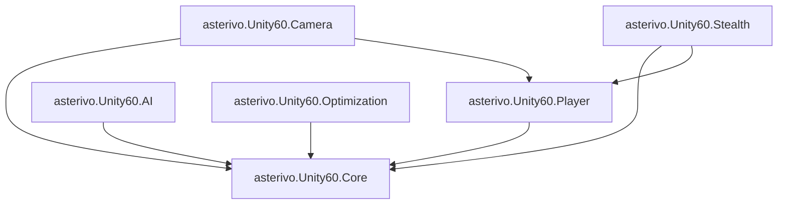

# Unity 6 URP3D プロジェクトディレクトリ構造ガイド

本プロジェクトは **機能駆動アーキテクチャ（Feature-Driven Architecture）** を採用し、Unity 6の最新機能を活用したイベント駆動型3Dゲーム開発基盤として構築されています。

---

## 📂 プロジェクト構造の設計思想

### 核心原則
1. **機能別カプセル化**: 各機能（Player、AI、Camera等）は独立したフォルダに完結
2. **層化アーキテクチャ**: Core → Features → Scenes の階層構造
3. **疎結合設計**: アセンブリ定義による依存関係の明確化
4. **データ駆動開発**: ScriptableObject による設定データの分離

### アーキテクチャ概要図

```
Assets/_Project/
├── Core/                    # 基盤システム（全機能共通）
├── Features/                # 機能別実装（独立性重視）
├── Scenes/                  # ゲームシーンファイル
├── Docs/                    # プロジェクトドキュメント
├── Logs/                    # 作業ログ・実験記録
└── _Sandbox/                # 安全な実験領域
```

---

## 🏗️ 実装されたディレクトリ構造

### Assets/_Project/ （メインプロジェクト）

#### Core/ - コアシステム層
**全ての機能から利用される基盤システム**

```
Core/
├── asterivo.Unity60.Core.asmdef        # コアアセンブリ定義
├── Audio/                              # オーディオシステム統合
│   ├── Commands/                       # 音響コマンド
│   ├── Controllers/                    # 音響制御
│   ├── Data/                          # オーディオデータ
│   ├── Events/                        # オーディオイベント
│   ├── StealthAudioCoordinator.cs     # ステルス音響統合
│   ├── SpatialAudioManager.cs         # 3D空間音響
│   └── DynamicAudioEnvironment.cs     # 動的環境音響
├── Commands/                           # コマンドパターン実装
│   ├── CommandPoolManager.cs          # プール統合管理
│   ├── CommandInvoker.cs              # コマンド実行・Undo管理
│   ├── ICommand.cs                    # コマンドインターフェース
│   ├── IResettableCommand.cs          # プール対応インターフェース
│   ├── DamageCommand.cs               # ダメージ処理
│   └── HealCommand.cs                 # 回復処理
├── Events/                             # イベント駆動システム
│   ├── GameEvent.cs                   # 基本イベント
│   ├── GenericGameEvent.cs            # 型付きイベント
│   ├── GameEventListener.cs           # イベントリスナー
│   ├── PlayerStateEvent.cs            # プレイヤー状態イベント
│   ├── CameraStateEvent.cs            # カメラ状態イベント
│   ├── Vector2GameEvent.cs            # Vector2イベント
│   └── StealthEvents/                 # ステルス専用イベント
├── Data/                              # データ構造定義
│   ├── GameData.cs                    # ゲーム基本データ
│   ├── Items/                         # アイテムデータ
│   ├── Skills/                        # スキルデータ
│   └── Stealth/                       # ステルスデータ
├── Patterns/                          # デザインパターン実装
│   ├── ObjectPool/                    # オブジェクトプール
│   ├── Registry/                      # レジストリパターン
│   └── StateHandlers/                 # 状態ハンドラー
├── Editor/                            # エディタ拡張
│   ├── EventFlowVisualizer.cs         # イベントフロー可視化
│   ├── CommandInvokerEditor.cs        # コマンド管理エディタ
│   ├── ProjectValidationWindow.cs     # プロジェクト検証
│   └── AudioSystemDebugger.cs         # オーディオデバッグ
├── Services/                          # 高レベルサービス
│   └── GameManager.cs                 # ゲーム統合管理
├── UI/                                # UI システム
│   ├── UIManager.cs                   # UI 統合管理
│   ├── MenuManager.cs                 # メニューシステム
│   └── HUDManager.cs                  # HUD管理
├── Input/                             # 入力システム
│   └── InputSystem_Actions.inputactions  # 入力アクション定義
├── RenderingSettings/                 # レンダリング設定
│   ├── PC_RPAsset.asset              # PC用レンダーパイプライン
│   ├── Mobile_RPAsset.asset          # モバイル用設定
│   └── DefaultVolumeProfile.asset    # ボリューム設定
├── ScriptableObjects/                 # ScriptableObjectアセット
│   ├── Events/                       # イベントアセット
│   └── Data/                         # データアセット
├── Debug/                             # デバッグ支援
│   ├── EventLogger.cs                # イベントログ機能
│   └── EventLoggerSettings.cs        # ログ設定
└── Shared/                            # 共有リソース
    ├── Player/                        # プレイヤー共通
    └── Events/                        # 共通イベント
```

#### Features/ - 機能実装層
**機能別に独立した実装**

```
Features/
├── Player/                             # プレイヤー機能
│   ├── Scripts/                        # プレイヤースクリプト
│   │   ├── asterivo.Unity60.Player.asmdef  # プレイヤーアセンブリ
│   │   ├── PlayerController.cs         # プレイヤー制御
│   │   ├── States/                     # プレイヤー状態
│   │   │   ├── PlayerStateMachine.cs   # 状態マシン
│   │   │   ├── IdleState.cs           # 待機状態
│   │   │   ├── WalkingState.cs        # 歩行状態
│   │   │   ├── RunningState.cs        # 走行状態
│   │   │   ├── CrouchingState.cs      # しゃがみ状態
│   │   │   ├── JumpingState.cs        # ジャンプ状態
│   │   │   ├── ProneState.cs          # 伏せ状態
│   │   │   └── CoverState.cs          # 遮蔽状態
│   │   ├── Commands/                   # プレイヤーコマンド
│   │   │   ├── MoveCommand.cs         # 移動コマンド
│   │   │   ├── JumpCommand.cs         # ジャンプコマンド
│   │   │   └── Definitions/           # コマンド定義
│   │   ├── Stealth/                   # ステルス機能
│   │   │   ├── CoverSystem.cs         # 遮蔽システム
│   │   │   └── StealthMovementController.cs  # ステルス移動
│   │   └── HealthComponent.cs         # 体力システム
│   ├── Audio/                         # プレイヤー音響
│   │   ├── PlayerAudioSystem.cs       # プレイヤー音響システム
│   │   └── SurfaceTypeDetector.cs     # 表面検知
│   ├── Art/                          # アート素材
│   ├── Prefabs/                      # プレハブ
│   └── ScriptableObjects/            # 設定データ
├── AI/                               # AI システム
│   ├── Scripts/                      # AI スクリプト
│   │   ├── asterivo.Unity60.AI.asmdef  # AI アセンブリ
│   │   └── States/                   # AI 状態管理
│   │       ├── AIStateMachine.cs     # AI 状態マシン
│   │       ├── AIIdleState.cs        # AI 待機状態
│   │       ├── AIPatrolState.cs      # AI 巡回状態
│   │       ├── AISuspiciousState.cs  # AI 疑念状態
│   │       ├── AIInvestigatingState.cs  # AI 調査状態
│   │       ├── AISearchingState.cs   # AI 捜索状態
│   │       ├── AIAlertState.cs       # AI 警戒状態
│   │       └── AICombatState.cs      # AI 戦闘状態
│   └── Audio/                        # AI 音響
│       └── NPCAuditorySensor.cs      # NPC 聴覚センサー
├── Camera/                           # カメラシステム
│   ├── Scripts/                      # カメラスクリプト
│   │   ├── asterivo.Unity60.Camera.asmdef  # カメラアセンブリ
│   │   ├── CinemachineIntegration.cs # Cinemachine統合
│   │   ├── CameraEvents.cs           # カメライベント
│   │   ├── States/                   # カメラ状態
│   │   │   ├── CameraStateMachine.cs # カメラ状態マシン
│   │   │   ├── FirstPersonCameraState.cs  # 1人称
│   │   │   ├── ThirdPersonCameraState.cs  # 3人称
│   │   │   ├── AimCameraState.cs     # 照準状態
│   │   │   └── CoverCameraState.cs   # 遮蔽状態
│   │   └── ViewMode/                 # ビューモード
│   │       ├── ViewModeController.cs # ビュー制御
│   │       └── ViewModeSettings.cs   # ビュー設定
│   ├── Art/                          # カメラ用素材
│   ├── Prefabs/                      # カメラプレハブ
│   └── ScriptableObjects/            # カメラ設定
└── Stealth/                          # ステルス専用機能
    ├── Scripts/                      # ステルススクリプト
    │   ├── asterivo.Unity60.Stealth.asmdef  # ステルスアセンブリ
    │   └── Detection/                # 検知システム
    │       ├── DetectionConfiguration.cs  # 検知設定
    │       └── VisibilityCalculator.cs   # 視認性計算
    └── ScriptableObjects/            # ステルス設定
        ├── Settings/                 # 設定データ
        │   ├── Player/              # プレイヤー設定
        │   ├── Camera/              # カメラ設定
        │   └── Stealth/             # ステルス設定
        └── Stealth/                 # ステルス専用データ
```

#### Scenes/ - シーン管理層
**ゲームシーンの構造化**

```
Scenes/
├── Levels/                           # ゲームレベル
│   ├── SampleScene.unity            # サンプルシーン
│   └── .gitkeep                     # 空フォルダ保持
├── Audio/                           # オーディオテスト
│   └── StealthAudioTest.unity       # ステルス音響テスト
└── System/                          # システムシーン
    └── .gitkeep                     # ブートストラップ等予定
```

#### Docs/ - ドキュメント管理
**プロジェクト関連ドキュメント**

```
Docs/
├── Architecture_and_DesignPatterns.md     # アーキテクチャ解説
├── ObjectPool_ComprehensiveGuide.md       # ObjectPool包括ガイド
├── ProjectDirectoryStructure.md           # 本ディレクトリガイド
├── StealthAudioSystem.md                  # ステルス音響仕様
├── SDD_Markdown作成実践ガイド.md          # SDD実践ガイド
├── StatePattern_Migration_Guide.md       # ステートパターン移行
├── Unity6_詳細セットアップ手順書.md       # セットアップ手順
├── EventSystem_EditorTools_Guide.md      # エディタツール解説
├── AudioSystem_Integration_Design.md     # 音響統合設計
└── GPU_Resident_Drawer_Implementation_Guide.md  # GPU最適化
```

#### その他のディレクトリ

```
Logs/                                 # 作業ログ・実験記録
├── Session_Work_Summary.md          # セッション作業まとめ
└── Claude Codeによるスペック駆動開発の実践ガイド_v2.md

_Sandbox/                             # 安全な実験領域
└── .gitkeep                         # 開発者個人の実験用
```

---

## 🔧 アセンブリ定義 (Assembly Definitions)

プロジェクトは以下のアセンブリに分割され、コンパイル時間を最適化し依存関係を管理：

```
asterivo.Unity60.Core        # 基盤システム
├── asterivo.Unity60.Player  # プレイヤー機能
├── asterivo.Unity60.Camera  # カメラシステム  
├── asterivo.Unity60.AI      # AIシステム
├── asterivo.Unity60.Stealth # ステルス機能
└── asterivo.Unity60.Optimization  # 最適化機能
```

### 依存関係図


---

## 📦 ScriptableObject データ管理

### データアセット配置戦略

```
Core/ScriptableObjects/
├── Events/                           # イベントアセット
│   └── Core/                        # コアイベント
└── Data/                            # データアセット

Features/[Feature]/ScriptableObjects/ # 機能別データ
├── Settings/                        # 設定データ
└── [Feature]/                       # 機能専用データ
```

### 命名規則

| アセット種類 | 命名パターン | 例 |
|------------|-------------|-----|
| **GameEvent** | `On[Action]` | `OnPlayerJump` |
| **型付きEvent** | `On[Data]Changed` | `OnHealthChanged` |
| **状態Event** | `On[State]Changed` | `OnPlayerStateChanged` |
| **設定Data** | `[Feature]Settings` | `PlayerSettings` |

---

## 🚀 機能追加ガイドライン

### 新機能追加の手順

1. **Features/[NewFeature]/** フォルダを作成
2. **アセンブリ定義** (`asterivo.Unity60.[NewFeature].asmdef`) を追加
3. **依存関係** を Core と必要な Features に設定
4. **フォルダ構造** を確立：
   ```
   Features/[NewFeature]/
   ├── Scripts/
   ├── Prefabs/
   ├── ScriptableObjects/
   └── Art/
   ```
5. **イベント駆動** で他機能と連携
6. **ドキュメント** を Docs/ に追加

### ベストプラクティス

#### ✅ 推奨事項
- **機能の独立性**: 他機能への直接参照を避ける
- **イベント駆動通信**: GameEvent を介した疎結合
- **ScriptableObject活用**: 設定データの外部化
- **Assembly Definition**: 適切なモジュール分割

#### ❌ 避けるべき事項
- **循環参照**: アセンブリ間での双方向依存
- **ハードコーディング**: 直接的な値の埋め込み
- **モノリス化**: 単一の巨大なスクリプト
- **命名の不統一**: 規則に従わない命名

---

## 🔄 プロジェクト進化の方針

### Phase 1 (現在): 基盤完成
- ✅ イベント駆動アーキテクチャ
- ✅ コマンドパターン + ObjectPool
- ✅ ステートマシンシステム
- ✅ ステルス音響システム

### Phase 2: 機能拡張
- 🔄 追加ゲーム機能 (Inventory, Dialogue等)
- 🔄 AI システム強化
- 🔄 エディタツール充実

### Phase 3: 最適化・品質向上
- 🔄 パフォーマンス最適化
- 🔄 プラットフォーム対応
- 🔄 テスト自動化

---

## 🎯 特徴と利点

### アーキテクチャの強み

1. **高い保守性**
   - 機能別の明確な分離
   - イベント駆動による疎結合

2. **優れた拡張性**
   - 新機能の独立した追加
   - 既存コードへの影響最小化

3. **チーム開発対応**
   - 機能別の並行開発
   - コンフリクトの最小化

4. **パフォーマンス**
   - Assembly Definition による高速コンパイル
   - ObjectPool による実行時最適化

### Unity 6 対応機能

- **最新Input System**: 完全統合とイベント駆動制御
- **Cinemachine 3.1**: 最新カメラシステム統合
- **URP最適化**: Universal Render Pipeline完全対応
- **Assembly Definitions**: モジュラー構造による開発効率化

---

## 📚 関連ドキュメント

| ドキュメント | 目的 |
|------------|------|
| `Architecture_and_DesignPatterns.md` | アーキテクチャ詳細解説 |
| `ObjectPool_ComprehensiveGuide.md` | ObjectPool包括ガイド |
| `StealthAudioSystem.md` | ステルス音響システム仕様 |
| `Unity6_詳細セットアップ手順書.md` | プロジェクトセットアップ |
| `SDD_Markdown作成実践ガイド.md` | スペック駆動開発実践 |

---

## 🔧 開発環境要件

### 必須環境
- **Unity Version**: 6000.0.42f1 (LTS)
- **Render Pipeline**: Universal Render Pipeline (URP)
- **Scripting Backend**: Mono (.NET Standard 2.1)

### 必須パッケージ
- `com.unity.inputsystem` (1.7.0+)
- `com.unity.cinemachine` (3.1.0+)
- `com.unity.render-pipelines.universal` (17.0.4+)
- `com.unity.textmeshpro` (3.2.0+)

### 推奨サードパーティ
- **UniTask**: 非同期プログラミング
- **DOTween Pro**: 高度なアニメーション
- **Odin Inspector**: エディタ拡張

---

このディレクトリ構造は、Unity 6の最新機能を活用し、大規模なチーム開発に対応した拡張性の高い3Dゲーム開発基盤を提供します。機能駆動アーキテクチャとイベント駆動設計により、保守性と開発効率の両立を実現しています。