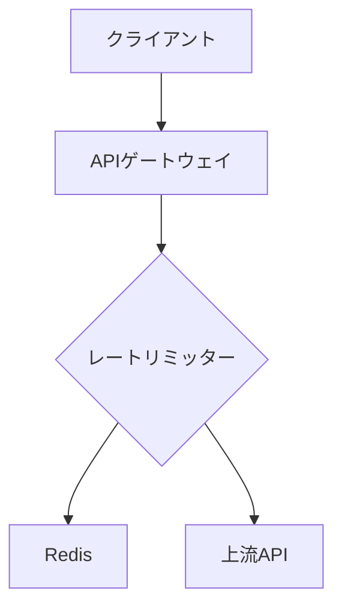

# SDD Markdownドキュメント作成実践ガイド

## 概要

スペック駆動開発（SDD）における4つの主要Markdownファイルの作成方法と構造化手法について解説します。Claude Code等のAIツールと連携した効率的なドキュメント作成プロセスを中心に説明します。

---

## SDDの5つのフェーズと成果物

### フェーズ1: 構想 → **spec.md**
- **目的**: 「何を」「なぜ」作るのかの高レベルビジョン
- **作成者**: 人間（プロダクトマネージャー/エンジニア）
- **配置場所**: `プロジェクトルート/spec.md`

### フェーズ2: 形式化 → **requirements.md** 
- **目的**: 構造化された要件定義書
- **作成者**: AI（人間がレビュー）
- **配置場所**: `プロジェクトルート/requirements.md`

### フェーズ3: 設計 → **design.md**
- **目的**: 技術的な実装戦略
- **作成者**: AI（人間がレビュー）
- **配置場所**: `プロジェクトルート/design.md`

### フェーズ4: 分解 → **tasks.md**
- **目的**: 実行可能なタスクチェックリスト
- **作成者**: AI（人間がレビュー）
- **配置場所**: `Assets/_Project/Docs/Work/tasks.md`

### フェーズ5: 実装・検証
- **目的**: AIによるコード生成と人間による検証

---

## 各Markdownファイルの詳細構造

### 1. spec.md（基礎となる青写真）

#### 必須コンポーネント
```markdown
# プロジェクト名

## 1. 問題提起 (Problem Statement)
なぜこのシステムを構築するのか

## 2. 成功指標 (Success Metrics)
プロジェクトの成功をどのように測定するか

## 3. ユーザーストーリー/ジャーニー (User Stories/Journeys)
誰が、どのようにシステムを利用するのか

## 4. スコープ (Scope)
### 対象内 (In-Scope)
### 対象外 (Out-of-Scope)

## 5. 非目標 (Non-Goals)
意図的に「行わない」ことを明記

## 6. 制約 (Constraints)
技術的、ビジネス的、リソース的な制約
```

#### サンプル構造（APIレート制限サービス例）
```markdown
# spec.md: APIレート制限サービス

## 1. 問題提起
マルチテナントSaaSプラットフォームで一部のテナントが過剰な
APIリソースを消費し、パフォーマンス低下が発生している。

## 2. 成功指標
- デプロイ後1四半期以内にp99 APIレイテンシを20%削減
- APIリソース枯渇による停止をゼロに
- エンタープライズ顧客満足度90%達成

## 3. ユーザーストーリー
**US-01 (管理者)**: 異なるサブスクリプション階層ごとに
異なるレート制限を設定したい

**US-02 (開発者)**: レート制限超過時に明確なフィードバック
（HTTPステータス429とヘッダー）を受け取りたい
```

---

### 2. requirements.md（形式化された契約書）

#### 必須コンポーネント
```markdown
# requirements.md: プロジェクト名

## 1. システムスコープ (System Scope)
システムが責任を持つ範囲の明確な定義

## 2. 機能要件 (Functional Requirements)
### FR-01: 要件名
- **説明**: 要件の説明
- **受け入れ基準**: 
  - AC-1.1: 具体的な基準 (MUST/SHOULD)
  - AC-1.2: 具体的な基準 (MUST/SHOULD)

## 3. 非機能要件 (Non-Functional Requirements)
### NFR-01: パフォーマンス
- **説明**: パフォーマンス要件の説明
- **受け入れ基準**:
  - AC-X.X: 具体的な基準 (MUST/SHOULD)
```

#### 受け入れ基準の書き方
- **MUST**: 絶対に満たすべき要件
- **SHOULD**: 可能であれば満たすべき要件
- **MAY**: オプショナルな要件

---

### 3. design.md（技術的な青写真）

#### 必須コンポーネント
```markdown
# design.md: プロジェクト名

## 1. アーキテクチャ概要 (Architecture Overview)
システム全体の構造を示す図（Mermaid.js推奨）

## 2. データモデル (Data Models)
主要なデータ構造の定義（JSON Schema推奨）

## 3. APIコントラクト (API Contracts)
外部とのインターフェース定義（OpenAPIスニペット推奨）

## 4. 技術スタックの正当化 (Technology Stack Justification)
なぜその技術を選んだのかの理由

## 5. シーケンス図 (Sequence Diagrams)
主要なプロセスの流れを視覚化
```

#### Mermaid図の活用例
```markdown
## システムダイアグラム


#### JSON Schemaの活用例
```json
{
  "$schema": "http://json-schema.org/draft-07/schema#",
  "title": "テナント設定",
  "type": "object",
  "properties": {
    "tenantId": { "type": "string", "format": "uuid" },
    "tier": { "enum": ["Free", "Pro", "Enterprise"] },
    "limit": { "type": "integer", "minimum": 0 }
  },
  "required": ["tenantId", "tier", "limit"]
}
```

---

### 4. tasks.md（実装ロードマップ）

#### 必須コンポーネント
```markdown
# tasks.md: 実装ロードマップ

## フェーズ1: プロジェクトセットアップ
- [ ] タスク1: 具体的で小さな作業単位
- [ ] タスク2: 独立して実行可能なタスク
- [ ] タスク3: 検証可能な成果物があるタスク

## フェーズ2: コア機能実装
- [ ] タスク4: ...
- [ ] タスク5: ...

## フェーズ3: 統合とテスト
- [ ] タスク6: ...
- [ ] タスク7: ...
```

#### タスク作成の原則
- **原子性**: 各タスクは最小単位の作業
- **独立性**: 他のタスクに依存しない
- **検証可能性**: 完了を明確に判断できる

---

## Claude Codeとの連携方法

### 1. spec.md → requirements.md生成
```
/spec-create "この spec.md から requirements.md を生成してください。
ユーザーストーリーを公式な機能要件リストに展開し、
制約セクションに基づいて非機能要件を特定・リストアップしてください。"
```

### 2. requirements.md → design.md生成
```
/design-create "requirements.md に基づいて design.md を作成してください。
[具体的な技術スタック]を使用した技術アーキテクチャを提案してください。
データモデルを定義し、APIコントラクトを作成してください。"
```

### 3. design.md → tasks.md生成
```
/tasks-create "design.md を読み込み、実装を tasks.md 内の
実行可能なタスクのチェックリストに分解してください。
各タスクが小さく、独立して実装およびテストできるようにしてください。"
```

### 4. tasks.md → 実装実行
```
/spec-execute "他の仕様ファイルからプロジェクトのコンテキストを読み込んでください。
次に、tasks.md の Task X を実行してください。
[具体的なファイル名]を作成し、design.md で定義された通りに実装してください。"
```

---

## ベストプラクティス

### 1. 段階的な精緻化
- 各フェーズで曖昧さを段階的に排除
- AIのコンテキストを豊かにする多段階プロンプト

### 2. 単一の信頼できる情報源
- 変更時は必ず上流ドキュメント（spec.md, requirements.md）を先に更新
- 仕様書を常に最新状態に維持

### 3. 構造化された記述
- 明確な見出し構造の使用
- 受け入れ基準の具体的な記述
- 図表（Mermaid, JSON Schema）の積極的活用

### 4. 人間とAIの役割分担
- 人間: 高レベルな意図定義と品質保証
- AI: 構造化と実装の自動化

---

## 時間配分の変化

### 従来の開発
- コーディング: 80%
- 計画: 10%
- テスト: 10%

### SDD + AI開発
- 計画・仕様策定: 50%
- AI支援コーディング: 20%
- 検証・テスト: 30%

---

## ToDo.md（タスク管理とAI協働）

### ToDo.mdの役割
SDD実践において、人間とAIが協働してタスクを効率的に進めるためのタスク管理ドキュメントです。AIが1つのタスクを確実に完了するための構造化された指示書として機能します。

- **配置場所**: `Assets/_Project/Docs/Work/todo.md`

### 必須コンポーネント
```markdown
# ToDo.md: プロジェクト名

## 現在のフェーズ
**フェーズX: [フェーズ名]** - [進捗状況]

## 優先タスク（AI実行対象）
### 🔥 高優先度（即座に実行）
- [ ] **[タスクID]**: [具体的なタスク内容]
  - **目的**: [なぜこのタスクが必要か]
  - **受け入れ基準**: [完了の明確な判定基準]
  - **関連ファイル**: [参照すべきファイルのパス]
  - **出力**: [期待される成果物]
  - **依存関係**: [前提となるタスク]

## 待機タスク（人間レビュー後）
### 🟡 中優先度（レビュー待ち）
- [ ] [タスク内容]

### 🔵 低優先度（計画中）
- [ ] [タスク内容]

## 完了タスク
### ✅ 完了済み
- [x] [完了したタスクの記録]
```

### AI単一タスク実行のベストプラクティス

#### 1. タスクの原子性確保
```markdown
❌ 悪い例:
- [ ] ユーザー認証機能を実装する

✅ 良い例:
- [ ] **AUTH-001**: UserAuthService.csクラスの基本構造を作成する
  - **目的**: 認証ロジックの基盤クラスを準備
  - **受け入れ基準**: IAuthServiceインターフェースを実装し、Login/Logoutメソッドのシグネチャが定義されている
  - **関連ファイル**: design.md (セクション3.2), IAuthService.cs
  - **出力**: Assets/_Project/Features/Auth/UserAuthService.cs
  - **依存関係**: なし
```

#### 2. コンテキスト情報の明示
```markdown
- [ ] **UI-003**: ログイン画面のUIコンポーネントを作成する
  - **目的**: ユーザーが認証情報を入力できるUI提供
  - **受け入れ基準**: 
    - Email/Passwordフィールドが配置されている
    - Loginボタンがクリック可能
    - デザインガイド（design.md 4.1）に準拠
  - **関連ファイル**: 
    - design.md (UI仕様 セクション4.1)
    - Assets/_Project/UI/Prefabs/LoginPanel.prefab
  - **出力**: 完全に設定されたLoginPanel prefab
  - **依存関係**: AUTH-001 (UserAuthServiceクラス)
```

#### 3. 段階的検証ポイント
```markdown
## 検証チェックポイント
各タスク完了時にAIが確認すべき項目：

### ✅ コード品質チェック
- [ ] コンパイルエラーがない
- [ ] 命名規則が統一されている
- [ ] 適切なコメント/XMLドキュメントがある
- [ ] design.mdの仕様に準拠している

### ✅ 統合チェック
- [ ] 既存コードとの互換性がある
- [ ] 依存関係が正しく解決されている
- [ ] テストが通る（該当する場合）

### ✅ ドキュメント同期チェック
- [ ] 変更内容がdesign.mdに反映されている
- [ ] tasks.mdの該当項目が更新されている
```

### AIタスク実行フロー
```markdown
## AIタスク実行の標準手順

1. **📋 タスク分析**
   - ToDo.mdから最高優先度タスクを特定
   - 関連ファイルを読み込んでコンテキストを理解
   - 受け入れ基準と依存関係を確認

2. **🔍 事前調査**
   - 既存コードベースの関連部分を分析
   - design.mdやrequirements.mdで仕様を確認
   - 類似実装パターンを検索

3. **⚡ 実装実行**
   - 小さな変更から段階的に実装
   - 各ステップで動作確認
   - エラーが発生した場合は即座に修正

4. **✅ 品質検証**
   - 受け入れ基準との照合
   - コンパイル・動作テスト
   - コード品質チェック

5. **📝 完了報告**
   - ToDo.mdのタスクを完了済みに更新
   - 次の優先タスクを特定
   - 必要に応じて新しいタスクを追加
```

### Claude Codeとの連携例
```bash
# 1. ToDo.mdから次のタスクを特定して実行
/todo-execute "ToDo.mdの最高優先度タスクを読み込み、
関連する仕様ファイル（spec.md, requirements.md, design.md）の
コンテキストと合わせて、指定されたタスクを完了してください。"

# 2. タスク完了後の更新
/todo-update "完了したタスクをToDo.mdで完了済みに更新し、
次の優先タスクがあれば特定してください。"
```

---

## ファイル配置の標準構造

SDDにおける各Markdownファイルは、役割と重要度に応じて適切な場所に配置することが重要です。以下の配置規則に従うことで、プロジェクトの構造が明確になり、AIとの協働がスムーズに行えます。

### 推奨ディレクトリ構造
```
プロジェクトルート/
├── spec.md                    # 初期構想・要件定義（人間作成）
├── requirements.md            # 形式化された要件（AI生成）
├── design.md                  # 技術設計書（AI生成）
├── Assets/
│   └── _Project/
│       └── Docs/
│           └── Work/          # 作業用ドキュメント
│               ├── tasks.md   # 実装タスク一覧
│               ├── todo.md    # 進行中タスク管理
│               └── WorkLogs/  # 作業ログ保管庫
│                   ├── 2024-12-20_14-30/  # 日時フォルダ
│                   │   ├── spec.md
│                   │   ├── requirements.md
│                   │   ├── design.md
│                   │   ├── tasks.md
│                   │   └── todo.md
│                   └── 2024-12-21_09-15/
│                       └── [各種スナップショット]
└── README.md                  # プロジェクト概要
```

### 配置理由と運用方針

#### プロジェクトルート配置
- **spec.md, requirements.md, design.md**
- **理由**: プロジェクト全体の基盤となる重要文書のため、最上位レベルで管理
- **運用**: 変更時は必ずバージョン管理（Git）にコミット
- **アクセス**: AIが仕様参照時に常に最新版を読み込み可能

#### Assets/_Project/Docs/Work/配置
- **tasks.md, todo.md**
- **理由**: 日々の作業進捗を管理する作業文書のため、プロジェクト内部で管理
- **運用**: 頻繁に更新されるため、適宜スナップショットを保存
- **アクセス**: AIが実装作業時に直接参照・更新

#### Assets/_Project/Docs/Work/WorkLogs/配置
- **作業ログスナップショット**
- **理由**: 開発プロセスの各段階での仕様書状態を履歴として保管
- **運用**: 重要な節目や問題発生時に日時フォルダでスナップショット作成
- **アクセス**: トラブルシューティングや変更履歴追跡時に参照

### Claude Codeでの配置指定例
```bash
# プロジェクトルートのファイルを参照
/read "spec.md"
/read "design.md"

# 作業ディレクトリのファイルを参照・更新
/read "Assets/_Project/Docs/Work/tasks.md"
/edit "Assets/_Project/Docs/Work/todo.md"

# 作業ログスナップショットの作成
/worklog-create "現在の全MarkdownファイルのスナップショットをWorkLogsに保存"
```

---

## 作業ログ管理システム（WorkLogs）

### 概要
SDD実践において、開発プロセスの各段階での仕様書の状態を時系列で保管し、トラブルシューティングや変更履歴の追跡を可能にするシステムです。

### WorkLogsの目的
- **履歴保管**: 重要な開発節目での全Markdownファイルの状態を記録
- **問題追跡**: 仕様変更による問題が発生した際の原因特定
- **チーム協働**: 複数開発者が同じプロジェクトで作業する際の状態共有
- **バージョン比較**: 異なる時点での仕様書内容の比較分析

### ログ作成タイミング
以下のタイミングでWorkLogスナップショットを作成することを推奨します：

#### 🔥 必須作成タイミング
- **フェーズ完了時**: 各SDD フェーズ（構想→形式化→設計→分解）完了後
- **重要な仕様変更時**: requirements.mdやdesign.mdの大幅な変更後
- **実装開始前**: コード生成作業に入る直前
- **問題発生時**: バグやエラーが発生し、仕様に遡って調査が必要な時

#### 🟡 推奨作成タイミング
- **日次作業終了時**: 1日の開発作業完了後
- **マイルストーン達成時**: プロジェクトの重要な目標達成後
- **チームレビュー前**: 他の開発者によるレビューを受ける前

### フォルダ命名規則
```
YYYY-MM-DD_HH-MM/
```

#### 命名例
- `2024-12-20_14-30/` - 2024年12月20日 14:30のスナップショット
- `2024-12-20_14-30_phase2-complete/` - フェーズ2完了時のスナップショット
- `2024-12-21_09-15_critical-bug/` - 重要なバグ発生時のスナップショット

### スナップショット内容
各日時フォルダには以下のファイルが含まれます：

```
2024-12-20_14-30/
├── spec.md              # その時点のプロジェクト仕様
├── requirements.md      # その時点の要件定義
├── design.md           # その時点の技術設計
├── tasks.md            # その時点のタスクリスト
├── todo.md             # その時点の作業状況
└── worklog_meta.md     # このスナップショットの説明
```

### worklog_meta.mdの構造
```markdown
# WorkLog Meta Information

## スナップショット情報
- **作成日時**: 2024-12-20 14:30:00
- **作成者**: [開発者名]
- **フェーズ**: Phase 2 - 形式化完了
- **説明**: requirements.md完成、design.mdフェーズに移行準備

## 主な変更点
- requirements.mdにFR-05からFR-08まで4つの機能要件追加
- NFR-03のパフォーマンス要件を具体化
- スコープからUI関連要件を除外

## 次のアクション
- [ ] design.mdでアーキテクチャ設計開始
- [ ] データモデル定義
- [ ] API仕様書作成

## 注意事項
- 認証機能は外部サービス依存に決定
- パフォーマンス要件は暫定値、負荷テスト後に調整予定
```

### Claude Codeとの連携

#### 1. 自動スナップショット作成
```bash
# 現在の状態で作業ログを作成
/worklog-snapshot "フェーズ2完了 - requirements.md確定"

# 特定の説明付きでスナップショット作成
/worklog-snapshot "critical-bug調査用" "認証エラーの原因調査のため、現在の仕様書状態を保存"
```

#### 2. 過去ログとの比較
```bash
# 特定の日時のスナップショットと現在を比較
/worklog-compare "2024-12-20_14-30" "design.md"

# 最新2つのスナップショットを比較
/worklog-diff-latest "requirements.md"
```

#### 3. ログからの復旧
```bash
# 特定のスナップショットから仕様書を復旧
/worklog-restore "2024-12-20_14-30" "design.md"

# 複数ファイルを一括復旧
/worklog-restore-all "2024-12-19_16-00"
```

### 運用ベストプラクティス

#### 1. 命名の一貫性
- 日時形式を統一（YYYY-MM-DD_HH-MM）
- 重要なイベント時は説明を付加
- チーム全体で命名規則を共有

#### 2. 定期的なクリーンアップ
- 週次で不要な中間スナップショットを整理
- 重要なマイルストーンのログは長期保管
- ディスク容量に応じて古いログを圧縮

#### 3. メタデータの充実
- worklog_meta.mdに十分な説明を記載
- 変更理由と影響範囲を明記
- 次のアクション項目を具体的に記述

---

## まとめ

SDD Markdownドキュメントは、人間の意図を段階的に機械実行可能な命令に変換するパイプラインとして機能します。各ドキュメントの構造を理解し、Claude Code等のAIツールと効果的に連携することで、高品質で保守性の高いソフトウェア開発が可能になります。

**ToDo.md**の追加により、AIが単一のタスクを確実に完了し、プロジェクト全体の進捗を管理できる仕組みが整います。これにより、人間は高レベルな戦略的判断に集中し、AIは具体的な実装作業を効率的に実行する理想的な協働体制が実現されます。

重要なのは、「コードファースト」から「インテントファースト」への思考の転換と、仕様書を実行可能な成果物として維持することです。
