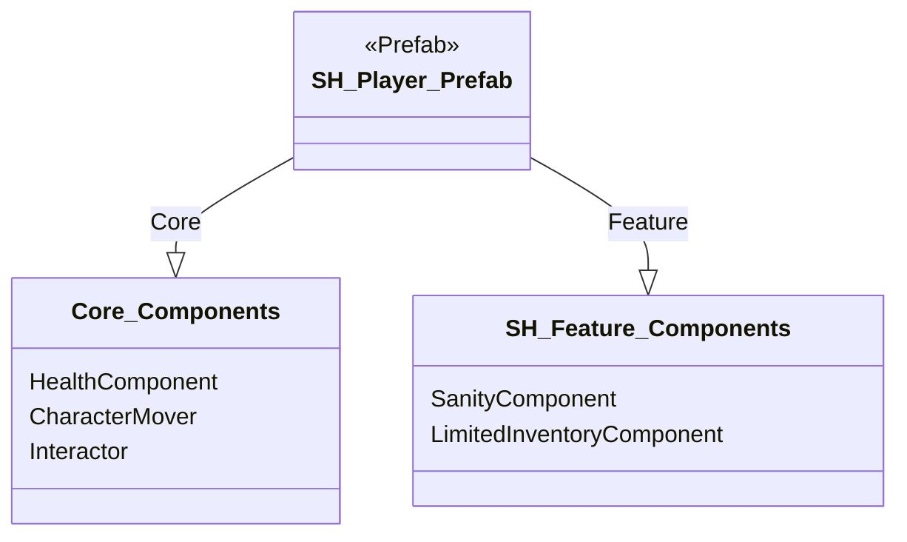

# DESIGN.md - サバイバルホラーテンプレート実装設計書

## 文書管理情報

- **ドキュメント種別**: テンプレート実装設計書（SDDフェーズ3: 設計）
- **生成元**: `SurvivalHorror_Advanced_Design_Doc.md`, `REQUIREMENTS.md` (FR-8.1.2)
- **対象読者**: 実装担当開発者、レベルデザイナー、QAエンジニア
- **整合性状態**: `Core Architecture`および`SurvivalHorror Feature Design`と完全整合
- **設計目標**: プロジェクトの核心価値である「Clone & Create」「Learn & Grow」をサバイバルホラーというジャンルで具体化する、即時体験可能かつ拡張容易なテンプレートを実装するための技術仕様を定義する。

## 1.0 テンプレートの全体構成

サバイバルホラーテンプレートは、プレイアブルなサンプルシーン、設定済みのPrefab群、そしてジャンル特有の`ScriptableObject`コンフィギュレーションから構成される。

### 1.1 ディレクトリ構造

テンプレート固有のアセットは、`Features`層の`Templates`ディレクトリ以下に集約する。

- `Assets/_Project/Features/Templates/SurvivalHorror/`
  - `Scenes/`: テンプレート用のシーンファイル
  - `Prefabs/`: プレイヤー、AI、アイテムなどのPrefab
  - `ScriptableObjects/`: アイテムDB、雰囲気設定などのSOアセット
  - `Materials/`: テンプレート固有のマテリアル
  - `Audio/`: テンプレート固有のオーディオクリップ

### 1.2 シーン構成

- **`SurvivalHorror_MenuScene.unity`**:
  - 役割: ゲーム起動時のメインメニュー。
  - 機能: 「ゲーム開始」ボタンのみを持つシンプルなUI。「ゲーム開始」時に`TemplateManager`を介して`SurvivalHorror_SampleScene`をロードする。
- **`SurvivalHorror_SampleScene.unity`**:
  - 役割: テンプレートのコア体験を提供するプレイアブルなメインシーン。
  - 構成: `SystemInitializer`、`TemplateManager`、およびレベルジオメトリを配置。プレイヤーとAIはランタイムで`TemplateManager`によってインスタンス化される。
- **`SurvivalHorror_UIScene.unity`**:
  - 役割: HUD（体力、正気度、所持アイテム）やインベントリ画面のUI要素を管理。
  - 構成: `SampleScene`に加算ロード（Additive Loading）される。

### 1.3 主要Prefab構成

#### `SH_Player_Prefab.prefab`
プレイヤーキャラクターのPrefab。`Core`層と`Feature`層のコンポーネントを組み合わせ、サバイバルホラー体験の主体を構築する。

- **Core Components**:
  - `HealthComponent`: 体力管理。負傷時に`BleedingEvent`を発行するフックを持つ。
  - `CharacterMover`: 移動制御。意図的に走行速度を遅めに設定し、無力感を演出。
  - `Interactor`: アイテムやギミックとのインタラクションを担当。
- **Survival Horror Feature Components**:
  - `SanityComponent`: 正気度管理。
  - `LimitedInventoryComponent`: スロット数制限付きのインベントリ。

#### `SH_StalkerAI_Prefab.prefab`
永続的な脅威となるストーカーAIのPrefab。`Core`層のAI基盤をサバイバルホラー向けに特化させる。

- **Core AI Components**:
  - `NPCVisualSensor`, `NPCAuditorySensor`, `NPCOlfactorySensor`: `Core`層のマルチモーダルセンサー。聴覚・嗅覚の感度を高めに設定。
  - `StalkerHSM.cs`: `SurvivalHorror_Advanced_Design_Doc.md`で設計した専用の階層化ステートマシン。
- **Survival Horror Feature Components**:
  - `PersistenceComponent`: AIの状態（位置、HP等）を`PersistenceService`に永続化する。

## 2.0 サンプルシーン (`SurvivalHorror_SampleScene`) 詳細設計

### 2.1 レベルデザインとゲームフロー

- **舞台**: 閉鎖された古い診療所。複数の部屋、暗い廊下、隠れるためのロッカー、鍵のかかった扉で構成される。
- **コア・ループ体験**:
  1.  **探索**: プレイヤーは1階の診察室で目覚める。目標は診療所からの脱出。出口の扉は施錠されている。
  2.  **心理的圧迫**: 地下室へ続く階段を降りると、`SanityTriggerVolume`が作動。視界が歪み、不気味な環境音が再生され始める（`AtmosphereManager`のデモンストレーション）。
  3.  **脅威との遭遇**: 地下室で「地下室の鍵」を入手すると、ストーカーAI (`SH_StalkerAI_Prefab`) が2階から出現し、巡回を開始する。
  4.  **リソース管理**: プレイヤーは限られたインベントリの中で、道中で見つけた「鎮静剤」（正気度回復）や「インクリボン」（セーブ用アイテム）を管理し、いつ使うべきか戦略的判断を迫られる。
  5.  **回避とステルス**: プレイヤーはストーカーAIの足音やうめき声を頼りにその位置を推測し、ロッカーに隠れたり、物陰を移動したりして追跡を回避する。
  6.  **目標達成**: 2階の院長室で「出口の鍵」を見つけ出し、1階の出口から脱出するとクリア。

### 2.2 主要なゲームオブジェクト配置

- **`SystemInitializer`**: シーン開始時に`AtmosphereManager`, `ResourceManager`, `PersistenceService`等のサバイバルホラー専用サービスを`ServiceLocator`に登録する。
- **`TemplateManager`**: `GenreTemplateConfig`として`SH_TemplateConfig.asset`をアタッチ。シーン開始時に`SH_Player_Prefab`と`SH_StalkerAI_Prefab`を指定された位置にインスタンス化する。
- **`SanityTriggerVolume`**: 地下室全体を覆う`BoxCollider`。内部にいるプレイヤーの`SanityComponent`に継続的に影響を与える。
- **インタラクタブルオブジェクト**:
  - **`ItemPickup`**: 「鎮静剤」「インクリボン」「鍵」などのアイテム。`Core.Interaction.IInteractable`を実装。
  - **`HidingSpot`**: ロッカー。プレイヤーがインタラクトすると、`CharacterMover`を無効化し、レンダラーを非表示にする。
  - **`SavePoint`**: タイプライター。インタラクトすると`RequestSaveGameEvent`を発行する。

## 3.0 ScriptableObject コンフィギュレーション

テンプレートの挙動は、以下の`ScriptableObject`アセットによって定義・調整される。

- **`SH_TemplateConfig.asset` (`GenreTemplateConfig`)**:
  - `playerPrefab`: `SH_Player_Prefab`への参照。
  - `requiredServices`: `AtmosphereManager`, `ResourceManager`等のサービスPrefabのリスト。
  - `initialScene`: `SurvivalHorror_SampleScene`への参照。

- **`SH_AtmosphereConfig.asset` (`VolumeProfile`)**:
  - `Sanity: 1.0` (正常時): Vignette弱、Film Grainなし。
  - `Sanity: 0.5` (中期): Vignette中、Film Grain弱、微かなChromatic Aberration。
  - `Sanity: 0.1` (危険水域): Vignette強、Film Grain中、Chromatic Aberration強。
  - `AtmosphereManager`は、現在の正気度に応じてこれらの状態間を滑らかに補間する。

- **`SH_ItemDB.asset` (`ItemDatabase`)**:
  - テンプレート内に登場する全アイテム（鍵、鎮静剤、インクリボン）の`ItemData`をリストとして保持する。

- **`SH_ResourceManagerConfig.asset` (`ResourceManagerData`)**:
  - `maxInkRibbons`: 3
  - `maxSanityPills`: 5
  - `ResourceManager`はこのSOをロードし、ゲーム内のリソース総量を制限する。

## 4.0 実装と検証のステップ

1.  **シーンとPrefabの作成 (Day 1-2)**: `1.0`で定義されたディレクトリ構造に従い、空のシーンと基本的なコンポーネントをアタッチしたPrefabを作成する。
2.  **サービス初期化の実装 (Day 2)**: `SystemInitializer`がサバイバルホラー専用サービスを正しく`ServiceLocator`に登録するロジックを実装する。
3.  **コア・ループの実装 (Day 3-5)**: `2.1`で設計したゲームフローを実装する。まずはAIなしで、アイテム取得、鍵の使用、シーン遷移までを実装。
4.  **Sanity & Atmosphere連携 (Day 6-7)**: `SanityComponent`と`AtmosphereManager`を連携させ、`SanityTriggerVolume`に入るとポストプロセスが変化する部分を実装・検証する。
5.  **ストーカーAIの統合 (Day 8-10)**: `SH_StalkerAI_Prefab`をシーンに導入し、プレイヤーを検知して追跡する基本動作を実装する。この段階では永続化は不要。
6.  **リソース管理とセーブ機能 (Day 11-12)**: `ResourceManager`によるアイテム数制限と、「インクリボン」を使ったセーブ機能を実装する。
7.  **永続化とテスト (Day 13-14)**: `PersistenceService`を実装し、ストーカーAIの位置とインベントリの状態がシーンをまたいで（このテンプレートではセーブ＆ロードをまたいで）維持されることをテストする。
8.  **最終調整 (Day 15)**: 全ての要素を統合し、ゲームバランス（AIの強さ、アイテムの配置数）を調整する。

この設計書に基づき実装することで、単なる機能の集合体ではなく、**一貫した恐怖体験を提供する、再利用可能で拡張性の高いサバイバルホラーテンプレート**が完成する。
