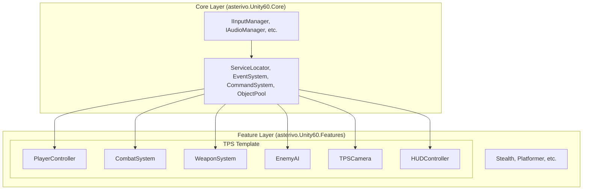
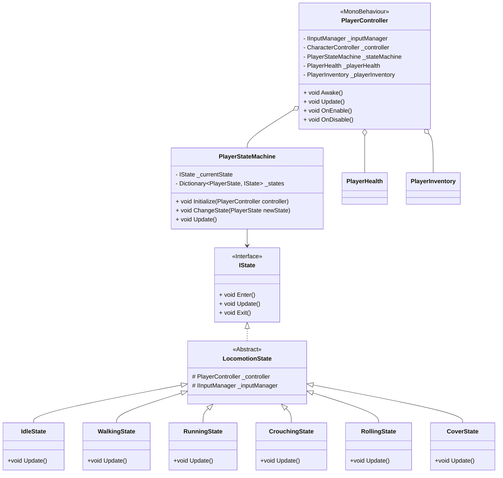
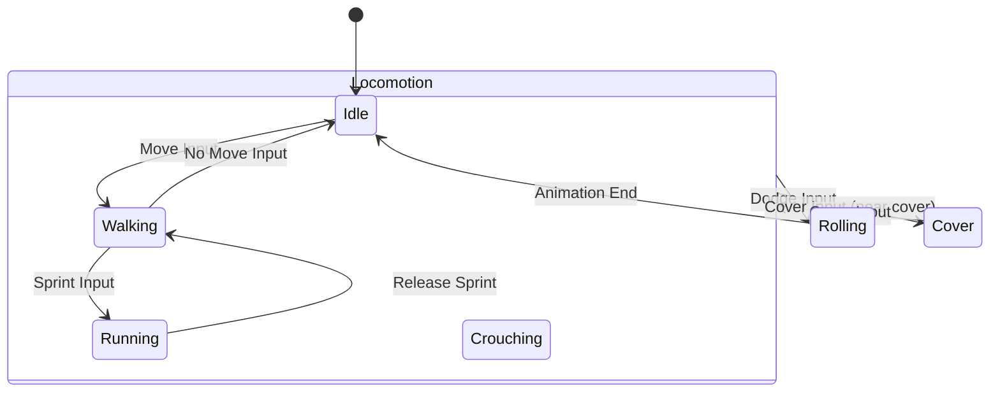
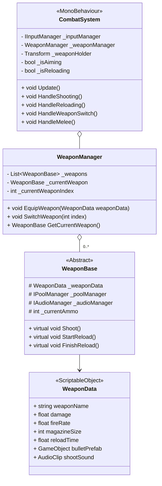
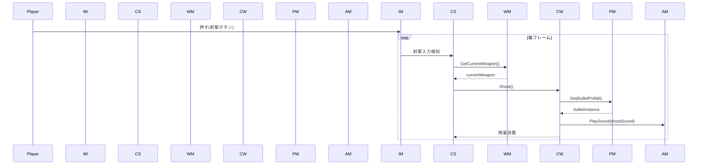
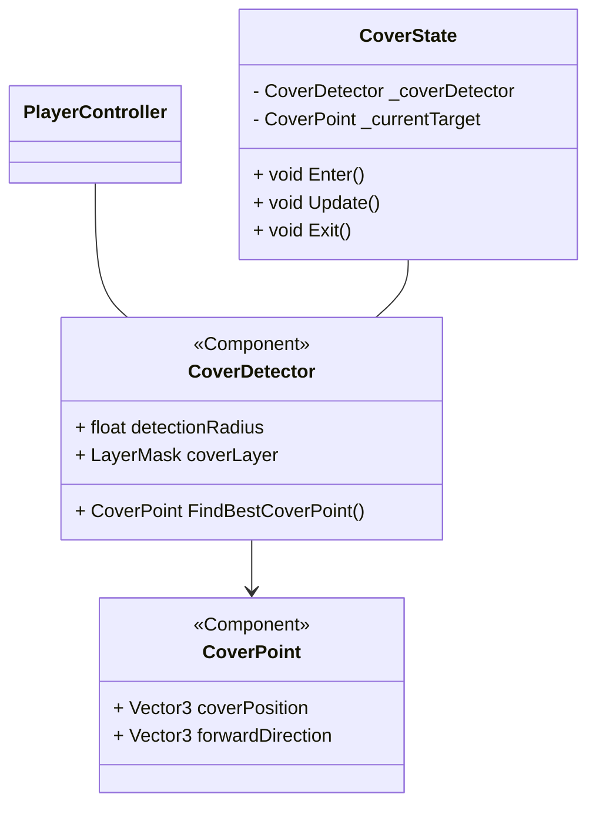
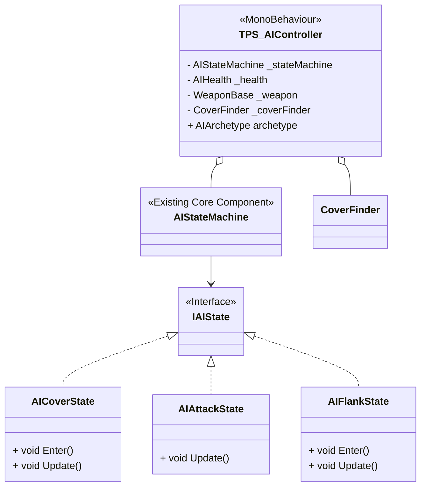
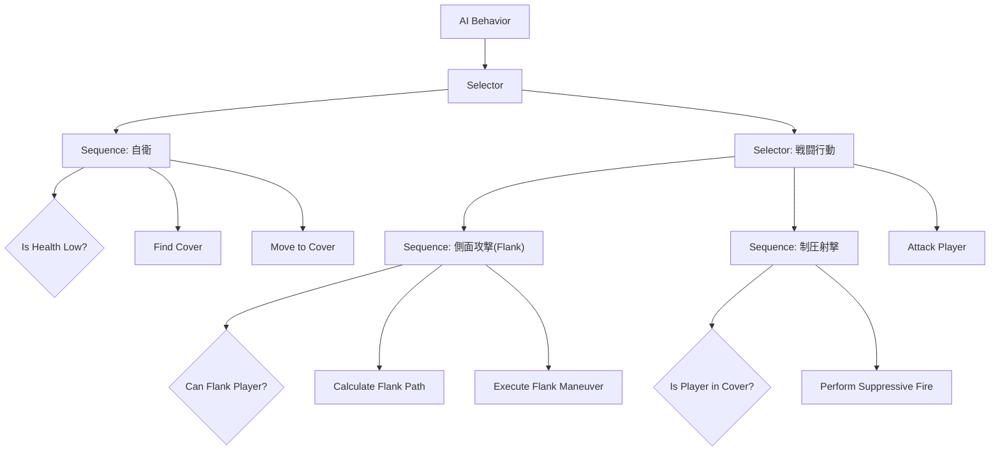
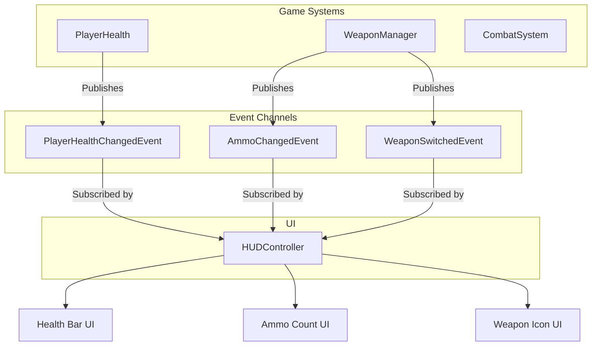

# **TPSゲームテンプレート 詳細設計書**

## **1. 文書管理情報**

* **ドキュメント種別**: 技術詳細設計書  
* **生成元**:  
  * DESIGN.md - Unity 6 3Dゲーム基盤プロジェクト 技術設計書  
  * TPSゲーム要件定義書  
* **対象読者**: 実装担当開発者、アーキテクト  
* **整合性状態**: SPEC.md, REQUIREMENTS.md, DESIGN.mdで定義されたアーキテクチャ原則と完全に整合

## **2. 設計思想とアーキテクチャ方針**

本設計書は、DESIGN.mdで定義された**Core層とFeature層の分離原則**を厳守し、汎用的な基盤（Core）と具体的なゲーム機能（Feature）を明確に分離します。

TPSゲーム機能は、asterivo.Unity60.Features.Templates.TPS 名前空間内に実装される、**完全に独立した機能モジュール**として設計します。これにより、既存のステルスやプラットフォーマーテンプレートとの依存関係を排除し、プロジェクトのモジュール性と拡張性を維持します。

### **2.1. ServiceLocatorの積極活用**

DESIGN.mdで示された軽量化と学習コスト削減の方針に基づき、DIフレームワークを使用せず、**ServiceLocatorパターン**を積極的に活用します。以下のグローバルサービスをServiceLocatorに登録し、TPS機能の各コンポーネントからアクセスします。

* IInputManager: 入力処理を一元管理  
* IPoolManager: オブジェクトプール（弾丸、エフェクト等）を管理  
* IAudioManager: 音響再生を管理  
* IGameEventManager: ゲーム全体の状態イベントを管理  
* ICameraManager: Cinemachine仮想カメラの管理

### **2.2. イベント駆動による疎結合の徹底**

システム間の連携は、DESIGN.mdで定義されたScriptableObjectベースの**イベントチャネル**を介して行います。これにより、各システムは互いを直接参照することなく、関心のあるイベントを購読・発行することで連携します。

**主要なTPS関連イベントチャネル:**

* PlayerHealthChangedEventChannel: プレイヤーの体力変化を通知  
* WeaponSwitchedEventChannel: 武器の切り替えを通知  
* AmmoChangedEventChannel: 弾薬数の変化を通知  
* EnemyDefeatedEventChannel: 敵の撃破を通知  
* ReloadStateChangedEventChannel: リロード状態を通知

## **3. 全体アーキテクチャと名前空間**

TPS機能は、既存のアーキテクチャ分離原則に基づき、Feature層に配置されます。



* **名前空間**: asterivo.Unity60.Features.Templates.TPS  
* **アセンブリ定義**: asterivo.Unity60.Features.Templates.TPS.asmdef を新規に作成し、asterivo.Unity60.Core.asmdefへの参照を設定します。

## **4. Feature層: TPS機能詳細設計**

### **4.1. プレイヤーシステム (PlayerController)**

プレイヤーの移動、姿勢、カバーアクションを管理する中心的なクラスです。

#### **4.1.1. クラス図**



#### **4.1.2. 状態遷移図 (PlayerStateMachine)**



#### **4.1.3. ServiceLocator/Event活用**

* **Awake()**: ServiceLocator.Current.Get<IInputManager>() を呼び出し、入力サービスを取得します。  
* **イベント購読**: PlayerHealthChangedEventChannelを購読し、体力変化に応じてUIやエフェクトを制御します。  
* **イベント発行**: プレイヤーがダメージを受けた際、PlayerDamagedCommand を発行します。

### **4.2. 戦闘システム (CombatSystem)**

射撃、リロード、武器切り替え、近接攻撃など、戦闘に関する全てのアクションを統括します。

#### **4.2.1. クラス図**



#### **4.2.2. シーケンス図 (射撃処理)**



#### **4.2.3. ServiceLocator/Event活用**

* **Awake()**: ServiceLocatorからIInputManager, IPoolManager, IAudioManagerを取得します。  
* **イベント発行**:  
  * Shoot()内でAmmoChangedEventChannelを発行し、UIに弾数変更を通知します。  
  * SwitchWeapon()内でWeaponSwitchedEventChannelを発行します。  
* **コマンド発行**: 近接攻撃時、MeleeAttackCommandを発行します。

### **4.3. カバーシステム**

PlayerController内のCoverStateと連携し、カバーアクションを管理します。

#### **4.3.1. 設計方針**

* CoverPointコンポーネントを遮蔽物オブジェクトにアタッチします。  
* プレイヤーは周囲のCoverPointを常に検出し、最も適切なポイントをハイライトします。  
* カバー入力時、プレイヤーは最も近いCoverPointに自動で移動し、CoverStateに遷移します。

#### **4.3.2. クラス図**



### **4.4. 敵AIシステム**

TPSゲーム要件定義書の敵アーキタイプに基づき、戦術的なAIを設計します。

#### **4.4.1. AIアーキテクチャ**

既存のAIStateMachine (DESIGN.mdで定義)を継承し、TPS専用の戦術的判断を追加します。



#### **4.4.2. 戦術的行動ロジック (ビヘイビアツリー概要)**



### **4.5. UI/HUDシステム (HUDController)**

イベントチャネルを購読し、ゲームの状態をUIに反映させる責務を持ちます。

#### **4.5.1. 設計方針**

HUDControllerは、ゲームロジックを一切含まず、イベントを受け取ってUI要素（Text, Image, Sliderなど）を更新することに専念します。

#### **4.5.2. イベント連携**



## **5. 結論**

本設計書は、既存の堅牢なアーキテクチャ基盤の上に、一般的かつ拡張性の高いTPSゲームのコアメカニクスを実装するための具体的な設計を示しました。

* **モジュール性**: TPS機能は独立したFeature層モジュールとして設計されており、他のゲームジャンルテンプレートに影響を与えません。  
* **疎結合**: **ServiceLocator**と**イベント駆動アーキテクチャ**を徹底することで、各システムは疎結合を保ち、高い保守性と拡張性を実現します。  
* **データ駆動**: WeaponDataなどのScriptableObjectを活用することで、ノンプログラマーでもゲームバランスの調整が容易になります。

この設計に基づき、TASKS.mdで定義されている実装フェーズへ進むことが可能です。

---

**Mermaidブロック編集時の注意事項:**
- Mermaidブロックは必ず ```mermaid で開始し、``` で終了してください
- ブロックの開始と終了の間に空行を入れないでください
- インデントはブロック内で統一してください
- 図が表示されない場合は、VSCodeのMermaid拡張機能が有効になっているか確認してください