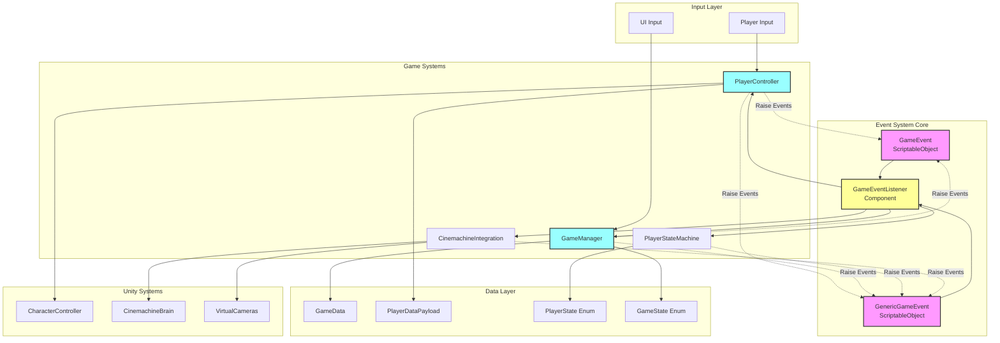
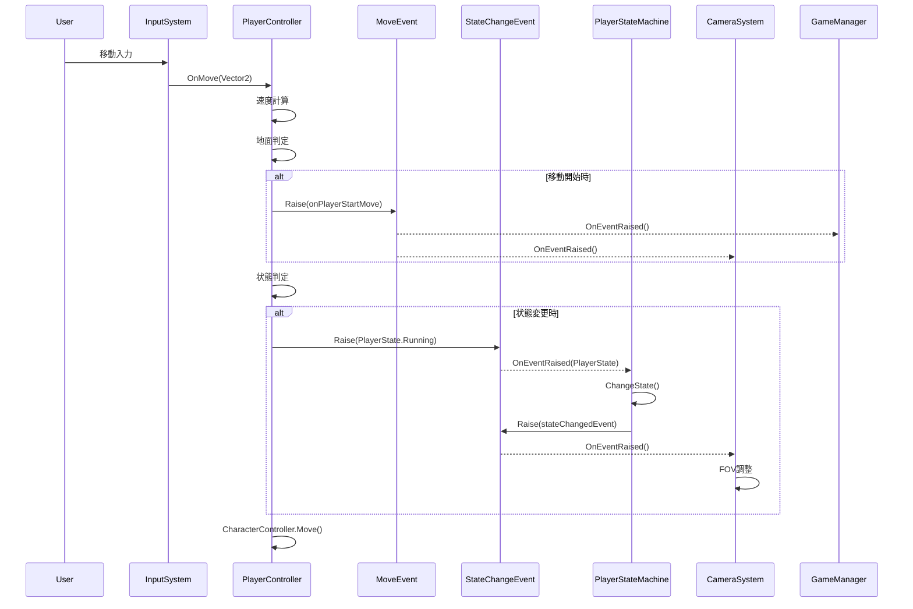
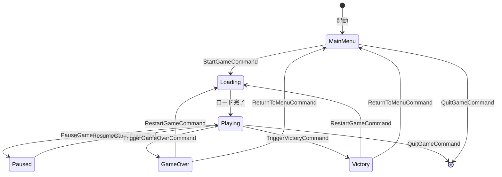
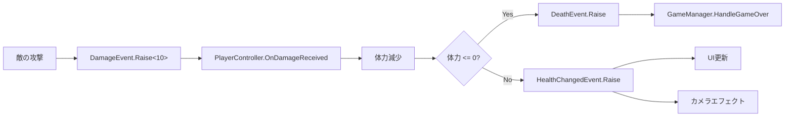
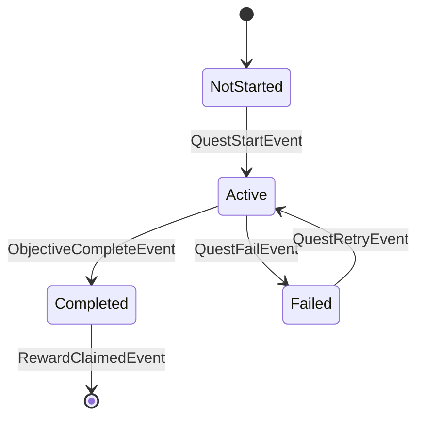

# Unity 6 イベント駆動アーキテクチャ 詳細解説書

## 目次
1. [アーキテクチャ概要](#アーキテクチャ概要)
2. [コアコンポーネント](#コアコンポーネント)
3. [アーキテクチャ図](#アーキテクチャ図)
4. [イベントフロー図](#イベントフロー図)
5. [各コンポーネントの詳細](#各コンポーネントの詳細)
6. [イベント駆動アーキテクチャの利点](#イベント駆動アーキテクチャの利点)
7. [実装における注意点とベストプラクティス](#実装における注意点とベストプラクティス)
8. [具体的なユースケース](#具体的なユースケース)

---

## アーキテクチャ概要

本プロジェクトは **Unity 6（6000.0.42f1）** で **イベント駆動アーキテクチャ（Event-Driven Architecture: EDA）** を採用した3Dゲーム基盤システムです。ScriptableObjectベースのイベントシステムを中核に、疎結合で拡張性の高いゲームシステムを実現しています。

### 主要な設計原則
- **疎結合**: コンポーネント間の直接参照を最小限に抑制
- **単一責任**: 各コンポーネントが明確な責任範囲を持つ
- **拡張性**: 新機能の追加が既存システムに影響を与えない
- **再利用性**: イベントとリスナーの組み合わせで多様な動作を実現
- **テスタビリティ**: 各コンポーネントを独立してテスト可能

---

## コアコンポーネント

### 1. **イベントシステム（Core/Events）**
- `GameEvent`: パラメータなしの基本イベント
- `GenericGameEvent<T>`: 型付きパラメータイベント
- `GameEventListener`: イベントリスナーコンポーネント
- `IGameEventListener<T>`: 型付きリスナーインターフェース

### 2. **ゲーム管理システム（Systems）**
- `GameManager`: ゲーム全体の状態管理とフロー制御

### 3. **プレイヤーシステム（Player）**
- `PlayerController`: プレイヤーの入力処理と物理制御
- `PlayerStateMachine`: プレイヤー状態管理
- `BasePlayerState`: 状態パターンの基底クラス

### 4. **カメラシステム（Camera）**
- `CinemachineIntegration`: Cinemachine 3.1統合カメラ制御

### 5. **データ構造（Core/Data）**
- `GameData`: ゲーム全体のデータ
- `PlayerDataPayload`: プレイヤー関連データ

---

## アーキテクチャ図



---

## イベントフロー図

### プレイヤー移動のイベントフロー



### ゲームフロー状態遷移のイベントフロー



---

## 各コンポーネントの詳細

### GameEvent（イベントチャネル）
```csharp
// ScriptableObjectベースのイベントチャネル
// 優先度付きリスナー管理、非同期発火対応
- HashSetによる高速リスナー管理
- 優先度ソート機能
- デバッグモード対応
- エディタ拡張による手動発火
```

**特徴:**
- **ScriptableObject継承**: アセットとして管理可能
- **疎結合**: 発行者と購読者が直接参照不要
- **優先度管理**: リスナーの実行順序を制御
- **キャッシュ機能**: 最後の値を保持（GenericGameEvent）

### GameEventListener（イベントリスナー）
```csharp
// MonoBehaviourベースのリスナーコンポーネント
// UnityEventによるInspector設定対応
- 自動登録/解除
- 遅延実行対応
- ワンショットモード
- 優先度設定
```

**特徴:**
- **Inspector対応**: UnityEventでレスポンスを視覚的に設定
- **ライフサイクル管理**: OnEnable/OnDisableで自動登録・解除
- **柔軟な設定**: 遅延実行、ワンショット、優先度など

### GameManager（ゲーム管理）
```csharp
// ゲーム全体の状態管理とフロー制御
- 完全イベント駆動
- エラーハンドリング強化
- コルーチン管理
- シーンローディング
```

**責務:**
1. ゲーム状態の管理（MainMenu, Playing, Paused, GameOver等）
2. シーンのロード・アンロード
3. ゲームデータの管理（スコア、ライフ、時間）
4. グローバルイベントの処理

### PlayerController（プレイヤー制御）
```csharp
// 静的リスナー方式と自動状態遷移を実装
- Input System統合
- 物理制御（CharacterController）
- 状態管理との連携
- イベント発火
```

**機能:**
1. 入力処理（移動、ジャンプ、スプリント）
2. 物理演算と衝突判定
3. 状態遷移の自動判定
4. ヘルスとスタミナ管理
5. カメライベント連携

### CinemachineIntegration（カメラシステム）
```csharp
// Cinemachine 3.1統合カメラシステム
- イベント駆動カメラ切り替え
- FOV動的調整
- プレイヤー状態連動
- 複数カメラ管理
```

**機能:**
1. カメラ状態管理（Follow, Combat, Cinematic等）
2. スムーズなカメラ遷移
3. FOVの動的調整
4. プレイヤー追従

---

## イベント駆動アーキテクチャの利点

### 1. **疎結合による柔軟性**
- コンポーネント間の直接参照が不要
- 新機能追加時の既存コードへの影響を最小化
- モジュールの独立性が高い

### 2. **拡張性の向上**
- 新しいイベントリスナーの追加が容易
- 既存システムを変更せずに機能拡張可能
- プラグインアーキテクチャの実現

### 3. **デバッグとテストの容易さ**
- イベントの発火と受信を個別にテスト可能
- エディタ上でイベントを手動発火してテスト
- イベントフローの可視化

### 4. **パフォーマンスの最適化**
- 必要な時だけイベントを購読
- HashSetによる高速なリスナー管理
- 優先度による実行順序の制御

### 5. **コードの再利用性**
- イベントとリスナーの組み合わせで多様な動作
- ScriptableObjectによるデータ駆動設計
- 汎用的なイベントシステムの構築

---

## 実装における注意点とベストプラクティス

### ベストプラクティス

#### 1. **イベント命名規則**
```csharp
// 良い例
onPlayerJump      // 動作を明確に表現
onHealthChanged   // 変更を示す
onGameStateChanged // 状態変更を明示

// 悪い例
jumpEvent        // 汎用的すぎる
event1          // 意味が不明
doSomething     // 具体性がない
```

#### 2. **リスナーの登録タイミング**
```csharp
// OnEnable/OnDisableペアで管理
private void OnEnable() {
    gameEvent.RegisterListener(this);
}

private void OnDisable() {
    gameEvent.UnregisterListener(this);
}
```

#### 3. **優先度の使い方**
- UI更新: 優先度 100
- ゲームロジック: 優先度 50
- エフェクト・サウンド: 優先度 10

#### 4. **パフォーマンス最適化**
```csharp
// キャッシュの活用
private List<Listener> sortedListeners;
private bool isDirty = true;

// 必要時のみソート
if (isDirty) {
    RebuildSortedList();
}
```

### 注意点

#### 1. **循環参照の回避**
- イベントAがイベントBを発火し、イベントBがイベントAを発火する状況を避ける
- 状態管理を介して循環を防ぐ

#### 2. **メモリリーク対策**
- リスナーの登録解除を忘れない
- OnDestroyでの確実なクリーンアップ

#### 3. **イベントの粒度**
- 細かすぎるイベントは管理が複雑化
- 大きすぎるイベントは再利用性が低下
- 適切な粒度の設計が重要

#### 4. **デバッグ機能の活用**
```csharp
#if UNITY_EDITOR
[SerializeField] private bool debugMode = false;
// デバッグログ出力
#endif
```

---

## 具体的なユースケース

### ユースケース1: プレイヤーのダメージ処理



**実装の流れ:**
1. 敵がダメージイベントを発火
2. PlayerControllerがダメージを受信
3. 体力を減算し、関連イベントを発火
4. UIとエフェクトが独立して反応

### ユースケース2: アイテム取得システム

```csharp
// アイテム側
public class Item : MonoBehaviour {
    [SerializeField] private ItemPickupEvent onPickup;
    
    private void OnTriggerEnter(Collider other) {
        if (other.CompareTag("Player")) {
            onPickup.Raise(itemData);
            Destroy(gameObject);
        }
    }
}

// インベントリ側（リスナー）
public class Inventory : MonoBehaviour {
    public void OnItemPickup(ItemData data) {
        AddItem(data);
        UpdateUI();
    }
}
```

### ユースケース3: クエストシステム



**実装例:**
```csharp
// クエストマネージャー
public class QuestManager : MonoBehaviour {
    [SerializeField] private QuestStateEvent questStateChanged;
    
    private void CompleteObjective(string objectiveId) {
        currentQuest.CompleteObjective(objectiveId);
        
        if (currentQuest.IsCompleted) {
            questStateChanged.Raise(QuestState.Completed);
            // 報酬イベント発火
            rewardEvent.Raise(currentQuest.rewards);
        }
    }
}
```

### ユースケース4: マルチプレイヤー同期

```csharp
// ネットワークイベント
[CreateAssetMenu(menuName = "Events/Network/Player Action")]
public class NetworkPlayerActionEvent : GenericGameEvent<PlayerActionData> {
    public override void Raise(PlayerActionData data) {
        // ローカル処理
        base.Raise(data);
        
        // ネットワーク送信
        if (NetworkManager.IsHost) {
            NetworkManager.Broadcast(data);
        }
    }
}
```

---

## まとめ

本プロジェクトのイベント駆動アーキテクチャは、Unity 6の最新機能を活用しながら、以下の特徴を実現しています：

### 達成された目標
1. **完全な疎結合設計** - コンポーネント間の依存関係を最小化
2. **高い拡張性** - 新機能の追加が容易
3. **優れた保守性** - 各コンポーネントが独立して管理可能
4. **効率的なデバッグ** - イベントフローの可視化とテスト
5. **パフォーマンス最適化** - HashSetと優先度管理による効率化

### 今後の拡張可能性
- **ビジュアルスクリプティング対応** - Unity Visual Scriptingとの統合
- **AIシステムの追加** - Behavior TreeやFSMとの連携
- **マルチプレイヤー対応** - ネットワークイベントの実装
- **アナリティクス統合** - イベントベースの分析システム

### 開発チームへの推奨事項
1. イベントの命名規則を統一する
2. ドキュメントを常に最新に保つ
3. 新規イベント追加時はテストケースも作成
4. パフォーマンスプロファイリングを定期的に実施
5. イベントフローの複雑化を避ける設計レビュー

このアーキテクチャにより、大規模なゲーム開発においても、チーム開発の効率化と品質の向上が期待できます。