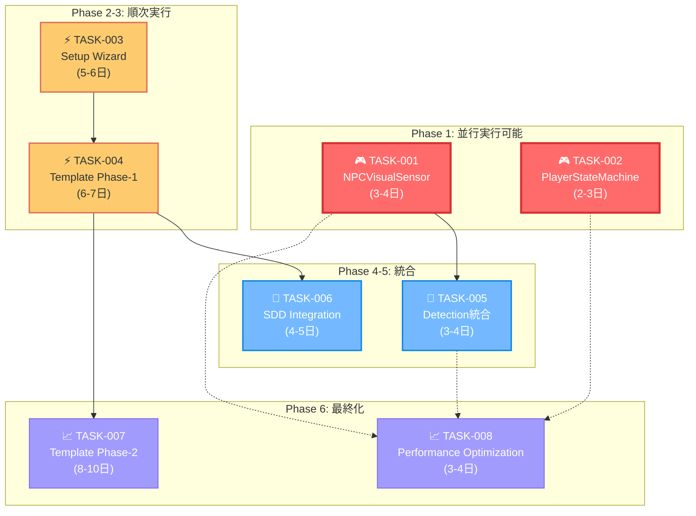

# TASKS.md - Unity 6 3Dゲーム基盤プロジェクト 実装タスクリスト

## 文書管理情報

- **ドキュメント種別**: 実装タスク一覧
- **生成元**: DESIGN.md + REQUIREMENTS.md 依存関係分析結果
- **対象読者**: 開発者、実装チーム
- **更新日**: 2025年9月
- **ステータス管理**: ❌未着手 🚧進行中 ✅完了 ⚠️ブロック中 📋レビュー待ち

## 🎯 核心ポイント・実行戦略

### ⚡ 即座実行推奨タスク（最高ROI）

**最短5-7日でステルスゲーム中核機能完成**

```
🎮 TASK-001: NPCVisualSensor（3-4日）
├─ ステルスゲームの心臓部
├─ 50体NPC同時稼働対応
└─ AI検知システム完全実装

🎮 TASK-002: PlayerStateMachine（2-3日） 
├─ プレイヤー制御統一化
├─ 8状態完全実装
└─ システム統合基盤完成
```

**🚀 並行実行で最大効率化**

### 📋 戦略的実装ロードマップ

```
Phase 1 (Week 1)     │ TASK-001 + TASK-002 並行実行
                     │ ↓ ステルス基本機能完成
Phase 2 (Week 2)     │ TASK-003 Setup Wizard
                     │ ↓ 1分セットアップ実現
Phase 3 (Week 2-3)   │ TASK-004 Template統合
                     │ ↓ 6ジャンル対応完成
Phase 4-6 (Week 4)   │ 統合・最適化フェーズ
                     │ ↓ プロダクション品質達成
```

### 🏆 成功指標・マイルストーン

| マイルストーン | タイミング | 達成内容 | ビジネス価値 |
|-------------|-----------|----------|-------------|
| **Alpha Release** | Phase 1完了 | ステルスゲーム基本動作 | 技術実証完了 |
| **Beta Release** | Phase 3完了 | 6ジャンル完全対応 | 市場投入可能 |
| **Gold Master** | Phase 6完了 | プロダクション品質 | 商用利用可能 |

### ⚙️ リスク軽減戦略

**🛡️ 技術リスク対応**
- **TASK-001**: 段階的実装（10サブタスク分割）
- **TASK-002**: 既存基盤活用（8状態実装済み）
- **並行実行**: 相互独立性確保、ブロッキング回避

**📊 品質保証戦略**
- **各Phase完了時**: 機能・パフォーマンステスト実行
- **継続的検証**: Unity Profiler統合監視
- **受入条件**: 定量的指標による客観評価

---

## 依存関係マップ



## 【CRITICAL - 最高優先度】

### TASK-001: NPCVisualSensor System 完全実装 ❌
- **要件ID**: FR-4.3
- **優先度**: Critical（最高）
- **依存関係**: 既存AI State Machine, Detection System, VisibilityCalculator
- **影響範囲**: ステルスゲームの中核機能
- **推定工数**: 3-4日

#### 実装サブタスク
- [ ] **TASK-001.1**: NPCVisualSensor.cs 基底クラス実装
  - 継続的視界スキャンシステム（10-20Hz可変頻度）
  - Update()での効率的スキャン処理
  - ICoroutine による分散処理実装

- [ ] **TASK-001.2**: VisualDetectionModule 実装
  - 多重判定システム（距離・角度・遮蔽・光量）
  - VisibilityCalculator との統合
  - 閾値ベース判定ロジック

- [ ] **TASK-001.3**: AlertSystemModule 実装
  - 4段階警戒レベル（Relaxed → Suspicious → Investigating → Alert）
  - 警戒レベル自動遷移制御
  - AI State Machine との連動

- [ ] **TASK-001.4**: MemoryModule 実装
  - 短期記憶（5秒）→長期記憶（30秒）階層管理
  - 位置履歴管理システム
  - 目標の予測位置計算

- [ ] **TASK-001.5**: TargetTrackingModule 実装
  - 複数目標同時追跡（最大5目標）
  - 優先度管理システム
  - DetectedTarget データ構造実装

- [ ] **TASK-001.6**: Configuration System 実装
  - VisualSensorSettings (ScriptableObject)
  - DetectionConfiguration (ScriptableObject)
  - Inspector UI カスタマイズ

- [ ] **TASK-001.7**: Performance Optimization 実装
  - LOD対応による動的最適化
  - フレーム分散処理システム
  - 早期カリング機能実装

- [ ] **TASK-001.8**: Event Integration 実装
  - onTargetSpotted, onTargetLost イベント
  - onAlertLevelChanged, onSuspiciousActivity イベント
  - Event-Driven Architecture との統合

- [ ] **TASK-001.9**: Debug Tools 実装
  - Scene View Gizmos 描画
  - カスタムInspector ウィンドウ
  - リアルタイムデバッグ情報表示

- [ ] **TASK-001.10**: Testing & Validation
  - パフォーマンステスト（0.1ms/frame以下）
  - 50体NPC同時稼働テスト
  - メモリ使用量検証（5KB/NPC以下）

**完了条件**:
- 視覚検出と警戒レベル遷移が正常動作
- パフォーマンス要件達成（1フレーム0.1ms以下）
- 50体NPC同時稼働で正常動作
- AIStateMachine との完全統合

---

### TASK-002: PlayerStateMachine 復元・完全実装 ❌
- **要件ID**: FR-3.3  
- **優先度**: Critical（最高）
- **依存関係**: 既存Player States, Command System
- **影響範囲**: プレイヤー制御の統一化
- **推定工数**: 2-3日

#### 実装サブタスク
- [ ] **TASK-002.1**: PlayerStateMachine.cs 復元
  - 空ファイル状態からの完全実装
  - Dictionary<PlayerStateType, IPlayerState> 高速管理
  - 既存 IPlayerState インターフェースとの統合

- [ ] **TASK-002.2**: State Management System 実装
  - BasePlayerState 基底クラスとの統合
  - 状態遷移ルールの定義と実装
  - Enter/Update/Exit ライフサイクル管理

- [ ] **TASK-002.3**: 基盤実装済み状態の統合
  - IdleState, WalkingState, RunningState 統合
  - CrouchingState, ProneState, JumpingState 統合
  - RollingState, CoverState 統合

- [ ] **TASK-002.4**: System Integration 実装
  - Camera System との状態同期
  - Audio System との状態連動
  - Event-Driven Architecture との統合

- [ ] **TASK-002.5**: Input Integration 実装
  - Input System との統合
  - 状態別入力処理の実装
  - 状態遷移トリガーの実装

- [ ] **TASK-002.6**: Animation Integration 実装
  - Animator Controller との統合
  - 状態別アニメーション制御
  - アニメーションイベントとの連動

- [ ] **TASK-002.7**: Physics Integration 実装
  - 物理演算との状態同期
  - コライダー制御（Crouch, Prone時）
  - 重力・移動速度制御

**完了条件**:
- プレイヤー状態遷移が正常動作
- 各状態の物理・音響特性が実装
- 他システムとの状態連動が動作

---

## 【HIGH - 高優先度】

### TASK-003: Interactive Setup Wizard System 実装 ❌
- **要件ID**: FR-7.1.1
- **優先度**: High（高）
- **依存関係**: 既存Template Systems
- **影響範囲**: 開発効率化（1分セットアップ）
- **推定工数**: 5-6日

#### 実装サブタスク
- [ ] **TASK-003.1**: SystemRequirementChecker 実装
  - Unity Version Validation
  - VS/VSCode Detection
  - Git Configuration Check

- [ ] **TASK-003.2**: Environment Diagnostics 実装
  - 環境診断システム
  - PDFレポート出力機能
  - 問題自動修復機能

- [ ] **TASK-003.3**: Genre Selection UI 実装
  - 6ジャンルテンプレート選択UI
  - プレビュー機能
  - 設定保存システム

- [ ] **TASK-003.4**: Module Selection System 実装
  - Audio, Localization, Analytics 選択
  - 依存関係自動解決
  - Package Manager 統合

- [ ] **TASK-003.5**: Project Generation Engine 実装
  - 自動シーン生成
  - アセット配置システム
  - 設定ファイル生成

**完了条件**:
- セットアップ時間1分以内達成
- 6ジャンル全てで正常セットアップ確認
- エラー時の分かりやすいメッセージ表示

---

### TASK-004: Ultimate Template Phase-1統合 ❌
- **要件ID**: FR-7.1.2
- **優先度**: High（高）  
- **依存関係**: TASK-003 (Setup Wizard)
- **影響範囲**: 開発フレームワーク統一
- **推定工数**: 6-7日

#### 実装サブタスク
- [ ] **TASK-004.1**: Template Registry System 実装
  - GenreTemplateConfig (ScriptableObject)
  - Template 管理システム
  - 動的切り替え機能

- [ ] **TASK-004.2**: 6ジャンルテンプレート実装
  - FPS/TPS/Platformer/Stealth Templates
  - Adventure/Strategy Templates
  - ジャンル特化シーン構成

- [ ] **TASK-004.3**: Camera Settings Presets 実装
  - Cinemachine構成済みプリセット
  - ジャンル別カメラ設定
  - プリセット切り替えシステム

- [ ] **TASK-004.4**: Input Settings Presets 実装
  - Input System構成済みプリセット
  - ジャンル別入力マッピング
  - カスタマイズ対応

- [ ] **TASK-004.5**: Sample Gameplay 実装
  - 各ジャンル15分以内基本ゲームプレイ
  - デモシーンの作成
  - チュートリアル統合

**完了条件**:
- 各ジャンル15分以内で基本ゲームプレイ実現
- テンプレート切り替え時のデータ整合性保証
- サンプルシーンの完全動作確認

---

## 【MEDIUM - 中優先度】

### TASK-005: Visual-Auditory Detection統合システム 🚧
- **要件ID**: FR-4.1 + FR-4.2 Integration
- **優先度**: Medium（中）
- **依存関係**: TASK-001 (NPCVisualSensor), 既存Audio System
- **影響範囲**: ステルス検知システム統一
- **推定工数**: 3-4日

#### 実装サブタスク
- [ ] **TASK-005.1**: Sensor Fusion System 実装
  - NPCVisualSensor + NPCAuditorySensor 統合
  - 統合検出スコア計算
  - 相互補完機能実装

- [ ] **TASK-005.2**: Integrated Detection Coordinator 実装
  - 情報統合処理システム
  - 統合警戒レベル管理
  - 協調検出システム

- [ ] **TASK-005.3**: AIStateMachine Integration 拡張
  - 統合センサーイベント対応
  - マルチセンサー状態遷移
  - 優先度ベース反応システム

**完了条件**:
- 視覚・聴覚センサーの統合動作
- 統合検出システムの精度向上
- AI反応の自然性向上

---

### TASK-006: SDD Workflow Integration System ❌
- **要件ID**: SDD-1.1, SDD-1.2
- **優先度**: Medium（中）
- **依存関係**: TASK-004 (Template Phase-1)
- **影響範囲**: 開発プロセス効率化
- **推定工数**: 4-5日

#### 実装サブタスク
- [ ] **TASK-006.1**: MarkdownDocumentManager 実装
  - 5段階フェーズ管理
  - バージョン管理統合
  - 自動フェーズ遷移

- [ ] **TASK-006.2**: Claude Code MCP Integration 実装
  - unityMCP統合コマンド
  - context7統合機能
  - git操作自動化

- [ ] **TASK-006.3**: AI連携コマンド実装
  - /spec-create 機能
  - /design-create 機能  
  - /tasks-create, /todo-execute 機能

**完了条件**:
- SDD 5フェーズの完全管理
- AI連携による文書自動生成
- 品質検証プロセスの確立

---

## 【LOW - 低優先度】

### TASK-007: Ultimate Template Phase-2拡張 ❌
- **要件ID**: FR-7.2.1, FR-7.2.2, FR-7.2.3
- **優先度**: Low（低）
- **依存関係**: TASK-004 (Phase-1完了)
- **影響範囲**: 高度なテンプレート機能
- **推定工数**: 8-10日

#### 実装サブタスク
- [ ] **TASK-007.1**: Advanced Save/Load System 実装
- [ ] **TASK-007.2**: Comprehensive Settings System 実装
- [ ] **TASK-007.3**: Localization Support System 実装
- [ ] **TASK-007.4**: Asset Store Integration Guide 実装

**完了条件**: Phase-1完了後に詳細化

---

### TASK-008: Performance Optimization Suite ❌
- **要件ID**: NFR-1.1, NFR-1.2, NFR-1.4
- **優先度**: Low（低）
- **依存関係**: 主要システム実装完了
- **影響範囲**: 全体パフォーマンス
- **推定工数**: 3-4日

#### 実装サブタスク
- [ ] **TASK-008.1**: Profiling Tools 実装
- [ ] **TASK-008.2**: Memory Optimization 詳細化
- [ ] **TASK-008.3**: CPU Optimization 詳細化
- [ ] **TASK-008.4**: Build Optimization 詳細化

**完了条件**: 主要システム完了後に詳細化

---

## タスク実行優先順序（推奨）

### Phase 1（並行実行可能）
1. **TASK-001**: NPCVisualSensor System 実装
2. **TASK-002**: PlayerStateMachine 復元・実装

### Phase 2（Phase 1完了後）
3. **TASK-003**: Setup Wizard System 実装

### Phase 3（Phase 2完了後）
4. **TASK-004**: Template Phase-1統合

### Phase 4（Phase 1,3完了後）
5. **TASK-005**: Detection統合システム

### Phase 5（Phase 3完了後）
6. **TASK-006**: SDD Integration

### Phase 6（全Phase完了後）
7. **TASK-007**: Template Phase-2拡張  
8. **TASK-008**: Performance Optimization

## 完了状況サマリー

| タスク | 優先度 | 状況 | 推定工数 | 依存関係 |
|--------|--------|------|----------|----------|
| TASK-001 | Critical | ❌未着手 | 3-4日 | 独立実装可能 |
| TASK-002 | Critical | ❌未着手 | 2-3日 | 独立実装可能 |  
| TASK-003 | High | ❌未着手 | 5-6日 | Template Systems |
| TASK-004 | High | ❌未着手 | 6-7日 | TASK-003 |
| TASK-005 | Medium | 🚧進行中 | 3-4日 | TASK-001, Audio System |
| TASK-006 | Medium | ❌未着手 | 4-5日 | TASK-004 |
| TASK-007 | Low | ❌未着手 | 8-10日 | TASK-004 |
| TASK-008 | Low | ❌未着手 | 3-4日 | Major Systems |

## 総工数見積もり
- **Critical**: 5-7日（並行実行）
- **High**: 11-13日（順次実行）
- **Medium**: 7-9日（部分並行）
- **Low**: 11-14日（Phase完了後）

**総計**: 34-43日（最適化実行時は約30日）

---

## 🚀 クイックスタートガイド

### 今すぐ開始する場合
1. **TASK-001.1** から開始（NPCVisualSensor基底クラス）
2. **TASK-002.1** と並行実行（PlayerStateMachine復元）
3. 各サブタスクのチェックリスト完了で進捗管理
4. Phase 1完了でステルスゲーム基本動作確認

### 実装優先度の判断基準
- **Critical**: ゲーム中核機能、他システムへの影響大
- **High**: 開発効率化、ユーザーエクスペリエンス直結
- **Medium**: システム統合、品質向上
- **Low**: 高度機能、将来拡張対応

---

*このTASKS.mdは、REQUIREMENTS.md v3.0 および DESIGN.md の分析に基づく実装計画です。各タスクの完了時には、対応する要件の受入条件を満たすことを確認してください。*

**🎯 Key Success Factor**: TASK-001 + TASK-002 の並行完成により、最短1週間でステルスゲームの基本機能が動作可能になります。