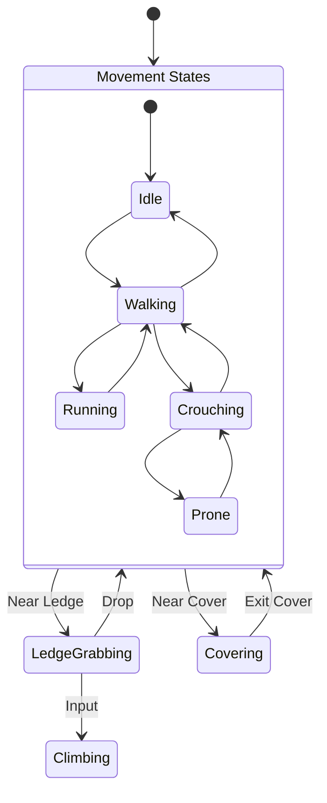
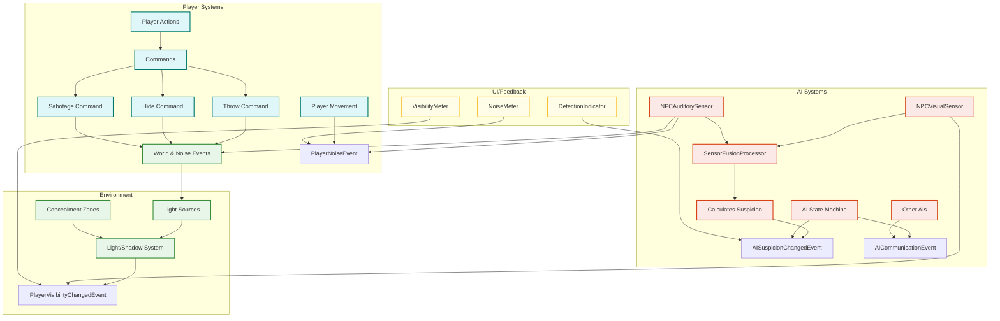

提供されたプロジェクト文書（CLAUDE.md, SPEC.md, REQUIREMENTS.md, DESIGN.md, TASKS.md）および「ステルスゲーム 要件定義」を基に、ステルスゲームのテンプレートを作成するための詳細設計書を作成します。

---

# **ステルスゲームテンプレート 詳細設計書**

## **1. 設計概要と目標**

### **1.1. 目的**

本設計書は、既存のUnity 6 3Dゲーム基盤プロジェクト（URP3D_Base01）を拡張し、**ステルスアクションゲーム**ジャンルに特化した、再利用可能かつ拡張性の高いテンプレートを構築するための技術的詳細を定義します。

### **1.2. 設計目標**

「ステルスゲーム 要件定義」で示されたコアゲームプレイループ**「観察、計画、実行、そして適応」** 1 を、プロジェクトのモダンなアーキテクチャ（ServiceLocator + Event駆動ハイブリッド）上で実現します。

* **柔軟なステルス契約**: 基本モデルを**アクションステルス**とし、発見が事態の複雑化を招くが、ゲームオーバーには直結しない設計とします 2。設定（ScriptableObject）の変更により、発見が即失敗となる

  **ピュアステルス**モデルにも対応可能な構造を目指します 3。

* **システミックな相互作用**: プレイヤー、AI、環境が互いに影響を与え合う、創発的なゲームプレイを促進するシステムを構築します。  
* **Feature層への集約**: ステルスゲーム固有の機能はすべてasterivo.Unity60.Features.Templates.Stealth名前空間以下に実装し、Core層からの分離を徹底します。

## **2. アーキテクチャ原則の適用**

既存の設計原則を踏襲し、ステルスゲームの要件を以下のようにマッピングします。

* **イベント駆動アーキテクチャ**: AIの警戒レベル変化、プレイヤーの発見、物音の発生などをGameEventとして発行し、UI、サウンド、他のAIなどのシステムが疎結合に連携します。  
* **コマンドパターン + ObjectPool**: 陽動のための投擲、死体隠蔽、光源の破壊といったプレイヤーのアクションをICommandとしてカプセル化し、再利用性と管理性を高めます。  
* **Stateパターン**: プレイヤー（移動、隠蔽、カバー）およびAI（巡回、不審、警戒、捜索）の状態遷移を、REQUIREMENTS.mdのFR-3.2およびFR-3.3に基づき、より詳細なステルス専用ステートとして実装します。  
* **ScriptableObjectベースのデータ駆動設計**: AIの視覚・聴覚パラメータ、巡回経路、警戒レベルの閾値、ミッションの評価基準などをScriptableObjectとして外部データ化し、ノンプログラマーによる調整を可能にします。

## **3. プレイヤーシステム詳細設計 (Player Agent's Toolkit)**

asterivo.Unity60.Features.Templates.Stealth.Player

### **3.1. プレイヤーステートマシンの拡張**

REQUIREMENTS.mdのFR-3.3を基盤とし、ステルスアクションに必須のステートを追加します。

コード スニペット


```

* **CrouchingState / ProneState**: 移動速度を低下させ、コライダーの高さを変更します。同時にプレイヤーの**視認性プロファイル**と**発生音レベル**を低下させるPlayerNoiseEventを発行します。  
* **CoveringState**: カバーオブジェクトに吸着し、遮蔽された状態。三人称視点カメラを専用のCover状態に遷移させるCameraStateEventを発行します。  
* **LedgeGrabbingState / ClimbingState**: 垂直方向の移動を可能にし、レベルデザインの多様性を確保します 4。

### **3.2. インタラクションと操作（コマンドパターン適用）**

プレイヤーのステルス関連アクションをIResettableCommandとして実装し、CommandPoolによる最適化を行います。

* **ThrowObjectCommand**: 陽動のためのオブジェクトを投擲します。着弾地点でNoiseEventを発行し、AIの注意を引きます 5。

* **HideBodyCommand**: 無力化されたNPCを担ぎ、コンテナなどの指定場所に隠します。これにより、他のAIによる死体発見を防ぎます 6。

* **SabotageCommand**: 光源やセキュリティカメラなどの環境オブジェクトを無力化します 7。

### **3.3. 隠蔽システム**

* **LightAndShadowSubsystem**:  
  * プレイヤーの位置と周囲の光源を基に、現在の光量を0.0（完全な闇）～1.0（完全な光）で算出します。  
  * この値をプレイヤーの**視認性係数(Visibility Factor)**としてPlayerVisibilityChangedEventを発行します。AIのNPCVisualSensorはこの値を基に発見判定を行います。  
* **EnvironmentConcealmentZone**:  
  * 背の高い草むら、ロッカー、コンテナなどのエリアにトリガーとして配置します。  
  * プレイヤーがゾーン内に入ると、視認性係数を強制的に低下させ（例:  
    * 0.2）、AIからの発見を困難にします 8。

## **4. 敵AIシステム詳細設計 (Intelligent Adversaries)**

asterivo.Unity60.Features.Templates.Stealth.AI

### **4.1. 統合センサーシステム (Sensor Fusion)**

完了済みのTASK-001: NPCVisualSensorとTASK-005: Visual-Auditory Detection統合システムを基盤とします。

* **SensorFusionProcessor**:  
  * NPCVisualSensorとNPCAuditorySensorから情報を受け取ります。  
  * 視覚情報（プレイヤーとの距離、遮蔽、視認性係数）と聴覚情報（音の大きさ、距離）を統合し、総合的な**疑心レベル(Suspicion Level)**を0.0～1.0で算出します。  
  * 疑心レベルの変動に応じてAISuspicionChangedEventを発行します。

### **4.2. AIステートマシンの詳細化**

REQUIREMENTS.mdのFR-3.2で定義された7状態を、疑心レベルと連携させ、より具体的な振る舞いを設計します。

| 状態 | トリガー (疑心レベル) | AIの行動 |  |
| :---- | :---- | :---- | :---- |
| **Patrol** | 0.0 - 0.29 |  | PatrolPath (ScriptableObject) に従って巡回。感覚は通常レベル 9。  |
| **Suspicious** | 0.3 - 0.69 | 軽微な刺激（遠くの物音など）。巡回を中断し、音源方向を注視。「今の音は何だ？」などの音声フィードバック 101010。  |  |
| **Investigating** | - |  | Suspicious状態で刺激が続いた場合、または不審物（開いたドア）を発見した場合。刺激の発生源まで移動して調査する 11。  |
| **Alert** | 0.7 - 1.0 | プレイヤーを明確に視認。 | PlayerSpottedEventを発行し、他のAIに情報を伝達。遮蔽物を利用し戦闘態勢に入る 12。  |
| **Search** | - |  | Alert状態でプレイヤーを見失った場合。最後の目撃地点や隠れそうな場所を体系的に捜索する 13。  |

### **4.3. AIコミュニケーションシステム**

* **AICommunicationEvent**: AI間の情報共有に使用します。  
  * **EventType**: PlayerSpotted, BodyFound, LoudNoiseHeard  
  * **Payload**: 位置情報、タイムスタンプ  
* あるAIが  
  Alert状態になるとPlayerSpottedイベントを発行し、範囲内の他のAIがその情報を受信して自身の警戒レベルを引き上げ、協力して捜索にあたります 14。

## **5. ワールドインタラクションとレベルデザイン**

### **5.1. インタラクティブオブジェクト**

* **DestructibleLight**: SabotageCommandに反応し、破壊されると周囲の光量を低下させ、プレイヤーに有利な闇を作り出します 15。

* **SecurityCamera**: PatrolPathに従って旋回。視界にプレイヤーを捉えると、AISuspicionChangedEventを発行し、自身の疑心レベルを上昇させます。  
* **HideableContainer**: HideBodyCommandのターゲット。内部にNPCの死体を格納できます。

### **5.2. データ駆動型レベル要素**

* **PatrolPath.asset (ScriptableObject)**: AIの巡回経路をウェイポイントのリストとして定義します。複数のAIが同じ経路を共有したり、時間差で巡回させることが可能です。  
* **AISensorConfig.asset (ScriptableObject)**: 視野角、視認距離、聴覚範囲、疑心レベルの上昇・下降率など、AIの感覚パラメータをジャンルや難易度に応じて定義します。

## **6. UI/UXとフィードバックシステム**

asterivo.Unity60.Features.Templates.Stealth.UI

* **DetectionIndicator**:  
  * AISuspicionChangedEventを購読します。  
  * AIの警戒レベルに応じて、敵の頭上にアイコン（例:  
    ? → !）を表示します 16。

* **VisibilityMeter**:  
  * PlayerVisibilityChangedEventを購読します。  
  * プレイヤーの現在の視認性をゲージやアイコンで表示します（例：『スプリンターセル』のライトメーター） 17。

* **NoiseMeter**:  
  * PlayerNoiseEventを購読します。  
  * プレイヤーの行動（走り、武器使用）によって発生する音の大きさを視覚的にフィードバックします。

## **7. パフォーマンス評価システム**

asterivo.Unity60.Features.Templates.Stealth.Scoring

* **MissionStatsTracker**:  
  * 各種GameEvent（PlayerSpottedEvent, NPCKilledEvent, AlarmTriggeredEventなど）を購読し、ミッション中の統計データを記録します。  
* **MissionEvaluator.asset (ScriptableObject)**:  
  * ミッションの評価基準を定義します。これにより、異なる評価スタイルを簡単に作成・切り替えできます。  
  * **Hitman_SilentAssassin_Evaluator**: ターゲット以外の殺傷、発見、警報がゼロの場合に最高評価を与えます 18。

  * **MGS_SRank_Evaluator**: 主にクリアタイムを重視し、非殺傷やノーアラートはボーナスポイントとして加算します 19。

## **8. データフローとイベントの相関図**

コード スニペット

