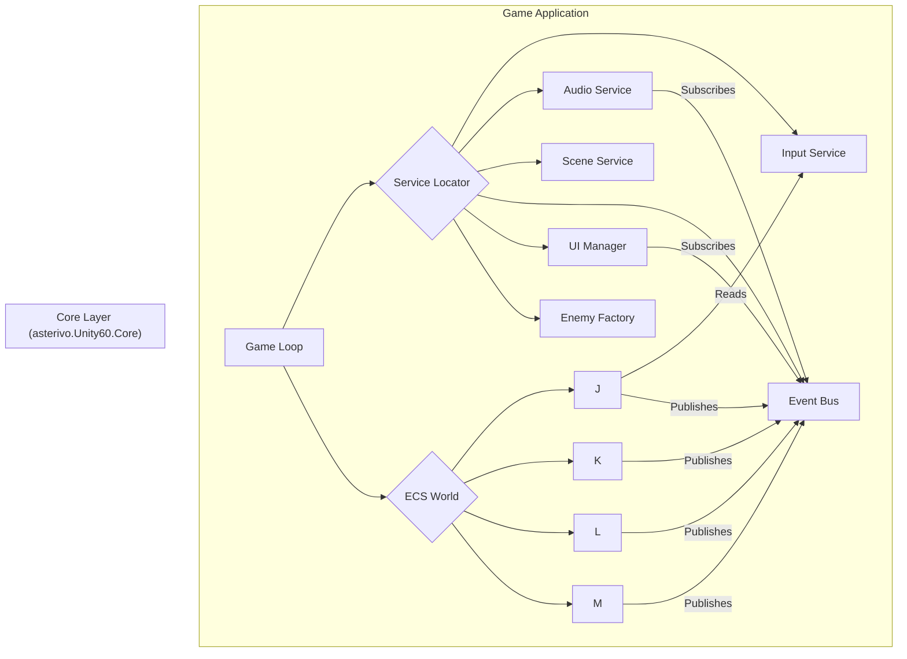

# **『汎用3Dプラットフォーマーゲーム』詳細設計書**

## **はじめに**

本ドキュメントは、『汎用3Dプラットフォーマーゲーム』ゲーム内容要件定義書に基づき、ゲームの技術的な実装方針を定める詳細設計書である。本作の「動かすこと自体の楽しさ」「探索と発見の喜び」「課題克服の達成感」というコアエクスペリエンスを実現するため、保守性、拡張性、そしてパフォーマンスに優れたソフトウェアアーキテクチャを採用する。

### **1. 設計思想と採用アーキテクチャ**

本設計では、以下の原則を遵守する。

* **疎結合 (Loose Coupling):** 各システムは互いに独立性を保ち、変更が他のシステムへ与える影響を最小限に抑える。  
* **単一責任の原則 (Single Responsibility Principle):** 各クラスやシステムは、単一の機能にのみ責任を持つ。  
* **データ指向設計 (Data-Oriented Design):** パフォーマンスを最大化するため、オブジェクト指向の階層構造よりも、データの連続性と効率的な処理を優先する。

これらの原則を実現するため、本作の基盤アーキテクチャとして**Entity Component System (ECS)** を採用する 1。ECSは、ゲーム内のすべてのオブジェクトを「エンティティ（Entity）」、その属性を「コンポーネント（Component）」、そして振る舞いを「システム（System）」として分離することで、高いパフォーマンスと柔軟な設計を可能にする 3。

### **2. 主要デザインパターン**

ECSアーキテクチャを補完し、コードの構造化と再利用性を高めるため、以下のデザインパターンを積極的に活用する。

* **Service Locator パターン:** ゲーム全体で共有されるべきグローバルなサービス（入力管理、音声管理など）へのアクセスを一元化し、依存関係を疎結合に保つ 5。これは本設計の中核をなす。  
* **State パターン:** プレイヤーや敵キャラクターの複雑な状態遷移（待機、移動、攻撃など）を、クリーンかつ管理しやすく実装する 7。  
* **Factory パターン (Object Pooling併用):** 敵やアイテムなど、動的に生成されるオブジェクトの生成プロセスをカプセル化し、オブジェクトプーリングと組み合わせることでパフォーマンスのオーバーヘッドを削減する 9。  
* **Observer パターン (Event Bus):** システム間の通信を非同期のイベント駆動型にすることで、システム間の直接的な依存関係を排除し、完全な疎結合を実現する 11。

---

## **第1章: 全体アーキテクチャ**

### **1.1. アーキテクチャ概要図**




### **1.2. Service Locator パターン**

本作の依存性管理の根幹をなす。ゲーム全体で唯一のインスタンスを持つべきサービス群へのアクセスポイントを提供する 5。

#### **1.2.1. ServiceLocator クラス設計**

静的クラスとして実装し、各サービスへのアクセスを提供する。

C#
```csharp
// ServiceLocator.cs (概念コード)  
public static class ServiceLocator  
{  
    private static Dictionary<Type, object> services = new Dictionary<Type, object>();

    public static void Register<T>(T service)  
    {  
        services = service;  
    }

    public static T Get<T>()  
    {  
        try  
        {  
            return (T)services;  
        }  
        catch (KeyNotFoundException)  
        {  
            throw new ApplicationException($"Service of type {typeof(T)} is not registered.");  
        }  
    }

    public static void Cleanup()  
    {  
        services.Clear();  
    }  
}
```

#### **1.2.2. 主要サービスインターフェース**

ServiceLocatorに登録される主要なサービスは、インターフェースを通じて定義される。

* IInputService: プレイヤーのコントローラー入力を抽象化する。  
* IAudioService: サウンドエフェクトやBGMの再生を管理する。  
* ISceneService: シーン（ステージ）のロードや遷移を管理する。  
* IEventBus: ゲーム内イベントの発行と購読を管理する (Observerパターン)。  
* IUIManager: UIの表示・非表示や更新を管理する。  
* IEnemyFactory: 敵キャラクターの生成を管理する (Factoryパターン)。

これらのサービスは、ゲーム起動時の初期化シーケンスでインスタンス化され、ServiceLocator.Register()を通じて登録される。

---

## **第2章: プレイヤーキャラクターシステム詳細設計 (ECS準拠)**

要件定義書第2章「コアゲームプレイとプレイヤーアクション」を実装する。

### **2.1. プレイヤーエンティティとコンポーネント**

プレイヤーは単一のエンティティとして表現され、以下のコンポーネントが付与される。

* PlayerTag: プレイヤーエンティティを識別するためのタグコンポーネント。  
* TransformComponent: 位置、回転、スケール情報。  
* PhysicsComponent: 速度、加速度、重力などの物理情報。  
* InputComponent: IInputServiceから受け取った入力状態を保持する。  
* HealthComponent: 現在の体力と最大体力。  
* PlayerStateComponent: 現在のプレイヤーの状態を保持する (Stateパターン用)。  
  C#  
```csharp
  public enum PlayerState { Idle, Walking, Running, Jumping, Falling, Attacking, Capturing }  
  public struct PlayerStateComponent : IComponentData  
  {  
      public PlayerState CurrentState;  
      public float StateTimer;  
  }
```

* ActionAbilityComponent: 実行可能なアクション（ダブルジャンプ可能かなど）をフラグで管理。

### **2.2. プレイヤーアクションを実現するシステム群**

各アクションは、特定のコンポーネントをクエリし、ロジックを実行する個別のシステムとして実装される。

#### **2.2.1. PlayerInputSystem**

* **責務:** ServiceLocator.Get<IInputService>() を通じて毎フレーム入力を取得し、プレイヤーエンティティの InputComponent に書き込む。  
* **実行順序:** 全てのプレイヤー関連システムの先頭で実行される。

#### **2.2.2. PlayerStateSystem (Stateパターン)**

* **責務:** プレイヤーの InputComponent と PhysicsComponent (接地状態など) を監視し、PlayerStateComponent の CurrentState を更新する。状態遷移のロジックのみを担当する。  
  * 例: CurrentStateがGroundedでInputComponentに移動入力があれば、CurrentStateをWalkingに変更する。

#### **2.2.3. 各状態に対応する振る舞いシステム**

PlayerStateSystemによって決定された状態に基づき、具体的な振る舞いを実装する。

* **PlayerMovementSystem:**  
  * **対象:** PlayerStateComponent.CurrentState が Walking または Running のエンティティ。  
  * **処理:** InputComponent の移動ベクトルに基づき、PhysicsComponent の速度を更新する。スティックの傾きに応じて歩きと走りを切り替える。  
* **PlayerJumpSystem:**  
  * **対象:** PlayerStateComponent.CurrentState が Jumping のエンティティ。  
  * **処理:** 通常ジャンプ、ダブルジャンプ、壁キック、走り幅跳び、バック宙などのロジックを実装。InputComponent のボタン押下時間や入力シーケンス、ActionAbilityComponent のフラグを参照する。  
* **PlayerAttackSystem:**  
  * **対象:** PlayerStateComponent.CurrentState が Attacking のエンティティ。  
  * **処理:** 基本攻撃のコンボ、ヒップドロップ、ボディアタックなどを実装。攻撃判定を生成し、ServiceLocator.Get<IEventBus>().Publish() を通じて AttackHitEvent を発行する。

#### **2.2.4. EchoDeviceSystem (固有メカニクス)**

* **責務:** 「エコーデバイス」に関連するすべてのアクションを管理する。  
* **処理:**  
  * **デバイススロー:** プレイヤーの InputComponent に基づき、EchoDeviceエンティティを生成する。  
  * **デバイスホールド:** 投げられたEchoDeviceエンティティを空中に静止させる。  
  * **デバイスジャンプ:** プレイヤーがEchoDeviceエンティティを踏み台にした際のジャンプ処理。  
  * **エコーキャプチャー:** EchoDeviceがキャプチャー可能なエンティティに接触した際、ServiceLocator.Get<IEventBus>().Publish() を通じて CaptureEvent を発行する。PlayerStateSystemがこのイベントを購読し、プレイヤーの状態を Capturing に遷移させ、キャプチャー対象の能力に対応するコンポーネントをプレイヤーエンティティに一時的に付与する。

---

## **第3章: 敵キャラクターシステム詳細設計**

要件定義書第5章「敵キャラクターとAI」を実装する。

### **3.1. 敵エンティティとコンポーネント**

* EnemyTag: 敵エンティティを識別するタグ。  
* EnemyTypeComponent: ウォーカー、シューターなどのアーキタイプを定義するenum。  
* AIStateComponent: 敵の現在のAI状態を保持する (Stateパターン用)。  
  C#  
```csharp
  public enum AIState { Patrol, Chase, Attack, Cooldown, Stunned }  
  public struct AIStateComponent : IComponentData  
  {  
      public AIState CurrentState;  
      public Entity Target;  
      public float StateTimer;  
  }
```

* StatsComponent: 体力、攻撃力、移動速度などの基本ステータス。  
* LootComponent: 倒された際にドロップするアイテムの情報。

### **3.2. EnemyFactory (Factoryパターン & Object Pooling)**

* **責務:** 敵エンティティの生成と破棄を管理する。内部でオブジェクトプーリングを実装し、パフォーマンスを最適化する 10。  
* **インターフェース (IEnemyFactory):**  
  C#  
```csharp
  public interface IEnemyFactory  
  {  
      Entity CreateEnemy(EnemyType type, Vector3 position);  
      void ReturnEnemy(Entity enemy);  
  }
```

* **実装:**  
  1. ゲーム開始時に、各敵アーキタイプのプレハブから一定数をプールしておく。  
  2. CreateEnemyが呼ばれると、プールから非アクティブなエンティティを取得し、初期化して返す。プールが空の場合は新規に生成する。  
  3. ReturnEnemyが呼ばれると、エンティティを非アクティブ化し、プールに戻す。  
* **利用:** EnemySpawnerシステムなどが ServiceLocator.Get<IEnemyFactory>() を通じて利用する。

### **3.3. 敵AIシステム群 (Stateパターン)**

プレイヤーと同様に、状態遷移を司るシステムと、各状態の振る舞いを実装するシステムに分割する。

* **AISensingSystem:**  
  * **責務:** 全ての敵エンティティの索敵ロジックを実行する。視覚・聴覚範囲内にプレイヤーが入ったかを判定する。  
* **AIStateTransitionSystem:**  
  * **責務:** AISensingSystemの結果や自身の状態（攻撃後のクールダウンなど）に基づき、AIStateComponent の CurrentState を更新する。  
  * 例: Patrol中にプレイヤーを発見したらChaseに、Chase中に攻撃範囲内に入ったらAttackに遷移させる。  
* **各状態に対応する振る舞いシステム:**  
  * **AIPatrolSystem:** CurrentStateがPatrolの敵を、設定された巡回ルートに沿って移動させる。  
  * **AIChaseSystem:** CurrentStateがChaseの敵を、ターゲット（プレイヤー）に向かって移動させる。  
  * **AIAttackSystem:** CurrentStateがAttackの敵に、アーキタイプ固有の攻撃（近接攻撃、遠距離射撃など）を実行させる。

---

## **第4章: UI/HUDシステム詳細設計**

要件定義書第9章「ユーザーインターフェース（UI）とヘッドアップディスプレイ（HUD）」を実装する。

### **4.1. UIManager (Service Locator)**

* **責務:** UI全体の管理を行うサービス。ポーズメニューの表示/非表示、画面遷移時のフェードイン/アウトなどを担当する。  
* **アクセス:** ServiceLocator.Get<IUIManager>() を通じて、任意のシステムからUI操作を要求できる。

### **4.2. HUDの更新 (Observerパターン)**

HUDの各要素（体力、通貨数など）は、ゲームロジックから直接操作されるのではなく、EventBusを介して間接的に更新される。これにより、UIとゲームプレイロジックの完全な分離を達成する 11。

#### **4.2.1. イベント定義**

HUD更新のトリガーとなるイベントを定義する。

C#
```csharp
public struct PlayerHealthChangedEvent  
{  
    public int CurrentHealth;  
    public int MaxHealth;  
}

public struct CurrencyChangedEvent  
{  
    public int NewAmount;  

public struct PlayerHealthChangedEvent  
{  
    public int CurrentHealth;  
    public int MaxHealth;  
}

public struct CurrencyChangedEvent  
{  
    public int NewAmount;  
}
```

#### **4.2.2. イベントの発行**

関連するゲームプレイシステムが、状態の変化時にイベントを発行する。

* **PlayerDamageSystem:** プレイヤーがダメージを受けた際、HealthComponentを更新し、ServiceLocator.Get<IEventBus>().Publish(new PlayerHealthChangedEvent {... }); を呼び出す。  
* **ItemCollectionSystem:** プレイヤーが通貨アイテムを収集した際、ServiceLocator.Get<IEventBus>().Publish(new CurrencyChangedEvent {... }); を呼び出す。

#### **4.2.3. イベントの購読とUI更新**

HUDを管理するUIスクリプト（例: HealthBarView.cs）が、EventBusを購読し、イベント受信時に自身の表示を更新する。

C#

```csharp
// HealthBarView.cs (概念コード)  
public class HealthBarView : MonoBehaviour  
{  
    void OnEnable()  
    {  
        ServiceLocator.Get<IEventBus>().Subscribe<PlayerHealthChangedEvent>(OnHealthChanged);  
    }

    void OnDisable()  
    {  
        ServiceLocator.Get<IEventBus>().Unsubscribe<PlayerHealthChangedEvent>(OnHealthChanged);  
    }

    private void OnHealthChanged(PlayerHealthChangedEvent e)  
    {  
        // UIのゲージ表示を e.CurrentHealth / e.MaxHealth に基づいて更新する  
    }  
}
```

この設計により、将来的に体力の表示方法を変更する場合でも、PlayerDamageSystemなどのコアなゲームプレイロジックに一切変更を加える必要がなくなる。

---

## **第5章: 結論**

本詳細設計書は、ECSアーキテクチャを基盤とし、Service Locator、State、Factory、Observerといった実証済みのデザインパターンを組み合わせることで、要件定義書に示された高品質な3Dプラットフォーマーゲームを実現するための技術的な道筋を示すものである。

特に、**Service Locatorパターン**を介したグローバルサービスへのアクセスと、**Observerパターン（Event Bus）**によるシステム間の疎結合な通信は、開発プロセス全体を通じてコードの柔軟性、保守性、テスト容易性を大幅に向上させる。この堅牢なアーキテクチャ基盤の上に、プレイヤーアクション、敵AI、UIといった各要素を体系的に実装していくことで、要件定義書が目指すコアエクスペリエンスを効率的かつ高品質に実現することが可能となる。

#### **引用文献**

1. 【Rustのまほう2】#2 Entity Component Systemの基本 #ゲーム制作 - Qiita, 9月 17, 2025にアクセス、 [https://qiita.com/hiruberuto/items/9cb625a0a8f253764bd8](https://qiita.com/hiruberuto/items/9cb625a0a8f253764bd8)  
2. Unity2022.2からのECS入門【Advent Calendar 12/6】 - Colorful Palette, 9月 17, 2025にアクセス、 [https://media.colorfulpalette.co.jp/n/n669486062bf7](https://media.colorfulpalette.co.jp/n/n669486062bf7)  
3. ECSの仕組みを理解し、使いどころを把握する - e.blog, 9月 17, 2025にアクセス、 [https://edom18.hateblo.jp/entry/2024/04/07/172558](https://edom18.hateblo.jp/entry/2024/04/07/172558)  
4. エンティティ・コンポーネント・システム - Wikipedia, 9月 17, 2025にアクセス、 [https://ja.wikipedia.org/wiki/%E3%82%A8%E3%83%B3%E3%83%86%E3%82%A3%E3%83%86%E3%82%A3%E3%83%BB%E3%82%B3%E3%83%B3%E3%83%9D%E3%83%BC%E3%83%8D%E3%83%B3%E3%83%88%E3%83%BB%E3%82%B7%E3%82%B9%E3%83%86%E3%83%A0](https://ja.wikipedia.org/wiki/%E3%82%A8%E3%83%B3%E3%83%86%E3%82%A3%E3%83%86%E3%82%A3%E3%83%BB%E3%82%B3%E3%83%B3%E3%83%9D%E3%83%BC%E3%83%8D%E3%83%B3%E3%83%88%E3%83%BB%E3%82%B7%E3%82%B9%E3%83%86%E3%83%A0)  
5. Unityの設計パターンを徹底比較！シングルトン・サービスロケーター・イベント駆動の違いと使い方, 9月 17, 2025にアクセス、 [https://cbagames.jp/2025/03/06/unity-singleton-service-event-comparison/](https://cbagames.jp/2025/03/06/unity-singleton-service-event-comparison/)  
6. Beginning Game Development: Service Locator Pattern | by Lem Apperson | Medium, 9月 17, 2025にアクセス、 [https://medium.com/@lemapp09/beginning-game-development-service-locator-pattern-9becb037e982](https://medium.com/@lemapp09/beginning-game-development-service-locator-pattern-9becb037e982)  
7. Building a State Machine in Unity With C# | by Haki - Medium, 9月 17, 2025にアクセス、 [https://medium.com/@jojackblack/building-a-state-machine-in-unity-with-c-b1c7c9c80a04](https://medium.com/@jojackblack/building-a-state-machine-in-unity-with-c-b1c7c9c80a04)  
8. The State Pattern with C# and Unity - One Wheel Studio, 9月 17, 2025にアクセス、 [https://onewheelstudio.com/blog/2020/6/16/the-state-pattern](https://onewheelstudio.com/blog/2020/6/16/the-state-pattern)  
9. Factory Design Pattern Unity | by Code_With_K - Medium, 9月 17, 2025にアクセス、 [https://medium.com/@Code_With_K/enhancing-unity-game-development-with-the-factory-method-design-pattern-74163614a6ac](https://medium.com/@Code_With_K/enhancing-unity-game-development-with-the-factory-method-design-pattern-74163614a6ac)  
10. Object Pooling: A Design Pattern for Games in Unity | by Seyyid Yiğit | Huawei Developers, 9月 17, 2025にアクセス、 [https://medium.com/huawei-developers/object-pooling-a-design-pattern-for-games-in-unity-52bb29e2170f](https://medium.com/huawei-developers/object-pooling-a-design-pattern-for-games-in-unity-52bb29e2170f)  
11. オブザーバーパターン（Observer Pattern）｜(非公式和訳）Unity - level up your code with game programming patterns - Zenn, 9月 17, 2025にアクセス、 [https://zenn.dev/twugo/books/21cb3a6515e7b8/viewer/e833a7](https://zenn.dev/twugo/books/21cb3a6515e7b8/viewer/e833a7)  
12. 【Unity】公式サンプルプロジェクトから学ぶデザインパターン：Observer, 9月 17, 2025にアクセス、 [https://www.karvan1230.com/entry/2022/12/13/200618](https://www.karvan1230.com/entry/2022/12/13/200618)  
13. Unityでサービスロケーター(ServiceLocator)を活用する - C# - Qiita, 9月 17, 2025にアクセス、 [https://qiita.com/ozaki_shinya/items/9eb0f827caa6a4108888](https://qiita.com/ozaki_shinya/items/9eb0f827caa6a4108888)  
14. Object Pooling Architecture : r/unity - Reddit, 9月 17, 2025にアクセス、 [https://www.reddit.com/r/unity/comments/1m5pz7w/object_pooling_architecture/](https://www.reddit.com/r/unity/comments/1m5pz7w/object_pooling_architecture/)
