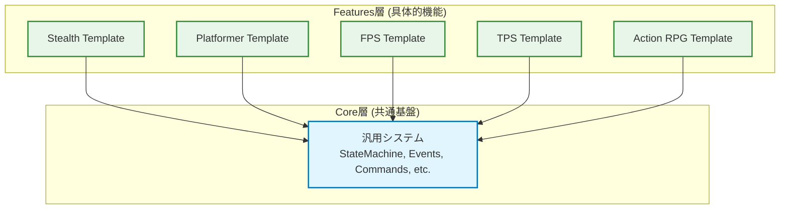

# 各ゲームテンプレートとCore層の依存関係について

## 1. 基本的な設計原則

このプロジェクトにおける各ゲームテンプレート（`Stealth`, `Platformer`, `FPS`など）は、**他のテンプレートに直接依存しない**という厳格な設計原則に基づいています。

すべてのテンプレートは、プロジェクトの**Core層**が提供する共通の基盤システム（`Core Systems`）にのみ依存します。これにより、各テンプレートは完全に独立したモジュールとして機能します。

## 2. 依存関係の構造

以下の図は、テンプレートとCore層の依存関係を視覚的に表したものです。

図が示すように、テンプレート間の横方向の依存関係（矢印）は一切存在しません。

## 3. この設計のメリット

このような独立した設計には、主に3つのメリットがあります。

### 3.1. モジュール性の確保
各テンプレートは自己完結したパッケージとなっています。これにより、特定のジャンルのプロジェクトを開始する際に、不要な他のテンプレートのコードやアセットを含めることなく、必要なものだけを利用できます。

### 3.2. 関心事の分離 (Separation of Concerns)
各テンプレートは、特定のゲームジャンルを実装するという単一の責任を持ちます。テンプレート間で依存関係が発生すると、あるテンプレートの変更が他のテンプレートに予期せぬ影響を与える「スパゲッティ化」のリスクが高まります。この設計は、そのリスクを根本的に排除します。

### 3.3. 高い拡張性
新しいゲームジャンルのテンプレート（例：`Strategy Template`）を追加する場合、既存のテンプレートに一切変更を加えることなく、Core層の機能を利用して新しいテンプレートを安全に追加できます。

## 4. 共通機能の扱い
複数のテンプレートで共有したい機能（例：高度なインベントリシステム）が必要になった場合、その機能を特定のテンプレート（例：`Action RPG Template`）に実装するのではなく、`Assets/_Project/Features/Inventory` のような**共有の機能モジュール**として独立して実装します。

そして、その機能を必要とする各テンプレートが、その共有モジュールを参照する形を取ります。これにより、テンプレート間の直接的な依存関係を回避し、設計原則を維持します。

## 5. 結論
このプロジェクトのテンプレートアーキテクチャは、**Core層への一方向依存**を徹底することで、高いモジュール性、保守性、拡張性を実現しています。各テンプレートは独立しており、相互に依存することはありません。
