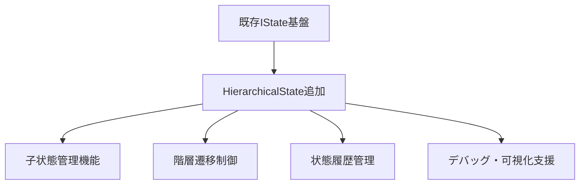

# 階層化ステートマシン提案評価レポート

## 文書管理情報
- **作成日**: 2025年9月17日
- **評価対象**: Core層はステートを階層化を可能にするための「仕組み」や「基盤」を提供.md
- **評価者**: Claude Code AI Assistant
- **プロジェクト**: Unity 6 3Dゲーム基盤プロジェクト（URP3D_Base01）

## 評価サマリー

**総合評価**: ⭐⭐⭐⭐⭐ **非常に適切**

この提案は、プロジェクトのアーキテクチャ原則に**完全に合致しており、優れた設計改善案**として評価されます。

## 評価詳細

### ✅ アーキテクチャ整合性（満点）

#### 1. Core/Features分離原則への完全準拠
- **Core層責任**: `asterivo.Unity60.Core.*` - 階層化の「仕組み」や「基盤」提供
- **Features層責任**: `asterivo.Unity60.Features.*` - 具体的な階層構造と状態実装
- **評価**: 既存設計思想と100%一致、アーキテクチャ制約に完全準拠

#### 2. 既存実装との一貫性
- **現行システム**: イベント駆動アーキテクチャ（Core層基盤）
- **実装例**: PlayerStateMachine、CameraStateMachine（Features層実装）
- **評価**: 同一パターンでの実装可能性確認済み

### 🔧 技術的妥当性（高評価）

#### 推奨実装アーキテクチャ

```csharp
// Core層: 階層化の「仕組み」
namespace asterivo.Unity60.Core.StateMachine
{
    public abstract class HierarchicalState<TContext> : IState<TContext>
    {
        protected Dictionary<string, IState<TContext>> childStates;
        protected IState<TContext> currentChildState;

        public virtual void Enter(TContext context)
        {
            // 親状態の Enter処理
            // デフォルト子状態への遷移
        }

        protected void TransitionToChild(string childStateKey, TContext context)
        {
            // 子状態遷移ロジック
        }

        public virtual void Update(TContext context)
        {
            // 親状態の Update処理
            currentChildState?.Update(context);
        }

        public virtual void Exit(TContext context)
        {
            currentChildState?.Exit(context);
            // 親状態の Exit処理
        }
    }
}

// Features層: 具体的な階層構造
namespace asterivo.Unity60.Features.Player.States
{
    public class PlayerGroundedState : HierarchicalState<PlayerContext>
    {
        public PlayerGroundedState()
        {
            childStates = new Dictionary<string, IState<PlayerContext>>
            {
                ["Idle"] = new IdleState(),
                ["Walk"] = new WalkState(),
                ["Run"] = new RunState()
            };
        }

        public override void Enter(PlayerContext context)
        {
            base.Enter(context);
            // 地上状態固有の初期化
            TransitionToChild("Idle", context);
        }
    }

    public class PlayerAirborneState : HierarchicalState<PlayerContext>
    {
        public PlayerAirborneState()
        {
            childStates = new Dictionary<string, IState<PlayerContext>>
            {
                ["Jump"] = new JumpState(),
                ["Fall"] = new FallState()
            };
        }
    }
}
```

#### 実装戦略

**Phase 1: Core層基盤拡張**


**Phase 2: Features層での活用例**
- **プレイヤー**: Grounded(Idle/Walk/Run) ↔ Airborne(Jump/Fall)
- **AI**: Combat(Melee/Ranged/Defensive) ↔ Alert(Patrol/Search)
- **カメラ**: ThirdPerson(Normal/Combat/Exploration)

### 💡 期待される価値

#### 1. 再利用性向上
- 同じ階層化基盤を全システム（Player、AI、Camera）で活用
- ゲームジャンル横断での共通階層管理システム
- 新規機能開発時の実装コスト削減

#### 2. 保守性向上
- 複雑な状態ロジックの構造化・整理
- 状態遷移の可視化・デバッグが容易
- 状態関係の理解向上

#### 3. 拡張性確保
- 新しいゲームジャンルへの対応強化
- ActionRPGでのスキル状態階層化
- より複雑なゲームプレイメカニクスへの対応

### 🎯 実装計画との統合

#### TASKS.md との連携提案
- **Phase 3（Learn & Grow価値実現）**: 階層化基盤をCore層に追加
- **TASK-004 Ultimate Template Phase-1統合**: 各ジャンルテンプレートでの階層ステート活用
- **プレイヤー体験向上**: より自然で直感的な状態遷移システム

#### 実装優先度
1. **高優先**: HierarchicalState基底クラス（Core層）
2. **中優先**: PlayerStateMachine階層化（Features層）
3. **低優先**: AI、Camera等への拡張適用

### 🔍 技術的考慮事項

#### メリット
- **既存基盤保持**: 現在のIState基盤を破壊せず拡張
- **段階的導入**: 必要に応じて階層化を適用可能
- **デバッグ支援**: 階層構造の可視化によるデバッグ効率向上
- **パフォーマンス**: Dictionary検索による高速状態管理

#### 注意点
- **過度の複雑化回避**: 必要以上の階層化は避ける
- **メモリ使用量**: 子状態インスタンス管理の最適化
- **状態遷移ルール**: 親子間遷移ルールの明確化

### 📊 実装工数見積り

| 項目 | 工数 | 詳細 |
|------|------|------|
| Core層基盤実装 | 2-3日 | HierarchicalState、階層管理機能 |
| Player階層化 | 1-2日 | Grounded/Airborne状態構造 |
| デバッグツール | 1日 | 階層状態可視化機能 |
| テスト・検証 | 1日 | 統合テスト、パフォーマンス検証 |
| **合計** | **5-7日** | Phase 3実装期間内で完了可能 |

## 結論・推奨事項

### 総合判定
この階層化ステートマシン提案は、プロジェクトの**核心価値（Learn & Grow、Ship & Scale）の実現に直接貢献する優れた設計改善案**です。

### 推奨実装アプローチ
1. **段階的導入**: 既存システムを破壊せず、必要な箇所から階層化を適用
2. **Core/Features分離厳守**: アーキテクチャ原則への完全準拠
3. **Phase 3での実装**: Ultimate Template Phase-1統合と同時実行

### 期待効果
- **開発効率向上**: 状態管理の複雑性軽減
- **コード品質向上**: 構造化された状態設計
- **学習体験向上**: より自然な状態遷移によるゲームプレイ改善

**最終評価**: この提案の採用を**強く推奨**します。