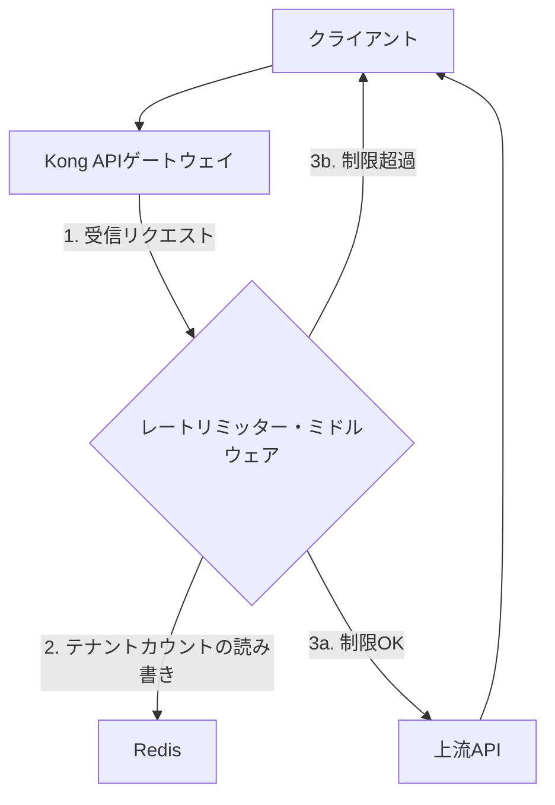
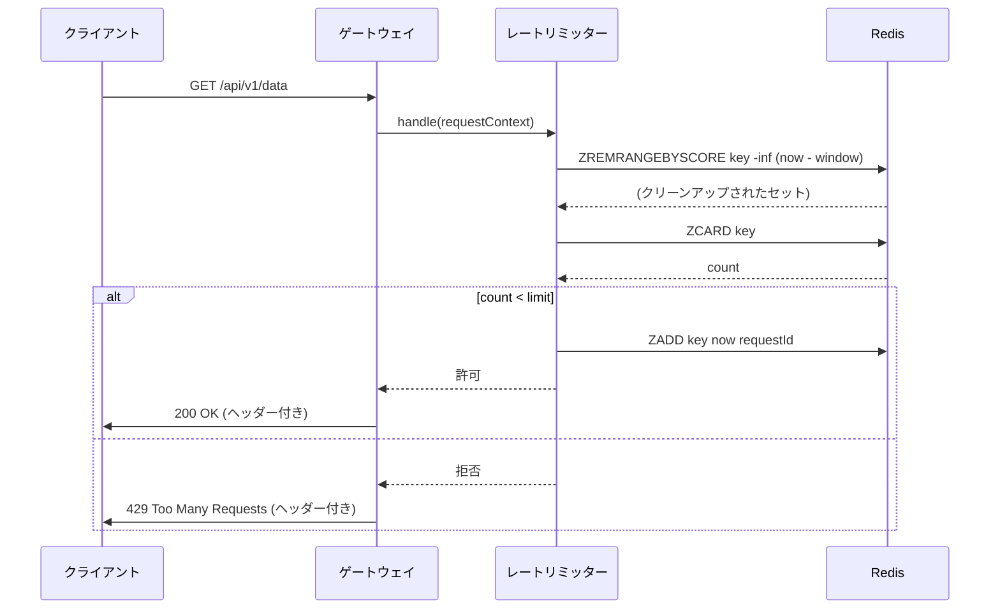

### **Claude Codeによるスペック駆動開発の実践ガイド：AI時代の設計・実装プロセス詳解**

---

### **第I部 パラダイムシフト：コードファーストからインテントファースト開発へ**

生成AIの台頭は、ソフトウェア開発の風景を根底から変えつつあります。この変革の中心にあるのは、単なるツールの進化ではなく、開発プロセスそのもののパラダイムシフトです。我々は、コードを最初に書く「コードファースト」のアプローチから、開発者の「意図（インテント）」を最初に定義する「インテントファースト」のアプローチへと移行する歴史的な転換点に立っています。この新しいパラダイムを支える中核的な方法論が、スペック駆動開発（Spec-Driven Development, SDD）です。本章では、なぜSDDがAI時代において再興し、不可欠なものとなったのか、その背景と開発者の役割の変化について詳述します。

---

#### **1.1 AI時代における仕様の再興**

近年のAIを活用した開発において、「Vibe Coding（バイブコーディング）」と呼ばれるアプローチが注目を集めました。これは、開発者の「感覚」や「雰囲気」を重視し、AIとの対話を通じて直感的かつ探索的にプロトタイプを迅速に構築する手法です 1。このアプローチはアイデアを素早く形にする上で優れた「発火装置」として機能します 2。しかし、そのスピードと引き換えに、プロジェクトの持続可能性という点で深刻な課題を抱えています。Vibe Codingによって生み出されたコードは、しばしば属人化し、チームでの共同開発や将来の機能追加の際に「これはどういう意図で書かれたのか？」という問題を引き起こし、技術的負債の温床となります 3。

AIは、その強力な生成能力にもかかわらず、曖昧さを増幅させるという特性を持ちます。曖昧な指示は、AIに「自信を持って間違ったコード」を生成させ、結果として過剰な設計、プロジェクトの文脈を無視した提案、そして手戻りの山を生み出します 4。この課題に対する体系的な解決策が、スペック駆動開発（SDD）です 5。SDDは、コードを書く前に「仕様（Spec）」を明確かつ構造的に記述し、その仕様を単一の信頼できる情報源（Single Source of Truth）として、設計、実装、テスト、ドキュメント化までを一貫して行う開発手法です 6。

歴史を振り返ると、仕様書を中心とした開発は新しい概念ではありません 7。しかし、従来のアプローチには、静的な仕様書と進化し続けるコードとの間に「乖離（ドリフト）」が生じるという致命的な欠点がありました 8。仕様書の更新は多大な労力を要し、しばしば実装から取り残され、その価値を失っていきました。

この歴史的な課題を解決したのが、現代の生成AIです。AIは、構造化された仕様書を直接解釈し、コードを生成することを可能にしました。これにより、仕様書はもはや単なるドキュメントではなく、「実行可能な成果物（Executable Artifact）」へと昇華したのです 9。仕様書を更新すれば、AIが関連するコード、テスト、さらにはダイアグラムまで再生成するため、仕様と実装の同期が保たれるようになりました 10。これにより、SDDはかつての欠点を克服し、AI時代の持続可能な開発プロセスの中核を担う方法論として再興したのです。

---

#### **1.2 問題の触媒と解決の実現者としてのAI**

現代におけるSDDの再興は、AIが持つ根本的なパラドックスに起因しています。AIの最大の弱点、すなわち「明確な指示なしに人間の意図を推論できないこと」が、厳格な仕様定義プロセスを不可欠にした一方で、AIの最大の強み、すなわち「構造化された仕様をコードに変換する能力」が、そのプロセスを初めて実用的かつ強力なものにしたのです。  
このメカニズムは、次のように段階的に理解することができます。AIコードジェネレーターは強力ですが、ビジネスの文脈、プロジェクト固有の制約、長期的なアーキテクチャのビジョンといった、人間が暗黙的に持つ知識を理解できません 11。  
開発者が構造化されていない「感覚的」なプロンプトを使用すると、AIはこれらの知識のギャップを統計的な推測で埋めようとします。その結果、しばしば欠陥のある、過剰に設計された、あるいは文脈にそぐわないコードが生成されます 12。これが、AIによって引き起こされた「曖昧性の危機」です。

この失敗モードは、コード生成の前に、開発の意図を明確かつ曖昧さなく記述するプロセスへの緊急の需要を生み出しました。  
歴史的に、詳細な仕様を作成する活動は、高いオーバーヘッドを伴う上に、前述の通り、仕様がコードの変更に追随できず陳腐化するという根本的な問題を抱えていました 13。  
しかし、現代のAI駆動ワークフローはこの関係を逆転させました。仕様書をコード生成のための直接的かつ機械可読なソースとすることで、「乖離」の問題が解消されます。仕様書は実行可能であるため、常に信頼できる情報源であり続けるのです 14。これが、AIによって可能になった「解決策」です。

結論として、強力でありながら文脈を理解できないAIの登場は、開発プロセスにおける曖昧性の危機を引き起こすと同時に、その危機を解決するために必要なツールそのものを提供しました。これにより、ソフトウェア開発業界は、より規律の取れた、意図中心の方法論の採用を余儀なくされたのです。

---

#### **1.3 エンジニアの新たな役割：建築家、指揮者、そして批評家**

SDDの導入は、ソフトウェアエンジニアの役割を根本的に変革します。従来、開発時間の約80%をコーディングに費やしていたモデルから、新たな時間配分へと移行します。それは、約50%を計画と仕様策定に、約20%をAI支援によるコーディングに、そして約30%を検証とテストに費やすというものです 15。エンジニアのアイデンティティは、「コードを書く人」から「システムを設計し、品質を保証する人」へと進化します 16。

この変化に伴い、重要となるスキルセットも変化します。  
最重要となるスキル :

* **システム思考** : 個々のコンポーネントがどのように連携し、全体として機能するかを理解する能力。  
* **正確な技術文書作成能力** : AIが誤解しようのない、明確で厳密な仕様を記述する能力。  
* **ドメインモデリング** : ビジネス要件を正確にソフトウェアの構造に落とし込む能力。  
* **要件分析** : ユーザーのニーズの背後にある本質的な課題を特定し、定義する能力。  
* **エッジケースの想像力** : システムが予期せぬ状況でどのように振る舞うべきかを予見し、仕様に盛り込む能力 17。

  相対的に重要度が低下するスキル :  
* **構文の暗記** : 特定の言語の細かい文法。  
* **定型的なアルゴリズムの実装** : よく知られた問題解決パターンの手作業によるコーディング。  
* **ボイラープレートコードの作成** : プロジェクトの初期設定や定型的なコードの記述 18。

  このシフトは、AIが開発者を不要にすることを意味するものではありません。むしろ、「AIを使う開発者が、AIを使わない開発者に取って代わる」時代の到来を告げています 19。人間の役割は、AIには不可能な、ビジネスコンテキストの提供、アーキテクチャに関する重要な意思決定、そして生成された成果物に対する批判的な品質保証といった、より高次の知的作業へと移行するのです 20。

---

### **第II部 Claude CodeによるSDDワークフロー：段階的フレームワーク**

AIを活用したスペック駆動開発は、単なる一連のタスクではなく、人間の意図を機械が実行可能な命令へと段階的に精緻化していくための、意図的に設計されたパイプラインです。このプロセスは、曖昧さを体系的に排除し、AIが利用可能なコンテキストを豊かにすることで、最終的な成果物の品質と正確性を最大化します。本章では、Claude Codeを用いたSDDの標準的なワークフローを、5つの明確なフェーズに分解して解説します。

---

#### **2.1 AI拡張SDDの5つのフェーズ**

様々な実践例から統合されたベストプラクティスは、SDDを以下の5つのフェーズに分けることを推奨しています 21。

* **フェーズ1: 構想とブレインストーミング (spec.md)** この最初のフェーズでは、「何を」「なぜ」作るのかという高レベルなビジョンを捉えます 22。技術的な詳細ではなく、解決すべき問題、ユーザージャーニー、そして成功の定義に焦点を当てます。この段階の成果物は、プロジェクトの目的と範囲を定義する、自然言語で記述されたドキュメントです 23。

* **フェーズ2: 形式化と文書化 (requirements.md)** 構想フェーズで生まれたアイデアを、構造化された要件定義書に変換します。このドキュメントは、機能要件と非機能要件を明確に分離し、それぞれに具体的な受け入れ基準（Acceptance Criteria）を設定します。また、「何をしないか」を定義する非目標（Non-Goals）も明記し、スコープの曖昧さを排除します 24。

* **フェーズ3: 設計と計画 (design.md)** 「どのように」作るかを定義する技術的な設計フェーズです。ここでは、アーキテクチャの選定、データモデルの定義、APIコントラクトの確立など、具体的な実装方針を決定します。このドキュメントは、技術的な意思決定の根拠と共に、システムの青写真を描き出します 25。

* **フェーズ4: 分解 (tasks.md)** 技術設計書で定義された計画を、具体的で実行可能なタスクのチェックリストに分解します。各タスクは、独立して実装・テストが可能な、管理しやすい最小単位の作業であるべきです 26。このタスクリストが、AIエージェントによる実装作業の直接的なロードマップとなります。

* **フェーズ5: 実行と検証** AIがタスクリストに従ってコードを生成し、人間がその出力を仕様書と照らし合わせてレビュー・検証する反復的なループです 27。このフェーズで最も重要な規律は、変更が必要になった場合、コードを直接修正するのではなく、必ず上流の仕様関連ドキュメント（requirements.mdやdesign.md）を先に更新することです。これにより、仕様書が常に「単一の信頼できる情報源」として維持されます 28。

---

#### **2.2 コンテキストを豊かにするパイプラインとしてのワークフロー**

この5フェーズからなるSDDワークフローは、単なるプロジェクト管理手法以上の意味を持ちます。それは、AIの出力を最大化するために設計された、洗練された多段階の「プロンプトエンジニアリング」プロセスと見なすことができます。各フェーズで生成されるドキュメントは、後続フェーズのための、より精緻で構造化されたプロンプトとして機能します。このプロセス全体が、曖昧さを段階的に排除し、AIのコンテキストを豊かにすることで、最終的な実装の正確性と文脈適合性を保証するのです。  
この「コンテキスト濃縮パイプライン」は以下のように機能します。  
プロセスは、高レベルでしばしば曖昧さを含む人間の意図を自然言語で捉えたspec.mdから始まります 29。これはパイプラインへの生の入力です。  
requirements.mdへの移行は、開発者にその意図を構造化させ、機能要件と非機能要件を分離し、明確な受け入れ基準を定義することを強制します 30。これが、コンテキストを豊かにし、曖昧さを削減する第一の層です。この時点で、AIはプロジェクトの境界と成功条件を理解します。

design.mdフェーズは、requirements.mdで定義された抽象的な「何を」を、具体的な「どのように」に変換します 31。アーキテクチャ、データモデル、APIコントラクトを定義することで、開発者はAIに技術的な足場を提供します。これが、より深く、第二のコンテキスト濃縮層となります。

最後に、tasks.mdは設計を可能な限り最小の作業単位に原子化します 32。これにより、AIは各生成ステップにおいて非常に焦点を絞った、曖昧さのないプロンプトを受け取ることができ、逸脱したり誤った仮定をしたりする可能性が最小限に抑えられます。

したがって、このワークフロー全体は一種の漏斗（ファネル）として機能します。上部で広範で曖昧な人間の意図を受け取り、一連の構造化された変換を通じて、下部から正確でコンテキストが豊富な、機械が実行可能な命令のストリームを送り出すのです。この意図的で段階的なコンテキストの濃縮こそが、AIを用いたSDDを効果的に機能させる中核的なメカニズムなのです。

---

### **第III部 SDDの成果物：Markdownファイルの詳細分析**

この章では、SDDプロセスの核心である具体的な成果物、すなわちMarkdownファイル群について、その役割、構造、そして記載内容を詳細に分析します。ここでは、一貫した理解を促すため、非自明なサンプルプロジェクトとして**「マルチテナントSaaSアプリケーション向けAPIレート制限サービス」**の構築を例に取り上げます。

---

#### **3.1 一目でわかるSDD成果物**

詳細な分析に入る前に、各成果物の役割を一覧で示します。この表は、プロセス全体の構造を俯瞰するための地図として機能します。

| 成果物 (ファイル名) | 中核的な目的 | 主要な内容 | 主な作成者 | 検証の焦点 |
| :---- | :---- | :---- | :---- | :---- |
| **spec.md (またはPRD.md)** | 初期の高レベルなビジョンとユーザー中心の目標を捉える | 問題提起、ユーザーストーリー、成功指標、大まかなスコープ | 人間（プロダクトマネージャー/エンジニア） | 正しいビジネス課題を解決しているか？ユーザージャーニーは正確か？ |
| **requirements.md** | spec.mdを構造化し、曖昧さのない公式な要件として定義する | システムスコープ、機能要件（受け入れ基準含む）、非機能要件 | AI (人間がレビュー) | 要件は完全か？曖昧さはないか？各要件はテスト可能か？ |
| **design.md** | 要件を具体的な技術的実装戦略に変換する | アーキテクチャ概要（図含む）、データモデル、APIコントラクト、技術スタック | AI (人間がレビュー) | 非機能要件を満たしているか？アーキテクチャは健全か？ |
| **tasks.md** | 技術設計を、実行可能な最小単位のタスクリストに分解する | 実装手順のチェックリスト | AI (人間がレビュー) | タスクは論理的に分解されているか？各タスクは独立して実行可能か？ |

---

#### **3.2 基礎となる青写真: spec.md (または PRD.md)**

目的と役割  
spec.mdは、すべての始まりとなる foundational document です。技術的な決定が下される前に、プロジェクトの「意図」、すなわち「何を」「なぜ」作るのかを捉えます 33。これは、ユーザーとビジネスの視点から見た成功の姿を定義する契約書であり、プロダクト要求仕様書（Product Requirements Document, PRD）に相当します。  
**必須コンポーネント**

* **問題提起 (Problem Statement)** : なぜこのシステムを構築するのか。  
* **成功指標 (Success Metrics)** : プロジェクトの成功をどのように測定するか。  
* **ユーザーストーリー/ジャーニー (User Stories/Journeys)** : 誰が、どのようにシステムを利用するのか。  
* **スコープ (Scope)** : 何を対象とし（In-Scope）、何を対象としないか（Out-of-Scope）。  
* **非目標 (Non-Goals)** : 意図的に「行わない」ことを明記する 34。

* **制約 (Constraints)** : 技術的、ビジネス的、リソース的な制約。

詳細な内容サンプル (レート制限サービス)  
spec.md: APIレート制限サービス  
1. 問題提起  
当社のマルチテナントSaaSプラットフォームでは、一部のテナントが不相応な量のAPIリソースを消費することにより、ピーク時にパフォーマンスの低下が発生しています。  
これは、すべてのユーザーに対するサービスの安定性と可用性に影響を与えます。  
公正な利用ポリシーを施行し、リソースの枯渇からプラットフォームを保護するための専用サービスが必要です。  
**2. 成功指標**

* デプロイ後1四半期以内に、ピーク時のp99 APIレイテンシを20%削減する。  
* APIリソースの枯渇に起因するプラットフォーム全体の停止をなくす（インシデントをゼロにする）。  
* APIのパフォーマンスと安定性に関して、エンタープライズ層の顧客から90%の満足度評価を達成する。

**3. ユーザーストーリー**

* **US-01 (管理者)** : プラットフォーム管理者として、異なるサブスクリプション階層（例: 無料、プロ、エンタープライズ）ごとに異なるレート制限を設定し、公正なリソース割り当てを確実にしたい。  
* **US-02 (開発者)** : APIを利用する開発者として、レート制限を超えた際にHTTPステータスコード（429）およびレスポンスヘッダー（X-RateLimit-Limit, X-RateLimit-Remaining, X-RateLimit-Reset）を通じて明確なフィードバックを受け取り、クライアントアプリケーションで適切なバックオフとリトライロジックを実装できるようにしたい。  
* **US-03 (管理者)** : プラットフォーム管理者として、テナントごとのリアルタイムのレート制限消費を監視するダッシュボードを用いて、不正な振る舞いを特定したい。

4. スコープ  
対象内

* サブスクリプション階層に基づくテナントごとのレート制限。  
* リクエストをカウントするためのスライディングウィンドウアルゴリズム。  
* APIレスポンスにおける標準的なレート制限ヘッダーの返却。

**対象外**

* ユーザー認証・認可（有効で認証済みのリクエストを前提とする）。  
* IPベースのレート制限。  
* API超過利用に対する課金。

**5. 非目標**

* このサービスはユーザー認証を処理**しない**。上流のAPIゲートウェイから、テナントとユーザーのコンテキストを含む有効なJWTが渡されることを前提とする。  
* このサービスは、スライディングウィンドウアルゴリズムに必要な期間を超えて、分析のための過去の利用データを永続化**しない**。

**6. 制約**

* レート制限のチェックは、各APIリクエストに10ms未満のレイテンシしか追加してはならない。  
* システムは高可用性を持ち、水平方向にスケーラブルでなければならない。  
* 既存のAPIゲートウェイ（Kong）と統合しなければならない。  
* 可能な限り既存の技術スタック（Node.js, Redis）を使用しなければならない。

Claude Codeとの連携  
このspec.mdを基に、次のフェーズであるrequirements.mdの生成をAIに指示します。  
サンプルプロンプト:

/spec-create "この spec.md から requirements.md を生成してください。ユーザーストーリーを公式な機能要件リストに展開し、制約セクションに基づいてパフォーマンスやセキュリティなどの非機能要件を特定・リストアップしてください。" 35

---

#### **3.3 形式化された契約書: requirements.md**

目的と役割  
requirements.mdは、spec.mdからAIによって生成されることが多い、構造化され形式化されたドキュメントです。これは要件に関する曖昧さのない情報源として機能し、機能要件と非機能要件を明確に分離することで、追跡とテストを容易にします 36。  
**必須コンポーネント**

* **システムスコープ (System Scope)** : システムが責任を持つ範囲の明確な定義。  
* **機能要件 (Functional Requirements)** : 各要件に対する具体的な受け入れ基準（Acceptance Criteria）を含む。  
* **非機能要件 (Non-Functional Requirements)** : パフォーマンス、スケーラビリティ、セキュリティ、可用性など。

詳細な内容サンプル (レート制限サービス)  
requirements.md: APIレート制限サービス  
1. システムスコープ  
このシステムは、テナントごとにAPIリクエストのレート制限を適用する責務を持つミドルウェアサービスである。  
上流のAPIゲートウェイからリクエストコンテキスト（テナントIDと階層を含む）を受け取り、設定された制限に対してリクエストを評価し、リクエストの続行を許可するか、429ステータスコードで拒否する。  
2. 機能要件  
FR-01: 階層ベースの制限

* **説明**: システムは、テナントのサブスクリプション階層に基づいてレート制限を適用しなければならない。  
* **受け入れ基準**:  
  * AC-1.1: システムは、「無料」階層のテナントに100リクエスト/分の制限を適用しなければならない(MUST)。  
  * AC-1.2: システムは、「プロ」階層のテナントに1000リクエスト/分の制限を適用しなければならない(MUST)。  
  * AC-1.3: システムは、「エンタープライズ」階層のテナントに10,000リクエスト/分の制限を適用しなければならない(MUST)。  
  * AC-1.4: 制限の設定は、サービスを再起動することなく動的に更新可能でなければならない(MUST)。

**FR-02: レート制限のレスポンスヘッダー**

* **説明**: リクエストが評価された際、レスポンスには標準的なレート制限ヘッダーが含まれなければならない。  
* **受け入れ基準**:  
  * AC-2.1: 評価されたリクエストへのレスポンスには、現在のウィンドウの合計制限を示すX-RateLimit-Limitヘッダーが含まれなければならない(MUST)。  
  * AC-2.2: レスポンスには、現在のウィンドウで残っているリクエスト数を示すX-RateLimit-Remainingヘッダーが含まれなければならない(MUST)。  
  * AC-2.3: レスポンスには、制限がリセットされるUTCエポックタイムを示すX-RateLimit-Resetヘッダーが含まれなければならない(MUST)。

**FR-03: 制限超過時のレスポンス**

* **説明**: テナントがレート制限を超えた場合、システムはリクエストを拒否しなければならない。  
* **受け入れ基準**:  
  * AC-3.1: システムは、HTTPステータスコード429 Too Many Requestsを返さなければならない(MUST)。  
  * AC-3.2: レスポンスボディには、人間が読める形式のエラーメッセージを含むJSONオブジェクトを含めるべきである(SHOULD)。

3. 非機能要件  
NFR-01: パフォーマンス

* **説明**: API全体のレイテンシに影響を与えないよう、レート制限のチェックは極めて高速でなければならない。  
* **受け入れ基準**:  
  * AC-4.1: レート制限ロジックのp99レイテンシ（ネットワークオーバーヘッドを除く）は、10ms未満でなければならない(MUST)。

**NFR-02: スケーラビリティ**

* **説明**: システムは、本番プラットフォームの全トラフィック負荷を処理できなければならない。  
* **受け入れ基準**:  
  * AC-5.1: システムは水平方向にスケーラブルであり、最大50,000リクエスト/秒を処理できなければならない(MUST)。

**NFR-03: 可用性**

* **説明**: レート制限サービスは、単一障害点であってはならない。  
* **受け入れ基準**:  
  * AC-6.1: システムは99.99%の可用性を持たなければならない(MUST)。  
  * AC-6.2: レート制限サービスのデータストア（例: Redis）に障害が発生した場合、プラットフォーム全体の停止を防ぐため、システムはフェイルオープン（すなわち、すべてのリクエストを通過させる）しなければならない(MUST)。

Claude Codeとの連携  
この形式化された要件を基に、技術的な設計の生成をAIに指示します。  
サンプルプロンプト:

/design-create "requirements.md に基づいて design.md を作成してください。Redis を使用したスライディングウィンドウアルゴリズムを実装する技術アーキテクチャを提案してください。テナント設定とリクエストカウンターを格納するためのデータモデルを定義し、設定用エンドポイントのAPIコントラクトを作成してください。" 37

---

#### **3.4 技術的な青写真: design.md**

目的と役割  
design.mdは、要件を実装戦略に変換するアーキテクチャ・技術計画書です 38。ここでは、シニアエンジニアの意思決定が文書化され、システムの構造が定義されます。  
**必須コンポーネント**

* **アーキテクチャ概要 (Architecture Overview)** : システム全体の構造を示す図（Mermaid.jsなど）を含む。  
* **データモデル (Data Models)** : 主要なデータ構造の定義（JSON Schemaなど）。  
* **APIコントラクト (API Contracts)** : 外部とのインターフェース定義（OpenAPIスニペットなど）。  
* **技術スタックの正当化 (Technology Stack Justification)** : なぜその技術を選んだのかの理由。  
* **シーケンス図 (Sequence Diagrams)** : 主要なプロセスの流れを視覚化する 39。

詳細な内容サンプル (レート制限サービス)  
design.md: APIレート制限サービス  
1. アーキテクチャ概要  
このサービスは、Kong APIゲートウェイ内でミドルウェアプラグインとして動作するように設計されたNode.jsアプリケーションとして実装される。  
このアプローチは、ロジックをゲートウェイと同じ場所に配置することで、ネットワークレイテンシを最小限に抑える。  
状態管理（リクエスト数）には、中央集権型のRedisクラスターを使用する。  
Redisは、その高性能、低レイテンシ、そしてアトミックな操作（例: INCR）が、分散環境でレート制限アルゴリズムを正しく実装する上で不可欠であるため選択された。  
**システムダイアグラム**

コード スニペット



2. アルゴリズム  
スライディングウィンドウカウンターアルゴリズムを実装します。これは、正確性とパフォーマンスの間の良いバランスを提供します。  
各テナントのリクエストタイムスタンプは、スコアをタイムスタンプとしてRedisのソート済みセットに保存されます。  
リクエストごとに、ウィンドウサイズ（例: 60秒）より古いタイムスタンプを削除し、残りのエントリを数えて制限と照合します。  
3. データモデル  
3.1 テナント設定（PostgreSQLに保存、管理API経由で管理）

JSON

```json
{  
  "$schema": "http://json-schema.org/draft-07/schema#",  
  "title": "テナント設定",  
  "type": "object",  
  "properties": {  
    "tenantId": { "type": "string", "format": "uuid" },  
    "tier": { "enum": ["Free", "Pro", "Enterprise"] },  
    "limit": { "type": "integer", "minimum": 0 },  
    "windowSeconds": { "type": "integer", "minimum": 1 }  
  },  
  "required": ["tenantId", "tier", "limit", "windowSeconds"]  
}
```

**3.2 リクエストカウンター（Redisに保存）**

* **キー**: rate_limit:{tenantId}  
* **タイプ**: ソート済みセット  
* **メンバー**: 一意のリクエストID（例: UUIDまたはタイムスタンプ+ランダム値）  
* **スコア**: リクエストのUNIXタイムスタンプ（ミリ秒）

4. APIコントラクト  
設定用の管理API  
この内部APIにより、管理者はレート制限ルールを管理できる。  
PUT /configs/{tenantId}

* **説明**: テナントのレート制限設定を作成または更新する。  
* **リクエストボディ**: TenantConfigのJSONオブジェクト。  
* **レスポンス**: 200 OK または 201 Created。

**5. シーケンス図: リクエスト処理**

コード スニペット



Claude Codeとの連携  
この詳細な設計書から、具体的な実装タスクを生成させます。  
サンプルプロンプト:

/tasks-create "design.md を読み込み、実装を tasks.md 内の実行可能なタスクのチェックリストに分解してください。各タスクが小さく、独立して実装およびテストできるようにしてください。例えば、「Redis接続モジュールのセットアップ」、「スライディングウィンドウカウンターロジックの実装」、「リクエストをインターセプトするミドルウェアの作成」などです。" 4040

---

#### **3.5 実装ロードマップ: tasks.md**

目的と役割

tasks.mdは、実装のための詳細なステップバイステップのチェックリストです 414141。複雑な設計を、AIエージェントが一つずつ実行するのに最適な、小さく、管理しやすく、独立して検証可能なチャンクに分解します 42。

必須コンポーネント  
シンプルなMarkdownのチェックリスト。各項目は、小さな作業単位を明確に指示する命令文であるべきです。  
詳細な内容サンプル (レート制限サービス)  
tasks.md: 実装ロードマップ  
**フェーズ1: プロジェクトのセットアップとコアロジック**

* [ ] タスク1: TypeScriptとESLint設定を含むNode.jsプロジェクトを初期化する。  
* [ ] タスク2: コネクションプーリングと正常なシャットダウン機能を備えたRedisクライアントモジュール（src/redisClient.ts）を作成する。  
* [ ] タスク3: design.mdのアルゴリズムに従い、isAllowed(tenantId, config)メソッドを持つコアのSlidingWindowRateLimiterクラス（src/rateLimiter.ts）を実装する。  
* [ ] タスク4: SlidingWindowRateLimiterクラスの単体テストを作成し、最初のリクエスト、制限超過、ウィンドウの有効期限切れシナリオなどのエッジケースをカバーする。

**フェーズ2: ミドルウェアの統合**

* [ ] タスク5: Kongミドルウェアのエントリーポイント（src/handler.ts）を作成する。  
* [ ] タスク6: リクエストJWTからtenantIdを抽出するロジックを実装する。  
* [ ] タスク7: テナントの設定を取得するロジックを実装する（最初はモックから、後に管理APIから）。  
* [ ] タスク8: SlidingWindowRateLimiterをミドルウェアロジックに統合する。  
* [ ] タスク9: レスポンスにX-RateLimit-*ヘッダーを追加するロジックを実装する。  
* [ ] タスク10: ミドルウェアハンドラの統合テストを作成する。

**フェーズ3: 管理API**

* [ ] タスク11: 管理API用に別のExpressサーバーをセットアップする。  
* [ ] タスク12: PUT /configs/{tenantId}エンドポイントを実装する。  
* [ ] タスク13: TenantConfig JSONスキーマに対するリクエストボディのバリデーションを追加する。

Claude Codeとの連携  
このタスクリストに基づき、AIに具体的なコード生成を指示します。  
サンプルプロンプト:
```
/spec-execute "他の仕様ファイルからプロジェクトのコンテキストを読み込んでください。次に、tasks.md の Task 3 を実行してください。src/rateLimiter.tsファイルを作成し、design.md で定義された通りにSlidingWindowRateLimiter クラスを実装してください。依存関係の実装はまだ行わないでください。" 43
```

