# オーディオシステム新システム完全移行計画書

**作成日時**: 2025年1月9日  
**プロジェクト**: URP3D_Base01 - Unity 6 3Dゲーム基盤プロジェクト  
**作成者**: Claude Code

---

## エグゼクティブサマリー

AudioUpdateCoordinatorの依存注入改善実装により後方互換性を確保しましたが、プロジェクト全体を新システムへ完全移行するための詳細計画を策定しました。5つの最優先改善対象（AudioManager、SpatialAudioManager、AudioUpdateCoordinator、EffectManager、StealthAudioCoordinator）を、4週間で段階的に新システムへ移行します。

### 移行目標
- **全Singleton削除**: 8個 → 0個
- **Service Locator完全移行**: 100%
- **既存コード影響**: ゼロ（Feature Flag制御）
- **テストカバレッジ**: 80%以上

---

## 1. 現状分析と移行対象

### 1.1 完了済み実装
| コンポーネント | 現状 | 新システム対応 | 後方互換性 |
|---------------|------|---------------|-----------|
| AudioUpdateCoordinator | ✅ 実装済 | IAudioUpdateService | アダプター動作 |
| ServiceLocator | ✅ 実装済 | 基盤完成 | - |
| FeatureFlags | ✅ 実装済 | 制御可能 | - |
| SystemInitializer | ✅ 実装済 | 優先度管理 | - |

### 1.2 移行待ちコンポーネント
| コンポーネント | Singleton依存 | 相互依存数 | 移行優先度 |
|---------------|-------------|-----------|-----------|
| AudioManager | あり | 4 | 🔴 最高 |
| SpatialAudioManager | あり | 3 | 🔴 高 |
| EffectManager | あり | 3 | 🟡 中 |
| StealthAudioCoordinator | あり | 2 | 🟡 中 |
| DynamicAudioEnvironment | なし（Event駆動） | 1 | 🟢 低 |

---

## 2. 段階的移行戦略

### 2.1 移行原則
1. **無停止移行**: システムを停止せずに移行
2. **段階的切り替え**: Feature Flagで制御
3. **並行稼働**: 新旧システムの共存期間を設定
4. **ロールバック可能**: いつでも旧システムに戻せる

### 2.2 移行フェーズ

```mermaid
graph LR
    A[Phase 0: 現在] --> B[Phase 1: AudioManager移行]
    B --> C[Phase 2: SpatialAudioManager移行]
    C --> D[Phase 3: EffectManager移行]
    D --> E[Phase 4: StealthAudioCoordinator移行]
    E --> F[Phase 5: 旧システム削除]
```



---

## 3. 詳細移行計画

### Phase 1: AudioManager移行（Week 1）

#### 実装タスク
```csharp
// 1. IAudioServiceの完全実装
public interface IAudioService {
    // BGM管理
    void PlayBGM(string bgmName, float fadeTime = 1f);
    void StopBGM(float fadeTime = 1f);
    void PauseBGM();
    void ResumeBGM();
    
    // 効果音管理
    void PlaySE(string seName, Vector3? position = null);
    void StopSE(string seName);
    
    // ボリューム管理
    float GetMasterVolume();
    void SetMasterVolume(float volume);
    float GetBGMVolume();
    void SetBGMVolume(float volume);
    float GetEffectVolume();
    void SetEffectVolume(float volume);
    float GetAmbientVolume();
    void SetAmbientVolume(float volume);
    
    // 状態管理
    AudioState GetCurrentAudioState();
}

// 2. AudioServiceの実装
public class AudioService : MonoBehaviour, IAudioService {
    // Singletonではない、ServiceLocator経由でアクセス
    [SerializeField] private AudioMixer audioMixer;
    [SerializeField] private BGMManager bgmManager;
    [SerializeField] private AmbientManager ambientManager;
    
    public void Initialize() {
        ServiceLocator.RegisterService<IAudioService>(this);
    }
}

// 3. 既存コードの移行用Proxy
public static class AudioManagerProxy {
    public static IAudioService Instance {
        get {
            if (FeatureFlags.UseNewAudioSystem) {
                return ServiceLocator.GetService<IAudioService>();
            }
            return AudioManager.Instance;
        }
    }
}
```

#### 移行手順
1. IAudioService実装をAudioManagerに追加
2. AudioServiceクラスを新規作成
3. SystemInitializerに登録
4. Feature Flag有効化でテスト
5. 段階的に既存参照を置換

#### テストケース
```csharp
[Test]
public void AudioService_BGM_PlayAndStop() {
    // Arrange
    var service = ServiceLocator.GetService<IAudioService>();
    
    // Act
    service.PlayBGM("MainTheme");
    var state = service.GetCurrentAudioState();
    
    // Assert
    Assert.IsTrue(state.isBGMPlaying);
    Assert.AreEqual("MainTheme", state.currentBGM);
}
```

---

### Phase 2: SpatialAudioManager移行（Week 2）

#### 実装タスク
```csharp
// 1. ISpatialAudioServiceの実装
public interface ISpatialAudioService {
    void Play3DSound(string soundId, Vector3 position, float volume = 1f);
    void Stop3DSound(string soundId);
    AudioSource GetPooledAudioSource();
    void ReturnAudioSource(AudioSource source);
    void SetListenerPosition(Vector3 position);
}

// 2. Event駆動への移行
public class SpatialAudioService : MonoBehaviour, ISpatialAudioService {
    [SerializeField] private SpatialAudioEvent onSpatialSoundRequested;
    private Queue<AudioSource> audioSourcePool;
    
    public void Play3DSound(string soundId, Vector3 position, float volume) {
        var data = new SpatialAudioData {
            soundId = soundId,
            position = position,
            volume = volume
        };
        onSpatialSoundRequested.Raise(data);
    }
}
```

#### 依存関係の解消
- AudioManagerへの依存 → ServiceLocator経由
- 直接参照 → Event経由の通信
- グローバル状態 → ローカル管理

---

### Phase 3: EffectManager移行（Week 3）

#### 実装タスク
```csharp
// 1. IEffectServiceの実装
public interface IEffectService {
    void PlayEffect(string effectId, Vector3 position);
    void StopEffect(string effectId);
    void SetEffectVolume(float volume);
    EffectHandle CreateEffect(EffectConfig config);
}

// 2. ファクトリーパターンの適用
public class EffectServiceFactory {
    public static IEffectService Create(EffectConfiguration config) {
        var service = new EffectService();
        service.Configure(config);
        ServiceLocator.RegisterService<IEffectService>(service);
        return service;
    }
}
```

#### Object Poolとの統合
```csharp
public class EffectService : IEffectService {
    private readonly Dictionary<string, Queue<GameObject>> effectPools;
    
    public EffectHandle CreateEffect(EffectConfig config) {
        var effect = GetFromPool(config.effectId);
        return new EffectHandle(effect, this);
    }
}
```

---

### Phase 4: StealthAudioCoordinator移行（Week 4）

#### 実装タスク
```csharp
// 1. IStealthAudioServiceの実装
public interface IStealthAudioService {
    void RegisterNPCListener(NPCAudioListener listener);
    void UnregisterNPCListener(NPCAudioListener listener);
    float CalculateDetectionProbability(Vector3 soundPosition, float volume);
    void ApplyStealthModifiers(AudioContext context);
}

// 2. Strategyパターンの適用
public class StealthAudioService : IStealthAudioService {
    private IAudioStrategy currentStrategy;
    
    public void SetStrategy(GameMode mode) {
        currentStrategy = mode switch {
            GameMode.Stealth => new StealthStrategy(),
            GameMode.Action => new ActionStrategy(),
            _ => new DefaultStrategy()
        };
    }
}
```

---

## 4. 移行時の技術的考慮事項

### 4.1 初期化順序の管理
```csharp
public class AudioSystemBootstrap : MonoBehaviour {
    [SerializeField] private List<AudioSystemConfig> systemConfigs;
    
    private void Awake() {
        // 優先度順に初期化
        foreach (var config in systemConfigs.OrderBy(c => c.Priority)) {
            InitializeSystem(config);
        }
    }
    
    private void InitializeSystem(AudioSystemConfig config) {
        switch (config.SystemType) {
            case AudioSystemType.Core:
                InitializeAudioService();
                break;
            case AudioSystemType.Spatial:
                InitializeSpatialService();
                break;
            // ...
        }
    }
}
```

### 4.2 メモリ管理とパフォーマンス
```csharp
// プロファイリング用アノテーション
[ProfilerMarker("AudioSystem.Update")]
public void UpdateAudioSystems(float deltaTime) {
    using (new ProfilerScope("AudioSystem.Update")) {
        foreach (var system in registeredSystems) {
            system.Update(deltaTime);
        }
    }
}
```

### 4.3 エラーハンドリング
```csharp
public class AudioServiceErrorHandler {
    public static void HandleServiceError(Exception e, string serviceName) {
        Debug.LogError($"[{serviceName}] Service error: {e.Message}");
        
        // フォールバック処理
        if (FeatureFlags.EnableAudioFallback) {
            ActivateFallbackSystem();
        }
    }
}
```

---

## 5. Feature Flag制御戦略

### 5.1 段階的有効化
```csharp
public static class AudioFeatureFlags {
    // Phase 1
    public static bool UseNewAudioManager => 
        PlayerPrefs.GetInt("FF_NewAudioManager", 0) == 1;
    
    // Phase 2
    public static bool UseNewSpatialAudio => 
        PlayerPrefs.GetInt("FF_NewSpatialAudio", 0) == 1;
    
    // Phase 3
    public static bool UseNewEffectSystem => 
        PlayerPrefs.GetInt("FF_NewEffectSystem", 0) == 1;
    
    // Phase 4
    public static bool UseNewStealthAudio => 
        PlayerPrefs.GetInt("FF_NewStealthAudio", 0) == 1;
    
    // Master Switch
    public static bool UseCompleteNewAudioSystem => 
        UseNewAudioManager && 
        UseNewSpatialAudio && 
        UseNewEffectSystem && 
        UseNewStealthAudio;
}
```

### 5.2 A/Bテスト設定
```csharp
public class AudioSystemABTest {
    public static void ConfigureForTesting(TestGroup group) {
        switch (group) {
            case TestGroup.Control:
                // 旧システム使用
                DisableAllNewFeatures();
                break;
            case TestGroup.Experimental:
                // 新システム使用
                EnableAllNewFeatures();
                break;
            case TestGroup.Hybrid:
                // 部分的に新システム
                EnablePartialFeatures();
                break;
        }
    }
}
```

---

## 6. テスト戦略

### 6.1 単体テスト
```csharp
[TestFixture]
public class AudioServiceTests {
    private IAudioService audioService;
    private Mock<IAudioService> mockService;
    
    [SetUp]
    public void Setup() {
        mockService = new Mock<IAudioService>();
        ServiceLocator.Clear();
        ServiceLocator.RegisterService(mockService.Object);
        audioService = ServiceLocator.GetService<IAudioService>();
    }
    
    [Test]
    public void PlayBGM_ValidInput_Success() {
        // Arrange
        string bgmName = "TestBGM";
        
        // Act
        audioService.PlayBGM(bgmName);
        
        // Assert
        mockService.Verify(x => x.PlayBGM(bgmName, It.IsAny<float>()), Times.Once);
    }
}
```

### 6.2 統合テスト
```csharp
[UnityTest]
public IEnumerator AudioSystem_Integration_Test() {
    // Setup
    var audioSystem = SetupCompleteAudioSystem();
    
    // Test BGM transition
    audioSystem.PlayBGM("MainTheme");
    yield return new WaitForSeconds(2f);
    
    // Test 3D sound
    audioSystem.Play3DSound("Footstep", Vector3.zero);
    yield return new WaitForSeconds(1f);
    
    // Verify state
    Assert.IsTrue(audioSystem.GetState().IsValid());
}
```

### 6.3 パフォーマンステスト
```csharp
[Test]
[Performance]
public void AudioSystem_Performance_Test() {
    Measure.Method(() => {
        var service = ServiceLocator.GetService<IAudioService>();
        for (int i = 0; i < 100; i++) {
            service.PlaySE($"Sound_{i}");
        }
    })
    .WarmupCount(10)
    .MeasurementCount(100)
    .Run();
    
    // 1ms以下であることを確認
    PerformanceTest.Active.SampleGroups[0].Median.Should().BeLessThan(1.0);
}
```

---

## 7. リスク管理

### 7.1 識別されたリスク

| リスク | 影響度 | 発生確率 | 対策 |
|--------|--------|----------|------|
| 初期化順序エラー | 高 | 中 | SystemInitializerで明示的管理 |
| パフォーマンス劣化 | 中 | 低 | プロファイリング継続実施 |
| 後方互換性の破壊 | 高 | 低 | Feature Flag + 自動テスト |
| メモリリーク | 高 | 低 | Dispose pattern実装 |
| Event miss | 中 | 中 | Event監視ツール導入 |

### 7.2 ロールバック計画
```csharp
public static class AudioSystemRollback {
    public static void ExecuteRollback() {
        // 1. Feature Flagを全て無効化
        AudioFeatureFlags.DisableAll();
        
        // 2. ServiceLocatorをクリア
        ServiceLocator.Clear();
        
        // 3. 旧Singletonを再初期化
        ReInitializeLegacySingletons();
        
        // 4. ログ出力
        Debug.LogWarning("[AudioSystem] Rollback executed - reverted to legacy system");
    }
}
```

---

## 8. 実装スケジュール

### タイムライン
```
Week 1 (1/10-1/16): AudioManager移行
  - Day 1-2: インターフェース実装
  - Day 3-4: AudioService実装
  - Day 5: テスト作成と実行

Week 2 (1/17-1/23): SpatialAudioManager移行  
  - Day 1-2: Event駆動実装
  - Day 3-4: Object Pool統合
  - Day 5: 統合テスト

Week 3 (1/24-1/30): EffectManager移行
  - Day 1-2: ファクトリー実装
  - Day 3-4: 依存関係解消
  - Day 5: パフォーマンステスト

Week 4 (1/31-2/6): StealthAudioCoordinator移行
  - Day 1-2: Strategy実装
  - Day 3-4: 最終統合
  - Day 5: 全体テストと検証
```

### マイルストーン
- **M1 (Week 1終了)**: コアシステム移行完了
- **M2 (Week 2終了)**: 空間音響移行完了
- **M3 (Week 3終了)**: エフェクト移行完了
- **M4 (Week 4終了)**: 完全移行完了

---

## 9. 成功基準

### 定量的指標
| 指標 | 現在値 | 目標値 | 測定方法 |
|------|--------|--------|----------|
| Singleton使用数 | 8個 | 0個 | コード解析 |
| テストカバレッジ | 19% | 80% | Unity Test Runner |
| 初期化時間 | 150ms | 100ms以下 | Profiler |
| メモリ使用量 | 45MB | 40MB以下 | Memory Profiler |
| フレームレート影響 | -2fps | 0fps | Performance Test |

### 定性的指標
- コードの可読性向上
- デバッグの容易性向上
- 新機能追加の柔軟性向上
- チーム開発の効率向上

---

## 10. 移行後のアーキテクチャ

### 最終形態
```
ServiceLocator
├── IAudioService (Core)
├── ISpatialAudioService (3D Audio)
├── IEffectService (Effects)
├── IStealthAudioService (Stealth)
└── IAudioUpdateService (Coordination)

EventSystem
├── AudioSystemInitialized
├── SpatialAudioRequested
├── EffectTriggered
└── StealthStateChanged

SystemInitializer
└── Priority-based initialization
    ├── 1. AudioService
    ├── 2. SpatialAudioService
    ├── 3. EffectService
    └── 4. StealthAudioService
```

### アーキテクチャの利点
1. **疎結合**: インターフェース経由の通信
2. **テスタブル**: モック注入可能
3. **拡張可能**: 新サービス追加が容易
4. **保守性**: 責任の明確な分離

---

## 11. 移行完了後の作業

### クリーンアップタスク
1. 旧Singletonコードの削除
2. 不要なFeature Flagの削除
3. デバッグコードの削除
4. ドキュメントの更新

### 最適化タスク
1. Job System統合検討
2. Burst Compiler適用
3. カスタムAudioMixer設定
4. プロファイリング最適化

---

## まとめ

本計画書に従って4週間で段階的に移行を実施することで、オーディオシステムの完全な新システム移行を安全に達成できます。Feature Flagによる制御と包括的なテスト戦略により、リスクを最小限に抑えながら、アーキテクチャの大幅な改善を実現します。

**次のアクション**: Week 1のAudioManager移行から開始

---

**作成日**: 2025年1月9日  
**最終更新**: 2025年1月9日