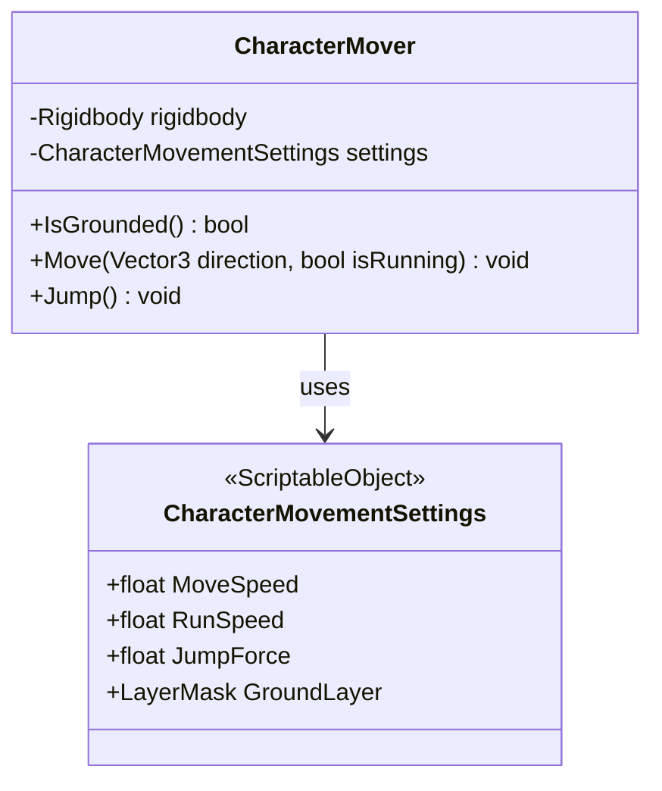
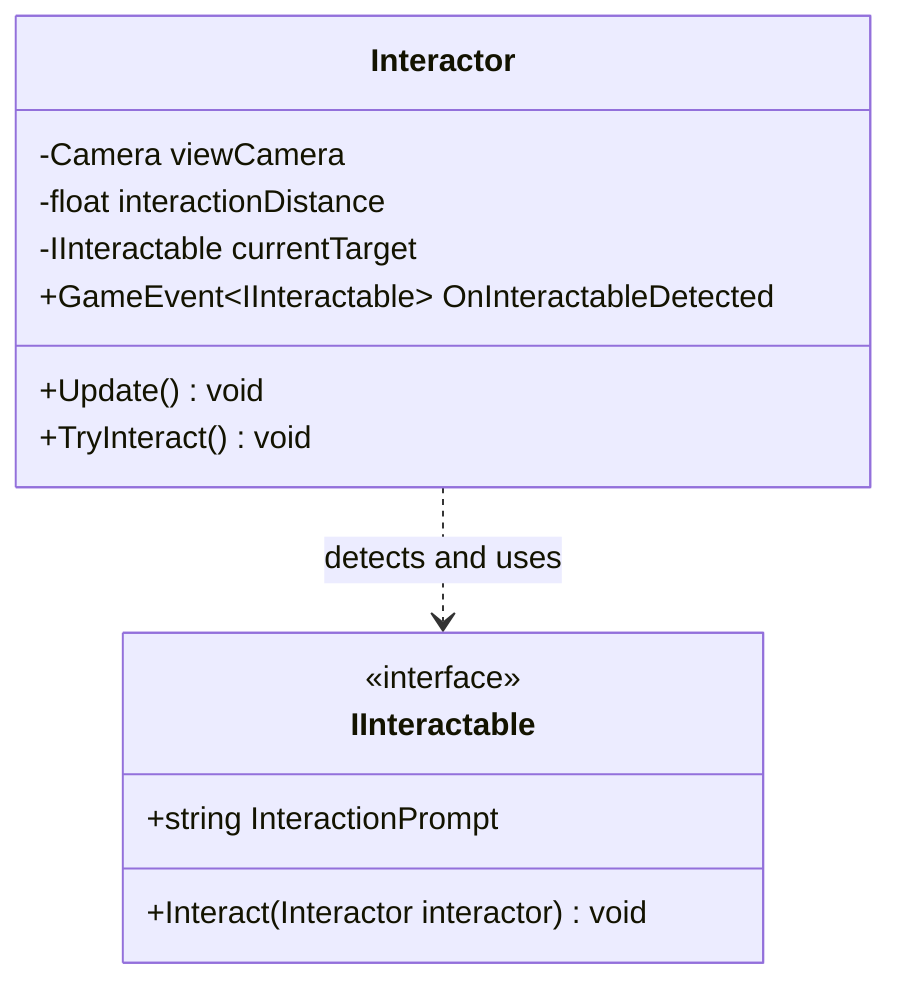
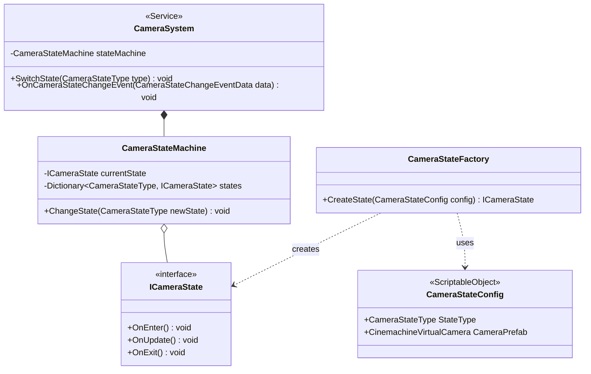
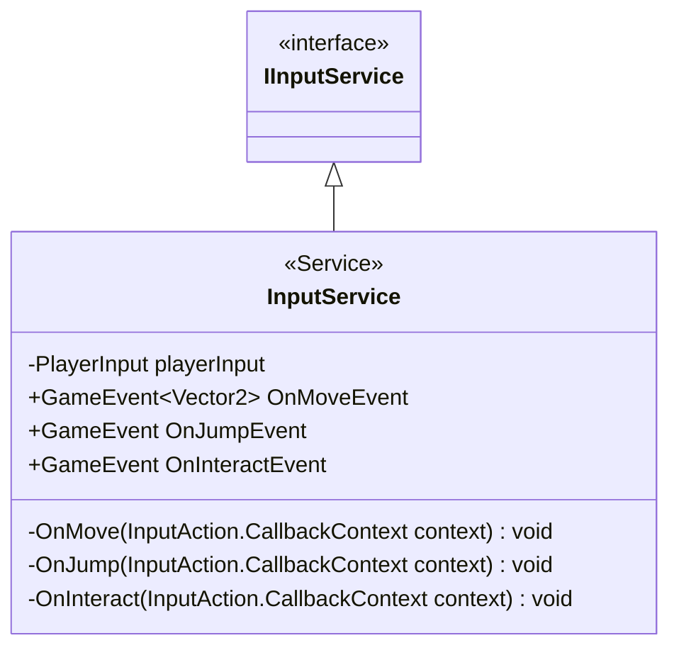
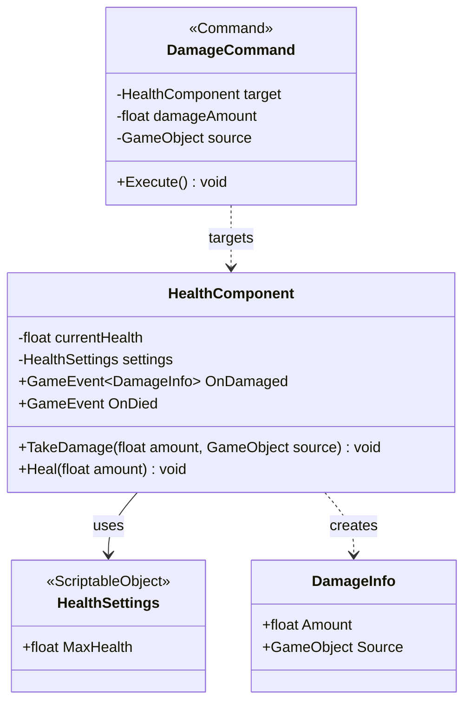

# Core層リファクタリング詳細設計書

## 1. 目的

このドキュメントは、`Template_Commonality_Analysis.md`で提案された5つの汎用システムを`Core`層に実装するための技術的な詳細設計を定義するものです。この設計に基づき、再利用可能で疎結合な基盤システムを構築します。

## 2. 設計原則

- **関心の分離**: `Core`層は汎用的なメカニクスを提供し、`Features`層は具体的なゲームロジックを実装する。
- **データ駆動設計**: `ScriptableObject`を積極的に活用し、設定とロジックを分離する。
- **イベント駆動**: `GameEvent`を介したコンポーネント間通信を徹底し、疎結合を維持する。
- **既存アーキテクチャの尊重**: `ServiceLocator`、`Command Pattern`、`ObjectPool`といった既存の設計パターンに準拠する。

## 3. 共通システムの詳細設計

---

### 3.1. 汎用キャラクター制御システム

- **名前空間**: `asterivo.Unity60.Core.Character`
- **アセンブリ**: `asterivo.Unity60.Core`

#### クラス図


#### `CharacterMovementSettings.cs`
- **責務**: キャラクターの物理的な挙動に関する設定値を保持するデータコンテナ。
- **実装**:
  ```csharp
  [CreateAssetMenu(fileName = "CharacterMovementSettings", menuName = "asterivo.Unity60/Core/Character/MovementSettings")]
  public class CharacterMovementSettings : ScriptableObject
  {
      public float MoveSpeed = 5f;
      public float RunSpeed = 8f;
      public float JumpForce = 10f;
      public LayerMask GroundLayer;
      public float GroundCheckDistance = 0.2f;
  }
  ```

#### `CharacterMover.cs`
- **責務**: `Rigidbody`を介してキャラクターの物理的な移動（移動、ジャンプ、接地判定）を直接制御する。
- **実装**:
  ```csharp
  public class CharacterMover : MonoBehaviour
  {
      [SerializeField] private Rigidbody _rigidbody;
      [SerializeField] private CharacterMovementSettings _settings;

      public bool IsGrounded()
      {
          // Physics.Raycastを使った接地判定ロジック
      }

      public void Move(Vector3 direction, bool isRunning)
      {
          float speed = isRunning ? _settings.RunSpeed : _settings.MoveSpeed;
          Vector3 velocity = direction * speed;
          velocity.y = _rigidbody.velocity.y;
          _rigidbody.velocity = velocity;
      }

      public void Jump()
      {
          if (IsGrounded())
          {
              _rigidbody.AddForce(Vector3.up * _settings.JumpForce, ForceMode.Impulse);
          }
      }
  }
  ```

---

### 3.2. 汎用インタラクションシステム

- **名前空間**: `asterivo.Unity60.Core.Interaction`
- **アセンブリ**: `asterivo.Unity60.Core`

#### クラス図


#### `IInteractable.cs`
- **責務**: インタラクション可能なオブジェクトが実装すべき契約を定義する。
- **実装**:
  ```csharp
  public interface IInteractable
  {
      string InteractionPrompt { get; }
      void Interact(Interactor interactor);
  }
  ```

#### `Interactor.cs`
- **責務**: 視界内の`IInteractable`オブジェクトを検出し、インタラクションを実行するトリガーとなる。
- **実装**:
  ```csharp
  public class Interactor : MonoBehaviour
  {
      [SerializeField] private Camera _viewCamera;
      [SerializeField] private float _interactionDistance = 3f;
      [SerializeField] private GameEvent<IInteractable> _onInteractableDetected; // UIに通知するためのイベント

      private IInteractable _currentTarget;

      void Update()
      {
          // _viewCameraからRaycastを飛ばし、_currentTargetを更新
          // _currentTargetが変化したら_onInteractableDetectedイベントを発行
      }

      public void TryInteract()
      {
          _currentTarget?.Interact(this);
      }
  }
  ```

---

### 3.3. 汎用カメラ制御システム

- **名前空間**: `asterivo.Unity60.Core.Camera`
- **アセンブリ**: `asterivo.Unity60.Core`

#### クラス図


- **設計**: `DESIGN.md`の設計を基盤とし、`Core`層でステートマシンの仕組みとインターフェースを定義する。具体的な状態（`ThirdPersonCameraState`など）と設定（`CameraStateConfig`）は`Features`層で実装・作成する。

---

### 3.4. 汎用入力管理システム

- **名前空間**: `asterivo.Unity60.Core.Input`
- **アセンブリ**: `asterivo.Unity60.Core`

#### クラス図


#### `InputService.cs`
- **責務**: `PlayerInput`からのコールバックを抽象化し、システム全体で使用可能な`GameEvent`に変換する。`ServiceLocator`を通じてグローバルにアクセス可能にする。
- **実装**:
  ```csharp
  public class InputService : MonoBehaviour, IInputService
  {
      [SerializeField] private PlayerInput _playerInput;
      [Header("Output Events")]
      [SerializeField] private GameEvent<Vector2> _onMoveEvent;
      [SerializeField] private GameEvent _onJumpEvent;
      [SerializeField] private GameEvent _onInteractEvent;
      // ... 他の入力イベント

      void Awake()
      {
          // ServiceLocatorへの登録
          ServiceLocator.Register<IInputService>(this);
      }

      // PlayerInputのEventsに各メソッドを登録
      public void OnMove(InputAction.CallbackContext context)
      {
          _onMoveEvent.Raise(context.ReadValue<Vector2>());
      }
      // ... OnJump, OnInteractなども同様
  }
  ```

---

### 3.5. 汎用体力・ダメージシステム

- **名前空間**: `asterivo.Unity60.Core.Combat`
- **アセンブリ**: `asterivo.Unity60.Core`

#### クラス図


#### `HealthSettings.cs`
- **責務**: 体力に関する設定値を保持するデータコンテナ。
- **実装**:
  ```csharp
  [CreateAssetMenu(fileName = "HealthSettings", menuName = "asterivo.Unity60/Core/Combat/HealthSettings")]
  public class HealthSettings : ScriptableObject
  {
      public float MaxHealth = 100f;
  }
  ```

#### `HealthComponent.cs`
- **責務**: オブジェクトの体力を管理し、ダメージや回復の処理、および関連イベントの発行を行う。
- **実装**:
  ```csharp
  public class HealthComponent : MonoBehaviour
  {
      [SerializeField] private HealthSettings _settings;
      [Header("Output Events")]
      [SerializeField] private GameEvent<DamageInfo> _onDamaged;
      [SerializeField] private GameEvent _onDied;

      private float _currentHealth;

      void Start() { _currentHealth = _settings.MaxHealth; }

      public void TakeDamage(float amount, GameObject source)
      {
          _currentHealth -= amount;
          _onDamaged.Raise(new DamageInfo { Amount = amount, Source = source });
          if (_currentHealth <= 0)
          {
              _onDied.Raise();
          }
      }
      // ... Healメソッドも同様
  }
  ```

#### `DamageCommand.cs`
- **責務**: `ICommand`インターフェースを実装し、特定の`HealthComponent`にダメージを与える処理をカプセル化する。`CommandPool`での再利用を想定。
- **実装**: `IResettableCommand`を実装し、`Execute`メソッド内で`target.TakeDamage()`を呼び出す。

## 5. 結論

この設計書に基づき`Core`層の5つの汎用システムを実装することで、`Features`層はこれらの安定した基盤の上に、ジャンル固有のロジックを効率的に構築できるようになります。これにより、プロジェクト全体の保守性と拡張性が大幅に向上します。