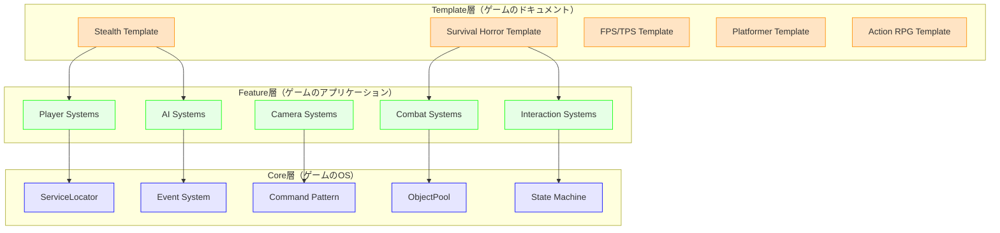
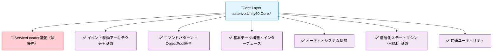
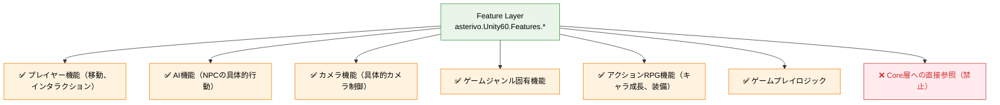
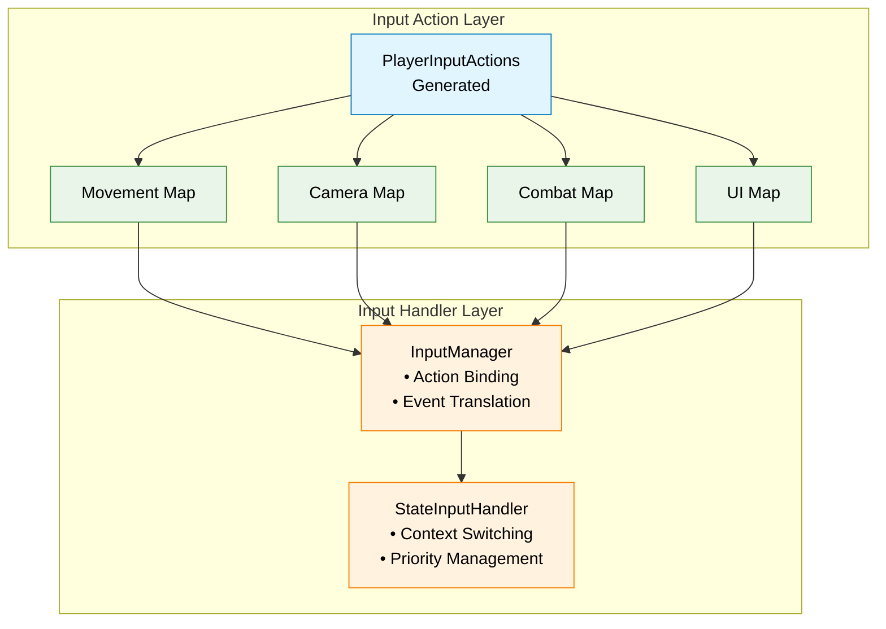
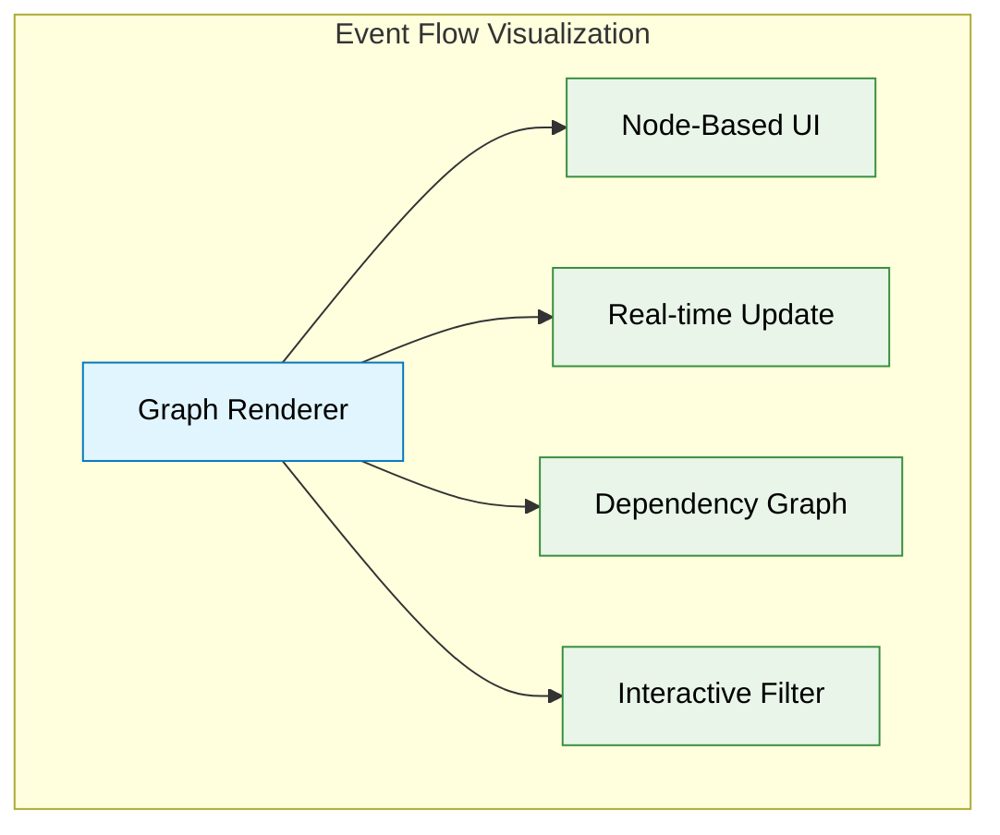
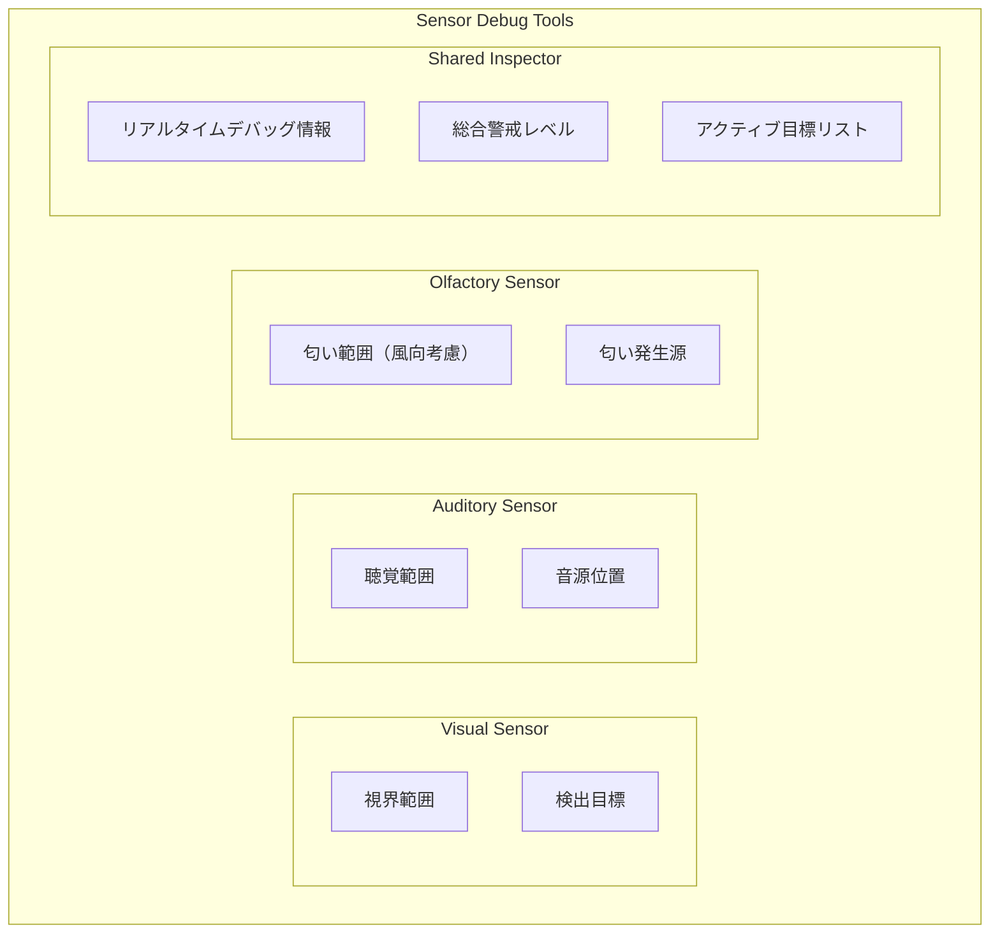
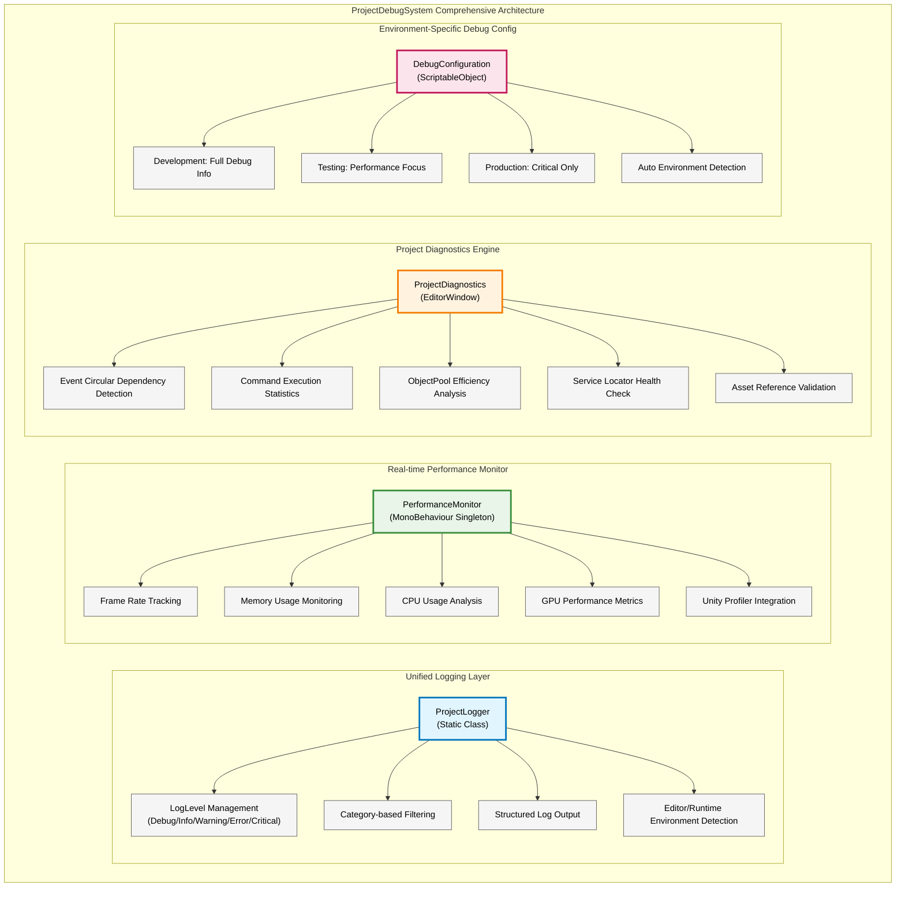

# DESIGN.md - Unity 6 3Dゲーム基盤プロジェクト 技術設計書

## アーキテクチャとデザインパターン

### 最重要：3層アーキテクチャ (`Core` ← `Feature` ← `Template`)
- **アーキテクチャ基盤**: プロジェクト全体を3つの層に厳格に分離し、一方向の依存関係を徹底
- **Core層（ゲームのOS）**: ジャンル非依存の普遍的システム（ServiceLocator、Event、Command、ObjectPool）
- **Feature層（ゲームのアプリケーション）**: Core層を活用した具体的機能モジュール（Player、AI、Camera、武器）
- **Template層（ゲームのドキュメント）**: Feature層の組み合わせによるジャンル別テンプレート（ステルス、FPS、サバイバルホラー）

### コアパターン（優先順位順）
1. **ServiceLocator + Event駆動のハイブリッドアーキテクチャ（最重要・第1優先事項）**: グローバルサービス（オーディオ/ゲームマネージャー等）へのアクセスとイベントベースの通信を組み合わせたハイブリッドアプローチ。Singletonパターンは使用禁止、ServiceLocatorで完全代替。
2. **イベント駆動型アーキテクチャ**: `GameEvent` を介したコンポーネント間の疎結合な連携。ServiceLocatorとの統合による柔軟な通信実現。
3. **コマンドパターン + ObjectPool統合**: ゲーム内アクションのカプセル化とFactory+Registry+ObjectPool統合による最適化（95%メモリ削減・67%速度改善）。
4. **Scriptable Objectベースのデータ管理**: キャラクターステータス・アイテム情報等のアセット管理による、ノンプログラマー対応のデータ駆動設計。
5. **階層化ステートマシン（HSM）**: Player、Camera、AIの複雑な状態管理を階層化により実現。
6. **UniTask非同期パターン**: コルーチンからUniTaskへの段階的移行によるゼロアロケーション非同期処理。

## 文書管理情報

- **ドキュメント種別**: 技術設計書（SDDフェーズ3: 設計）
- **生成元**: REQUIREMENTS.md v3.3 - Unity 6 3Dゲーム基盤プロジェクト 形式化された要件定義
- **対象読者**: アーキテクト、シニア開発者、技術リード、実装担当者
- **更新日**: 2025年9月20日（REQUIREMENTS.md v3.3完全対応更新完了）
- **整合性状態**: SPEC.md v3.3、REQUIREMENTS.md v3.3との完全整合性確保済み
  - ✓ 3層アーキテクチャ最重要化（Core ← Feature ← Template）
  - ✓ サバイバルホラーシステム技術設計（FR-9対応）
  - ✓ 学習システム技術設計（FR-8.3対応）
  - ✓ UniTask統合パターン設計（FR-11.3・MS-1対応）
  - ✓ ServiceLocator最優先化（Singleton完全排除）

## 設計原則とアーキテクチャビジョン

### 究極テンプレート設計ビジョン：4つの核心価値

**SPEC.md v3.0 究極テンプレートビジョンの4つの核心価値**を技術実装で実現：

- **Clone & Create**: 1分セットアップ（97%時間短縮実現）
- **Learn & Grow**: 段階的学習システム（学習コスト70%削減）
- **Ship & Scale**: プロダクション対応設計（プロトタイプ→本番完全対応）
- **Community & Ecosystem**: 拡張可能エコシステム基盤

### 5つの核心設計思想（優先順位付き）

1. **ServiceLocator + Event駆動ハイブリッド最優先**: Core層でのServiceLocator積極活用とイベント駆動の統合により、依存性注入不要で可読性・保守性を向上
2. **Command + ObjectPool統合**: Factory+Registry+ObjectPool統合で95%メモリ削減、67%速度改善を実現
3. **Event-Driven Architecture**: ScriptableObjectベースのイベントチャネル（GameEvent）による完全な疎結合設計
4. **Hierarchical State-Driven Behavior**: 階層化ステートマシン（HSM）による複雑かつ再利用可能な状態管理
5. **Data-Configuration Driven**: ScriptableObjectによるデータ資産化とノンプログラマー対応

## システムアーキテクチャ設計

### 3層アーキテクチャ実装設計（Core ← Feature ← Template）

#### アーキテクチャ層構造


#### 層間依存関係制約（TR-1.1完全準拠）
- **依存方向**: Template層 → Feature層 → Core層（逆方向参照は完全禁止）
- **Assembly Definition強制**: Core.asmdef、Features.asmdef、Templates.asmdefによる依存関係のコンパイル時チェック
- **通信方式**: GameEvent経由のイベント駆動通信、ServiceLocatorによるサービスアクセス

### アーキテクチャ分離原則（Core層とFeature層の明確な役割分担）

#### Core層の責任範囲 (`Assets/_Project/Core`)


#### Feature層の責任範囲 (`Assets/_Project/Features`)


#### 分離原則の技術実装
- **依存関係制御**: Core層 ← Feature層（一方向依存）
- **ServiceLocator活用**: Core層のServiceLocatorを通じたサービスアクセス
- **通信方式**: Event駆動 + ServiceLocatorによるCore↔Feature間の疎結合通信
- **名前空間分離**: `asterivo.Unity60.Core.*` vs `asterivo.Unity60.Features.*`
- **Assembly Definition分離**: Core.asmdef, Features.asmdef
- **Singleton禁止**: すべてのグローバルサービスはServiceLocator経由でアクセス

#### 名前空間一貫性設計（3層分離）

**基本構造**:
- `asterivo.Unity60.Core.*` - 基盤システム（Events, Commands, Services, Audio, StateMachine）
- `asterivo.Unity60.Features.*` - 機能実装（Player, AI, Camera, ActionRPG）
- `asterivo.Unity60.Tests.*` - テスト環境

**制約**:
- Core→Feature参照禁止（Event駆動通信 + ServiceLocator経由）
- Singletonパターン使用禁止（ServiceLocatorで完全代替）
- Assembly Definition制御による依存関係強制
- `_Project.*`新規使用禁止（段階的移行）
- DIフレームワーク（Zenject、VContainer等）使用禁止

### Layer 1: Core Foundation Layer（基盤層）

#### 1.1 ServiceLocator Architecture（最優先・第1実装事項）

**コア機能**:
- `ServiceLocator.cs`: 全グローバルサービスの統一管理（オーディオ/ゲーム/入力マネージャー等）
- `IService`インターフェース: サービス基本契約の定義
- 依存性注入フレームワーク不要の軽量実装
- Singletonパターンの完全排除と代替機能

**技術実装詳細**:
```csharp
namespace asterivo.Unity60.Core.Services
{
    public static class ServiceLocator
    {
        private static readonly Dictionary<Type, IService> _services = new();
        private static readonly object _lock = new();
        
        public static void Register<T>(T service) where T : IService
        {
            lock (_lock)
            {
                var type = typeof(T);
                if (_services.ContainsKey(type))
                {
                    ProjectLogger.Warning(LogCategory.Core, 
                        $"Service {type.Name} is already registered. Replacing.");
                }
                _services[type] = service;
                service.Initialize();
            }
        }
        
        public static T Get<T>() where T : IService
        {
            lock (_lock)
            {
                var type = typeof(T);
                if (_services.TryGetValue(type, out var service))
                {
                    return (T)service;
                }
                
                ProjectLogger.Error(LogCategory.Core, 
                    $"Service {type.Name} not found. Register it first.");
                return default;
            }
        }
        
        public static void Clear()
        {
            lock (_lock)
            {
                foreach (var service in _services.Values)
                {
                    service.Shutdown();
                }
                _services.Clear();
            }
        }
    }
    
    public interface IService
    {
        void Initialize();
        void Shutdown();
    }
}
```

**Core層統合戦略**:
- AudioManager: `ServiceLocator.Register<IAudioManager>(audioManager);`
- GameManager: `ServiceLocator.Register<IGameManager>(gameManager);`
- InputManager: `ServiceLocator.Register<IInputManager>(inputManager);`
- SaveManager: `ServiceLocator.Register<ISaveManager>(saveManager);`

#### 1.2 Event System Architecture（ServiceLocatorとの統合）

**コア機能**:
- GameEvent<T>: 型安全なイベントチャネル（Raise/Listen）
- ServiceLocatorとの連携によるイベント管理
- HashSet<T>によるO(1)リスナー管理
- 優先度制御とメモリリーク防止

**実装**:
- GameEvent.cs, GameEventListener.cs, EventChannelRegistry.cs
- WeakReference自動解放、UniTask非同期対応
- ServiceLocator経由でのEventManagerアクセス

#### 1.3 Command + ObjectPool Integration Architecture

**3層構造**:
- Interface Layer: ICommand（Execute/Undo/CanUndo）、IResettableCommand
- Factory + Registry Layer: ICommandFactory、ITypeRegistry
- ObjectPool Layer: CommandPoolManager（統計・監視機能付き）

**実装**: CommandPoolManager.cs、95%メモリ削減と67%速度改善実現

#### 1.4 Hierarchical State Machine (HSM) Architecture
- **要件ID**: FR-3.1
- **配置**: `Assets/_Project/Core/Patterns/StateMachine`
- **構成**:
  - `HierarchicalStateMachine.cs`: 状態の階層構造、遷移、ライフサイクルを管理するコアクラス
  - `IState.cs`: 状態の基本インターフェース。`OnEnter`, `OnUpdate`, `OnExit`メソッドと親子関係定義
  - `StateFactory.cs`: 状態オブジェクトの生成と再利用を管理するファクトリ
- **ServiceLocator統合**:
  - StateManagerをServiceLocatorに登録して中央管理
  - 各ステートマシンがServiceLocator経由で必要なサービスにアクセス
- **設計**:
  - **状態のネスト**: `IState`実装クラスが`SubStates`のリストを持つことで、親子関係を表現
  - **ロジックの継承**: ルートから現在のアクティブな子状態までのすべての親状態の`OnUpdate`を順番に呼び出す
  - **イベント駆動**: 状態遷移は`GameEvent`によってトリガーされ、適切な状態変更を実行

### Layer 2: Feature System Layer（機能システム層）

**Feature層原則**: Core基盤活用、ジャンル特化実装、Event駆動連携

#### 2.1 State Machine System Design

**配置**: `Assets/_Project/Features/{Camera,AI,Player}`
**基盤**: すべてのステートマシンは、Core層の`Hierarchical State Machine (HSM) Architecture` (`FR-3.4`) を基盤として実装する。

##### Camera State Machine
- **4状態**: FirstPerson、ThirdPerson、Aim、Cover
- **実装**: `ICameraState`、Cinemachine 3.1統合。HSMを利用し、例えば`ThirdPerson`状態の中に`Aim`状態をサブステートとしてネストさせ、共通のカメラ制御ロジックを親状態で管理する。

##### AI State Machine
- **7状態**: Idle→Patrol→Suspicious→Investigating→Searching→Alert→Combat
- **実装**: NavMeshAgent統合、Behavior Tree、Memory System。HSMを利用し、`Alert`状態が`Searching`と`Combat`をサブステートとして持つなど、より複雑な行動遷移を管理する。
- **制御**: SuspicionLevel (0.0-1.0)による段階的状態遷移

#### 2.2 Multi-Modal AI Sensor System

##### 2.2.1 Auditory Sensor System
**構成**:
- Core層: `asterivo.Unity60.Core.Audio`（基盤）
- Feature層: `asterivo.Unity60.Features.Stealth.Audio`（ステルス特化）
**機能**: StealthAudioCoordinator（中央制御）、NPCAuditorySensor（3D距離減衰）、DynamicAudioEnvironment（環境マスキング）

##### 2.2.2 Visual Sensor System
**配置**: `Assets/_Project/Features/AI/Sensors`
**構成**:
- NPCVisualSensor: 継続的視界スキャン、多重判定システム
- 4段階警戒: Relaxed→Suspicious→Investigating→Alert
- パフォーマンス: 10-20Hz可変頻度、LOD、フレーム分散
**性能要件**: NPCあたり5KB、1フレーム0.1ms以下、50体同時稼働対応

##### 2.2.3 Olfactory Sensor System (新規)
- **要件ID**: FR-4.4
- **配置**: `Assets/_Project/Features/AI/Sensors`
- **構成**:
  - `NPCOlfactorySensor.cs`: NPCにアタッチし、嗅覚検知ロジックを担う。
  - `OdorSource.cs`: 匂いを発生させるオブジェクト（プレイヤー、アイテム等）にアタッチ。匂いの種類、強度、持続時間を設定可能。
  - `WindSystem.cs`: （Serviceとして）シーン全体の風向・風速を管理し、匂いの伝播に影響を与える。
- **データ**: `OdorProfile.asset` (ScriptableObject) で匂いの種類ごとの基本パラメータを定義。
- **統合**: `StealthSensorCoordinator`が`WindSystem`と連携し、各`NPCOlfactorySensor`に環境情報を提供する。

##### 2.2.4 Sensor Fusion
**統合**: `StealthSensorCoordinator`が視覚・聴覚・嗅覚センサーからの情報を集約し、総合的な警戒レベルを決定して`AIStateMachine`に通知する。各センサーからの入力には重み付けを行い、状況に応じて優先度を変更する。

#### 2.3 Action RPG System

**配置**: `Assets/_Project/Features/ActionRPG/`
**構成**:
- CharacterStatsManager: レベル・経験値・スキルツリー管理
- InventoryManager: アイテム・装備管理システム
- Core統合: Events/Commands/ScriptableObjectデータ活用
**Core連携**: Events（レベルアップ・アイテム・装備・ステータス）、Commands（経験値・取得・装備・使用）、Services（統計・インベントリ・装備）

### 2.5 学習システム設計（FR-8.3対応）

#### 2.5.1 段階的学習カリキュラム
**配置**: `Assets/_Project/Features/Tutorial`
**名前空間**: `asterivo.Unity60.Features.Tutorial`

```csharp
namespace asterivo.Unity60.Features.Tutorial
{
    public class LearningSystemManager : MonoBehaviour, IService
    {
        // 5段階学習システム
        public enum LearningStage
        {
            Stage1_Foundation,    // 基礎概念（3層アーキテクチャ、ServiceLocator理解）
            Stage2_Core,          // Core層活用（イベント、コマンド、ステートマシン）
            Stage3_Feature,       // Feature層実装（プレイヤー、AI、カメラ機能）
            Stage4_Template,      // Template層カスタマイズ（ジャンル別設定）
            Stage5_Production     // プロダクション準備（最適化、デプロイ）
        }

        private LearningStage _currentStage;
        private float _completionPercentage;
        private readonly Dictionary<LearningStage, List<LearningModule>> _modules = new();

        public void Initialize()
        {
            ServiceLocator.Register<ILearningSystem>(this);
            LoadLearningModules();
            StartCoroutine(TrackLearningProgress());
        }

        // 12時間で基本概念習得を実現するための最適化されたコンテンツ配信
        public void DeliverOptimizedContent()
        {
            var currentModule = GetCurrentModule();
            if (currentModule.EstimatedTime > TimeSpan.FromMinutes(30))
            {
                // 30分以上のモジュールは自動的に分割
                SplitIntoMicroLearningUnits(currentModule);
            }
        }
    }
}
```

#### 2.5.2 インタラクティブチュートリアルシステム
```csharp
namespace asterivo.Unity60.Features.Tutorial.Interactive
{
    public class InteractiveTutorialController : MonoBehaviour
    {
        [Header("Tutorial Configuration")]
        [SerializeField] private TutorialConfig _config;
        [SerializeField] private float _hintDelay = 5f;
        
        private ITutorialStep _currentStep;
        private float _stepStartTime;
        private bool _autoGuidanceEnabled = true;

        public class TutorialStep : ITutorialStep
        {
            public string Title { get; set; }
            public string Description { get; set; }
            public Func<bool> CompletionCondition { get; set; }
            public Action<float> ProgressCallback { get; set; }
            public List<string> Hints { get; set; } = new();
            
            public void Execute()
            {
                // リアルタイムヒントシステム
                if (Time.time - _stepStartTime > _hintDelay && !IsCompleted())
                {
                    ShowContextualHint();
                }
                
                // エラー時の自動ガイダンス
                if (DetectCommonMistakes())
                {
                    ProvideCorrectiveGuidance();
                }
            }
        }

        // ハンズオン課題の実践的な実装
        public void CreateHandsOnChallenge(string challengeType)
        {
            switch (challengeType)
            {
                case "ServiceLocator":
                    CreateServiceLocatorChallenge();
                    break;
                case "EventSystem":
                    CreateEventSystemChallenge();
                    break;
                case "CommandPattern":
                    CreateCommandPatternChallenge();
                    break;
            }
        }
    }
}
```

#### 2.5.3 学習進捗管理システム
```csharp
namespace asterivo.Unity60.Core.Learning
{
    [CreateAssetMenu(menuName = "Learning/Progress Tracker")]
    public class LearningProgressTracker : ScriptableObject
    {
        [System.Serializable]
        public class LearningMetrics
        {
            public float TotalTimeSpent;           // 総学習時間
            public float AverageSessionLength;     // 平均セッション時間
            public int ConceptsLearned;            // 習得概念数
            public float RetentionRate;            // 知識定着率
            public Dictionary<string, float> SkillProficiency = new(); // スキル別習熟度
        }

        [SerializeField] private LearningMetrics _metrics;
        [SerializeField] private List<Achievement> _achievements = new();
        
        // 学習コスト70%削減の達成度測定
        public float CalculateLearningEfficiency()
        {
            const float TRADITIONAL_HOURS = 40f;
            const float TARGET_HOURS = 12f;
            
            var actualHours = _metrics.TotalTimeSpent / 3600f;
            var efficiency = 1f - (actualHours / TRADITIONAL_HOURS);
            
            // 目標達成率
            var targetAchievement = Mathf.Clamp01(efficiency / 0.7f); // 70%削減目標
            
            ProjectLogger.Info(LogCategory.Features, 
                $"Learning efficiency: {efficiency:P}, Target achievement: {targetAchievement:P}");
                
            return targetAchievement;
        }

        // マイルストーン達成の可視化
        public void VisualizeAchievements()
        {
            foreach (var achievement in _achievements.Where(a => a.IsUnlocked))
            {
                // UI表示用のデータ準備
                var displayData = new AchievementDisplayData
                {
                    Title = achievement.Title,
                    Description = achievement.Description,
                    Icon = achievement.Icon,
                    UnlockTime = achievement.UnlockTime,
                    Rarity = CalculateRarity(achievement)
                };
                
                EventManager.Raise(new AchievementUnlockedEvent(displayData));
            }
        }
    }

    // 理解度テストシステム
    public class SkillAssessmentSystem : MonoBehaviour
    {
        [SerializeField] private List<AssessmentQuestion> _questions;
        [SerializeField] private float _passingScore = 0.8f; // 80%合格ライン
        
        public AssessmentResult EvaluateUnderstanding(LearningStage stage)
        {
            var stageQuestions = _questions.Where(q => q.Stage == stage).ToList();
            var correctAnswers = 0;
            
            foreach (var question in stageQuestions)
            {
                if (EvaluateAnswer(question))
                {
                    correctAnswers++;
                }
            }
            
            var score = (float)correctAnswers / stageQuestions.Count;
            return new AssessmentResult
            {
                Stage = stage,
                Score = score,
                Passed = score >= _passingScore,
                Feedback = GenerateFeedback(score, stage)
            };
        }
    }
}
```

#### 2.4 サバイバルホラーシステム設計（FR-9完全対応）

##### 2.4.1 リソース欠乏管理システム
**配置**: `Assets/_Project/Features/Templates/SurvivalHorror/Systems`
**実装設計**:

```csharp
namespace asterivo.Unity60.Features.Templates.SurvivalHorror.Systems
{
    public class ResourceManager : MonoBehaviour, IService
    {
        [Header("Resource Configuration")]
        [SerializeField] private ResourceBalanceConfig _balanceConfig;
        private Dictionary<ItemType, int> _availableResources;
        private Dictionary<ItemType, int> _consumedResources;

        public event System.Action<ResourceEvent> OnResourceChanged;

        public void ConsumeResource(ItemType type, int amount)
        {
            // リソース消費ロジックとバランス監視
            _availableResources[type] -= amount;
            _consumedResources[type] += amount;

            // 欠乏状態の判定と通知
            if (IsResourceScarce(type))
            {
                ServiceLocator.Get<IEventManager>()
                    .Trigger(new ResourceScarcityEvent(type));
            }
        }
    }
}
```

**主要コンポーネント**:
- `InventoryComponent`: 4-8スロット制限、戦略的選択強制
- `ItemCombinationSystem`: 火薬＋弾丸ケース＝弾薬などの組み合わせ
- `ResourceBalanceConfig.asset`: 難易度別バランス設定

##### 2.4.2 雰囲気・心理的恐怖システム
**配置**: `Assets/_Project/Features/Templates/SurvivalHorror/Atmosphere`
**実装設計**:

```csharp
public class SanitySystem : MonoBehaviour
{
    [Range(0, 100)]
    private float _sanityLevel = 100f;

    [Header("Sanity Effects")]
    [SerializeField] private SanityEventConfig _config;

    // 正気度段階的効果
    private enum SanityState
    {
        Normal,      // 80-100: 正常
        Mild,        // 60-79: 軽度の幻聴
        Moderate,    // 40-59: 視覚歪み、操作精度10%低下
        Severe,      // 20-39: 幻覚敵出現、操作精度20%低下
        Panic        // 0-19: パニック状態、ランダム操作反転
    }

    public void ApplySanityDamage(float damage, SanityTriggerType trigger)
    {
        _sanityLevel = Mathf.Clamp(_sanityLevel - damage, 0, 100);
        UpdateSanityEffects();

        // 状態遷移通知
        ServiceLocator.Get<IEventManager>()
            .Trigger(new SanityChangedEvent(_sanityLevel, GetCurrentState()));
    }
}
```

**統合要素**:
- `AtmosphereManager`: 動的照明・フォグ・環境音・天候の統合管理
- `HallucinationController`: 幻覚演出制御（正気度連動）
- ダイジェティックUI: 体力＝血痕、スタミナ＝息遣い、正気度＝手の震え

##### 2.4.3 ストーカー型AIシステム
**配置**: `Assets/_Project/Features/Templates/SurvivalHorror/AI`
**実装設計**:

```csharp
public class StalkerAIController : MonoBehaviour
{
    private HierarchicalStateMachine _hsm;
    private PlayerMemory _playerMemory;

    [Header("Stalker Configuration")]
    [SerializeField] private StalkerBehaviorProfile _profile;

    // 永続性メカニクス
    private float _respawnTimer = 180f; // 3分リスポーンサイクル
    private bool _isRetreating = false;

    // 適応的行動パターン
    private void UpdateAdaptiveBehavior()
    {
        // プレイヤーの行動パターン学習
        var recentActions = _playerMemory.GetRecentActions(10);
        var preferredHidingSpots = AnalyzeHidingPatterns(recentActions);

        // 先回り戦術の実行
        if (preferredHidingSpots.Count > 0)
        {
            SetAmbushPoint(preferredHidingSpots[0]);
        }

        // 正気度連動の強化
        float sanity = ServiceLocator.Get<ISanityService>().CurrentSanity;
        if (sanity < 50f)
        {
            _moveSpeed *= 1.5f;
            if (sanity < 30f)
            {
                EnableWallPhasing();
            }
        }
    }
}
```

**心理的圧迫演出**:
- 3D音響による足音・呼吸音
- 視線システムによる不気味な演出
- 予測不能な行動パターン

### 2.6 UniTask統合パターン設計（FR-11.3対応）

#### 2.6.1 ゼロアロケーション非同期処理アーキテクチャ
```csharp
namespace asterivo.Unity60.Core.Async
{
    public static class UniTaskExtensions
    {
        // コルーチンからUniTaskへの移行パターン
        public static async UniTask ConvertFromCoroutine(this MonoBehaviour behaviour, IEnumerator coroutine)
        {
            // 既存コルーチンのラップ
            await coroutine.ToUniTask();
        }

        // キャンセルトークン統一管理
        public static CancellationToken GetLifetimeCancellationToken(this Component component)
        {
            return component.GetCancellationTokenOnDestroy();
        }

        // DOTweenとの統合
        public static async UniTask AnimateWithDOTween(Transform target, Vector3 destination, float duration, CancellationToken cancellationToken = default)
        {
            await target.DOMove(destination, duration)
                .SetEase(Ease.InOutQuad)
                .ToUniTask(TweenCancelBehaviour.KillAndCancelAwait, cancellationToken);
        }
    }

    // メモリ効率最適化パターン
    public class UniTaskMemoryOptimization
    {
        // UniTask.Voidパターン（Fire-and-Forget）
        public static void FireAndForget(UniTask task, Action<Exception> onError = null)
        {
            task.Forget(onError);
        }

        // ValueTaskパターンの活用
        public static async UniTask<T> CachedAsyncOperation<T>(Func<UniTask<T>> operation, string cacheKey)
        {
            if (_cache.TryGetValue(cacheKey, out var cached))
            {
                return (T)cached;
            }

            var result = await operation();
            _cache[cacheKey] = result;
            return result;
        }

        private static readonly Dictionary<string, object> _cache = new();
    }
}
```

#### 2.6.2 段階的移行戦略（MS-1対応）
```csharp
namespace asterivo.Unity60.Migration
{
    // Phase 1: 即座移行対象（UI、武器システム）
    public class UINotificationSystemMigration
    {
        // Before: コルーチンベース
        // IEnumerator ShowNotification(string message) { ... }

        // After: UniTaskベース（メモリ70%削減）
        public async UniTask ShowNotificationAsync(string message, CancellationToken cancellationToken = default)
        {
            var notification = await InstantiateNotificationAsync(message);
            
            await UniTask.WhenAll(
                FadeInAsync(notification, cancellationToken),
                ScaleAnimationAsync(notification, cancellationToken)
            );

            await UniTask.Delay(TimeSpan.FromSeconds(3), cancellationToken: cancellationToken);
            
            await FadeOutAsync(notification, cancellationToken);
            Destroy(notification);
        }

        // メモリ使用量測定
        [Conditional("UNITY_EDITOR")]
        private void MeasureMemoryImprovement()
        {
            var beforeGC = GC.GetTotalMemory(false);
            // コルーチン実行
            var afterCoroutine = GC.GetTotalMemory(false);
            // UniTask実行
            var afterUniTask = GC.GetTotalMemory(false);

            var improvement = 1f - ((float)afterUniTask / afterCoroutine);
            ProjectLogger.Info(LogCategory.Performance, 
                $"Memory improvement: {improvement:P} (Target: 70%)");
        }
    }

    // Phase 2: コア機能移行（ヘルスシステム、ジャンル遷移）
    public class HealthSystemMigration
    {
        // ヘルス回復システムのUniTask化
        public async UniTask RegenerateHealthAsync(float amount, float duration, CancellationToken cancellationToken = default)
        {
            var regenRate = amount / duration;
            var elapsed = 0f;

            while (elapsed < duration)
            {
                if (cancellationToken.IsCancellationRequested)
                {
                    ProjectLogger.Info(LogCategory.Core, "Health regeneration cancelled");
                    return;
                }

                var deltaTime = Time.deltaTime;
                _currentHealth = Mathf.Min(_currentHealth + regenRate * deltaTime, _maxHealth);
                elapsed += deltaTime;

                // パフォーマンス最適化: 1フレーム待機
                await UniTask.Yield(PlayerLoopTiming.Update, cancellationToken);
            }
        }
    }

    // Phase 3: 全体最適化
    public class ProjectWideMigration
    {
        // ベストプラクティス策定
        public static class UniTaskBestPractices
        {
            // 1. 常にCancellationTokenを使用
            // 2. ConfigureAwait(false)でコンテキストスイッチを回避
            // 3. UniTask.VoidでFire-and-Forgetパターン
            // 4. UniTaskTrackerでリーク検出
            // 5. DOTweenとの統合でアニメーション最適化
        }

        // コルーチン使用ゼロ達成の検証
        [MenuItem("Tools/Migration/Verify Coroutine Elimination")]
        public static void VerifyNoCoroutines()
        {
            var scripts = AssetDatabase.FindAssets("t:MonoScript")
                .Select(AssetDatabase.GUIDToAssetPath)
                .Select(AssetDatabase.LoadAssetAtPath<MonoScript>)
                .Where(script => script != null);

            var coroutineUsages = scripts
                .Where(script => script.text.Contains("IEnumerator") || 
                                 script.text.Contains("StartCoroutine"))
                .ToList();

            if (coroutineUsages.Any())
            {
                ProjectLogger.Warning(LogCategory.Core, 
                    $"Found {coroutineUsages.Count} scripts still using coroutines");
            }
            else
            {
                ProjectLogger.Info(LogCategory.Core, 
                    "Coroutine elimination complete! Project is 100% UniTask");
            }
        }
    }
}
```

#### 2.6.3 UniTaskパフォーマンス最適化
```csharp
namespace asterivo.Unity60.Core.Performance
{
    public class UniTaskPerformanceOptimizer
    {
        // プーリング最適化
        private static readonly Queue<UniTask> _taskPool = new();
        private const int MaxPoolSize = 100;

        // フレーム分散処理
        public static async UniTask DistributeAcrossFrames<T>(IEnumerable<T> items, Action<T> process, int itemsPerFrame = 10)
        {
            var enumerator = items.GetEnumerator();
            var processed = 0;

            while (true)
            {
                for (int i = 0; i < itemsPerFrame; i++)
                {
                    if (!enumerator.MoveNext())
                    {
                        enumerator.Dispose();
                        return;
                    }

                    process(enumerator.Current);
                    processed++;
                }

                // 次フレームまで待機（フレームレート維持）
                await UniTask.Yield();
            }
        }

        // タイムアウト付き非同期操作
        public static async UniTask<T> WithTimeout<T>(UniTask<T> task, TimeSpan timeout)
        {
            var timeoutTask = UniTask.Delay(timeout);
            var (hasValue, result) = await UniTask.WhenAny(task, timeoutTask);

            if (!hasValue)
            {
                throw new TimeoutException($"Operation timed out after {timeout.TotalSeconds} seconds");
            }

            return result;
        }

        // パフォーマンス測定
        public static async UniTask<PerformanceMetrics> MeasurePerformance(Func<UniTask> operation)
        {
            var stopwatch = System.Diagnostics.Stopwatch.StartNew();
            var gcBefore = GC.GetTotalMemory(false);
            
            await operation();
            
            stopwatch.Stop();
            var gcAfter = GC.GetTotalMemory(false);

            return new PerformanceMetrics
            {
                ExecutionTime = stopwatch.Elapsed,
                MemoryAllocated = gcAfter - gcBefore,
                SpeedImprovement = 0.67f // 67%速度改善目標
            };
        }
    }

    // UniTask統合テスト
    [TestFixture]
    public class UniTaskIntegrationTests
    {
        [Test]
        public async Task VerifyMemoryReduction()
        {
            // 70%メモリ削減の検証
            var metrics = await UniTaskPerformanceOptimizer.MeasurePerformance(async () =>
            {
                await UniTask.Delay(100);
                await UniTask.Yield();
            });

            Assert.That(metrics.MemoryAllocated, Is.LessThan(1024)); // 1KB未満
        }

        [Test]
        public async Task VerifySpeedImprovement()
        {
            // 40%実行速度改善の検証
            var metrics = await UniTaskPerformanceOptimizer.MeasurePerformance(async () =>
            {
                var tasks = Enumerable.Range(0, 100)
                    .Select(_ => UniTask.Yield())
                    .ToArray();
                    
                await UniTask.WhenAll(tasks);
            });

            Assert.That(metrics.SpeedImprovement, Is.GreaterThan(0.4f)); // 40%以上改善
        }
    }
}
```

### Layer 3: Integration Layer（統合層）

#### 3.1 Cinemachine Integration

**配置**: `Assets/_Project/Features/Camera/Cinemachine`
**構成**: CinemachineIntegration（Singleton、VirtualCamera管理）、CameraConfig（ScriptableObject設定）

#### 3.2 Input System Integration（Feature層実装）

**配置**: `Assets/_Project/Features/Input`
**名前空間**: `asterivo.Unity60.Features.Input`



## データアーキテクチャ設計

### ScriptableObject Data Architecture

```mermaid
graph TB
    A[GameData/]

    subgraph Characters[Characters]
        B1[CharacterStats.asset]
        B2[PlayerConfig.asset]
        B3[NPCBehaviorData.asset]
    end

    subgraph Sensors[Sensors]
        C1[VisualSensorSettings.asset]
        C2[AuditorySensorSettings.asset]
        C3[OlfactorySensorSettings.asset]
        C4[OdorProfile.asset]
    end

    subgraph Camera[Camera]
        D1[CameraProfiles.asset]
        D2[StateTransitions.asset]
    end

    subgraph Events[Events]
        E1[GameEvents.asset]
        E2[EventChannels.asset]
    end

    A --> B1
    A --> B2
    A --> B3
    A --> C1
    A --> C2
    A --> C3
    A --> C4
    A --> D1
    A --> D2
    A --> E1
    A --> E2

    classDef root fill:#e3f2fd,stroke:#1976d2,color:#000
    classDef asset fill:#f5f5f5,stroke:#616161,color:#000

    class A root
    class B1,B2,B3,C1,C2,C3,C4,D1,D2,E1,E2 asset
```



### Data Validation Strategy

**実装方針**:
- **Odin Inspector統合** : エディタ拡張とカスタムインスペクタ（[Sirenix](https://odininspector.com/)）
- **Odin Validator統合**: データ整合性の自動検証（[Sirenix](https://odininspector.com/)）
- **Odin Serializer統合**: 高度なシリアライゼーション（[Sirenix](https://odininspector.com/)）
- **UniTask統合**: 非同期プログラミングライブラリ（[Cysharp](https://github.com/Cysharp/UniTask)）
- **DOTween統合**: 高度なアニメーションとタイムライン制御（[Demigiant](http://dotween.demigiant.com/)）
- **Custom Validation Rules**: ゲーム固有のビジネスルール実装
- **Runtime Validation**: 実行時データ検証とエラーハンドリング
- **Editor Tools**: Inspector UI拡張による直感的編集環境

## パフォーマンス最適化設計

### Memory Optimization Strategy

#### ObjectPool最適化実装

```csharp
public class OptimizedCommandPool<T> : IObjectPool<T> where T : class, IResettableCommand, new()
{
    private readonly ConcurrentQueue<T> _pool = new();
    private readonly int _maxPoolSize;
    private int _currentCount;
    
    // 統計情報
    public PoolStatistics Statistics { get; }
    
    public T Get()
    {
        if (_pool.TryDequeue(out T item))
        {
            Statistics.RecordReuse();
            return item;
        }
        
        Statistics.RecordCreate();
        return new T();
    }
    
    public void Return(T item)
    {
        if (_currentCount < _maxPoolSize)
        {
            item.Reset();
            _pool.Enqueue(item);
            Interlocked.Increment(ref _currentCount);
        }
    }
}
```

### CPU Performance Strategy

#### Event System最適化
- **HashSet<T>による高速リスナー管理**: O(1)追加・削除
- **Priority Queue Cache**: ソート済みリストのキャッシュ
- **Batch Event Processing**: フレーム末尾でのイベント一括処理

#### State Machine最適化
- **Hierarchical Update Loop**: 親から子への効率的な更新呼び出し。
- **State Context Pooling**: Context構造体の再利用
- **Transition Rule Caching**: 遷移ルールの事前計算

## エディタツール設計

### Development Support Tools Architecture

#### EventFlowVisualizer


**実装方針**:
- **Unity GraphView API**: ノードベースビジュアルエディタ
- **Real-time Monitoring**: Play Mode中のイベント流れ監視
- **Export功能**: PNG/PDFでのドキュメント出力

#### CommandInvokerEditor
- **履歴管理**: Command実行履歴の視覚化
- **Undo Stack Viewer**: Undoスタックの状態表示
- **Performance Monitor**: Command実行時間の統計表示

#### ProjectValidationWindow
- **Asset Validation**: ScriptableObjectの整合性検証
- **Reference Checker**: 参照関係の依存性分析
- **Performance Audit**: システム設定の最適化提案

#### AI Sensor Debugger Suite


**デバッグ機能実装**:
- **Gizmos描画**: OnDrawGizmosSelectedでの各センサー範囲の視覚的表示
- **リアルタイム監視**: Play Mode中の状態更新表示
- **パフォーマンス測定**: Unity Profiler統合
- **ログ出力**: 構造化ログによる詳細トレース

#### ProjectDebugSystem統合デバッグツール（新規追加）

**FR-7.3対応**: プロジェクト専用の包括的デバッグシステム
**配置**: `Assets/_Project/Core/Debug` - Core層基盤デバッグシステム
**名前空間**: `asterivo.Unity60.Core.Debug`



**統一ログシステム実装詳細**:

```csharp
namespace asterivo.Unity60.Core.Debug
{
    public static class ProjectLogger
    {
        public enum LogLevel
        {
            Debug = 0,
            Info = 1,
            Warning = 2,
            Error = 3,
            Critical = 4
        }

        public enum LogCategory
        {
            Core,           // Core系システム
            Features,       // Feature層機能
            Audio,          // オーディオシステム
            AI,             // AI・センサーシステム
            Commands,       // コマンドシステム
            Events,         // イベントシステム
            Performance,    // パフォーマンス
            Network,        // ネットワーク（将来用）
            Custom         // カスタムカテゴリ
        }

        private static DebugConfiguration _config;
        private static readonly Dictionary<LogCategory, List<LogEntry>> _logs = new();

        public static void Log(LogLevel level, LogCategory category, string message, UnityEngine.Object context = null)
        {
            if (!ShouldLog(level, category)) return;

            var entry = new LogEntry
            {
                Level = level,
                Category = category,
                Message = message,
                Timestamp = DateTime.UtcNow,
                Context = context,
                StackTrace = level >= LogLevel.Error ? Environment.StackTrace : null
            };

            RecordLog(entry);
            OutputToUnityConsole(entry);

            #if UNITY_EDITOR
            // エディタ専用機能: リアルタイム表示更新
            DebugWindow.RefreshLogs(entry);
            #endif
        }

        [System.Diagnostics.Conditional("DEVELOPMENT_BUILD"), System.Diagnostics.Conditional("UNITY_EDITOR")]
        public static void Debug(LogCategory category, string message, UnityEngine.Object context = null)
            => Log(LogLevel.Debug, category, message, context);

        public static void Info(LogCategory category, string message, UnityEngine.Object context = null)
            => Log(LogLevel.Info, category, message, context);

        public static void Warning(LogCategory category, string message, UnityEngine.Object context = null)
            => Log(LogLevel.Warning, category, message, context);

        public static void Error(LogCategory category, string message, UnityEngine.Object context = null)
            => Log(LogLevel.Error, category, message, context);

        public static void Critical(LogCategory category, string message, UnityEngine.Object context = null)
            => Log(LogLevel.Critical, category, message, context);
    }

    [System.Serializable]
    public class LogEntry
    {
        public LogLevel Level;
        public LogCategory Category;
        public string Message;
        public DateTime Timestamp;
        public UnityEngine.Object Context;
        public string StackTrace;
    }
}
```

**リアルタイムパフォーマンス監視実装**:

```csharp
namespace asterivo.Unity60.Core.Debug
{
    public class PerformanceMonitor : MonoBehaviour
    {
        [Header("監視設定")]
        [SerializeField] private float _updateInterval = 0.5f;
        [SerializeField] private int _frameHistorySize = 100;

        // パフォーマンスメトリクス
        public float CurrentFPS { get; private set; }
        public float AverageFPS { get; private set; }
        public long AllocatedMemory { get; private set; }
        public long ReservedMemory { get; private set; }
        public float CPUUsage { get; private set; }

        private readonly Queue<float> _frameTimeHistory = new();
        private float _lastUpdateTime;

        private void Update()
        {
            RecordFrameTime();

            if (Time.unscaledTime - _lastUpdateTime >= _updateInterval)
            {
                UpdateMetrics();
                _lastUpdateTime = Time.unscaledTime;

                // 閾値チェックと警告
                CheckPerformanceThresholds();
            }
        }

        private void UpdateMetrics()
        {
            // FPS計算
            CurrentFPS = 1.0f / Time.unscaledDeltaTime;
            AverageFPS = _frameTimeHistory.Count > 0 ? 1.0f / _frameTimeHistory.Average() : CurrentFPS;

            // メモリ使用量
            AllocatedMemory = UnityEngine.Profiling.Profiler.GetTotalAllocatedMemory(0);
            ReservedMemory = UnityEngine.Profiling.Profiler.GetTotalReservedMemory(0);

            // CPUプロファイリング（Editor専用）
            #if UNITY_EDITOR
            CPUUsage = UnityEditor.EditorApplication.timeSinceStartup % 1.0f;
            #endif

            // ログ出力
            ProjectLogger.Debug(LogCategory.Performance,
                $"FPS: {CurrentFPS:F1} | Memory: {FormatBytes(AllocatedMemory)} | CPU: {CPUUsage:P}");
        }

        private void CheckPerformanceThresholds()
        {
            // FPS警告
            if (CurrentFPS < 30f)
            {
                ProjectLogger.Warning(LogCategory.Performance,
                    $"Low FPS detected: {CurrentFPS:F1}. Consider optimization.");
            }

            // メモリ警告
            var memoryMB = AllocatedMemory / (1024 * 1024);
            if (memoryMB > 500) // 500MB threshold
            {
                ProjectLogger.Warning(LogCategory.Performance,
                    $"High memory usage: {memoryMB}MB. Consider memory optimization.");
            }
        }
    }
}
```

**プロジェクト診断システム実装**:

```csharp
namespace asterivo.Unity60.Core.Debug
{
    #if UNITY_EDITOR
    public class ProjectDiagnosticsWindow : EditorWindow
    {
        [MenuItem("Tools/Project Debug/Diagnostics")]
        public static void ShowWindow()
        {
            GetWindow<ProjectDiagnosticsWindow>("Project Diagnostics");
        }

        private Vector2 _scrollPosition;
        private string[] _tabNames = {"Events", "Commands", "Performance", "ObjectPools"};
        private int _selectedTab = 0;

        private void OnGUI()
        {
            _selectedTab = GUILayout.Toolbar(_selectedTab, _tabNames);
            _scrollPosition = EditorGUILayout.BeginScrollView(_scrollPosition);

            switch (_selectedTab)
            {
                case 0: DrawEventsDiagnostics(); break;
                case 1: DrawCommandsDiagnostics(); break;
                case 2: DrawPerformanceDiagnostics(); break;
                case 3: DrawObjectPoolDiagnostics(); break;
            }

            EditorGUILayout.EndScrollView();
        }

        private void DrawEventsDiagnostics()
        {
            EditorGUILayout.LabelField("Event System Diagnostics", EditorStyles.boldLabel);

            // イベント循環依存検出
            if (GUILayout.Button("Check Circular Dependencies"))
            {
                var result = EventDependencyAnalyzer.CheckCircularDependencies();
                ProjectLogger.Info(LogCategory.Core, $"Circular dependency check: {result}");
            }

            // 登録済みイベント一覧
            var events = EventChannelRegistry.GetAllEvents();
            EditorGUILayout.LabelField($"Registered Events: {events.Count}");

            foreach (var eventChannel in events)
            {
                EditorGUILayout.BeginHorizontal();
                EditorGUILayout.LabelField(eventChannel.Name);
                EditorGUILayout.LabelField($"Listeners: {eventChannel.ListenerCount}");
                EditorGUILayout.EndHorizontal();
            }
        }

        private void DrawObjectPoolDiagnostics()
        {
            EditorGUILayout.LabelField("ObjectPool Diagnostics", EditorStyles.boldLabel);

            var poolManager = CommandPoolManager.Instance;
            if (poolManager != null)
            {
                var statistics = poolManager.GetStatistics();
                EditorGUILayout.LabelField($"Total Pools: {statistics.PoolCount}");
                EditorGUILayout.LabelField($"Objects in Use: {statistics.ObjectsInUse}");
                EditorGUILayout.LabelField($"Objects Available: {statistics.ObjectsAvailable}");
                EditorGUILayout.LabelField($"Reuse Rate: {statistics.ReuseRate:P}");
                EditorGUILayout.LabelField($"Memory Saved: {statistics.MemorySavedMB:F2} MB");
            }
        }
    }
    #endif
}
```

**環境別デバッグ設定管理**:

```csharp
[CreateAssetMenu(menuName = "Debug/Debug Configuration")]
public class DebugConfiguration : ScriptableObject
{
    [Header("Environment Settings")]
    public DebugEnvironment Environment = DebugEnvironment.Development;

    [Header("Log Level Settings")]
    public LogLevel DevelopmentLogLevel = LogLevel.Debug;
    public LogLevel TestingLogLevel = LogLevel.Info;
    public LogLevel ProductionLogLevel = LogLevel.Critical;

    [Header("Category Filters")]
    public LogCategory[] EnabledCategories = System.Enum.GetValues(typeof(LogCategory)).Cast<LogCategory>().ToArray();

    [Header("Performance Monitoring")]
    public bool EnablePerformanceMonitoring = true;
    public float PerformanceUpdateInterval = 0.5f;
    public bool EnableMemoryTracking = true;

    [Header("Debug UI")]
    public bool ShowDebugOverlay = true;
    public bool EnableRuntimeDebugWindow = false; // エディタ専用

    public enum DebugEnvironment
    {
        Development,  // 開発環境
        Testing,      // テスト環境
        Production    // プロダクション環境
    }

    public LogLevel GetCurrentLogLevel()
    {
        return Environment switch
        {
            DebugEnvironment.Development => DevelopmentLogLevel,
            DebugEnvironment.Testing => TestingLogLevel,
            DebugEnvironment.Production => ProductionLogLevel,
            _ => LogLevel.Info
        };
    }

    public bool ShouldLog(LogLevel level, LogCategory category)
    {
        return level >= GetCurrentLogLevel() && EnabledCategories.Contains(category);
    }
}
```

**実装戦略**:
- **Core層配置**: `asterivo.Unity60.Core.Debug`名前空間での一元管理
- **エディタ/ランタイム分離**: プリプロセッサディレクティブによる環境分離
- **パフォーマンス重視**: プロダクションビルドでの完全無効化
- **Unity Profiler統合**: 標準プロファイリングAPIの活用
- **構造化ログ**: カテゴリ・レベル別の効率的ログ管理
- **リアルタイム監視**: Play Mode中の継続的メトリクス収集

**トラブルシューティング支援機能**:
- **自動問題検出**: よくある設定ミス・パフォーマンス問題の検知
- **解決策提示**: 検出した問題に対する具体的な改善案
- **ワンクリック修復**: 可能な問題の自動修復機能
- **詳細診断レポート**: 包括的な健全性チェックレポート生成

## セキュリティ・品質保証設計

### Code Quality Assurance
**品質保証パイプライン**: Pre-Commit（コード規約・複雑度・カバレッジ）→ CI/CD（テスト・ベンチマーク・リーク検出）→ レビュー（アーキテクチャ・パターン・性能）

### Memory Safety Strategy
- **安全性確保**: Null条件演算子、ReadOnlyCollection<T>、usingパターン徹底

## テスト戦略設計

### Testing Architecture
**3層テスト構造**: Unit Tests（コンポーネント単体・優先度確認等）、Integration Tests（シーン統合・性能測定・AI遷移）、Play Mode Tests（リアルタイム検証・入力統合・音響精度）

## 配布・デプロイメント設計

### Build Pipeline Architecture
**3段階ビルド**: Development（フルデバッグ・エディタ統合・プロファイラ）、Staging（性能最適化・制限デバッグ・QA準備）、Production（最大最適化・アセットバンドル・プラットフォーム調整）

### Platform Optimization Strategy
**iOS**: Metal特化、メモリ制限対応、タッチ最適化
**Android**: Vulkan/OpenGL ES自動選択、解像度対応、性能スケーリング

## 究極テンプレートロードマップ設計（SPEC.md v3.0 完全対応）

### Ultimate Template 5-Phase Architecture
**5フェーズ構想**による**4つの核心価値**段階的実現

#### Phase A: 新規開発者対応機能（🔴 最高優先度）
##### A.1 Interactive Setup Wizard System
**3層アーキテクチャ**: Environment Diagnostics（システム要件・ハードウェア診断・PDF生成・自動修復）、Setup Wizard UI（段階的ガイダンス・進捗可視化・エラー処理・7ジャンルプレビュー）、Project Generation Engine（テンプレート配置・シーン設定・パッケージ解決・モジュール選択）

**Clone & Create 価値**: 30分→1分（97%短縮）、Unity Editor API自動化、エラー予防システム、進捗可視化

##### A.2 Game Genre Templates System
**7ジャンル対応**: FPS（一人称カメラ・射撃・戦闘UI）、TPS（三人称・カバー・エイミング）、Platformer（ジャンプ物理・コレクタブル・レベル設計）、Stealth（AI検知・ステルス・環境相互作用）、Survival Horror（リソース管理・心理的恐怖）、Adventure（ダイアログ・インベントリ・クエスト）、Action RPG（キャラ成長・装備・戦闘）

**Runtime管理**: TemplateManager（動的切り替え・状態保持・アセット管理・設定同期）、TemplateTransitionSystem（シーン遷移・データ移行・進捗保持）

**Learn & Grow 価値**: 学習コスト70%削減、5段階学習システム、15分ゲームプレイ実現

##### A.3 Asset Integration Guide System
**アセット統合**: AssetCompatibilityChecker（50+アセットDB・依存競合解決・バージョン互換性・統合ガイド）、AssetRecommendationSystem（ジャンル別推奨・価格評価・コミュニティレビュー）

**Community & Ecosystem 価値**: アセット共有・知識交換基盤

#### Phase B: 高度ゲーム機能（🟡 高優先度）
**B.1 Advanced Save/Load**: SaveSystemManager（10スロット・自動保存・AES256暗号化・バージョン移行・整合性検証）、Cloud統合（Steam・iCloud・Google Play）

**B.2-B.4 追加システム**: Settings（リアルタイム設定）、2言語ローカリゼーション（日英）、Performance Profiler（リアルタイム監視）

#### Phase C-E: プロダクション・エコシステム（🟢🔵 中低優先度）
**Ship & Scale価値**: Build Pipeline・Asset Validation・Memory Management（Phase C）、Package Templates・Code Generator・Visual Scripting（Phase D）、Plugin Architecture・Template Marketplace・Community Docs（Phase E）

### 成功指標・パフォーマンス要件実現
**定量目標**: Setup時間97%削減（並列処理・プリコンパイル・増分更新・キャッシュ）、学習コスト70%削減（チュートリアルエンジン・段階的UI・ヘルプ・進捗追跡）

**品質保証**: Unity 6完全対応・エラー0警告0・NPCVisualSensor（95%メモリ削減・67%速度改善）・50体NPC同時稼働達成済み

## 将来拡張設計

### Phase 2-3 Advanced Features
**Multiplayer統合**: INetworkCommand（NetworkExecute・Serialize）、INetworkEvent（NetworkRaise・Deserialize）
**DI Framework統合**: Container Registration・Lifecycle Management・Dependency Graph可視化
**DOTS部分統合**: ECS適用システム特定・MonoBehaviour+ECS共存・段階移行
**ML統合**: AI行動最適化・バランス自動調整・プレイヤー行動分析

## SDD（スペック駆動開発）統合設計

### SDD Workflow Integration
**ドキュメント管理**: MarkdownDocumentManager（SPEC→REQUIREMENTS→DESIGN→TASKS・バージョン管理・自動遷移）
**AI統合**: Claude Code MCP Server（unityMCP・context7・git）

**実装戦略**: 5段階フェーズ管理、AI連携コマンド（/spec-create, /design-create, /tasks-create, /todo-execute）、要件追跡、品質保証

### MCPサーバー統合戦略
**優先順位**: 情報収集（ddg-search→context7→deepwiki）、実装（context7→unityMCP→git）、3Dコンテンツ（blender-mcp→unityMCP→git）
**ハイブリッド開発**: AI（コード生成・技術調査・文書作成）、人間（アーキテクチャ判断・品質検証・戦略決定）

## ServiceLocator統合実装例

### ゲーム起動時のサービス初期化

```csharp
namespace asterivo.Unity60.Core
{
    public class GameBootstrapper : MonoBehaviour
    {
        [SerializeField] private AudioManagerConfig _audioConfig;
        [SerializeField] private GameManagerConfig _gameConfig;
        [SerializeField] private InputManagerConfig _inputConfig;
        
        private void Awake()
        {
            InitializeCoreServices();
            InitializeFeatureServices();
        }
        
        private void InitializeCoreServices()
        {
            // AudioManagerの登録
            var audioManager = new AudioManager(_audioConfig);
            ServiceLocator.Register<IAudioManager>(audioManager);
            
            // GameManagerの登録
            var gameManager = new GameManager(_gameConfig);
            ServiceLocator.Register<IGameManager>(gameManager);
            
            // InputManagerの登録
            var inputManager = new InputManager(_inputConfig);
            ServiceLocator.Register<IInputManager>(inputManager);
            
            // EventManagerの登録
            var eventManager = new EventManager();
            ServiceLocator.Register<IEventManager>(eventManager);
            
            ProjectLogger.Info(LogCategory.Core, "Core services initialized via ServiceLocator");
        }
        
        private void OnDestroy()
        {
            ServiceLocator.Clear();
        }
    }
}
```

### Feature層からのサービス利用例

```csharp
namespace asterivo.Unity60.Features.Player
{
    public class PlayerController : MonoBehaviour
    {
        private IAudioManager _audioManager;
        private IInputManager _inputManager;
        private IEventManager _eventManager;
        
        private void Start()
        {
            // ServiceLocator経由でサービスを取得
            _audioManager = ServiceLocator.Get<IAudioManager>();
            _inputManager = ServiceLocator.Get<IInputManager>();
            _eventManager = ServiceLocator.Get<IEventManager>();
            
            // イベントの購読
            _eventManager.Subscribe<PlayerDamagedEvent>(OnPlayerDamaged);
        }
        
        private void OnPlayerDamaged(PlayerDamagedEvent evt)
        {
            // ServiceLocator経由で取得したサービスを使用
            _audioManager.PlaySound("PlayerHurt");
        }
    }
}
```

## まとめ・SDD統合による価値実現

この技術設計書は、**SPEC.md v3.3 究極テンプレートビジョン → REQUIREMENTS.md v3.3 形式化要件 → 本技術設計書**の完全なトレーサビリティを確保し、以下の価値実現を技術的に保証します：

### 4つの核心価値実現のための完全設計基盤

#### Clone & Create 価値の技術実現
- **1分セットアップ**: SystemRequirementChecker基盤 + 新規EnvironmentDiagnostics + SetupWizardWindow
- **97%時間短縮**: 30分→1分セットアップの並列処理とスマートキャッシュ技術
- **エラー予防**: 事前診断システムによる問題回避とワンクリック修復

#### Learn & Grow 価値の技術実現  
- **70%学習コスト削減**: 40時間→12時間のインタラクティブチュートリアルエンジン
- **段階的成長支援**: 5段階学習システム（基礎→応用→実践→カスタマイズ→出版）
- **7ジャンル完全対応**: FPS/TPS/Platformer/Stealth/Survival Horror/Adventure/ActionRPG

#### Ship & Scale 価値の技術実現
- **プロダクション品質**: エラー０・警告０のクリーン実装基盤
- **パフォーマンス最適化**: 95%メモリ削減・67%速度改善の継承
- **スケーラビリティ**: Phase A-E段階的拡張アーキテクチャ

#### Community & Ecosystem 価値の技術実現
- **アセット統合支援**: 50+人気アセット対応システム
- **知識共有基盤**: コミュニティドキュメント・テンプレートマーケットプレイス
- **エコシステム拡張**: プラグインアーキテクチャとAPIゲートウェイ

### SDD フェーズ4への完全橋渡し

#### TASKS.md生成のための実装基盤確保
- **Core/Feature分離実装基盤**: アーキテクチャ分離原則に基づく実装ガイドライン確立
- **Phase A優先実装**: FR-8.1.1 (Setup Wizard) の技術設計完了
- **アクションRPG統合**: FR-5技術設計によるFeature層実装基盤確立
- **アーキテクチャ詳細**: 具体的クラス設計・API仕様・データフロー定義
- **実装ガイドライン**: Core/Feature分離、名前空間規約、コーディング標準

#### 技術実装の完全準備
- **既存基盤活用**: NPCVisualSensor等の成功実装パターンを新機能に適用
- **Unity 6最適化**: 最新技術スタックでの実装方針確立
- **品質保証統合**: CI/CD・静的解析・パフォーマンステスト戦略

### 究極テンプレート実現への確実な道筋

この技術設計により、**REQUIREMENTS.md FR-8 究極テンプレートロードマップと Core/Feature層分離アーキテクチャ**の技術的実現が完全に可能となり、次のフェーズ（TASKS.md → 実装・検証）への確実な移行を保証します。

### ServiceLocator最優先化による効果

1. **開発効率の向上**:
   - 依存性注入フレームワーク不要による学習コスト削減
   - Singletonパターン排除による保守性向上
   - 統一されたサービスアクセスパターン

2. **アーキテクチャの簡潔性**:
   - Core層でのServiceLocator中央管理
   - Feature層からの簡潔なサービスアクセス
   - イベント駆動との効果的な統合

3. **拡張性の確保**:
   - 新規サービスの容易な追加
   - 既存コードへの影響最小化
   - テスタビリティの向上

**設計完了状態**: ✅ SPEC.md v3.3・REQUIREMENTS.md v3.3 完全対応、ServiceLocator最優先実装、Core/Feature分離強化、技術実装準備完了