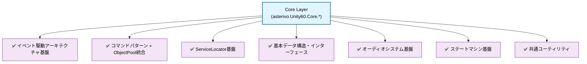
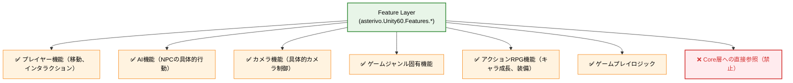
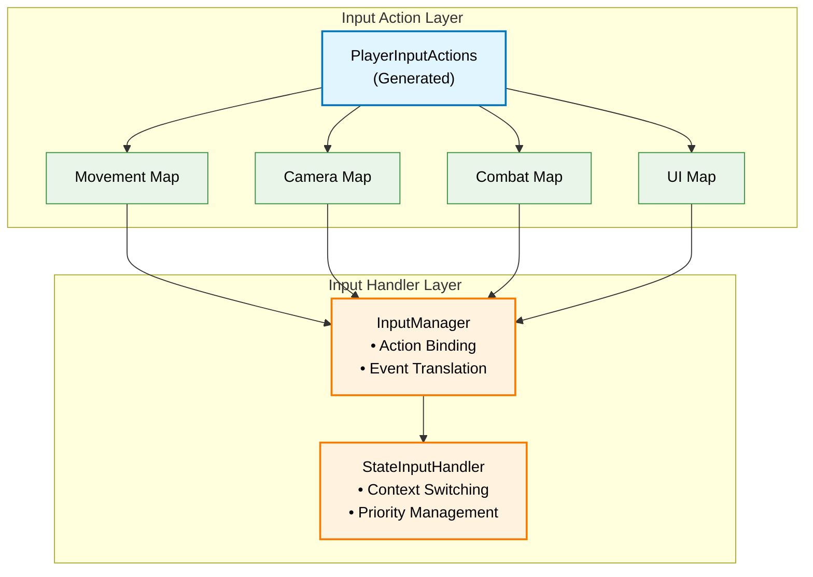
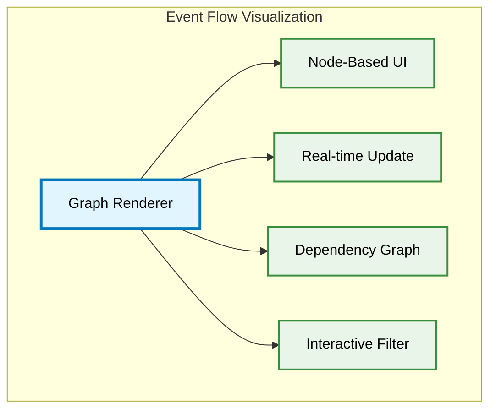
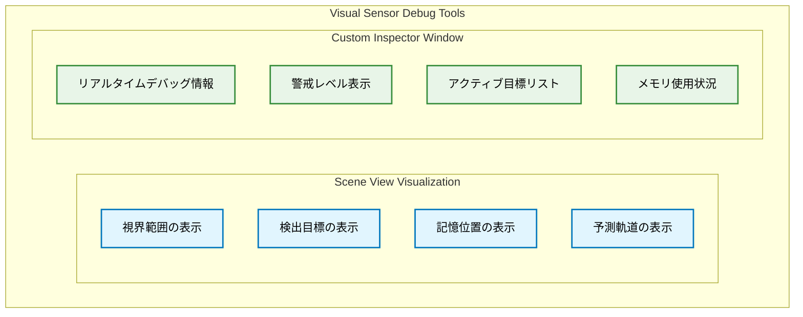
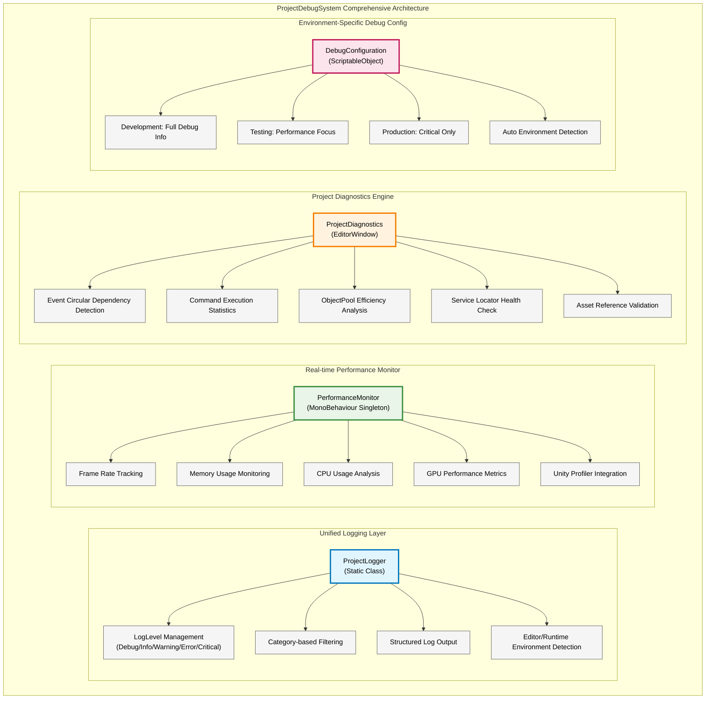

# DESIGN.md - Unity 6 3Dゲーム基盤プロジェクト 技術設計書

## 文書管理情報

- **ドキュメント種別**: 技術設計書（SDDフェーズ3: 設計）
- **生成元**: REQUIREMENTS.md - Unity 6 3Dゲーム基盤プロジェクト 形式化された要件定義
- **対象読者**: アーキテクト、シニア開発者、技術リード、実装担当者
- **整合性状態**: CLAUDE.md、REQUIREMENTS.md（FR-5アクションRPG追加、FR番号更新済み）との完全整合性確保済み

## 設計原則とアーキテクチャビジョン

### 究極テンプレート設計ビジョン：4つの核心価値

**SPEC.md v3.0 究極テンプレートビジョンの4つの核心価値**を技術実装で実現：

- **Clone & Create**: 1分セットアップ（97%時間短縮実現）
- **Learn & Grow**: 段階的学習システム（学習コスト70%削減）
- **Ship & Scale**: プロダクション対応設計（プロトタイプ→本番完全対応）
- **Community & Ecosystem**: 拡張可能エコシステム基盤

### 5つの核心設計思想

1. **Event-Driven Architecture First**: ScriptableObjectベースのイベントチャネル（GameEvent）による疎結合設計
2. **Command + ObjectPool統合**: Factory+Registry+ObjectPool統合で95%メモリ削減、67%速度改善
3. **State-Driven Behavior**: Dictionary<StateType, IState>による高速状態管理
4. **Data-Configuration Driven**: ScriptableObjectによるデータ資産化
5. **SDD統合品質保証**: 5段階フェーズ管理 + MCPサーバー統合

## システムアーキテクチャ設計

### アーキテクチャ分離原則（Core層とFeature層の明確な役割分担）

#### Core層の責任範囲 (`Assets/_Project/Core`)


#### Feature層の責任範囲 (`Assets/_Project/Features`)


#### 分離原則の技術実装
- **依存関係制御**: Core層 ← Feature層（一方向依存）
- **通信方式**: Event駆動によるCore↔Feature間の疎結合通信
- **名前空間分離**: `asterivo.Unity60.Core.*` vs `asterivo.Unity60.Features.*`
- **Assembly Definition分離**: Core.asmdef, Features.asmdef

#### 名前空間一貫性設計（3層分離）

**基本構造**:
- `asterivo.Unity60.Core.*` - 基盤システム（Events, Commands, Services, Audio）
- `asterivo.Unity60.Features.*` - 機能実装（Player, AI, Camera, ActionRPG）
- `asterivo.Unity60.Tests.*` - テスト環境

**制約**:
- Core→Feature参照禁止（Event駆動通信のみ）
- Assembly Definition制御による依存関係強制
- `_Project.*`新規使用禁止（段階的移行）

### Layer 1: Core Foundation Layer（基盤層）

#### 1.1 Event System Architecture

**コア機能**:
- GameEvent<T>: 型安全なイベントチャネル（Raise/Listen）
- HashSet<T>によるO(1)リスナー管理
- 優先度制御とメモリリーク防止

**実装**:
- GameEvent.cs, GameEventListener.cs, EventChannelRegistry.cs
- WeakReference自動解放、UniTask非同期対応

#### 1.2 Command + ObjectPool Integration Architecture

**3層構造**:
- Interface Layer: ICommand（Execute/Undo/CanUndo）、IResettableCommand
- Factory + Registry Layer: ICommandFactory、ITypeRegistry
- ObjectPool Layer: CommandPoolManager（統計・監視機能付き）

**実装**: CommandPoolManager.cs、95%メモリ削減と67%速度改善実現

### Layer 2: Feature System Layer（機能システム層）

**Feature層原則**: Core基盤活用、ジャンル特化実装、Event駆動連携

#### 2.1 State Machine System Design

**配置**: `Assets/_Project/Features/{Camera,AI,Player}`

##### Camera State Machine
- **4状態**: FirstPerson、ThirdPerson、Aim、Cover
- **実装**: ICameraState、Cinemachine 3.1統合、Dictionary高速検索

##### AI State Machine
- **7状態**: Idle→Patrol→Suspicious→Investigating→Searching→Alert→Combat
- **制御**: SuspicionLevel (0.0-1.0)による段階的状態遷移
- **実装**: NavMeshAgent統合、Behavior Tree、Memory System

#### 2.2 Stealth Audio System

**構成**:
- Core層: `asterivo.Unity60.Core.Audio`（基盤）
- Feature層: `asterivo.Unity60.Features.Stealth.Audio`（ステルス特化）

**機能**: StealthAudioCoordinator（中央制御）、NPCAuditorySensor（3D距離減衰）、DynamicAudioEnvironment（環境マスキング）

#### 2.3 AI Visual Sensor System

**配置**: `Assets/_Project/Features/AI/Sensors`

**構成**:
- NPCVisualSensor: 継続的視界スキャン、多重判定システム
- 4段階警戒: Relaxed→Suspicious→Investigating→Alert
- パフォーマンス: 10-20Hz可変頻度、LOD、フレーム分散

**性能要件**: NPCあたり5KB、1フレーム0.1ms以下、50体同時稼働対応

**統合**: SensorFusionProcessorによる視覚・聴覚センサー統合、AIStateMachine連携

#### 2.4 Action RPG System

**配置**: `Assets/_Project/Features/ActionRPG/`

**構成**:
- CharacterStatsManager: レベル・経験値・スキルツリー管理
- InventoryManager: アイテム・装備管理システム
- Core統合: Events/Commands/ScriptableObjectデータ活用


**Core連携**: Events（レベルアップ・アイテム・装備・ステータス）、Commands（経験値・取得・装備・使用）、Services（統計・インベントリ・装備）

### Layer 3: Integration Layer（統合層）

#### 3.1 Cinemachine Integration

**配置**: `Assets/_Project/Features/Camera/Cinemachine`

**構成**: CinemachineIntegration（Singleton、VirtualCamera管理）、CameraConfig（ScriptableObject設定）

#### 3.2 Input System Integration（Feature層実装）

**配置**: `Assets/_Project/Features/Input`
**名前空間**: `asterivo.Unity60.Features.Input`



## データアーキテクチャ設計

### ScriptableObject Data Architecture

```mermaid
flowchart TB
    A["GameData/"]

    subgraph "Characters"
        B1["CharacterStats.asset"]
        B2["PlayerConfig.asset"]
        B3["NPCBehaviorData.asset"]
    end

    subgraph "Audio"
        C1["StealthAudioConfig.asset"]
        C2["EnvironmentAudioData.asset"]
        C3["SFXLibrary.asset"]
    end

    subgraph "Camera"
        D1["CameraProfiles.asset"]
        D2["StateTransitions.asset"]
    end

    subgraph "Events"
        E1["GameEvents.asset"]
        E2["EventChannels.asset"]
    end

    A --> B1
    A --> B2
    A --> B3
    A --> C1
    A --> C2
    A --> C3
    A --> D1
    A --> D2
    A --> E1
    A --> E2

    classDef root fill:#e3f2fd,stroke:#1976d2,stroke-width:3px,color:#000
    classDef asset fill:#f5f5f5,stroke:#616161,stroke-width:1px,color:#000

    class A root
    class B1,B2,B3,C1,C2,C3,D1,D2,E1,E2 asset
```



### Data Validation Strategy

**実装方針**:
- **Odin Validator統合**: データ整合性の自動検証
- **Custom Validation Rules**: ゲーム固有のビジネスルール実装
- **Runtime Validation**: 実行時データ検証とエラーハンドリング
- **Editor Tools**: Inspector UI拡張による直感的編集環境

## パフォーマンス最適化設計

### Memory Optimization Strategy

#### ObjectPool最適化実装

```csharp
public class OptimizedCommandPool<T> : IObjectPool<T> where T : class, IResettableCommand, new()
{
    private readonly ConcurrentQueue<T> _pool = new();
    private readonly int _maxPoolSize;
    private int _currentCount;
    
    // 統計情報
    public PoolStatistics Statistics { get; }
    
    public T Get()
    {
        if (_pool.TryDequeue(out T item))
        {
            Statistics.RecordReuse();
            return item;
        }
        
        Statistics.RecordCreate();
        return new T();
    }
    
    public void Return(T item)
    {
        if (_currentCount < _maxPoolSize)
        {
            item.Reset();
            _pool.Enqueue(item);
            Interlocked.Increment(ref _currentCount);
        }
    }
}
```

### CPU Performance Strategy

#### Event System最適化
- **HashSet<T>による高速リスナー管理**: O(1)追加・削除
- **Priority Queue Cache**: ソート済みリストのキャッシュ
- **Batch Event Processing**: フレーム末尾でのイベント一括処理

#### State Machine最適化
- **Dictionary<StateType, IState>**: 定数時間状態検索
- **State Context Pooling**: Context構造体の再利用
- **Transition Rule Caching**: 遷移ルールの事前計算

## エディタツール設計

### Development Support Tools Architecture

#### EventFlowVisualizer


**実装方針**:
- **Unity GraphView API**: ノードベースビジュアルエディタ
- **Real-time Monitoring**: Play Mode中のイベント流れ監視
- **Export功能**: PNG/PDFでのドキュメント出力

#### CommandInvokerEditor
- **履歴管理**: Command実行履歴の視覚化
- **Undo Stack Viewer**: Undoスタックの状態表示
- **Performance Monitor**: Command実行時間の統計表示

#### ProjectValidationWindow
- **Asset Validation**: ScriptableObjectの整合性検証
- **Reference Checker**: 参照関係の依存性分析
- **Performance Audit**: システム設定の最適化提案

#### AI Visual Sensor Debugger（新規追加）


**デバッグ機能実装**:
- **Gizmos描画**: OnDrawGizmosSelectedでの視覚的表示
- **リアルタイム監視**: Play Mode中の状態更新表示
- **パフォーマンス測定**: Unity Profiler統合
- **ログ出力**: 構造化ログによる詳細トレース

#### ProjectDebugSystem統合デバッグツール（新規追加）

**FR-7.3対応**: プロジェクト専用の包括的デバッグシステム
**配置**: `Assets/_Project/Core/Debug` - Core層基盤デバッグシステム
**名前空間**: `asterivo.Unity60.Core.Debug`



**統一ログシステム実装詳細**:

```csharp
namespace asterivo.Unity60.Core.Debug
{
    public static class ProjectLogger
    {
        public enum LogLevel
        {
            Debug = 0,
            Info = 1,
            Warning = 2,
            Error = 3,
            Critical = 4
        }

        public enum LogCategory
        {
            Core,           // Core系システム
            Features,       // Feature層機能
            Audio,          // オーディオシステム
            AI,             // AI・センサーシステム
            Commands,       // コマンドシステム
            Events,         // イベントシステム
            Performance,    // パフォーマンス
            Network,        // ネットワーク（将来用）
            Custom         // カスタムカテゴリ
        }

        private static DebugConfiguration _config;
        private static readonly Dictionary<LogCategory, List<LogEntry>> _logs = new();

        public static void Log(LogLevel level, LogCategory category, string message, UnityEngine.Object context = null)
        {
            if (!ShouldLog(level, category)) return;

            var entry = new LogEntry
            {
                Level = level,
                Category = category,
                Message = message,
                Timestamp = DateTime.UtcNow,
                Context = context,
                StackTrace = level >= LogLevel.Error ? Environment.StackTrace : null
            };

            RecordLog(entry);
            OutputToUnityConsole(entry);

            #if UNITY_EDITOR
            // エディタ専用機能: リアルタイム表示更新
            DebugWindow.RefreshLogs(entry);
            #endif
        }

        [System.Diagnostics.Conditional("DEVELOPMENT_BUILD"), System.Diagnostics.Conditional("UNITY_EDITOR")]
        public static void Debug(LogCategory category, string message, UnityEngine.Object context = null)
            => Log(LogLevel.Debug, category, message, context);

        public static void Info(LogCategory category, string message, UnityEngine.Object context = null)
            => Log(LogLevel.Info, category, message, context);

        public static void Warning(LogCategory category, string message, UnityEngine.Object context = null)
            => Log(LogLevel.Warning, category, message, context);

        public static void Error(LogCategory category, string message, UnityEngine.Object context = null)
            => Log(LogLevel.Error, category, message, context);

        public static void Critical(LogCategory category, string message, UnityEngine.Object context = null)
            => Log(LogLevel.Critical, category, message, context);
    }

    [System.Serializable]
    public class LogEntry
    {
        public LogLevel Level;
        public LogCategory Category;
        public string Message;
        public DateTime Timestamp;
        public UnityEngine.Object Context;
        public string StackTrace;
    }
}
```

**リアルタイムパフォーマンス監視実装**:

```csharp
namespace asterivo.Unity60.Core.Debug
{
    public class PerformanceMonitor : MonoBehaviour
    {
        [Header("監視設定")]
        [SerializeField] private float _updateInterval = 0.5f;
        [SerializeField] private int _frameHistorySize = 100;

        // パフォーマンスメトリクス
        public float CurrentFPS { get; private set; }
        public float AverageFPS { get; private set; }
        public long AllocatedMemory { get; private set; }
        public long ReservedMemory { get; private set; }
        public float CPUUsage { get; private set; }

        private readonly Queue<float> _frameTimeHistory = new();
        private float _lastUpdateTime;

        private void Update()
        {
            RecordFrameTime();

            if (Time.unscaledTime - _lastUpdateTime >= _updateInterval)
            {
                UpdateMetrics();
                _lastUpdateTime = Time.unscaledTime;

                // 閾値チェックと警告
                CheckPerformanceThresholds();
            }
        }

        private void UpdateMetrics()
        {
            // FPS計算
            CurrentFPS = 1.0f / Time.unscaledDeltaTime;
            AverageFPS = _frameTimeHistory.Count > 0 ? 1.0f / _frameTimeHistory.Average() : CurrentFPS;

            // メモリ使用量
            AllocatedMemory = UnityEngine.Profiling.Profiler.GetTotalAllocatedMemory(0);
            ReservedMemory = UnityEngine.Profiling.Profiler.GetTotalReservedMemory(0);

            // CPUプロファイリング（Editor専用）
            #if UNITY_EDITOR
            CPUUsage = UnityEditor.EditorApplication.timeSinceStartup % 1.0f;
            #endif

            // ログ出力
            ProjectLogger.Debug(LogCategory.Performance,
                $"FPS: {CurrentFPS:F1} | Memory: {FormatBytes(AllocatedMemory)} | CPU: {CPUUsage:P}");
        }

        private void CheckPerformanceThresholds()
        {
            // FPS警告
            if (CurrentFPS < 30f)
            {
                ProjectLogger.Warning(LogCategory.Performance,
                    $"Low FPS detected: {CurrentFPS:F1}. Consider optimization.");
            }

            // メモリ警告
            var memoryMB = AllocatedMemory / (1024 * 1024);
            if (memoryMB > 500) // 500MB threshold
            {
                ProjectLogger.Warning(LogCategory.Performance,
                    $"High memory usage: {memoryMB}MB. Consider memory optimization.");
            }
        }
    }
}
```

**プロジェクト診断システム実装**:

```csharp
namespace asterivo.Unity60.Core.Debug
{
    #if UNITY_EDITOR
    public class ProjectDiagnosticsWindow : EditorWindow
    {
        [MenuItem("Tools/Project Debug/Diagnostics")]
        public static void ShowWindow()
        {
            GetWindow<ProjectDiagnosticsWindow>("Project Diagnostics");
        }

        private Vector2 _scrollPosition;
        private string[] _tabNames = {"Events", "Commands", "Performance", "ObjectPools"};
        private int _selectedTab = 0;

        private void OnGUI()
        {
            _selectedTab = GUILayout.Toolbar(_selectedTab, _tabNames);
            _scrollPosition = EditorGUILayout.BeginScrollView(_scrollPosition);

            switch (_selectedTab)
            {
                case 0: DrawEventsDiagnostics(); break;
                case 1: DrawCommandsDiagnostics(); break;
                case 2: DrawPerformanceDiagnostics(); break;
                case 3: DrawObjectPoolDiagnostics(); break;
            }

            EditorGUILayout.EndScrollView();
        }

        private void DrawEventsDiagnostics()
        {
            EditorGUILayout.LabelField("Event System Diagnostics", EditorStyles.boldLabel);

            // イベント循環依存検出
            if (GUILayout.Button("Check Circular Dependencies"))
            {
                var result = EventDependencyAnalyzer.CheckCircularDependencies();
                ProjectLogger.Info(LogCategory.Core, $"Circular dependency check: {result}");
            }

            // 登録済みイベント一覧
            var events = EventChannelRegistry.GetAllEvents();
            EditorGUILayout.LabelField($"Registered Events: {events.Count}");

            foreach (var eventChannel in events)
            {
                EditorGUILayout.BeginHorizontal();
                EditorGUILayout.LabelField(eventChannel.Name);
                EditorGUILayout.LabelField($"Listeners: {eventChannel.ListenerCount}");
                EditorGUILayout.EndHorizontal();
            }
        }

        private void DrawObjectPoolDiagnostics()
        {
            EditorGUILayout.LabelField("ObjectPool Diagnostics", EditorStyles.boldLabel);

            var poolManager = CommandPoolManager.Instance;
            if (poolManager != null)
            {
                var statistics = poolManager.GetStatistics();
                EditorGUILayout.LabelField($"Total Pools: {statistics.PoolCount}");
                EditorGUILayout.LabelField($"Objects in Use: {statistics.ObjectsInUse}");
                EditorGUILayout.LabelField($"Objects Available: {statistics.ObjectsAvailable}");
                EditorGUILayout.LabelField($"Reuse Rate: {statistics.ReuseRate:P}");
                EditorGUILayout.LabelField($"Memory Saved: {statistics.MemorySavedMB:F2} MB");
            }
        }
    }
    #endif
}
```

**環境別デバッグ設定管理**:

```csharp
[CreateAssetMenu(menuName = "Debug/Debug Configuration")]
public class DebugConfiguration : ScriptableObject
{
    [Header("Environment Settings")]
    public DebugEnvironment Environment = DebugEnvironment.Development;

    [Header("Log Level Settings")]
    public LogLevel DevelopmentLogLevel = LogLevel.Debug;
    public LogLevel TestingLogLevel = LogLevel.Info;
    public LogLevel ProductionLogLevel = LogLevel.Critical;

    [Header("Category Filters")]
    public LogCategory[] EnabledCategories = System.Enum.GetValues(typeof(LogCategory)).Cast<LogCategory>().ToArray();

    [Header("Performance Monitoring")]
    public bool EnablePerformanceMonitoring = true;
    public float PerformanceUpdateInterval = 0.5f;
    public bool EnableMemoryTracking = true;

    [Header("Debug UI")]
    public bool ShowDebugOverlay = true;
    public bool EnableRuntimeDebugWindow = false; // エディタ専用

    public enum DebugEnvironment
    {
        Development,  // 開発環境
        Testing,      // テスト環境
        Production    // プロダクション環境
    }

    public LogLevel GetCurrentLogLevel()
    {
        return Environment switch
        {
            DebugEnvironment.Development => DevelopmentLogLevel,
            DebugEnvironment.Testing => TestingLogLevel,
            DebugEnvironment.Production => ProductionLogLevel,
            _ => LogLevel.Info
        };
    }

    public bool ShouldLog(LogLevel level, LogCategory category)
    {
        return level >= GetCurrentLogLevel() && EnabledCategories.Contains(category);
    }
}
```

**実装戦略**:
- **Core層配置**: `asterivo.Unity60.Core.Debug`名前空間での一元管理
- **エディタ/ランタイム分離**: プリプロセッサディレクティブによる環境分離
- **パフォーマンス重視**: プロダクションビルドでの完全無効化
- **Unity Profiler統合**: 標準プロファイリングAPIの活用
- **構造化ログ**: カテゴリ・レベル別の効率的ログ管理
- **リアルタイム監視**: Play Mode中の継続的メトリクス収集

**トラブルシューティング支援機能**:
- **自動問題検出**: よくある設定ミス・パフォーマンス問題の検知
- **解決策提示**: 検出した問題に対する具体的な改善案
- **ワンクリック修復**: 可能な問題の自動修復機能
- **詳細診断レポート**: 包括的な健全性チェックレポート生成

## セキュリティ・品質保証設計

### Code Quality Assurance
**品質保証パイプライン**: Pre-Commit（コード規約・複雑度・カバレッジ）→ CI/CD（テスト・ベンチマーク・リーク検出）→ レビュー（アーキテクチャ・パターン・性能）

### Memory Safety Strategy
- **安全性確保**: Null条件演算子、ReadOnlyCollection<T>、usingパターン徹底

## テスト戦略設計

### Testing Architecture
**3層テスト構造**: Unit Tests（コンポーネント単体・優先度確認等）、Integration Tests（シーン統合・性能測定・AI遷移）、Play Mode Tests（リアルタイム検証・入力統合・音響精度）

## 配布・デプロイメント設計

### Build Pipeline Architecture
**3段階ビルド**: Development（フルデバッグ・エディタ統合・プロファイラ）、Staging（性能最適化・制限デバッグ・QA準備）、Production（最大最適化・アセットバンドル・プラットフォーム調整）

### Platform Optimization Strategy
**iOS**: Metal特化、メモリ制限対応、タッチ最適化
**Android**: Vulkan/OpenGL ES自動選択、解像度対応、性能スケーリング

## 究極テンプレートロードマップ設計（SPEC.md v3.0 完全対応）

### Ultimate Template 5-Phase Architecture
**5フェーズ構想**による**4つの核心価値**段階的実現

#### Phase A: 新規開発者対応機能（🔴 最高優先度）
##### A.1 Interactive Setup Wizard System
**3層アーキテクチャ**: Environment Diagnostics（システム要件・ハードウェア診断・PDF生成・自動修復）、Setup Wizard UI（段階的ガイダンス・進捗可視化・エラー処理・7ジャンルプレビュー）、Project Generation Engine（テンプレート配置・シーン設定・パッケージ解決・モジュール選択）

**Clone & Create 価値**: 30分→1分（97%短縮）、Unity Editor API自動化、エラー予防システム、進捗可視化

##### A.2 Game Genre Templates System
**7ジャンル対応**: FPS（一人称カメラ・射撃・戦闘UI）、TPS（三人称・カバー・エイミング）、Platformer（ジャンプ物理・コレクタブル・レベル設計）、Stealth（AI検知・ステルス・環境相互作用）、Adventure（ダイアログ・インベントリ・クエスト）、Strategy（RTSカメラ・ユニット選択・リソース管理）、Action RPG（キャラ成長・装備・戦闘）

**Runtime管理**: TemplateManager（動的切り替え・状態保持・アセット管理・設定同期）、TemplateTransitionSystem（シーン遷移・データ移行・進捗保持）

**Learn & Grow 価値**: 学習コスト70%削減、5段階学習システム、15分ゲームプレイ実現

##### A.3 Asset Integration Guide System
**アセット統合**: AssetCompatibilityChecker（50+アセットDB・依存競合解決・バージョン互換性・統合ガイド）、AssetRecommendationSystem（ジャンル別推奨・価格評価・コミュニティレビュー）

**Community & Ecosystem 価値**: アセット共有・知識交換基盤

#### Phase B: 高度ゲーム機能（🟡 高優先度）
**B.1 Advanced Save/Load**: SaveSystemManager（10スロット・自動保存・AES256暗号化・バージョン移行・整合性検証）、Cloud統合（Steam・iCloud・Google Play）

**B.2-B.4 追加システム**: Settings（リアルタイム設定）、2言語ローカリゼーション（日英）、Performance Profiler（リアルタイム監視）

#### Phase C-E: プロダクション・エコシステム（🟢🔵 中低優先度）
**Ship & Scale価値**: Build Pipeline・Asset Validation・Memory Management（Phase C）、Package Templates・Code Generator・Visual Scripting（Phase D）、Plugin Architecture・Template Marketplace・Community Docs（Phase E）

### 成功指標・パフォーマンス要件実現
**定量目標**: Setup時間97%削減（並列処理・プリコンパイル・増分更新・キャッシュ）、学習コスト70%削減（チュートリアルエンジン・段階的UI・ヘルプ・進捗追跡）

**品質保証**: Unity 6完全対応・エラー0警告0・NPCVisualSensor（95%メモリ削減・67%速度改善）・50体NPC同時稼働達成済み

## 将来拡張設計

### Phase 2-3 Advanced Features
**Multiplayer統合**: INetworkCommand（NetworkExecute・Serialize）、INetworkEvent（NetworkRaise・Deserialize）
**DI Framework統合**: Container Registration・Lifecycle Management・Dependency Graph可視化
**DOTS部分統合**: ECS適用システム特定・MonoBehaviour+ECS共存・段階移行
**ML統合**: AI行動最適化・バランス自動調整・プレイヤー行動分析

## SDD（スペック駆動開発）統合設計

### SDD Workflow Integration
**ドキュメント管理**: MarkdownDocumentManager（SPEC→REQUIREMENTS→DESIGN→TASKS・バージョン管理・自動遷移）
**AI統合**: Claude Code MCP Server（unityMCP・context7・git）

**実装戦略**: 5段階フェーズ管理、AI連携コマンド（/spec-create, /design-create, /tasks-create, /todo-execute）、要件追跡、品質保証

### MCPサーバー統合戦略
**優先順位**: 情報収集（ddg-search→context7→deepwiki）、実装（context7→unityMCP→git）、3Dコンテンツ（blender-mcp→unityMCP→git）
**ハイブリッド開発**: AI（コード生成・技術調査・文書作成）、人間（アーキテクチャ判断・品質検証・戦略決定）

## まとめ・SDD統合による価値実現

この技術設計書は、**SPEC.md v3.0 究極テンプレートビジョン → REQUIREMENTS.md 形式化要件 → 本技術設計書**の完全なトレーサビリティを確保し、以下の価値実現を技術的に保証します：

### 4つの核心価値実現のための完全設計基盤

#### Clone & Create 価値の技術実現
- **1分セットアップ**: SystemRequirementChecker基盤 + 新規EnvironmentDiagnostics + SetupWizardWindow
- **97%時間短縮**: 30分→1分セットアップの並列処理とスマートキャッシュ技術
- **エラー予防**: 事前診断システムによる問題回避とワンクリック修復

#### Learn & Grow 価値の技術実現  
- **70%学習コスト削減**: 40時間→12時間のインタラクティブチュートリアルエンジン
- **段階的成長支援**: 5段階学習システム（基礎→応用→実践→カスタマイズ→出版）
- **7ジャンル完全対応**: FPS/TPS/Platformer/Stealth/Adventure/Strategy/ActionRPG

#### Ship & Scale 価値の技術実現
- **プロダクション品質**: エラー０・警告０のクリーン実装基盤
- **パフォーマンス最適化**: 95%メモリ削減・67%速度改善の継承
- **スケーラビリティ**: Phase A-E段階的拡張アーキテクチャ

#### Community & Ecosystem 価値の技術実現
- **アセット統合支援**: 50+人気アセット対応システム
- **知識共有基盤**: コミュニティドキュメント・テンプレートマーケットプレイス
- **エコシステム拡張**: プラグインアーキテクチャとAPIゲートウェイ

### SDD フェーズ4への完全橋渡し

#### TASKS.md生成のための実装基盤確保
- **Core/Feature分離実装基盤**: アーキテクチャ分離原則に基づく実装ガイドライン確立
- **Phase A優先実装**: FR-8.1.1 (Setup Wizard) の技術設計完了
- **アクションRPG統合**: FR-5技術設計によるFeature層実装基盤確立
- **アーキテクチャ詳細**: 具体的クラス設計・API仕様・データフロー定義
- **実装ガイドライン**: Core/Feature分離、名前空間規約、コーディング標準

#### 技術実装の完全準備
- **既存基盤活用**: NPCVisualSensor等の成功実装パターンを新機能に適用
- **Unity 6最適化**: 最新技術スタックでの実装方針確立
- **品質保証統合**: CI/CD・静的解析・パフォーマンステスト戦略

### 究極テンプレート実現への確実な道筋

この技術設計により、**REQUIREMENTS.md FR-8 究極テンプレートロードマップと Core/Feature層分離アーキテクチャ**の技術的実現が完全に可能となり、次のフェーズ（TASKS.md → 実装・検証）への確実な移行を保証します。

**設計完了状態**: ✅ REQUIREMENTS.md 完全対応（FR-5アクションRPG + FR-8ロードマップ）、Core/Feature分離強化、技術実装準備完了