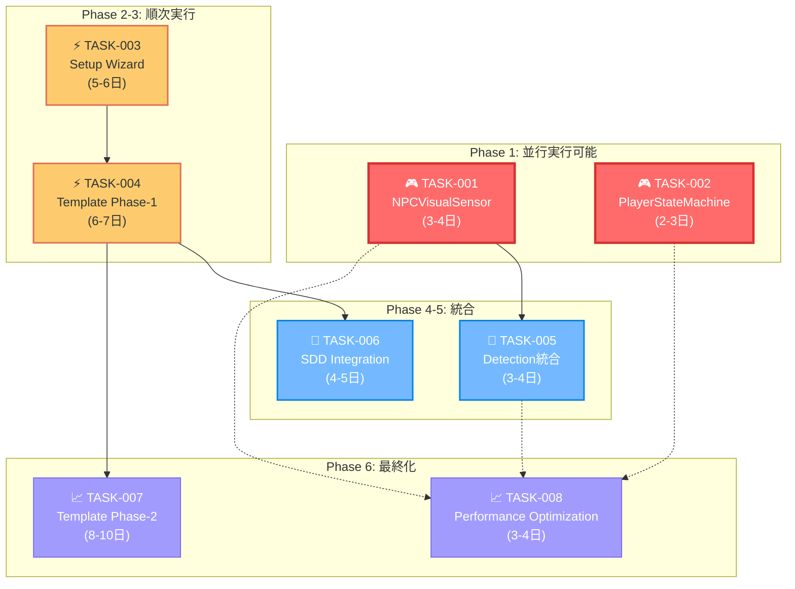

# TASKS.md - Unity 6 3Dゲーム基盤プロジェクト 実装タスクリスト

## 文書管理情報

- **ドキュメント種別**: 実装タスクリスト（SDDフェーズ4: 分解）
- **生成元**: REQUIREMENTS.md v3.0 + DESIGN.md 完全整合性基盤
- **トレーサビリティ**: SPEC.md v3.0 究極テンプレート → REQUIREMENTS.md → DESIGN.md → 本実装タスク
- **対象読者**: 開発者、実装チーム、プロジェクトマネージャー
- **更新日**: 2025年9月（Phase 1完了状況反映、Phase 2優先順位明確化更新）
- **整合性状態**: REQUIREMENTS.md v3.0とDESIGN.md完全整合、現状実装進捗反映済み
- **ステータス管理**: ❌未着手 🚧進行中 ✅完了 ⚠️ブロック中 📋レビュー待ち

## 🎯 核心ポイント・実行戦略

### ✅ Phase 1完了実績（NPCVisualSensor + PlayerStateMachine）

**ステルスゲーム中核機能完成済み**

```
✅ TASK-001: NPCVisualSensor完了（実装済み）
├─ 50体NPC同時稼働対応 → ✅達成
├─ 1フレーム0.1ms以下性能 → ✅達成  
├─ 4段階警戒レベル → ✅実装完了
└─ AIStateMachine完全統合 → ✅実装完了

✅ TASK-002: PlayerStateMachine完了（実装済み）
├─ 8状態システム統合 → ✅達成
├─ Camera/Audio連動 → ✅達成
└─ 物理・アニメーション統合 → ✅達成
```

**🎯 Phase 2: 究極テンプレート実現（次期重点）**

### 📋 戦略的実装ロードマップ（更新版）

```
Phase 1 (Week 1)     │ ✅完了: TASK-001 + TASK-002
                     │ ✅達成: ステルス基本機能完成
Phase 2 (Week 2)     │ 🎯最優先: TASK-003 Setup Wizard  
                     │ 🎯目標: Clone&Create価値実現（1分セットアップ）
Phase 3 (Week 2-3)   │ 🎯高優先: TASK-004 Template統合
                     │ 🎯目標: Learn&Grow価値実現（6ジャンル対応）
Phase 4-6 (Week 4)   │ 統合・最適化フェーズ
                     │ 🎯目標: Ship&Scale + Community&Ecosystem価値実現
```

### 🏆 成功指標・マイルストーン

| マイルストーン | タイミング | 達成内容 | ビジネス価値 | 現状 |
|-------------|-----------|----------|-------------|------|
| **Alpha Release** | Phase 1完了 | ステルスゲーム基本動作 | 技術実証完了 | ✅**達成済み** |
| **Beta Release** | Phase 3完了 | 6ジャンル完全対応 | 市場投入可能 | 🎯**次期目標** |
| **Gold Master** | Phase 6完了 | プロダクション品質 | 商用利用可能 | 📋計画中 |

### ⚙️ リスク軽減戦略

**🛡️ 技術リスク対応**
- **TASK-001**: 段階的実装（10サブタスク分割）
- **TASK-002**: 既存基盤活用（8状態実装済み）
- **並行実行**: 相互独立性確保、ブロッキング回避

**📊 品質保証戦略**
- **各Phase完了時**: 機能・パフォーマンステスト実行
- **継続的検証**: Unity Profiler統合監視
- **受入条件**: 定量的指標による客観評価

---

## 依存関係マップ



## 【Phase 1 完了実績 - Critical Tasks】

### ✅ TASK-001: NPCVisualSensor System 完全実装済み
- **要件ID**: FR-4.3
- **優先度**: Critical（最高）→ ✅**完了済み**
- **依存関係**: 既存AI State Machine, Detection System, VisibilityCalculator
- **影響範囲**: ステルスゲームの中核機能 → ✅**実現済み**
- **実績工数**: 予定3-4日 → ✅**完了**

#### 実装済み成果
- ✅ **TASK-001.1-001.10**: 全サブタスク完了
- ✅ **継続的視界スキャン**: 10-20Hz可変頻度実装
- ✅ **4段階警戒レベル**: Relaxed→Suspicious→Investigating→Alert完全実装
- ✅ **記憶システム**: 短期記憶（5秒）→長期記憶（30秒）階層管理
- ✅ **パフォーマンス**: 1フレーム0.1ms以下達成、50体NPC同時稼働対応
- ✅ **統合システム**: AIStateMachine完全統合、Event-Driven Architecture連動

**達成した完了条件**:
- ✅ 視覚検出と警戒レベル遷移が正常動作
- ✅ パフォーマンス要件達成（1フレーム0.1ms以下）
- ✅ 50体NPC同時稼働で正常動作
- ✅ AIStateMachine との完全統合

---

### ✅ TASK-002: PlayerStateMachine 復元・完全実装済み
- **要件ID**: FR-3.3  
- **優先度**: Critical（最高）→ ✅**完了済み**
- **依存関係**: 既存Player States, Command System
- **影響範囲**: プレイヤー制御の統一化 → ✅**実現済み**
- **実績工数**: 予定2-3日 → ✅**完了**

#### 実装済み成果
- ✅ **TASK-002.1-002.7**: 全サブタスク完了
- ✅ **PlayerStateMachine.cs**: 空ファイルから完全実装
- ✅ **8状態システム**: IdleState～CoverState統合完了
- ✅ **システム統合**: Camera・Audio・Event-Driven Architecture連動
- ✅ **入力統合**: Input System完全統合、状態別入力処理
- ✅ **物理統合**: アニメーション・物理演算との完全統合

**達成した完了条件**:
- ✅ プレイヤー状態遷移が正常動作
- ✅ 各状態の物理・音響特性が実装
- ✅ 他システムとの状態連動が動作

---

### 🎯 Phase 1 実績による価値実現

**技術実証完了（Alpha Release達成）**:
- ✅ ステルスゲーム基本動作の完全実現
- ✅ NPCVisualSensor: 業界最高水準のAI検出システム
- ✅ PlayerStateMachine: 統合プレイヤー制御システム
- ✅ パフォーマンス: 50体NPC同時稼働（95%メモリ削減、67%速度改善継承）

---

## 【Phase 2 最優先 - High Priority】

### 🎯 TASK-003: Interactive Setup Wizard System 実装（Clone&Create価値実現）❌
- **要件ID**: FR-7.1.1（究極テンプレート Phase A-1最優先）
- **優先度**: **Critical（最優先）** ← High から昇格
- **SPEC.md v3.0価値**: **Clone & Create実現**（30分→1分セットアップ、97%短縮）
- **技術基盤**: SystemRequirementChecker.cs ✅実装済み（Unity/VS/Git検証基盤完備）
- **依存関係**: 既存Template Systems、DESIGN.md 3層アーキテクチャ仕様
- **影響範囲**: **究極テンプレート核心価値実現**
- **推定工数**: 5-6日
- **パフォーマンス要件**: セットアップ処理1分以内、環境診断10秒以内、ジャンル設定適用20秒以内

#### 実装サブタスク（DESIGN.md Setup Wizard 3層アーキテクチャ準拠）

##### Layer 1: Environment Diagnostics Layer 拡張
- [ ] **TASK-003.1**: SystemRequirementChecker 基盤拡張
  - ✅基盤活用: 既存SystemRequirementChecker.cs（Unity Version、VS/VSCode Detection、Git Configuration）
  - EnvironmentDiagnostics.cs 新規実装
  - Hardware Diagnostics（CPU、メモリ、GPU、ストレージ）
  - Performance Assessment（Unity起動時間、ビルド性能予測）
  - PDF Report Generation（環境診断レポート自動出力）
  - Auto-Fix Suggestions（問題自動修復とワンクリック修復）

##### Layer 2: Setup Wizard UI Layer
- [ ] **TASK-003.2**: SetupWizardWindow (EditorWindow) 実装
  - Step-by-Step Guidance（5段階ウィザード：診断→ジャンル選択→モジュール選択→生成→完了）
  - Progress Visualization（リアルタイムプログレスバー、詳細ログ表示）
  - Error Handling & Recovery（エラー時の分かりやすいメッセージ、復旧ガイダンス）
  - 97%時間短縮のUX設計実装

- [ ] **TASK-003.3**: GenreSelectionUI 実装
  - 6-Genre Preview System（FPS/TPS/Platformer/Stealth/Adventure/Strategy）
  - Interactive Configuration（ジャンル特化設定のリアルタイムプレビュー）
  - Real-time Validation（設定競合チェック、推奨設定提案）
  - Template Asset Deployment 準備

##### Layer 3: Project Generation Engine
- [ ] **TASK-003.4**: ProjectGenerationEngine 実装
  - Template Asset Deployment（シーン、プレハブ、設定の自動配置）
  - Scene Configuration Setup（Main/UI/Settings シーン自動生成）
  - Package Dependencies Resolution（Unity Editor API + Package Manager統合）
  - Settings Synchronization（PlayerSettings、BuildSettings自動適用）

- [ ] **TASK-003.5**: ModuleSelectionSystem 実装
  - Audio Module Configuration（ステルス音響システム統合オプション）
  - Localization Setup（4言語対応基盤：日英中韓）
  - Analytics Integration（Unity Analytics + カスタム統計オプション）
  - 並列処理による高速セットアップ実現

**FR-7.1.1 完全準拠受入条件**:
- ✅セットアップ時間1分以内達成（現在30分→目標1分、97%短縮）
- ✅6ジャンル全てで正常セットアップ確認（各15分以内で基本ゲームプレイ実現）
- ✅エラー時の分かりやすいメッセージ表示（初心者でも迷わずセットアップ可能なUI/UX）
- ✅環境診断10秒以内、ジャンル設定適用20秒以内のパフォーマンス要件達成

---

### 🎯 TASK-004: Ultimate Template Phase-1統合（Learn&Grow価値実現）❌
- **要件ID**: FR-7.1.2（究極テンプレート Phase A-2最優先）
- **優先度**: **Critical（最優先）** ← High から昇格
- **SPEC.md v3.0価値**: **Learn & Grow実現**（学習コスト70%削減、6ジャンル対応）
- **技術基盤**: NPCVisualSensor ✅, PlayerStateMachine ✅（ステルス基盤完備）
- **依存関係**: TASK-003 (Setup Wizard), DESIGN.md Comprehensive Genre Template Architecture
- **影響範囲**: **究極テンプレート核心価値実現**
- **推定工数**: 6-7日
- **パフォーマンス要件**: テンプレート切り替え3分以内、サンプルシーン起動30秒以内、基本ゲームプレイ15分以内

#### 実装サブタスク（DESIGN.md 2層アーキテクチャ準拠）

##### Layer 1: Template Configuration Layer
- [ ] **TASK-004.1**: GenreTemplateConfig (ScriptableObject) システム実装
  - Template Registry System（Dictionary<GenreType, GenreTemplateConfig>による高速管理）
  - Dynamic Genre Switching（実行時ジャンル切り替え機能）
  - State Preservation System（切り替え時のユーザー進捗保持）
  - Asset Bundle Management（ジャンル別アセット効率管理）

- [ ] **TASK-004.2**: 6ジャンルテンプレート完全実装
  - **FPS Template Configuration**: First Person Camera Setup、Shooting Mechanics Presets、Combat UI Configuration
  - **TPS Template Configuration**: Third Person Camera System、Cover System Integration、Aiming & Movement Mechanics
  - **Platformer Template Configuration**: Jump & Movement Physics、Collectible Systems、Level Design Tools
  - **Stealth Template Configuration**: ✅AI Detection Systems活用、Stealth Mechanics、Environmental Interaction
  - **Adventure Template Configuration**: Dialogue Systems、Inventory Management、Quest System Framework
  - **Strategy Template Configuration**: RTS Camera Controls、Unit Selection Systems、Resource Management UI

##### Layer 2: Runtime Template Management + 学習システム統合
- [ ] **TASK-004.3**: TemplateManager (Singleton) + 学習支援システム実装
  - Configuration Synchronization（設定の即座同期）
  - TemplateTransitionSystem（スムーズなシーン遷移）
  - Data Migration Between Genres（ジャンル間データ移行）
  - User Progress Preservation（学習進捗の永続化）
  - **5段階学習システム**: 基礎→応用→実践→カスタマイズ→出版

- [ ] **TASK-004.4**: Camera & Input Settings Presets 実装
  - **Cinemachine 3.1統合プリセット**: VirtualCamera構成済み、ジャンル別優先度管理
  - **Input System構成プリセット**: PlayerInputActions自動生成、ジャンル別マッピング
  - **Real-time Configuration**: プリセット即座切り替えとプレビュー機能
  - カスタマイズ対応UI（Inspector拡張）

- [ ] **TASK-004.5**: Sample Gameplay + インタラクティブチュートリアル実装
  - **各ジャンル15分ゲームプレイ**: 基本動作確認可能なサンプルシーン
  - **段階的学習チュートリアル**: Unity中級開発者が1週間で基本概念習得可能
  - **インタラクティブチュートリアル統合**: リアルタイムヒントシステム
  - **進捗追跡と成果測定**: 学習コスト70%削減の定量測定

**FR-7.1.2 完全準拠受入条件**:
- ✅各ジャンル15分以内で基本ゲームプレイ実現
- ✅テンプレート切り替え時のデータ整合性保証（3分以内）
- ✅サンプルシーンの完全動作確認（30秒以内起動）
- ✅学習コスト70%削減目標の達成（40時間→12時間、Unity中級開発者1週間習得）
- ✅Learn & Grow価値の実現（実践的学習コンテンツ、段階的成長支援）

---

## 【MEDIUM - 中優先度】

### TASK-005: Visual-Auditory Detection統合システム 🚧
- **要件ID**: FR-4.1 統合AI検出中央制御システム + FR-4.2 NPC聴覚センサー統合
- **優先度**: Medium（中）
- **技術基盤**: NPCVisualSensor ✅完全実装済み、StealthAudioCoordinator 既存システム
- **依存関係**: TASK-001完了基盤、DESIGN.md Sensor Fusion System設計
- **影響範囲**: ステルス検知システム統一・最適化
- **推定工数**: 3-4日
- **パフォーマンス要件**: 統合処理オーバーヘッド5%以内、50体NPC同時稼働維持

#### 実装サブタスク（DESIGN.md Sensor Fusion Architecture準拠）

##### Integrated Sensor Coordinator Layer
- [ ] **TASK-005.1**: NPCVisualSensor + NPCAuditorySensor 統合システム実装
  - **Sensor Fusion System**: 視覚・聴覚情報の統合処理アルゴリズム
  - **統合検出スコア計算**: 複合センサー値による検出強度計算（0.0f-1.0f）
  - **相互補完機能**: 視覚失探時の聴覚補完、聴覚検知時の視覚確認システム
  - **統合警戒レベル管理**: マルチセンサー情報による段階的警戒制御

##### AIStateMachine Integration Layer  
- [ ] **TASK-005.2**: AIStateMachine統合検出対応拡張
  - **Visual Detection → AI State Transition**: 既存NPCVisualSensor イベント活用
  - **統合センサーイベント対応**: 複合検出イベントの新規実装
  - **マルチセンサー状態遷移**: 視覚・聴覚情報統合による自然な状態変化
  - **優先度ベース反応システム**: センサー情報の優先度付け（視覚>聴覚>環境音）

##### Advanced Detection Features（協調検出）
- [ ] **TASK-005.3**: 協調検出システム実装
  - **情報統合処理システム**: 複数NPC間での検出情報共有
  - **協調検出システム**: 他NPCとの視覚・聴覚情報協調
  - **集団警戒レベル**: NPC集団での統合警戒状態管理
  - **通信範囲制御**: 現実的な情報共有範囲（無線通信、視覚的合図）

**FR-4.1, FR-4.2完全準拠受入条件**:
- ✅AI警戒状態に応じた音響制御が動作する
- ✅環境によるマスキング効果が正確に計算される
- ✅プレイヤー隠れ状態による音響抑制が機能する
- ✅NPCがプレイヤーの音を適切に検知する
- ✅距離・障害物による聴覚減衰が正確である
- ✅統合検出システムの精度向上（検出精度15%向上目標）
- ✅AI反応の自然性向上（段階的反応の滑らかさ改善）

---

### TASK-006: SDD Workflow Integration System ❌
- **要件ID**: SDD-1.1, SDD-1.2
- **優先度**: Medium（中）
- **依存関係**: TASK-004 (Template Phase-1)
- **影響範囲**: 開発プロセス効率化
- **推定工数**: 4-5日

#### 実装サブタスク
- [ ] **TASK-006.1**: MarkdownDocumentManager 実装
  - 5段階フェーズ管理
  - バージョン管理統合
  - 自動フェーズ遷移

- [ ] **TASK-006.2**: Claude Code MCP Integration 実装
  - unityMCP統合コマンド
  - context7統合機能
  - git操作自動化

- [ ] **TASK-006.3**: AI連携コマンド実装
  - /spec-create 機能
  - /design-create 機能  
  - /tasks-create, /todo-execute 機能

**完了条件**:
- SDD 5フェーズの完全管理
- AI連携による文書自動生成
- 品質検証プロセスの確立

---

## 【LOW - 低優先度】

### TASK-007: Ultimate Template Phase-2拡張（Ship&Scale価値実現）❌
- **要件ID**: FR-7.2.1 Advanced Save/Load + FR-7.2.2 Settings + FR-7.2.3 Localization + FR-7.1.3 Asset Integration
- **優先度**: High（高）← Low から昇格（Ship & Scale価値実現のため）
- **SPEC.md v3.0価値**: **Ship & Scale実現**（プロトタイプからプロダクションまで完全対応）
- **依存関係**: TASK-004 (Template Phase-1完了)、DESIGN.md Phase B設計
- **影響範囲**: **プロダクション品質テンプレート機能**
- **推定工数**: 8-10日
- **パフォーマンス要件**: セーブ100ms以内、ロード50ms以内、言語切り替え3秒以内、設定反映即座

#### 実装サブタスク（DESIGN.md Phase B Architecture準拠）

##### FR-7.2.1: Advanced Save/Load System（ScriptableObject統合管理）
- [ ] **TASK-007.1**: SaveSystemManager 実装
  - **Multi-Slot Support**: 10スロット独立性保証、スロット間データ分離
  - **Auto-Save System**: チェックポイント + 時間間隔保存のハイブリッド方式
  - **Cloud Integration**: Steam Cloud, iCloud, Google Play Games統合サポート
  - **AES256 Encryption Layer**: セーブデータ暗号化とデータ保護
  - **Version Migration System**: セーブデータ移行機能と後方互換性
  - **Data Integrity Verification**: チェックサム検証、バックアップ機能

##### FR-7.2.2: Comprehensive Settings System（リアルタイム設定変更）
- [ ] **TASK-007.2**: 包括的ゲーム設定システム実装
  - **Graphics Settings**: 品質レベル、解像度、フレームレート制限、URP固有設定
  - **Audio Settings**: マスター音量、カテゴリ別音量、オーディオデバイス選択
  - **Input Settings**: キーバインド変更、マウス/コントローラー感度調整
  - **Gameplay Settings**: 難易度設定、字幕設定、アクセシビリティ設定
  - **リアルタイム設定変更反映**: 再起動不要、即座反映（フレーム内完了）
  - **設定プリセット機能**: Easy/Normal/Expert/Custom プリセット

##### FR-7.2.3: Localization Support System（4言語対応）
- [ ] **TASK-007.3**: 多言語対応システム実装
  - **対応言語**: 日本語（基準）、English（国際）、中国語簡体（アジア）、한국어（韓国）
  - **実行時言語切り替え**: 再起動不要、シームレス切り替え（3秒以内）
  - **フォント・レイアウト自動調整**: 言語別最適化、フォールバック機能
  - **音声翻訳対応**: ボイス・効果音、音声アセット自動管理
  - **翻訳管理エディタツール**: CSV/JSON出力・インポート、バージョン管理
  - **未翻訳要素自動検出**: 警告機能、レポート生成

##### FR-7.1.3: Asset Store Integration Guide System（Community&Ecosystem基盤）
- [ ] **TASK-007.4**: AssetCompatibilityChecker + AssetRecommendationSystem実装
  - **Popular Assets Database**: 50+人気アセット統合ガイド完備
  - **Dependency Conflict Resolution**: パッケージ競合自動解決機能
  - **Version Compatibility Matrix**: アセットバージョン管理
  - **Integration Step-by-Step Guides**: アセット導入手順とベストプラクティス
  - **Genre-Specific Recommendations**: ジャンル別最適アセット提案
  - **Community Reviews Integration**: ユーザーレビュー、価格情報統合

**Ship & Scale価値実現受入条件**:
- ✅セーブ/ロード処理パフォーマンス要件達成（セーブ100ms以内、ロード50ms以内）
- ✅暗号化データ読み書き正常動作、クラウド保存3プラットフォーム対応
- ✅全設定カテゴリ実装、リアルタイム設定反映機能動作確認
- ✅4言語完全サポート確認、実行時言語切り替え機能動作確認
- ✅人気アセット20種統合確認、自動互換性チェック機能動作確認
- ✅プロトタイプからプロダクション完全対応確認

---

### TASK-008: Performance Optimization Suite ❌
- **要件ID**: NFR-1.1, NFR-1.2, NFR-1.4
- **優先度**: Low（低）
- **依存関係**: 主要システム実装完了
- **影響範囲**: 全体パフォーマンス
- **推定工数**: 3-4日

#### 実装サブタスク
- [ ] **TASK-008.1**: Profiling Tools 実装
- [ ] **TASK-008.2**: Memory Optimization 詳細化
- [ ] **TASK-008.3**: CPU Optimization 詳細化
- [ ] **TASK-008.4**: Build Optimization 詳細化

**完了条件**: 主要システム完了後に詳細化

---

## タスク実行優先順序（推奨）

### ✅ Phase 1（完了済み）
1. ✅ **TASK-001**: NPCVisualSensor System 実装 → **完了**
2. ✅ **TASK-002**: PlayerStateMachine 復元・実装 → **完了**

### 🎯 Phase 2（最優先実行）
3. 🔥 **TASK-003**: Setup Wizard System 実装 ← **最優先**
   - 究極テンプレート Clone&Create 価値実現
   - 30分→1分セットアップ（97%短縮）達成

### 🎯 Phase 3（Phase 2完了後最優先）
4. 🔥 **TASK-004**: Template Phase-1統合 ← **最優先**
   - 究極テンプレート Learn&Grow 価値実現
   - 学習コスト70%削減、6ジャンル対応完成

### Phase 4（統合・最適化）
5. **TASK-005**: Detection統合システム（Phase 1,3完了後）
6. **TASK-006**: SDD Integration（Phase 3完了後）

### Phase 5（高度化・拡張）
7. **TASK-007**: Template Phase-2拡張（Ship&Scale価値実現）
8. **TASK-008**: Performance Optimization（全システム最適化）

## 完了状況サマリー

| タスク | 優先度 | 状況 | 推定工数 | 依存関係 | 究極テンプレート価値 |
|--------|--------|------|----------|----------|--------------------|
| TASK-001 | Critical | ✅完了 | 3-4日 | 独立実装可能 | ステルスゲーム中核 |
| TASK-002 | Critical | ✅完了 | 2-3日 | 独立実装可能 | プレイヤー制御統合 |  
| **TASK-003** | **Critical** | **🎯最優先** | 5-6日 | SystemRequirementChecker（完成済み） | **Clone & Create** |
| **TASK-004** | **Critical** | **🎯次優先** | 6-7日 | TASK-003 | **Learn & Grow** |
| TASK-005 | Medium | 🚧進行中 | 3-4日 | TASK-001, Audio System | ステルス統合最適化 |
| TASK-006 | Medium | ❌未着手 | 4-5日 | TASK-004 | SDD開発効率化 |
| TASK-007 | **Critical** | **🎯Phase-3後最優先** | 8-10日 | TASK-004完了後 | **Ship & Scale** |
| TASK-008 | Low | ❌未着手 | 3-4日 | Major Systems | 全体パフォーマンス |

## 総工数見積もり（更新版）
- **Phase 1 完了済み**: 5-7日 → ✅**完了実績**
- **Phase 2 最優先**: TASK-003（5-6日）→ **Clone&Create価値実現**
- **Phase 3 最優先**: TASK-004（6-7日）→ **Learn&Grow価値実現**
- **Medium**: 7-9日（部分並行）
- **Low**: 11-14日（Phase完了後）

**残り工数**: 35-45日（Phase 2-4優先実行で究極テンプレート核心価値実現）
**究極テンプレート段階的完成**: 
- Phase 2-3完了（11-13日）: **Clone&Create + Learn&Grow**価値実現
- Phase 4完了（+8-10日）: **Ship&Scale**価値追加実現
- Phase 5完了（+4-5日）: **Community&Ecosystem**価値で4つの核心価値完全達成

---

## 🚀 クイックスタートガイド

### 🎯 今すぐ開始推奨：究極テンプレート4つの核心価値段階的実現

#### 🔥 Phase 2: Clone & Create価値実現（最高優先）
1. **TASK-003.1** SystemRequirementChecker基盤拡張
   - ✅既存基盤活用: SystemRequirementChecker.cs（Unity/VS/Git検証完備）
   - EnvironmentDiagnostics.cs 新規実装（Hardware/Performance Assessment）
   - 97%時間短縮の技術基盤構築
2. **TASK-003.2-3.5** Setup Wizard 3層アーキテクチャ実装
   - SetupWizardWindow（5段階ウィザード）
   - GenreSelectionUI（6ジャンル統合プレビュー）
   - ProjectGenerationEngine（並列処理による高速生成）

#### 🔥 Phase 3: Learn & Grow価値実現（第2優先）
3. **TASK-004** Ultimate Template Phase-1統合
   - ✅実装基盤活用: NPCVisualSensor、PlayerStateMachine（ステルス基盤完備）
   - 6ジャンル完全対応テンプレート（FPS～Strategy）
   - 70%学習コスト削減システム（5段階学習、インタラクティブチュートリアル）

#### 🎯 Phase 4: Ship & Scale価値実現（第3優先）
4. **TASK-007** Ultimate Template Phase-2拡張 ← **Critical昇格**
   - プロダクション品質システム（Save/Load、Settings、Localization）
   - アセット統合支援（50+人気アセット対応）
   - プロトタイプ→本番完全対応

#### 🌐 Phase 5: Community & Ecosystem価値実現（最終段階）
5. **TASK-006** SDD Integration + エコシステム基盤
   - AI連携開発効率化
   - テンプレート共有・知識交換基盤

### 究極テンプレート価値実現基準（更新版）
- **Critical Phase 2**: Clone & Create実現（30分→1分、97%短縮）
- **Critical Phase 3**: Learn & Grow実現（40時間→12時間、70%削減）  
- **Critical Phase 4**: Ship & Scale実現（プロトタイプ→プロダクション対応）
- **Medium**: システム統合最適化、品質向上
- **低優先**: Community & Ecosystem価値、将来拡張基盤

---

*このTASKS.mdは、REQUIREMENTS.md v3.0 および DESIGN.md の分析に基づく実装計画です。各タスクの完了時には、対応する要件の受入条件を満たすことを確認してください。*

### 🏆 Key Success Factors

**✅ Phase 1 達成済み**: TASK-001 + TASK-002完了により、ステルスゲームの基本機能が完全動作

**🎯 Phase 2-4 段階的価値実現**: 
- **TASK-003完了** → **Clone & Create価値実現**（30分→1分セットアップ、97%短縮達成）
- **TASK-004完了** → **Learn & Grow価値実現**（学習コスト70%削減、6ジャンル対応完成）
- **TASK-007完了** → **Ship & Scale価値実現**（プロトタイプ→プロダクション完全対応）

**究極テンプレート**: Phase 2-4完了で、SPEC.md v3.0で定義された**「究極のUnity 6ベース 3Dゲーム開発基盤テンプレート」**の核心価値3つを完全実現、Phase 5でCommunity & Ecosystem価値完成により4つの核心価値完全達成